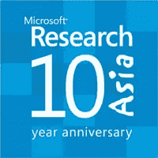
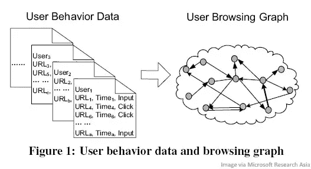

# 微软对 PageRank 的回答:BrowseRank

> 原文：<https://www.sitepoint.com/microsofts-answer-to-pagerank-browserank/>

 [据 CNET](http://news.cnet.com/8301-1023_3-9999038-93.html) 报道，微软亚洲研究院的一篇新论文( [PDF](http://research.microsoft.com/users/tyliu/files/fp032-Liu.pdf) )详细描述了最终可能是微软对谷歌 PageRank 算法的回答，该算法在很大程度上是这家总部位于山景城的公司登上搜索引擎宝座的原因。微软的版本名为 BrowseRank，将根据用户行为而不是链接对页面进行排名。

谷歌 PageRank 背后的基本思想是，一个页面链接得越多，它就越重要。微软表示，像 PageRank 这样的链接分析算法是有缺陷的，因为它们很容易被欺骗，并且没有考虑用户行为。当然，谷歌对 PageRank 的实际实现远没有这么简单，该公司每年都会更新其搜索算法数百次。此外，谷歌经常提醒我们，PageRank 只是它用来对搜索结果进行排名的众多工具之一。

尽管如此，微软认为它可以做得更好——它最好希望它能做得更好。正如我们[之前讨论过的](https://www.sitepoint.com/4-ways-to-beat-google-at-search/)用技术击败谷歌意味着你必须击败他们，真正用更好的搜索结果让用户惊叹。

微软亚洲研究院的 BrowseRank 算法抛弃了谷歌推广的链接图模型，而是创建了一个用户浏览图，查看用户点击了哪些链接以及他们在每个页面上停留了多长时间。

据研究人员称，“用户行为数据可以通过网络客户端的互联网浏览器记录下来，并在网络服务器上收集”。微软亚洲研究院表示，他们从“一个与他们有合法协议的庞大用户群体”中收集了匿名数据，以检验他们的理论。其想法是，您可以从数亿用户中获取匿名浏览数据，并创建一个用户浏览图，该图可以描绘出哪些页面对用户最重要。

“用户浏览图可以更精确地表示网络冲浪者的随机行走过程，因此对于计算页面重要性更有用。用户访问该页面的次数越多，用户在该页面上停留的时间越长，该页面就越可能重要，”研究人员说。“通过这个图表，我们可以利用数亿用户对页面重要性的*隐性投票*。在这方面，我们的方法符合 Web 2.0 的概念。"

当然，用户浏览行为本身可能不足以对页面进行排名——如果单独使用 BrowseRank，很容易看到 MySpace 和脸书以及 Hulu 等视频网站在搜索结果页面中排名靠前。然而，微软研究人员认为，它可以与其他网页排名算法相结合，以大大增强搜索结果。他们写道:“还可以结合链接图和用户行为数据来计算页面重要性。”研究人员表示，他们使用 BrowseRank 进行测试的初步结果显示出比现有方法更好的性能。

得知谷歌正在开发类似的东西并不令人惊讶。谷歌已经通过其广受欢迎的谷歌工具栏捕获了用户的浏览行为，并似乎在今年早些时候推出了广告策划器，并增强了谷歌趋势，包括网络流量，从而将其中的一些数据投入使用。在搜索引擎结果排名中使用这些数据——或者至少尝试这样做——并不是一个巨大的飞跃。谷歌很难说是一个沉睡的巨人。

## 分享这篇文章