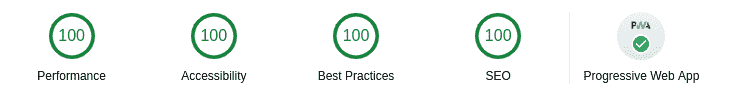

# 如何从 WordPress 迁移到静态站点生成器

> 原文：<https://www.sitepoint.com/migrate-wordpress-static-site-generator/>

在这篇文章中，你将学习如何用一些强大的工具把你的 WordPress 驱动的站点变成一个静态站点。我们将把重点放在从 WordPress 迁移到静态站点生成器上，并涵盖一些替代方案，包括使用无头 CMS。

你为什么要这么做？因为你可以获得巨大的速度增益，从而提高你的网站在搜索引擎中的性能，还可以减少(或消除)你的主机费用，并大大提高你的安全性。

## 静态化的好处

惊人的加速当然不是一个小壮举，但这并不是你将动态的 WordPress (WP)站点安装变成静态的所能得到的全部。

我们总结一下:

*   **降低页面加载速度**。页面不会在运行时进行预处理(用户请求)，内容也不会从数据库中提取。因此，网络服务器的响应速度会比 T2 快很多(10 倍甚至更多)。
*   **通过 CDN 的**减少延迟。你可以把这些静态的页面放到分布式内容交付网络(CDN)上，极大地改善全球的响应时间。
*   **更容易管理**。一旦你设置了你的工作流程——这就是我们在这里要做的——你会发现你实际上不需要在维护、WP 升级或服务器更新上花费任何额外的努力。
*   **安全性大幅提升**。HTTPS 开箱即用，只有静态页面，不是由一些伪造的 PHP 版本或过时的 WordPress 运行的，甚至很可能不是由 Apache 运行的。
*   **改进的 SEO** 。谷歌看重的不仅仅是你的内容，还有获取这些内容的便捷性和安全性。事实上，这是目前仍然有效的少数几个搜索引擎优化之一:一个更快、更安全的网站将在[搜索引擎结果页面](https://en.wikipedia.org/wiki/Search_engine_results_page)上表现更好。
*   **安心**。不需要升级 PHP，没有未打补丁的 WP 问题，甚至不需要管理 Linux 服务器。完成部署后，放松一下，喝点咖啡/啤酒/茶/人参。

## " WordPress 安全吗？"嗯，这很复杂…

WordPress 开发者遵循良好的标准和安全实践，尽管仍然缺少 T2 的长期支持 LTS 的。然而，由于其独特的架构，有些事情不在 WP 安全团队的掌控之中，而是直接转移到您的手中:

*   更新您的服务器
*   安装 WP 更新
*   安装 PHP 更新
*   安装插件和主题的更新(如果有的话)
*   管理 WP 和 PHP(这两个都没有 LTS)市长每隔一段时间升级一次

所有这些都是一个*常数*的过程，插件不是一个小威胁，尤其是无人维护的插件。这些通常有安全漏洞，攻击者通过这些漏洞控制 WordPress 的安装。这也正是为什么在 WordPress 的商业管理版本 WordPress.com 上，[automatic](https://automattic.com/)花了几年时间来支持*一些*插件。

经过相当多的有意识的努力后,会变得安全吗？虽然你可能会说这些是任何一个正派的开发者都应该付出的努力，但你也确实可以通过将你的 WP 网站变成一个静态网站来卸下你肩上的重担，同时重新定义它的架构并永久移除几乎所有可能变成安全威胁的可用点*。毕竟，攻击者对普通的 HTML、CSS 文件和平面图像无能为力。*

 *然而，你仍然需要小心[跨站脚本](https://en.wikipedia.org/wiki/Cross-site_scripting)和[跨站请求伪造](https://en.wikipedia.org/wiki/Cross-site_request_forgery)。🤷‍♂️

## 准备工作:输入静态站点生成器

[](https://jamstack.org/)

<small>*提供:Netlify*</small>

在我们的[100 个 Jamstack 工具、API 和服务的列表中，我们简要地回顾了静态站点生成器(SSG)来为你的站点提供动力](https://www.sitepoint.com/jamstack-tools-services-apis/)文章，还有*吨*比我们在这里要多，所以一定要检查 [StaticGen](https://www.staticgen.com/) 来了解更多。

有些 SSG 是专门针对 WordPress 的，比如 [WP2Static](https://wp2static.com/) ，但我们将专注于一个更通用的，[Gatsby . js](https://www.gatsbyjs.org/)—*“基于 React 的免费开源框架，帮助开发者构建超快的网站和应用”*。

## 迁移 WordPress

我不得不承认，尽管我希望这个过程非常简单，但有一些事情可能会让它变得更加麻烦和耗时，比如你可能已经安装的现有插件(越少越容易)和你格式化帖子的方式(越简单越好)。请将此视为指导方针，您可能需要根据您的具体情况进行调整。

本质上，这就是我们要做的:

1.  设置 Gatsby.js
2.  将 WP 帖子/页面导出到 Markdown
3.  生成静态资产

### 第一步:叉上盖茨比开胃菜

我们将从分叉**[Gatsby Advanced Starter](https://github.com/vagr9k/gatsby-advanced-starter/)**或**[Gatsby Material Starter](https://github.com/Vagr9K/gatsby-material-starter)**开始，这两个都是 Gatsby.js 项目的通用引物，第二个带有“固执己见的” [Material Design](https://material.io/) 模板( [demo](https://vagr9k.github.io/gatsby-material-starter/) )。

[](https://en.wikipedia.org/wiki/Progressive_web_application)

这些启动器将立即为您提供一个全功能的 React-powered [渐进式 web 应用程序](https://www.sitepoint.com/progressive-web-apps-a-crash-course/) (PWA ),包括所有电池:

*   极快的加载速度(预渲染 HTML，JS 自动块加载)
*   Markdown 帖子(代码语法突出显示，嵌入 YouTube 视频，嵌入 Tweets)
*   分页、标签、类别
*   [Disqus](https://disqus.com/) 支持
*   [NetlifyCMS](https://www.netlifycms.org) 支持
*   SEO 好东西( [Google Analytics](https://marketingplatform.google.com/about/analytics/) 支持、 [Sitemaps](https://en.wikipedia.org/wiki/Sitemaps) 和 [robots.txt](https://en.wikipedia.org/wiki/Robots_exclusion_standard) 生成、meta 标签、[Schema.org JSON-LD](https://schema.org/)用于 Google Rich 片段、 [OpenGraph 标签](https://ogp.me/)用于脸书/Google+/Pinterest、 [Twitter 标签](https://developer.twitter.com/en/docs/tweets/optimize-with-cards/overview/markup)用于 Twitter 卡片)
*   联合供稿(RSS)
*   社交功能(Twitter、LinkedIn 和 Telegram 分享按钮；脸书和 Reddit 股份/股份计数)
*   开发工具( [ESLint](https://eslint.org/) 、[pretty](https://prettier.io/)、 [Remark-Lint](https://github.com/remarkjs/remark-lint) ，部署对 [GitHub 页面](https://pages.github.com/)和 [Netlify](https://www.netlify.com/) 、 [CodeClimate](https://codeclimate.com/) 配置文件和徽章的支持)
*   还有更多！

据称，在成功迁移和部署到 CDN 后，您的网站应该非常高效，以至于使用 [Google Lighthouse](https://developers.google.com/web/tools/lighthouse/) 进行的审计应该会报告可能的最佳结果:



#### 安装和配置

你首先需要安装 Gatsby.js 和 [Node.js](https://nodejs.org/) ，这样你就可以使用`gatsby` CLI 和 Node.js 包管理器`npm`。对于 Node.js 只需[下载并安装](https://nodejs.org/en/download/)，对于 Gatsby.js 参见[快速入门](https://www.gatsbyjs.org/docs/quick-start/)或[设置你的开发环境](https://www.gatsbyjs.org/tutorial/part-zero/)。

一旦你解决了这个问题，这就是你开始一个项目的方法(记住你也可以克隆`gatsby-material-starter`):

```
gatsby new YourProjectName https://github.com/Vagr9K/gatsby-advanced-starter
npm run develop # or gatsby develop 
```

高级([示例](https://github.com/vagr9k/gatsby-advanced-starter/#configuration))和材料([示例](https://github.com/Vagr9K/gatsby-material-starter#configuration))启动器的配置基本相同。

[](https://www.netlifycms.org/)

如前所述，有现成的 Netlify CMS 支持，您可以通过编辑`static/admin/config.yml`与 Git 存储库同步，如下所示:

```
backend:
  name: github
  branch: master
  repo: your-user/your-repo 
```

也可以将 Netlify CMS 与 GitLab 或 Bitbucket 集成(见[后端配置](https://www.netlifycms.org/docs/backends-overview/))。

### 步骤 2:导出 WordPress 文章

在某些情况下，你可以通过简单地使用 **[ExitWP](https://github.com/thomasf/exitwp)** 将包含所有文章和页面的 XML 导出文件转换成 Markdown 文件。

然而，根据你的 WP 设置和调整，这个过程可能需要一点技巧；但仍然是可管理的和值得做的。

Tania Rascia 在她的文章[一个时代的终结:从 WordPress 迁移到 Gatsby](https://www.taniarascia.com/migrating-from-wordpress-to-gatsby/) 中写了一篇很好的概述，讲述了她是如何处理这部分过程的。

### 步骤 3:构建页面

鉴于 Gatsby.js 是一个 React 应用程序，成为一名 **[React](https://reactjs.org/)** 开发人员或者至少是一名经验丰富的 JavaScript 程序员将对你有很大的帮助，以便紧密地定制 Gatsby。了解一些 **[GraphQL](https://graphql.org/)** 也会在查询和挖掘数据时变得非常方便，尤其是现在这些页面不是由 MySQL 数据库提供的。

幸运的是，Gatsby.js 非常有据可查。以下是一些有用的资源:

*   [以编程方式从数据创建页面](https://www.gatsbyjs.org/tutorial/part-seven/)
*   [创建和修改页面](https://www.gatsbyjs.org/docs/creating-and-modifying-pages/)
*   [以编程方式从数据创建页面](https://www.gatsbyjs.org/docs/programmatically-create-pages-from-data/)

现在您已经完成了页面生成，您可以安全地将资产(静态页面和图像)放到几乎任何地方！查看我们[的 100 个 Jamstack 工具、API 和服务列表](https://www.sitepoint.com/jamstack-tools-services-apis/#hostingmostlyforfree)中的*托管*部分，了解一些想法，并看看我们关于[通过自动化管道](https://www.sitepoint.com/how-to-host-static-sites-for-free-with-an-automated-pipeline/)免费托管静态网站的文章。

## 安全，仅此一次！

即使你的 WordPress 管理员在互联网上(并且有很多[)。htpasswd](https://en.wikipedia.org/wiki/.htpasswd) 文件可以为你做的)，即使它没有打补丁，即使你的 WP 备份被损坏，*这些都不会影响你已经部署的静态页面*，因为前端是“分离”的。

不要误会，即使你在防火墙后面的局域网上运行 WordPress，你还是应该定期更新。

## 失去理智:无头 CMS

如果你已经做到了这一点，你可能不再需要使用 WordPress 了。虽然您可以让管理员生成新的帖子和页面，但另一个工作流将使用另一个 headless CMS 来为您生成静态文件，并将它们同步到您的存储库，所有这些都是自动化的，只需一个步骤。

进入“[headless CMS](https://en.wikipedia.org/wiki/Headless_content_management_system)”——这是一个内容管理系统，仍然作为后端实例在某个地方运行，但完全与实际的实时网站分离。

WordPress 是静态站点的无头 CMS 的常见选择，事实上可能是大规模 SSG 部署中最常见的。虽然迁移方法可以涵盖很多情况，但是你可能有太多的遗留内容或者太多的内容处理嵌入到 WordPress 中，使得大规模迁移立即变得可行。对于大型内容运营和数字媒体业务来说尤其如此。但是，如果您需要管理的历史较少，那么看看更现代的内容管理方法会对您有好处——从动态服务的站点迁移出去是进行这种改变的最佳时机。

我们实现的迁移已经支持 Netlify CMS，尽管我们不会在这里讨论如何使用无头 CMS。这是一个我们将在不久的将来以自己的文章返回的主题。

## 进一步挖掘

在这样一篇文章中，我们只能介绍这么多，所以这里有一些关于用 SSG 迁移 WP 的额外资源。

### 盖茨比

[](https://www.gatsbyjs.org/)

官方[文档中心](https://www.gatsbyjs.org/docs/)和[博客](https://www.gatsbyjs.org/blog/)非常全面，写得非常好。

以下是一些与 WP 相关的文章:

*   [开始使用 Gatsby 和 WordPress](https://www.gatsbyjs.org/blog/2018-01-22-getting-started-gatsby-and-wordpress/)
*   [从 WordPress 迁移到 Gatsby.js 和 jam stack](https://www.gatsbyjs.org/blog/2018-03-29-migration-from-wordpress-to-gatsby/)
*   如何用 WordPress 和 Gatsby.js 建立博客:[第一部分](https://www.gatsbyjs.org/blog/2019-04-26-how-to-build-a-blog-with-wordpress-and-gatsby-part-1/)、[第二部分](https://www.gatsbyjs.org/blog/2019-04-30-how-to-build-a-blog-with-wordpress-and-gatsby-part-2/)和[第三部分](https://www.gatsbyjs.org/blog/2019-05-02-how-to-build-a-blog-with-wordpress-and-gatsby-part-3/)

### 雨果

[](https://gohugo.io/)

基于 [Go](https://golang.org/) 编程语言， **[Hugo](https://gohugo.io/)** 是 SSGs 的另一个大名鼎鼎的名字，有[大量可用的模板](https://themes.gohugo.io/)，以及一个你可能会考虑到 Gatsby.js 的可靠选项

有[工具可以把 WordPress 迁移到 Hugo](https://gohugo.io/tools/migrations/#wordpress) 。如果你看看这些指南，你会发现虽然你的灵活性会少一些，但这个过程应该比 Gatsby.js 简单得多:

*   从 WordPress 迁移到 Hugo
*   Mattias Geniar 撰写的从 WordPress 迁移到 Hugo 的分步指南
*   从 WordPress 切换到 Hugo

### 吉基尔博士

[](https://jekyllrb.com/)

如果你设法设置了 Ruby 环境， **[Jekyll](https://jekyllrb.com/)** ，可以*将你的纯文本转换成静态网站和博客的 SSG*，使用起来就更简单了，尽管它只会生成静态页面，而不会生成 Gatsby.js 这样的 web 应用程序

就像 Gatsby 一样，您可以使用基于 Python 的 [ExitWP](https://github.com/thomasf/exitwp) 来生成 WP 的 Markdown。您还可以从 wpXml 导出中获得 Windows 可执行文件 [wpXml2Jekyll](https://github.com/theaob/wpXml2Jekyll) 到通用 Jekyll 就绪的 Markdown 文件。

一些有用的文章:

*   将博客从 WordPress 迁移到 Jekyll
*   从 WordPress 迁移到 Jekyll: [第一部分](https://blog.floriancourgey.com/2018/11/migrate-from-wordpress-to-jekyll)和[第二部分](https://blog.floriancourgey.com/2018/11/migrate-from-wordpress-to-jekyll-2)
*   面向 WordPress 开发者的 Jekyll

### 软件即服务(SaaS)解决方案

**[Gatsby Cloud](https://www.gatsbyjs.com/)** 免费或收费提供构建和维护 Gatsby.js 网站[的支持](https://www.gatsbyjs.com/pricing/)，在这里您可以自动化快速构建、访问预览、生成每日编辑，并轻松启动 Netlify、Cloudflare、AWS CloudFront 或 Akamai 的部署。

**[HardyPress](https://www.hardypress.com/)** 也生成静态 WordPress 网站，而[收费](https://www.hardypress.com/pricing/)你会有一个管理面板，在那里你可以输入访问你的在线 WP 安装的凭证来管理现场的一切:关闭已经导入的 WP 安装，透明地部署到全球 CDN，HTTPS，表单和搜索。

其他有商业支持的 WP 相关 SSG 还有 **[移位器](https://www.getshifter.io/)****[Strattic](https://www.strattic.com/)****[site sauce](https://sitesauce.app/)**。

## 结论和思考:国王死了吗？

内心的平静对我来说很重要，这也是我几年前停止开发 WordPress 网站的主要原因之一。我讨厌一个 bug 可能在任何给定的时间出现([零日](https://en.wikipedia.org/wiki/Zero-day_(computing))或其他)，如果不及时修补，它会危及我的工作。相信我，我看到我的[网站因为一次重大的——突然的——PHP 或 WP 升级而被破坏或者干脆停止工作的次数比我愿意承认的要多。但是*如果你的网站是静态的，这些安全问题就不复存在了！*](https://en.wikipedia.org/wiki/Website_defacement)

在我看来，WordPress 在 2012 年已经达到了其“[石油峰值](https://en.wikipedia.org/wiki/Peak_oil)”的情况(见[谷歌趋势:WordPress 2004 年至今](https://trends.google.com/trends/explore?date=all&geo=US&q=WordPress))。如果它不能很快适应*的变化，它只会继续失去市场份额，而青睐那些能够通过更好的集成工作流程来更快、更安全地完成工作的技术。*

WP 的创始人兼 Automattic 的首席执行官马特·莫楞威格也承认这一点，他开始鼓励开发人员“深入学习 JavaScript”，并采取了一个大胆的举措，通过引入 Calypso，摆脱了 WP 的 PHP 后端，转而支持 JavaScript(参见[他自己对过程的反思](https://ma.tt/2015/11/dance-to-calypso/))。这在整个社区引发了冲击波(甚至[恐慌](https://wesbos.com/wordpress-calypso-react)),有[传言 WordPress 将完全抛弃 PHP](https://www.quora.com/Is-it-true-that-WordPress-is-moving-away-from-PHP-and-towards-JavaScript)。古腾堡只是朝着这个方向迈出的又一步。

如果国王能够重塑自我，它可能会保住自己的王冠。如果不是，嘿，为将近三分之一的互联网提供动力是一个不小的壮举——国王万岁！👑

*阅读关于 [SitePoint 如何在 2020 年将其前端转移到由 WordPress headless CMS](https://www.sitepoint.com/our-gatsby-redesign/) 支持的 Gatsby。*

## Jamstack 基础

跟上 Jamstack 的速度。我们的 Jamstack Foundations 系列可帮助您迈出进入 Jamstack 和超越 Jamstack 的第一步，并且我们会不断增加它。我们将为您带来成为职业选手所需的教程。您可以随时参考我们的索引，因为它在 Jamstack 简介的末尾进行了更新:

➤ [贾姆斯塔克地基](https://www.sitepoint.com/learn-jamstack#foundations)

## 分享这篇文章*