# 我们为什么以及如何将 babylon.js 迁移到 Azure: CORS、gzip 和 IndexedDB

> 原文：<https://www.sitepoint.com/migrated-babylon-js-azure-cors-gzip-indexeddb/>

本文是微软网站开发技术系列的一部分。感谢您对使 SitePoint 成为可能的合作伙伴的支持。

你在为一家初创公司工作。突然间，辛苦一年的编码得到了回报，但随着成功而来的是更多的增长和对你的 web 应用的需求。

在本教程中，我想谦虚地使用我们最近围绕 ourWebGL 开源游戏框架的一个成功故事，babylon.js 及其网站:[babylonjs.com](http://www.babylonjs.com/?WT.mc_id=13395-DEV-sitepoint-article19)。我们很高兴看到如此多的网络游戏开发者尝试它。

但是为了跟上需求，我们知道我们需要一个新的虚拟主机解决方案。虽然本教程关注的是 Microsoft Azure，但许多概念适用于您可能更喜欢的各种解决方案。我们还将看到我们已经实施的各种优化，以尽可能地限制从我们的服务器到您的浏览器的输出带宽。

*   介绍

[第一步:迁移到 Azure 网站&自动缩放服务](http://blogs.msdn.com/b/davrous/archive/2014/05/22/why-and-how-we-migrated-babylonjs-com-to-microsoft-azure.aspx#step1?WT.mc_id=13395-DEV-sitepoint-article19)

*   [第二步:将资产转移到 Azure Blob 存储中，启用 CORS、gzip 支持& CDN](http://blogs.msdn.com/b/davrous/archive/2014/05/22/why-and-how-we-migrated-babylonjs-com-to-microsoft-azure.aspx#step2?WT.mc_id=13395-DEV-sitepoint-article19)
    *   [在 blob 存储上启用 CORS](http://blogs.msdn.com/b/davrous/archive/2014/05/22/why-and-how-we-migrated-babylonjs-com-to-microsoft-azure.aspx#step21?WT.mc_id=13395-DEV-sitepoint-article19)
    *   [在 blob 存储上启用 gzip 支持](http://blogs.msdn.com/b/davrous/archive/2014/05/22/why-and-how-we-migrated-babylonjs-com-to-microsoft-azure.aspx#step22?WT.mc_id=13395-DEV-sitepoint-article19)
    *   [启用 CDN](http://blogs.msdn.com/b/davrous/archive/2014/05/22/why-and-how-we-migrated-babylonjs-com-to-microsoft-azure.aspx#step23?WT.mc_id=13395-DEV-sitepoint-article19)
*   [步骤 3:使用 HTML5 IndexedDB 避免重新下载资产](http://blogs.msdn.com/b/davrous/archive/2014/05/22/why-and-how-we-migrated-babylonjs-com-to-microsoft-azure.aspx#step3?WT.mc_id=13395-DEV-sitepoint-article19)

## 介绍

js 是一个我们已经做了一年多的个人项目。由于这是个人的(即我们的时间和金钱)，我们已经在一个相对便宜的托管解决方案上使用一个小型的专用 Windows/IIS 机器托管了网站、纹理和 3D 场景。该项目始于法国，但很快受到了全球一些 3D 和网络专家以及一些游戏工作室的关注。我们对社区的反馈很满意，但是流量是可控的！

例如，在 2014 年 2 月至 2014 年 4 月期间，我们平均每月有 7K+用户，平均每月有 16K+页面/浏览量。我们谈到的一些事件产生了一些有趣的峰值:

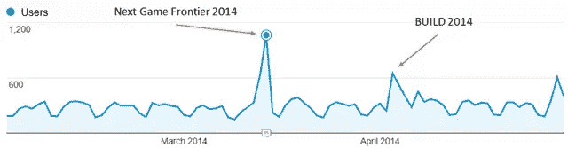

但是网站上的体验还是足够好的。加载我们的场景并没有以最快的速度完成，但是用户并没有抱怨太多。

然而，最近，一个[酷家伙](https://news.ycombinator.com/user?id=NicoJuicy?WT.mc_id=13395-DEV-sitepoint-article19)决定[分享我们在黑客新闻](https://news.ycombinator.com/item?id=7748413?WT.mc_id=13395-DEV-sitepoint-article19)上的工作。我们真的很高兴听到这样的消息！但是看看在网站的连接上发生了什么:


我们的小服务器游戏结束了！它慢慢停止工作，我们的用户体验非常糟糕。IIS 服务器花费大量时间为大型静态资产和图像提供服务，CPU 使用率过高。当我们即将推出在 babylon.js 上运行的[Assassin ' s Creed Pirates web GL experience](http://race.assassinscreedpirates.com/?WT.mc_id=13395-DEV-sitepoint-article19)项目时，是时候通过使用云解决方案切换到一个更具可扩展性的专业主机了。

但在回顾我们的主机选择之前，让我们简单地谈谈我们的引擎和网站的具体情况:

1.  在我们的网站上，一切都是静态的。我们目前没有运行任何服务器端代码。
2.  我们的场景(*)。巴比伦* JSON 文件)和纹理(*)。巴新*或*。jpeg* 文件可能非常大(高达 100 MB)。这意味着我们绝对需要在我们的"*上激活 gzip 压缩。巴比伦*场景文件。事实上，在我们的例子中，价格将在输出带宽上被索引很多。
3.  在 WebGL 画布中绘图需要特殊的安全检查。例如，如果没有启用 CORS，你不能从另一个服务器加载我们的场景和纹理。

<u>鸣谢:</u>我要特别感谢 [Benjamin Talmard](https://twitter.com/benjiiim?WT.mc_id=13395-DEV-sitepoint-article19) ，他是我们的法国 Azure 技术传道者之一，帮助我们迁移到 Azure。

## 步骤 1:迁移到 Azure 网站&自动缩放服务

由于我们想花大部分时间为我们的引擎编写代码和特性，我们不想在管道上浪费时间。这就是为什么我们立即决定选择 PaaS 方法，而不是 IaaS 方法。

此外，我们喜欢 Visual Studio 与 Azure 的集成。我几乎可以在我最喜欢的 IDE 上做任何事情。即使 [babylon.js 托管在 Github](https://github.com/BabylonJS/Babylon.js/?WT.mc_id=13395-DEV-sitepoint-article19) 上，我们也在使用 Visual Studio 2013、TypeScript 和 Visual Studio Online 来编写我们的引擎。作为对你项目的说明，你可以免费获得 [Visual Studio 社区](https://www.visualstudio.com/en-us/products/visual-studio-community-vs?WT.mc_id=13395-DEV-sitepoint-article19)和 [Azure 试用版](http://azure.microsoft.com/en-us/pricing/free-trial/?WT.mc_id=13395-DEV-sitepoint-article19)。

搬到 Azure 花了我大约 5 分钟的时间:

1.  我在管理页面创建了一个新的网站:`http://manage.windowsazure.com`(也可以在 VS 内部完成)。
2.  我从我们的源代码库中取出正确的变更集，与当前在线的版本相匹配。
3.  我在 Visual Studio 解决方案资源管理器中右键单击了 Web 项目。
    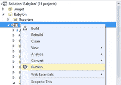
4.  工具的神奇之处就在这里。当我使用绑定到我的 Azure 订阅的 Microsoft 帐户登录 VS 时，向导让我简单地选择我想要部署的网站。
    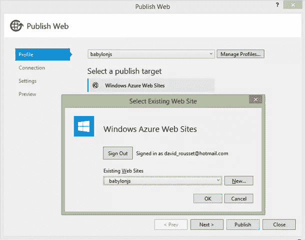

不需要担心复杂的认证，连接字符串或任何东西。

"*下一个，下一个，下一个&发布*"几分钟后，在我们所有资产和文件的上传过程结束时，网站启动并运行了！

在配置方面，我们希望从超酷的自动缩放服务中获益。这在我们之前的黑客新闻场景中会有很大帮助。

首先，您的实例已经在“Scale”选项卡中配置为“Standard”模式。

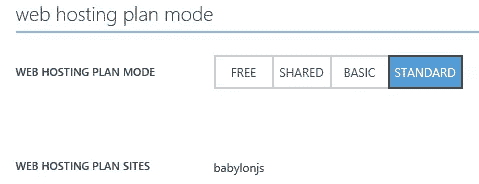

然后，您可以选择想要自动伸缩的实例数量、CPU 条件以及调度时间。在我们的例子中，我们决定使用最多 3 个小实例(1 个内核，1.75 GB 内存)，如果 CPU 利用率超过 80%，就自动生成一个新实例。如果 CPU 下降到 60%以下，我们将删除一个实例。在我们的例子中，自动缩放机制总是打开的，我们没有设置一些特定的预定时间。

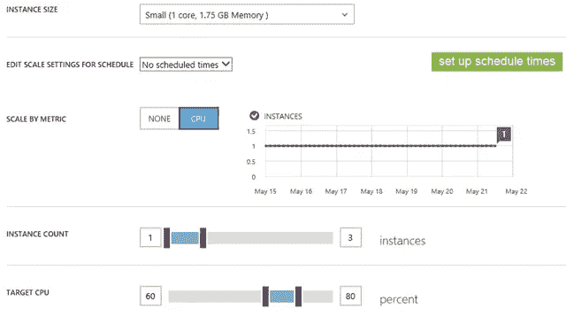

这个想法实际上是只为你在特定的时间范围和负载内需要的东西付费。我喜欢这个概念。有了这个 Azure 服务，我们就可以什么都不做地处理以前的峰值了！这就是我所说的服务。

您还可以通过紫色图表快速查看自动缩放历史。在我们的例子中，自从我们迁移到 Azure 之后，到目前为止，我们从未检查过一个实例。我们将在下面看到如何最小化陷入自动缩放的风险。

总结一下网站配置，我们希望在我们特定的 3D 引擎资源(`.babylon`和`.babylonmeshdata`文件)上启用自动 gzip 压缩。这对我们至关重要，因为它可以节省高达 3 倍的带宽，从而降低价格。

网站运行在 IIS 上。要配置 IIS，您需要进入 web.config 文件。在我们的例子中，我们使用了以下配置:

```
<system.webServer>
  <staticContent>
    <mimeMap fileExtension=".dds" mimeType="application/dds" />
    <mimeMap fileExtension=".fx" mimeType="application/fx" />
    <mimeMap fileExtension=".babylon" mimeType="application/babylon" />
    <mimeMap fileExtension=".babylonmeshdata" mimeType="application/babylonmeshdata" />
    <mimeMap fileExtension=".cache" mimeType="text/cache-manifest" />
    <mimeMap fileExtension=".mp4" mimeType="video/mp4" />
  </staticContent>
  <httpCompression>
    <dynamicTypes>
      <clear />
      <add enabled="true" mimeType="text/*"/>
      <add enabled="true" mimeType="message/*"/>
      <add enabled="true" mimeType="application/x-javascript"/>
      <add enabled="true" mimeType="application/javascript"/>
      <add enabled="true" mimeType="application/json"/>
      <add enabled="true" mimeType="application/atom+xml"/>
      <add enabled="true" mimeType="application/atom+xml;charset=utf-8"/>
      <add enabled="true" mimeType="application/babylonmeshdata" />
      <add enabled="true" mimeType="application/babylon"/>
      <add enabled="false" mimeType="*/*"/>
    </dynamicTypes>
    <staticTypes>
      <clear />
      <add enabled="true" mimeType="text/*"/>
      <add enabled="true" mimeType="message/*"/>
      <add enabled="true" mimeType="application/javascript"/>
      <add enabled="true" mimeType="application/atom+xml"/>
      <add enabled="true" mimeType="application/xaml+xml"/>
      <add enabled="true" mimeType="application/json"/>
      <add enabled="true" mimeType="application/babylonmeshdata" />
      <add enabled="true" mimeType="application/babylon"/>
      <add enabled="false" mimeType="*/*"/>
    </staticTypes>
  </httpCompression>
</system.webServer>
```

这个解决方案工作得非常好，我们甚至注意到，与我们以前的主机相比，加载场景的时间已经减少了。我猜这要归功于 Azure 数据中心使用的更好的基础设施和网络。

然而，我现在已经考虑搬进 Azure 有一段时间了。我的第一个想法不是让网站实例为我的大量资产服务。从一开始，我就对将我的资产存储到 blob 存储中更感兴趣。这也将为我们提供一个可能的 CDN 场景。

## 步骤 2:将资产转移到 Azure Blob 存储中，启用 CORS、gzip 支持和 CDN

在我们的例子中使用 blob 存储的主要原因是为了避免加载我们的 web 站点实例的 CPU 来服务它们。如果除了一些 html、js 和 css 文件之外的所有内容都通过 blob 存储来提供，我们的网站实例将很少有机会自动缩放。

但这提出了两个需要解决的问题:

1.  由于内容将托管在另一个域名上，我们将陷入跨域安全问题。为了避免这种情况，您需要在远程域(Azure Blob 存储)上启用 CORS
2.  Azure Blob 存储不支持自动 gzip 压缩。我们不想降低网站的 CPU 使用率，如果我们因为带宽增加而支付 3 倍的价格作为交换的话！

### 在 blob 存储上启用 CORS

blob 存储上的 CORS 已经支持了几个月了。这篇名为[Windows Azure Storage:CORS 简介](http://blogs.msdn.com/b/windowsazurestorage/archive/2014/02/03/windows-azure-storage-introducing-cors.aspx?WT.mc_id=13395-DEV-sitepoint-article19)的文章解释了如何使用 Azure APIs 来配置 CORS。在我这边，我不想写一个小应用程序来做这些。我在网上找到一个已经写好的:[CORS 助手——管理 Windows Azure Blob 存储 CORS 规则的免费工具](http://blog.cynapta.com/2013/12/cynapta-azure-cors-helper-free-tool-to-manage-cors-rules-for-windows-azure-blob-storage/?WT.mc_id=13395-DEV-sitepoint-article19)

然后，我在容器上启用了对 GET 和 proper 头的支持。要检查是否一切正常，只需打开 F12 开发者栏并检查控制台日志:

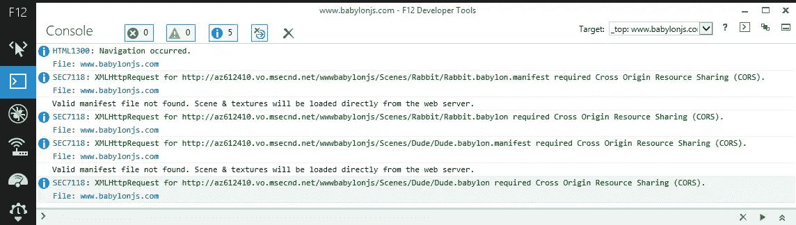

如您所见，绿色的日志线意味着一切正常。

这是一个失败的例子。如果您尝试直接从本地主机(或任何其他域)从我们的 blob 存储中加载我们的场景，您将在日志中得到这些错误:

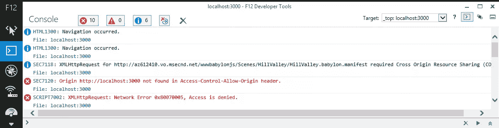

总之，如果您发现您的呼叫域没有出现在“*Access-Control-Allow-Origin*”标题中，并且在其后带有“*Access denied*”，这是因为您没有正确设置您的 CORS 规则。控制你的 CORS 规则是非常重要的；否则，任何人都可以在你不知道的情况下使用你的资产，从而使用你的带宽，并因此花费金钱！

### 在 blob 存储上启用 gzip 支持

正如我之前告诉你的，Azure Blob 存储不支持自动 gzip 压缩。S3 等竞争对手的解决方案似乎也是如此。您有两种选择来解决这个问题:

1.  gzip 在上传之前，在客户端上压缩你自己的文件，使用你的经典工具将它上传到 blob 存储器中，并将`content-encoding`头设置为`gzip`。这种解决方案有效，但只适用于支持 gzip 的浏览器(还有不支持 gzip 的浏览器吗？)
2.  gzip 您自己在客户端上的文件，并在 blob 存储中上传两个版本:例如，一个使用默认的 `.extension`，另一个使用`.extension.gzip`。在 IIS 端设置一个处理程序，它将捕获来自客户端的 HTTP 请求，检查设置为`gzip`的报头`accept-encoding`，并基于这种支持提供适当的文件。您将在本文中找到更多关于要实现的代码的细节:[从 Azure CDN](http://joelfillmore.com/serving-gzip-compressed-content-from-the-azure-cdn/?WT.mc_id=13395-DEV-sitepoint-article19) 提供 GZip 压缩内容。

在我们的例子中，我不知道有哪个浏览器支持 WebGL 而不支持 gzip 压缩。因此，如果浏览器不支持 gzip，就没有兴趣继续下去，因为这可能意味着 WebGL 也不支持。

然后我选择了第一个解决方案。由于我们没有太多的场景，也不是每天都制作一个新的，所以我目前使用的是这个手动流程:

1.  使用 [7-zip](http://www.7-zip.org/?WT.mc_id=13395-DEV-sitepoint-article19) ，我在我的机器上使用 gzip 编码压缩`.babylon`文件，并将`compression level`压缩为`fastest`。在我的测试中，其他压缩级别似乎会产生问题。
2.  我使用[Cloud berry Explorer for Microsoft Azure 云存储](http://www.cloudberrylab.com/free-microsoft-azure-explorer.aspx?WT.mc_id=13395-DEV-sitepoint-article19)上传文件。
3.  我用 CloudBerry 手动将 HTTP 头`content-encoding`设置为`gzip`。

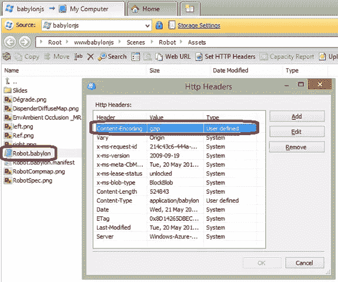

我知道你在想什么。我要对我所有的文件都这么做吗？！不，您需要构建一个工具或后期构建脚本来实现自动化。例如，下面是我构建的一个小命令行工具:

 `要使用它，我可以做`UploadAndGzipFilesToAzureBlobStorage
Scenes/Espilit C:\Boulot\Babylon\Scenes\Espilit\*.babylon*`来推送一个包含多个文件的场景(我们的增量场景带有`muliples.babylonmeshdata`文件)

或者简单地用`UploadAndGzipFilesToAzureBlobStorage Scenes/Espilit C:\Boulot\Babylon\Scenes\Espilit\Espilit.babylon`推送一个独特的文件。

为了检查 gzip 在使用这个解决方案时是否像预期的那样工作，我使用了 [Fiddler](http://www.telerik.com/fiddler?WT.mc_id=13395-DEV-sitepoint-article19) 。从您的客户端机器加载您的内容，并在网络跟踪中检查返回的内容是否真的被压缩并且可以被解压缩:

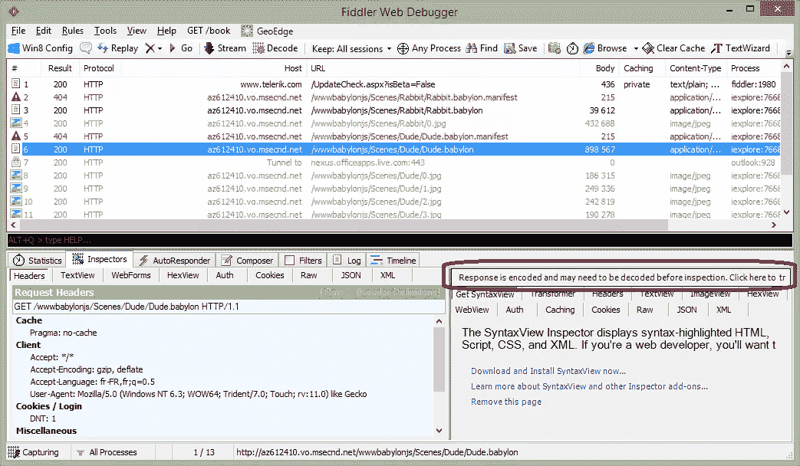

### 启用 CDN

一旦你完成了前面的两个步骤，你只需要点击 Azure 管理页面中的一个按钮来启用 CDN 并将其映射到你的 blob 存储:

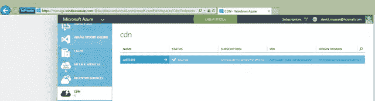

就这么简单！在我的例子中，我需要简单地将下面的 URL `http://yoda.blob.core.windows.net/wwwbabylonjs/Scenes`改为`http://az612410.vo.msecnd.net/wwwbabylonjs/Scenes`。请注意，如果您愿意，可以将这个 CDN 域定制为您自己的域。

由于这一点，我们能够以非常快速的方式为您提供我们的 3D 资产，因为您将从这里列出的节点位置之一获得服务: [Azure 内容交付网络(CDN)节点位置](http://msdn.microsoft.com/en-us/library/gg680302.aspx?WT.mc_id=13395-DEV-sitepoint-article19 "http://msdn.microsoft.com/en-us/library/gg680302.aspx")。

我们的网站目前托管在北欧 Azure 数据中心。但是如果你来自西雅图，你将 ping 这个服务器来下载我们基本的`index.html`、`index.js`、`index.css`文件和一些截图。所有的 3D 资产都将从您附近的西雅图节点提供服务！

注意:我们所有的演示都使用完全优化的体验(使用 gzip、CDN 和 DB 缓存的 blob 存储)。

### 步骤 3:使用 HTML5 IndexedDB 避免重新下载资产

优化加载时间和控制输出带宽成本不仅仅是服务器端的事情。你也可以构建一些逻辑客户端来优化事情。幸运的是，从我们的 babylon.js 引擎的 1.4 版本开始，我们就这样做了。我已经在这篇文章中非常详细地解释了我是如何实现对 IndexedDB 的支持的:[使用 IndexedDB 来处理你的 3D WebGL 资产:分享反馈&巴比伦的提示。JS](http://blogs.msdn.com/b/davrous/archive/2013/09/24/using-indexeddb-to-handle-your-3d-webgl-assets-sharing-feedbacks-amp-tips-of-babylon-js.aspx?WT.mc_id=13395-DEV-sitepoint-article19) 你会在我们的 wiki 上的 babylon.js 中找到如何激活它:[在 IndexedDB](https://github.com/BabylonJS/Babylon.js/wiki/Caching-the-resources-in-IndexedDB?WT.mc_id=13395-DEV-sitepoint-article19) 中缓存资源。

基本上，你只需要创建一个与`.babylon`场景名称匹配的`.babylon.manifest`文件，然后设置你想要缓存的内容(纹理和/或 JSON 场景)。就是这样。

例如，检查正在进行的山谷演示场景。第一次加载时，发送的请求如下:

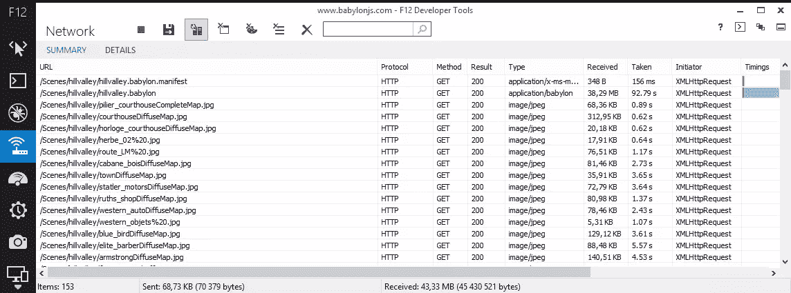

收到 153 个项目和 43.33 MB。但是如果你已经同意让 babylonjs.com 使用你电脑上的额外存储空间，这是你第二次加载相同场景时会看到的:

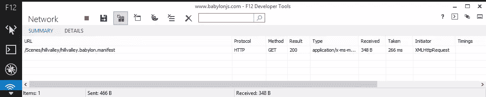

1 项 348 字节！我们只是检查清单文件是否已经更改。如果没有，我们将从数据库中加载所有内容，这样可以节省 43+ MB 的带宽。

例如，这种方法被用在[刺客信条海盗](http://race.assassinscreedpirates.com/?WT.mc_id=13395-DEV-sitepoint-article19)游戏中:

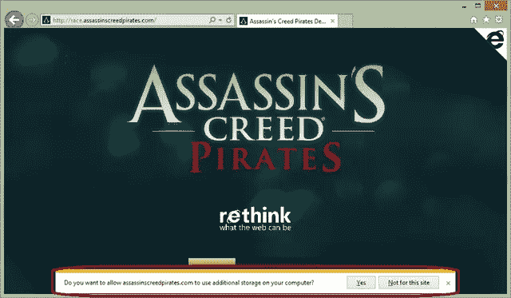

让我们想一想:游戏一旦被加载就几乎立即启动，因为资源是直接从本地数据库提供的——您的 web 存储压力更小，使用的带宽更少，成本更低！

现在，这将满足你的用户和支付帐单的人！

本文是微软网站开发技术系列的一部分。我们很高兴与您分享[微软 Edge](http://blogs.msdn.com/b/ie/archive/2015/01/22/project-spartan-and-the-windows-10-january-preview-build.aspx?WT.mc_id=13395-DEV-sitepoint-article19) 和它的[新渲染引擎](http://blogs.msdn.com/b/ie/archive/2015/02/26/a-break-from-the-past-the-birth-of-microsoft-s-new-web-rendering-engine.aspx?WT.mc_id=13395-DEV-sitepoint-article19)。在 [modern 获得免费虚拟机或在你的 Mac、iOS、Android 或 Windows 设备上进行远程测试。即](http://modern.ie/?utm_source=SitePoint&utm_medium=article19&utm_campaign=SitePoint)。` 

## `分享这篇文章`