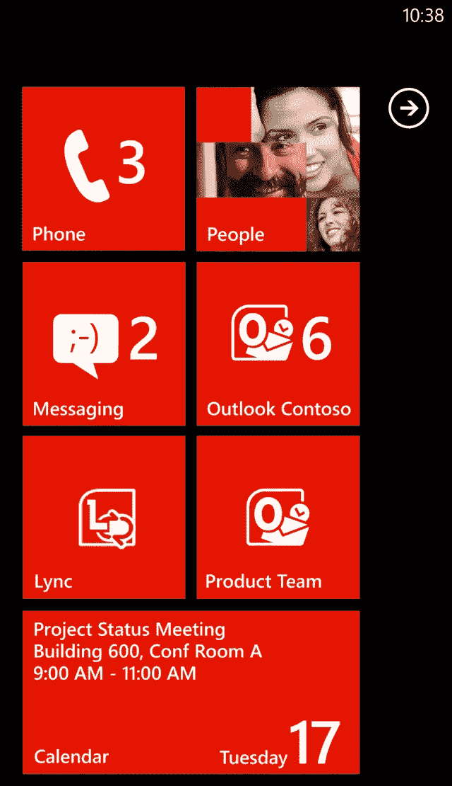
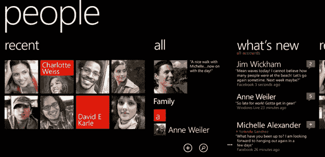
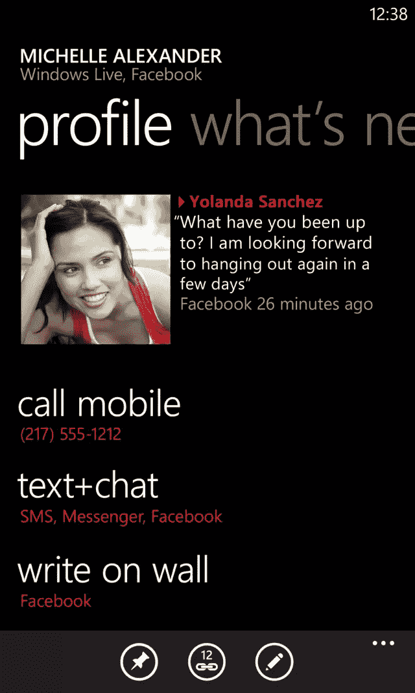
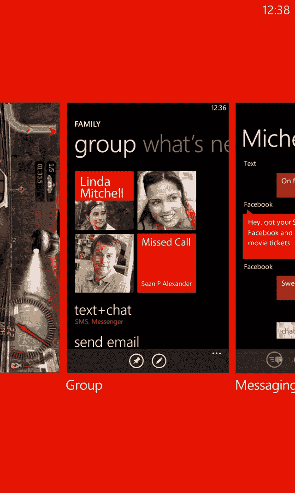
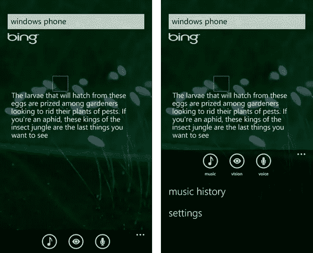

# 将 iOS 应用迁移到 Windows Phone

> 原文：<https://www.sitepoint.com/migrating-ios-applications-to-windows-phone/>

自从一年前发布以来，Windows Phone 已经引起了开发者社区的极大兴趣。许多人已经为 iOS 开发了应用程序，并试图将其移植到 Windows Phone 上。虽然这似乎需要学习一套新的工具、技术和 API，但事实是，迁移之路已经走得很好，而且沿途充满了有用的资源。在本文中，我们将了解这些平台之间的一些相似之处和不同之处，以及如何使用开发人员和设计人员工具来帮助您将应用程序移植到 Windows Phone。

### 用户界面

这两个平台最重要的一个方面是用户至上，这直接关系到让平台和运行在其上的所有应用程序都以用户为中心。iOS 和 AppStore 批准施加的限制以及 Windows Phone 通过 Marketplace 认证要求，鼓励用户构建在正常操作期间不会崩溃或失败的高响应性应用程序。它们还围绕样式和用户交互提供指导，同样允许用户构建看起来和感觉上属于该平台的应用程序。

Windows Phone 有自己的差异化风格。在 Metro 设计语言的引领下，Windows Phone 平台使用了漂亮的版式、可识别且有意义的图标，以及有创意且有意义的内容放置。重要的是，该平台还允许内容通过使用空间和动画来呼吸和变得生动。

#### 起点、枢纽和枢纽

在 iOS 中，一切都是从由应用程序和文件夹组成的主区域开始的，相比之下，Windows Phone Start 包含一系列动态磁贴(图 1)。除了简单地作为用户跟踪和启动他们最喜欢的应用程序的机制， [Live Tile](https://www.sitepoint.com/personalise-windows-phone-7-live-tiles/) 的内容可以动态更新，以反映应用程序的当前状态。例如，在图 1 中，消息传送块已经被更新以指示有两个未读消息，人物块已经用电话上的一些联系人的图像更新，并且日历块包括关于下一个约会的信息。

图 1

Start 旨在让用户无需打开应用程序就可以进入、获得他们需要的东西，然后再次离开。Windows Phone 7.5 将允许用户将应用程序的不同部分固定在开始位置。例如，新闻聚合应用程序将允许用户将一个或多个提要固定在开始处，允许他们快速跳转到应用程序中阅读该提要。这些图块也可以通过从云推送的通知或后台代理进行动态更新，后台代理可用于定期检查更新。动态磁贴是 Windows Phone 的标志性功能之一，因此你应该考虑应用程序的哪个方面，或者多个方面，出现在[开始](https://www.sitepoint.com/get-pinned-windows-phone-7-live-tiles/)中是有意义的。

从一开始，Windows Phone 上的用户体验就包括一系列集线器，这些集线器是核心平台内数据的聚合点。内置的中心是人、图片、音乐和视频、办公室、游戏和市场。如果你看看图 2 中的 People hub，你会发现它是一个全景视图，实际的手机就像一个视窗，允许用户水平滚动来发现更多的内容。

图 2

关于 hub 或全景体验，需要注意的一件重要事情是，它的最佳用途是聚合来自多个数据源的数据。在以人为中心的情况下，联系信息可能来自许多服务，如脸书和推特，以及用户交换或邮件帐户。此外，整个用户体验不应该被塞进一个单一的全景。全景应该突出显示热门项目、收藏夹等，允许用户深入了解更多细节。

该界面的另一个独特功能是 Pivot，它用于拆分单个数据集，使用户更容易找到他们感兴趣的信息。透视控件用于以更密集的配置方式呈现信息。例如，Windows Phone 上的 Outlook mobile 使用透视控件。图 3 说明了 People hub 中联系人的信息卡，其中联系人的不同方面被分解成不同的枢纽项目。

图 3

Pivot 的另一个例子是在一个房地产应用程序中，搜索结果可以根据郊区、价格或上市日期进行重组。这些排序顺序中的每一个都可以呈现在不同的 Pivot 项上，使用户更容易找到他们可能感兴趣的属性。

#### 航行

Windows Phone 没有在整个界面中分散导航控件，如箭头，而是专注于展示内容，并使用相同的内容来允许用户在平台中导航。例如，在 People hub 中，最近列表中的个人资料图像允许用户跳转到这些联系人的信息卡。

Windows Phone 界面不再像许多其他移动平台那样视觉混乱，而是提供了一个更加整洁的界面。这完全是关于 chrome 上的内容。界面中既没有后退箭头，也没有用于导航的软按钮，因为所有 Windows Phone 设备都必须在设备的正面带有一个硬件后退按钮。这个设计决策本身就允许应用程序回收屏幕上的很大一部分，否则就会被后退箭头或导航栏占用。

后退按钮不仅允许用户在打开的应用程序列表中向后导航，还可以在单个应用程序的页面中向后导航。这统称为后堆栈。在 Windows Phone 7.5 中，后退按钮的功能已经扩展到允许快速切换应用程序。按住 Back 按钮一小段时间，就会显示应用程序切换器，如图 4 所示，允许用户快速跳回到当前正在运行的任何应用程序。

图 4

除了后退按钮之外，所有 Windows Phone 设备的正面都必须有另外两个按钮。这是开始和搜索按钮，分别将用户导航到开始和 Bing 搜索体验。虽然应用程序无法直接拦截或集成这些按钮，但 Windows Phone 7.5 引入了通过 App Connect 连接到 Bing 搜索的功能。这允许应用程序扩展搜索体验，允许用户从搜索结果导航到应用程序。

许多为 iOS 设计的应用程序使用标签栏在应用程序的不同区域之间导航。Windows Phone 应用程序没有直接的对等物；相反，我们鼓励应用程序开发人员对其应用程序的架构进行微小的调整，以便使用 hub 体验来汇总来自每个同等 iOS 选项卡的信息，然后根据需要深入到 Pivot 和 Page views 以获取更多详细信息。然后，用户可以通过点击中心上的内容来访问关于该内容的更详细的信息，或者访问应用程序的其他区域。

应用程序栏为在页面上下文中向用户公开可用的操作提供了一致的体验。例如，在 Bing 搜索应用程序中，如图 5 所示，音乐、视觉和语音图标按钮允许用户分别启动音乐搜索、基于通过相机扫描的条形码或 MS 标签的搜索、或来自音频捕获的搜索。在左图中，应用程序栏处于默认视图，只有图标按钮可见；右图显示了它的展开图，其中显示了附加菜单项。菜单项是向用户公开额外的、不太频繁的操作的机制。

图 5

#### 应用程序生命周期

有一种普遍的误解，认为 Windows Phone 不支持多任务，而 iOS 支持多任务。事实上，你可以争辩说两者都做多任务或者都不做多任务，这取决于你对多任务的定义。与 Windows Mobile(Windows Phone 的前身)或 Android 等平台相比，iOS 和 Windows Phone 实际上都不允许应用程序的多任务处理。在任何给定时间，只有一个应用程序被允许在前台执行或活动，并且当应用程序进入后台时，它被挂起。然而，这两个平台都允许打开多个应用程序，并且当用户在应用程序之间移动时，将保持它们的状态。

对于应用程序开发人员来说，了解 Windows Phone 应用程序的生命周期非常重要，特别是当应用程序进入后台，然后返回前台时会发生什么。有四个应用程序级事件，它们在应用程序启动(Launching)、发送到后台(Deactivated)、返回前台(activated)或关闭(Closing)时引发。与 iOS 类似，一旦应用程序被发送到后台，它就不一定会返回前台。

当 Windows Phone 7.5 应用程序被发送到后台时，该平台会尽可能长时间地将该应用程序保留在内存中。如果设备内存不足，平台将终止暂停的应用程序，同时仍保留关于这些应用程序所处状态的信息。用户仍然可以切换或返回这些应用程序。然而，不是简单地重新激活，而是必须再次启动应用程序，将用户返回到他们所在的应用程序页面。该平台还将恢复由应用程序保存在应用程序或页面状态字典中的任何状态信息。应用程序负责从这些字典中检索状态信息，并恢复应用程序中页面的状态。这也被称为“墓碑”。

#### 控制

Windows Phone 有一个非常独特的风格，在整个核心平台上都是一致的。Windows Phone SDK 附带的控件已经过设计，以保持这种一致性。这既包括 TextBlock、TextBox 和 Application Bar 等基本控件，也包括 Panorama、Pivot 和 Map 等更高级的控件。

除了 SDK 附带的控件，微软还通过 Silverlight Toolkit for Windows Phone 发布了其他控件。任何 Windows Phone 开发人员都可以在他们的应用程序中使用这些工具，包括完整的源代码。同样，这些控件已被开发和设计，以便与核心平台的内置[控件相匹配。](https://www.sitepoint.com/windows-phone-controls/)

#### 风格、资源和主题

为了鼓励开发人员构建与核心平台一致的应用程序，还有许多资源可供所有 Windows Phone 应用程序使用。其中包括用于设置前景和背景颜色的画笔，以及用于保持控件集一致性的样式。

开发者也可以定义他们自己的资源，比如颜色、字体、风格，甚至可以在整个应用程序中重复使用的模板。可以在应用程序、页面甚至控制级别定义资源，这取决于资源的重用范围。

Windows Phone 还支持两种主题设置。用户可以选择深色(黑色背景上的白色文本)或浅色(白色背景上的黑色文本)主题，他们可以选择一种强调颜色，用于突出整个平台的重要信息。为 Windows Phone 构建的应用程序必须能够在所有主题设置下正常工作。幸运的是，这很容易通过重用内置资源来实现。

#### 推送通知

您之前已经看到，Windows Phone 平台的一个标志性功能是可以固定在开始位置的动态磁贴。这些磁贴可以由应用程序在运行时自己更新，通过后台代理或通过发送到手机的磁贴通知来更新。实际上有三种类型的[推送通知](https://www.sitepoint.com/wp7-push-notifications-part-2/):

1.  瓷砖

    [磁贴通知](https://www.sitepoint.com/push-notifications-in-windows-phone/#toastnotification)用于更新与 Windows Phone 应用程序相关的实时磁贴。在 Windows Phone Live 磁贴的最初版本中，磁贴正面仅支持背景图像、标题和徽章/计数。Windows Phone 7.5 增加了对磁贴背面的支持，其中也包括一个图像和两个文本属性。所有这些属性都可以通过图块通知进行更新。

2.  烤

    [Toast 通知](https://www.sitepoint.com/push-notifications-in-windows-phone/#tilenotification)以类似于接收 SMS 的风格出现在用户面前，在设备顶部覆盖在当前前台的任何应用程序上。用户可以选择忽略或消除该消息，也可以点击该消息。在后一种情况下，将启动 toast 消息所属的应用程序。Windows Phone 7.5 引入了 toast 通知的深度链接功能，这意味着用户可以直接导航到应用程序中的页面，而不是主页或主页。

    如果前台恰好是 toast 消息所属的应用程序，将在该应用程序中引发一个事件，而不向用户显示该消息。这允许应用程序决定如何将消息呈现给用户。

3.  生的

    [原始通知](https://www.sitepoint.com/push-notifications-in-windows-phone/#rawnotification)用于直接向正在运行的应用程序发送消息。顾名思义，原始通知只是一个包含应用程序特定数据的字节数组。这种类型的通知对于对等类型的消息传递特别有用。与无论应用程序是否正在运行都将由电话处理的磁贴和 toast 通知不同，原始通知只能由正在运行的应用程序处理。当应用程序未运行时，手机收到的原始通知将被丢弃。

#### 形象

与只有一种固定尺寸的 iOS 设备不同，Windows Phone 设备的物理尺寸会因制造商而异。但是，所有 Windows Phone 设备的分辨率都是 480 x 800。这个分辨率介于早期 iPhone 的低分辨率和 iPhone 4 的高分辨率之间。需要注意的是，分辨率的长宽比与 iPhone 不同。将应用程序从 iOS 迁移到 Windows Phone 时，图像资源很可能需要调整大小。它们可能还需要裁剪或调整，以适应 Windows Phone 的不同纵横比。

### 工具

除了确保 Windows Phone 用户的良好体验，微软还不遗余力地提供令人惊叹的开发工具来构建该平台的应用程序。有两个工具可以从[http://create.msdn.com](http://create.msdn.com)下载，它们使用相同的解决方案和项目结构，允许开发人员和设计人员携手工作。

#### 可视化工作室

Visual Studio 2010 是开发 Windows Phone 应用程序的最佳 IDE。它提供了布局应用程序的基本设计体验，并配有高生产率的代码编辑器。开发人员可以选择用 C#或 Phone 编写应用程序，页面和控件布局是在 XAML(一种为 WPF、Silverlight 和 Windows Phone 应用程序定义的特定 XML 格式)中定义的。

#### 表达融合

设计人员和开发人员会发现在 Expression Blend 中设计页面和控件布局更容易。由于 Expression Blend 与 Visual Studio 处理相同的解决方案、项目和文件，开发人员和设计人员可以同时处理同一应用程序。

Expression Blend 不仅允许设计人员构建静态布局，它还便于创建多种状态、过渡和动画，甚至可以方便数据绑定的连接。设计者甚至可以创建示例数据，这些数据可以在设计时用来帮助设计应用程序。

### 架构、模式和框架

在将应用从 iOS 移植到 Windows Phone 的过程中，首先要做的事情之一就是研究应用的视觉架构。这里我们指的是应用程序如何被分成页面。有些应用程序只有几页；根据应用程序的复杂程度，有些会有十几页。

在设计您的应用程序时，有一些 Windows Phone 特定的要点需要考虑。

*   Windows Phone 应用程序通常由一个主页或主页面组成，应用程序的其余部分从该主页流出。
*   主页通常利用全景控件来提供整个应用程序的概要体验。
*   Windows Phone 应用程序通常依靠 Back 键将用户返回到主页，这样他们就可以切换到应用程序的不同区域，而不是在应用程序的不同区域之间进行交叉链接。
*   有些情况下，用户可能会从固定的动态磁贴深度链接到应用程序中的不同页面，而不是从主页或主页面启动应用程序。在这种情况下，你可以考虑用一个主页按钮让他们返回主页。

#### 项目模板

Visual Studio 和 Expression Blend 都附带了许多用于构建 Windows Phone 应用程序的项目模板。有演示数据绑定、Panorama 控件以及如何使用 Windows Phone 7.5 中引入的后台代理的模板。这些都是如何构建不同的 Windows Phone 应用程序的很好的例子。Silverlight Toolkit for Windows Phone 也有一个示例应用程序，对于熟悉该工具包也很有用。

#### 数据绑定和 MVVM

构建 Windows Phone 应用程序最强大的技术之一是数据绑定。数据绑定可用于将数据连接到用户界面，通常是以声明的方式。与在 XAML 中声明页面布局的方式相同，您可以声明要将哪些属性数据绑定到源数据对象(也称为 DataContext)的不同属性。在运行时，您设置页面的数据上下文，或者在页面内的控件上设置数据上下文，这将激活数据绑定框架。默认情况下，数据绑定是单向的，这意味着用户界面将根据底层数据的变化进行更新。然而，对于输入控件，您可以将其更改为双向的，允许底层数据随着输入控件的更改而更新。

数据绑定概念的扩展是模型-视图-视图模型模式。这种模式相对简单，因为您有数据模型(模型)、页面布局(视图)和表示页面当前状态的类(视图模型)。数据绑定用于连接视图和视图模型。由于 ViewModel 包含表示视图状态的属性，因此可以使用单元测试和集成测试来验证应用程序的行为。

#### MVVMLite，CaliburnMicro，WindowsPhoneMVC

对 MVVM 模式有许多不同的解释。有些比其他的需要更多的应用基础设施。出现了许多框架来帮助开发人员专注于构建他们的应用程序，而不是管道逻辑。其中的一些例子是:

*   MVVMLite
*   CaliburnMicro
*   WindowsPhoneMVC

#### 用于 Windows Phone 的 Windows Azure 工具包

在过去的几年里，移动用户的期望已经超越了孤立存在的简单移动应用程序。现在，一个成功的应用程序需要连接到云中的其他服务。例如，用户希望应用程序连接到[他们的](https://www.facebook.com/sitepoint/) [社交](https://www.sitepoint.com/twitter-in-a-windows-phone-7-app/) [网络](https://www.sitepoint.com/linkedin-from-a-windows-phone-app/) [of](https://www.sitepoint.com/flickr-from-a-windows-phone-app/) [choice](https://www.sitepoint.com/youtube-and-foursquare-from-a-windows-phone-app/) ，或者应用程序拥有一些基于云的数据存储，以便在他们丢失设备时备份他们的数据。

微软最近发布了 Windows Phone 的 Windows Azure 工具包，以及相应的 iOS 和 Android 工具包，帮助开发人员将他们的应用程序连接到 Windows Azure。该工具包演示了如何使用 ASP.NET 成员服务(ACS)来认证用户、Blob、表和队列存储，以便将数据持久化到云中，最后演示了如何发送 Tile 和 Toast 通知。

### 映射资源

微软也一直在努力工作，为从 iOS 到 Windows Phone 的应用迁移提供大量在线资源。其中包括一系列博客文章，涵盖了一系列需要考虑的领域:

第一章: [Windows Phone 平台向 iPhone 应用开发者介绍](http://windowsphone.interoperabilitybridges.com/articles/chapter-1-windows-phone-7-platform-introduced-to-iphone-application-developers)
第二章:[全新 UI 范式](http://windowsphone.interoperabilitybridges.com/articles/chapter-2-user-interface-guidelines)
第三章:[开发者和设计者工具向 iPhone 应用开发者介绍](http://windowsphone.interoperabilitybridges.com/articles/chapter-3-developer-and-designer-tools-introduced-to-iphone-application-developers)
第四章: [C# Objective-C 程序员编程入门](http://windowsphone.interoperabilitybridges.com/articles/chapter-4-c-programming-introduced-to-objective-c-programmers)
第 5 章:[将 iPhone 应用程序迁移到 Windows Phone 时的图像格式考虑事项](http://windowsphone.interoperabilitybridges.com/articles/chapter-5-image-format-considerations-in-migration-of-iphone-applications-to-windows-phone-7)
第 6 章:[Windows Phone 和 iPhone 之间的应用程序生命周期差异](http://windowsphone.interoperabilitybridges.com/articles/chapter-6-application-lifecycle-differences-between-windows-phone-7-and-the-iphone)
第 7 章: [iPhone 到 Windows Phone 的应用程序首选项迁移](http://windowsphone.interoperabilitybridges.com/articles/chapter-7-iphone-to-wp7-application-preference-migration)
第 8 章:[面向 iPhone 开发人员的 Windows Phone 通知简介](http://windowsphone.interoperabilitybridges.com/articles/chapter-8-introduction-to-windows-phone-7-notifications-for-iphone-developers)

他们还创建了一个 [API 映射工具](http://wp7mapping.interoperabilitybridges.com/Home/Library?source=iPhone)，可用于解决将 iOS 应用迁移到 Windows Phone 时经常遇到的特定问题。从 iOS API 开始，您可以深入并找到关于如何最好地将应用程序的这一部分移植到 Windows Phone 的参考和信息。

帮助应用从 iOS 迁移到 Windows Phone 的映射工具和其他资源可在 [Windows Phone 互操作性](http://windowsphone.interoperabilitybridges.com)找到

### 为什么要迁移到 Windows Phone？

通过将你的应用程序移植到 Windows Phone，你可以立即打开另一个市场，通过这个市场你可以销售你的应用程序。有了 Windows Phone 7.5，你可以进入更多的市场，使用更多的语言。你的应用程序可以是免费的，也可以是付费的，有很多选择可以通过应用程序内的广告来赚钱。微软已经为他们的 AdCenter 发布了一个 SDK，但目前仅限于少数几个市场。对于其他市场，有其他替代产品，如 AdMob，它们有适用于 Windows Phone 的 SDK。

迁移到 Windows Phone 的另一个原因是，这是一个非常棒的平台，可以在上面构建新功能的原型。Visual Studio 和 Expression Blend 相结合，允许应用程序开发人员快速添加和更改功能，从而轻松响应客户反馈。对 Windows Phone Marketplace 的改进使开发人员可以完全控制何时向市场发布应用程序、何时有更新，甚至分发应用程序的测试版本。所有这些使 Windows Phone 成为一个创新和向市场推出新功能的伟大平台。

**SitePoint Content Partner**

本教程是在微软的支持下完成的。我们与微软合作，由 SitePoint 独立编写，努力共同开发对您最有用、最相关的内容。

## 分享这篇文章