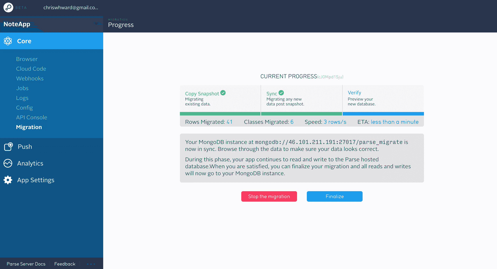
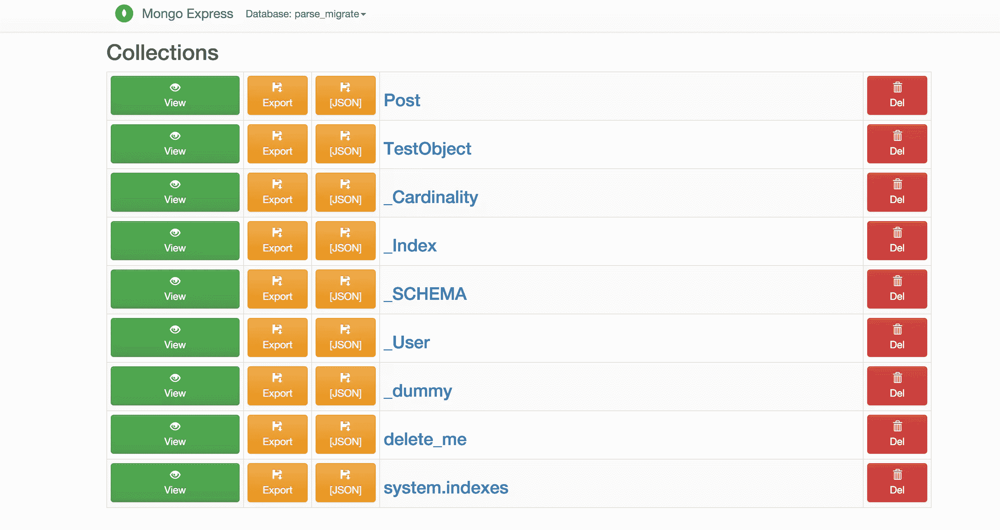
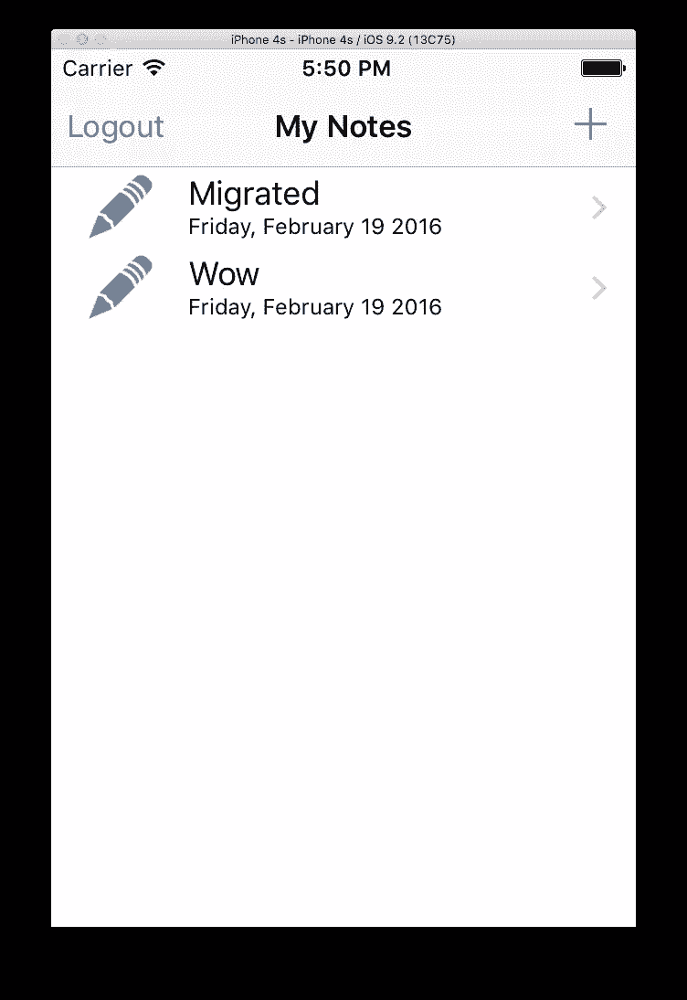

# 从 Parse 迁移您的 Android 或 iOS 应用

> 原文：<https://www.sitepoint.com/migrating-your-android-or-ios-app-from-parse/>

*这篇文章由[蒂姆·塞弗林](https://timseverien.com/)和[阿德里安·三都](http://www.adriansandu.com/)进行了同行评审。感谢 SitePoint 的所有同行评审员使 SitePoint 的内容尽可能做到最好！*

自从谷歌阅读器关闭以来，科技迷中还没有出现过如此多的惊讶和烦恼。脸书宣布他们广受欢迎的开发者服务平台 Parse 将在一年后关闭，这在依赖它的开发者中引起了恐慌。过于依赖一个集中的商业服务总是一个坏主意，因为它可能不会永远持续下去。Parse 不会是第一个或最后一个关闭的，这对我们所有人来说都是一个灵活的好教训。

讨论到此为止，让我们开始讨论如何使用 Parse powered 应用程序的实际步骤。

## 替换的下降

如果你不想自己托管东西，有其他商业替代方案可以解析，替代它提供的一个或所有服务。下面我将重点介绍一些较大的玩家，但对于一个全面的列表， [relatedcode 在 GitHub](https://github.com/relatedcode/ParseAlternatives) 上编制了一个惊人的列表。

### Twitter 结构

[Fabric](https://get.fabric.io/) 更侧重于基于它们的应用分析和优化。它与 Parse 共享许多特性，但是缺少有用的数据存储和同步。Fabric 有 iOS 和 Android 的本地客户端，并且有一个平滑的设置过程，适合您可能有的任何构建过程。 [SitePoint 有一个很棒的 Fabric 介绍](https://www.sitepoint.com/introducing-fabric-twitters-mobile-development-platform/)让你开始。

### 重火力点

[Firebase](https://www.firebase.com/) 专注于为您的应用提供可扩展的数据存储和认证，是理想的解析替代产品。它有一个 Android、iOS 和 JavaScript SDK 以及一个 REST API。 [SitePoint 有很多教程](https://www.sitepoint.com/?s=firebase)，涵盖了将服务与你的应用集成。

### 辛卡诺

[Syncano](https://www.syncano.io/) 提供数据存储和通道的组合，您的应用程序订阅这些存储和通道，并在数据发生变化时触发。它有各种各样的 SDK，适用于你喜欢的大多数应用程序和后端语言，并且 [SitePoint 已经发布了几篇关于使用 Syncano](https://www.sitepoint.com/?s=Syncano) 的帖子来帮助你入门。

### AWS 移动中心

在典型的 AWS 风格中，[他们的产品](https://aws.amazon.com/mobile/)拥有移动应用程序所需的一切。它利用了您的应用程序可能需要的 AWS 服务，并添加了测试等特定于移动设备的服务。有这么多的选项和 AWS 典型的冗长文档，可能很难知道从哪里开始。

## 移民

作为一个要迁移的示例应用程序，我将引用 Joyce Echessa 的 SitePoint 文章，介绍如何使用 Parse ( [iOS](https://www.sitepoint.com/creating-cloud-backend-ios-app-using-parse/) 和 [Android](https://www.sitepoint.com/creating-cloud-backend-android-app-using-parse/) )为移动应用程序创建后端。您可能希望遵循这些，或者尝试遵循您自己的应用程序。

Parse 数据的基础是基于 [MongoDB](https://www.mongodb.com) ，一个著名的 NoSQL 数据库，拥有丰富的历史和支持。与您的数据交互依赖于使用 Parse API，这已经被开源到一个同样标准的、但是精简的节点中。JS / Express 应用程序。

如果您的系统上没有安装 MongoDB，[在这里找到说明](https://docs.mongodb.org/manual/installation/)。安装完成后，启动服务器，但不要担心数据库或模式的创建，Parse 会处理这些。

**注意**:Parse migration service 只支持 MongoDB 2.6.X 和 3.0.X，这是比较老的版本，所以一定要安装。

**注意:**迁移工具需要远程 MongoDB 安装，这对于测试来说不是很好。我试图用 [Ngrok](https://www.sitepoint.com/use-ngrok-test-local-site/) 暴露一个本地安装，但无法让它工作。希望您已经安装了 MongoDB，可以在某个地方进行试验。

从 Parse 的**新**仪表板的*应用设置- >常规- >迁移到外部数据库*部分导出您的 Parse 数据，并输入您的 MongoDB 连接 url，类似于*MongoDB://server _ IP:27017*。这将把解析数据直接传输到 MongoDB 数据库中。

这是我成功的迁移:



这里我使用 [Mongo Express](https://github.com/mongo-express/mongo-express) 来证明数据被迁移:



### 解析服务器

此时，您可以将您的应用程序直接连接到 MongoDB 数据库，但是解析服务器本身是开源的，以提供更容易的访问和对您的应用程序更少的更改。所以让我们把这个过程进行到底。

我使用了[解析服务器示例](https://github.com/ParsePlatform/parse-server-example)来启动并运行快速测试服务器，但是[服务器也可以作为节点/快速模块](https://github.com/ParsePlatform/parse-server)添加到您可能已经拥有的任何现有应用程序堆栈中。

服务器示例的安装步骤是正确的，直到它告诉您启动一个本地 MongoDB 实例，因为我们的数据已经被迁移到一个远程服务器。这是 Parse 记录的迁移过程中的一个小缺陷，因为您不能迁移到本地实例，但是这个“下一步”告诉您连接启动一个本地实例！我有几个这样的问题…

很容易更改服务器示例以满足我们的需求，在克隆的项目中打开 *index.js* ，并将第 7-18 行更改为:

```
var databaseUri = process.env.DATABASE_URI || process.env.MONGOLAB_URI || 'mongodb://SERVER_IP:27017/db';

if (!databaseUri) {
  console.log('DATABASE_URI not specified, falling back to localhost.');
}

var api = new ParseServer({
  databaseURI: databaseUri || 'mongodb://SERVER_IP:27017/db',
  cloud: process.env.CLOUD_CODE_MAIN || __dirname + '/cloud/main.js',
  appId: process.env.APP_ID || 'Add Value Here',
  masterKey: process.env.MASTER_KEY || 'Add Value Here' //Add your master key here. Keep it secret!
});
```

现在运行:

```
npm start
```

### 更新你的应用

要将解析服务器切换到我们自己的自托管实例，解析库至少需要是 iOS 版本 1.12 或 Android 版本 1.13.0。如果你正在从我们的原始教程升级 iOS 应用程序，[遵循这里的步骤](https://www.parse.com/apps/quickstart#parse_data/mobile/ios/native/existing)，如果你正在升级 Android 应用程序，[这些步骤](https://www.parse.com/apps/quickstart#parse_data/mobile/android/native/existing)。

接下来，通过更改应用程序解析配置设置，切换到本地运行的解析服务器。

#### ios

```
[Parse initializeWithConfiguration:[ParseClientConfiguration configurationWithBlock:^(id<ParseMutableClientConfiguration> configuration) {
   configuration.applicationId = @"YOUR_APP_ID";
   configuration.clientKey = @"YOUR_APP_CLIENT_KEY";
   configuration.server = @"http://localhost:1337/parse/";
}]];
```

**注意**:如果您收到以下错误:

```
"[Error]: The resource could not be loaded because the App Transport Security policy requires the use of a secure connection."
```

正确的解决方案是在安全连接上运行解析服务器，但是出于测试目的，您可以按照这里提到的步骤通过[禁用 iOS 的安全连接。](http://stackoverflow.com/questions/32631184/the-resource-could-not-be-loaded-because-the-app-transport-security-policy-requi)

#### 机器人

```
Parse.initialize(new Parse.Configuration.Builder(myContext)
    .applicationId("YOUR_APP_ID")
    .clientKey("YOUR_APP_CLIENT_KEY")
    .server("http://localhost:1337/parse/")

    .build()
);
```

清理和重建你的应用程序，希望一切都像以前一样，当它连接到托管解析。下面是 iOS 版本:



## 结论

编写本教程花了一些时间，因为 Parse 的迁移文档不一致，而且有些地方不完整。我很有希望成功地提炼出一些更简洁的步骤，并提供了一个实际的例子。我想你们中的许多人正在尝试迁移比本教程复杂得多的应用程序，所以这里有一些我认为最有用的文档来源:

*   [Parse 的通用迁移指南](https://github.com/ParsePlatform/parse-server/wiki/Migrating-an-Existing-Parse-App)。请注意，对于由 Parse 提供的[许多其他服务，建议您切换到独立选项。](https://github.com/ParsePlatform/parse-server/wiki/Migrating-an-Existing-Parse-App#3-cloud-code)
*   [解析服务器指南](https://github.com/ParsePlatform/parse-server/wiki/Parse-Server-Guide)，配置选项最有用。

*如果您有任何其他意见或问题，请在下面的评论中告诉我*。

## 分享这篇文章