# 将你的 WordPress 博客迁移到 Adobe Business Catalyst

> 原文：<https://www.sitepoint.com/migrating-your-wordpress-blog-to-adobe-business-catalyst/>

博客是电子商务解决方案的重要组成部分，尤其是对小公司而言——它们提供了一种与客户直接联系的方式，是一种让您的客户从竞争对手中脱颖而出的廉价方式，并且为搜索引擎优化提供了真正的好处。

然而，在许多情况下，设计师致力于为客户的业务构建电子商务解决方案，并可以理解地将大部分可用时间和预算花在在线商店上，专注于产品展示、类别、导航和结账。博客通常是一个现成的、附加的解决方案来完善网站的功能集——特别是对于开发资源有限的设计师来说。

然而，典型的集成侧重于导航和表示——支持商店的应用程序和支持博客的应用程序都使用通用的标题和样式——但仅此而已。数据不容易共享，不支持认证会话，对通用元素的任何更改都需要在多个位置更新，但这只是支持困境的开始。

WordPress 的插件架构对大多数用户来说是一个巨大的优势——让世界各地的开发者添加特性和功能给设计者和客户提供了各种各样的选择来扩展他们博客的功能。但是对于任何插件架构，您都需要保持最新，因为平台升级会影响插件。这只是维护障碍的另一个方面，随着时间的推移，维护障碍可能会发展成成本高昂的维护任务。

与中小型企业合作的小型设计公司需要最大限度地提高效率并降低长期支持成本。您应该集中精力为客户创造价值，并保持较低的支持成本。

即使认识到这个问题的设计者也发现自己陷入了一个更大的困境:改变的成本有时比处理支持问题的成本还要高。大多数全服务平台都承认这一点，并提供工具来帮助将现有站点迁移到新平台。

[Adobe Business Catalyst](http://businesscatalyst.com/?sdid=ISTFH) 提供工具将在线业务迁移到他们的平台上，包括博客。博客代表了一种特殊的情况，因为博客包含的结构化数据的关系跨越了文章。例如，大多数博客都有评论和评论线程，它们被分配到不同的类别，并且有一个历史记录。在这篇文章中，我们将把你的博客迁移到一个新的 [Business Catalyst](http://businesscatalyst.com/?sdid=ISTFH) 网站，并基于你当前的 [WordPress](http://wordpress.org) 博客建立一个无缝模板。

除了博客， [Business Catalyst](http://businesscatalyst.com/?sdid=ISTFH) 实际上是一个在线业务平台，为集成电子商务、营销和内容管理提供工具。本系列的其他文章将更详细地讨论这些主题。

### 想办法

一切从计划开始。我非常相信在开始之前就做好计划，所以花几分钟时间做好计划，以下是我们知道必须采取的步骤:

*   创建新的 BC 站点
*   创建模板
*   设置您的博客布局
*   创建您的博客
*   导出/导入当前博客
*   微调并设置为起始页

在这个过程中，我将确定一些更多的细节，但这基本上是我们将涵盖的内容。

### 进入

实际上，在进入 Business Catalyst 的过程中，我将涉及两个步骤——第一步是建立一个模板来包装您的内容。我们在以前的文章中已经这样做了，但是在这篇文章中，我应用的设计约束是你想要在你的 WP 博客上保持当前的站点模板。

为了进行设置，最快的方法是导入您当前的站点，然后根据该内容创建一个模板。设置好模板后，我们将把博客内容移入模板。听起来不错吧？好了，我们开始吧。

### 导入网站

Business Catalyst 提供了一个向导，可以很容易地将站点迁移到平台上。它构建文件系统，并将所有内容和支持资产移动到 Business Catalyst 中的目录结构中。如果希望新网站模板基于现有网站，这一步很重要。如果您借此机会创建一个新模板，您不需要执行导入站点步骤，您可以继续跳到**导入博客**步骤。

我假设您已经创建了一个新帐户，并且熟悉**合作伙伴门户**(如果不熟悉，请参见[Adobe Business Catalyst 简介](https://www.sitepoint.com/intro-business-catalyst/)，转到**创建网站**，选择一个 **Pro** 网站类型，然后单击“*导入您当前的网站*”单选按钮。这将加载一个分区，您可以在其中输入当前站点的 URL。

**note:**

通过指定开始目录，您可以将此限制到当前网站的一个子部分；BC 将只导入该目录下的页面。

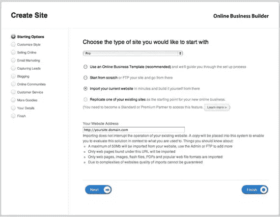

一旦你输入了 URL/路径，点击**下一步**，然后你需要输入更多的信息来完成在你的帐户上设置新网站。

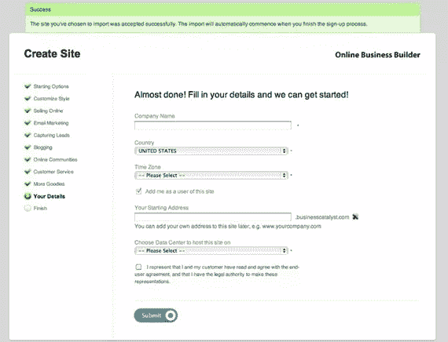

单击**提交**，页面将重新加载导入过程的详细状态。相当酷。根据网站的大小，这可能需要一段时间。最后你会看到一条确认信息“*祝贺你！您已经成功注册……*"

现在有趣的部分开始了。

### 创建模板

第一项任务是检查新站点—打开一个新的浏览器窗口，点击您为导入的站点创建的 URL。我已经决定与一家名为 Koffee Klubbe 的虚构公司合作，该公司面向咖啡爱好者。

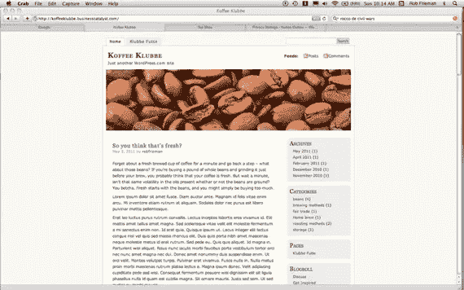

检查链接，他们应该都工作。你将看到的是你的旧网站所包含的所有内容的静态副本。不幸的是，这也包括看似动态的项目，如搜索框和评论表单。它们不会工作——至少不会像你预期的那样，因为它们仍然指向旧站点。我们一会儿就来清理一下。

### 删除 WP 标签和内容

注意:如果你查看 source，你会看到你的站点中的一些条目仍然引用旧的 WordPress 站点——包括样式表。一旦你建立了你的博客，你应该花时间去识别和迁移那些文件到你的 BC 站点。

我们已经在以前的文章中介绍了设置模板的基础知识，所以如果你需要复习，请点击这里。我将重点介绍在你现有的 WordPress 页面上创建一个新模板的步骤。

在我使用的 WP 主题中，包含内容的`div`是`
`。我简单地在**网页详情**编辑器中调出我的**默认**页面，找到了`div`的开始和结束。用一个简单的`{tag_pagecontent}`标签替换`div`中的所有内容:

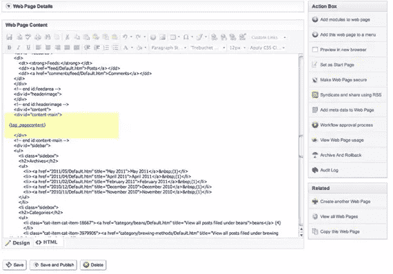

如果您切换回**设计**视图，您会看到内容被替换为标签。现在，BC 没有解析那个标签，因为这是一个静态页面——我们接下来将设置模板。

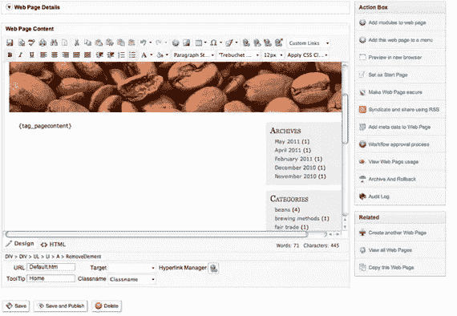

复制该页面的 HTML，点击**Admin>Manage Site-wide Templates**并为该站点创建一个新模板。命名模板，切换到 **HTML** 视图，粘贴内容，保存并发布。返回到**网页**，创建一个新页面作为`index.html`，为其命名并选择您的新模板:

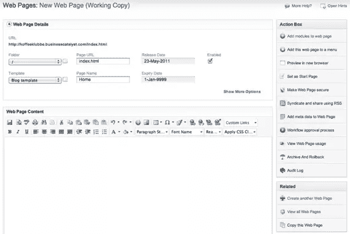

好的。你实际上已经成功了一半。现在，让我们建立你的博客。

我们将从博客布局开始。除了允许您定义通用元素的站点范围模板，这些元素将作为一致的框架显示在站点的各个部分，您还可以为您的博客定义布局，该布局将控制文本、评论、到其他文章和类别的链接如何在您的大布局的`{tag_pagecontent}`部分中显示。明白了吗？让我们开始吧。

导航到**管理>更多定制选项**，然后点击**博客布局**。

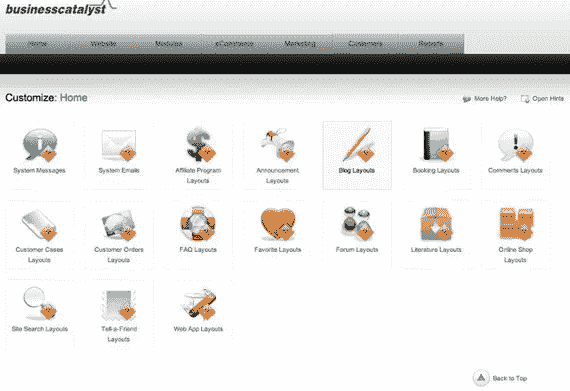

接下来，选择**整体博客布局**进行编辑。

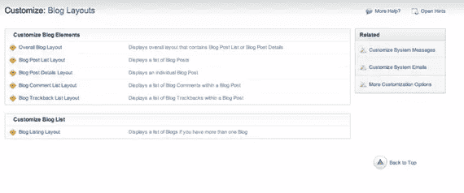

这将打开一个标准的编辑窗口，但这次你将看到所有与博客相关的模块——博客内容、标签、评论、引用链接等。如果你切换到 **HTML** 视图，你可以控制布局到你需要的细节层次。

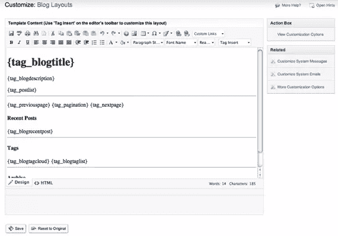

现在你的模板和博客布局都设置好了，让我们把博客添加到你的站点。

转到**网页>博客**并创建一个新博客。像大多数 BC 应用程序一样，您将命名博客并选择显示内容时要使用的模板。我选择启用**引用通告**功能和 **RSS 订阅**——大多数博客的常见功能。

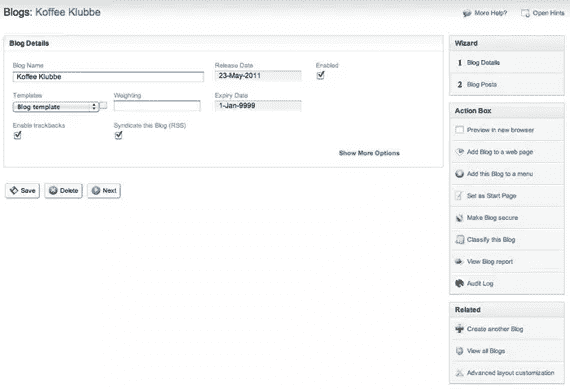

在下一个屏幕上，你会看到你的博客还没有内容。接下来，我们将从 WordPress 导入您的博客。

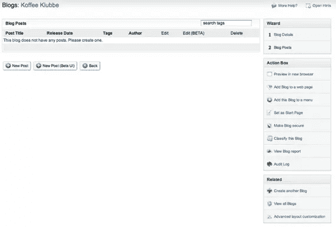

### 导入博客

导入首先需要的是你的数据——去你的 WordPress 网站，登录你的**仪表盘**,点击**设置**菜单下的**导出**。

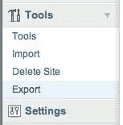

在下一个屏幕中，缩小导出的范围，以满足与您想要移入新站点的内容相匹配的范围。在我的例子中，我把所有的文章都移过来。

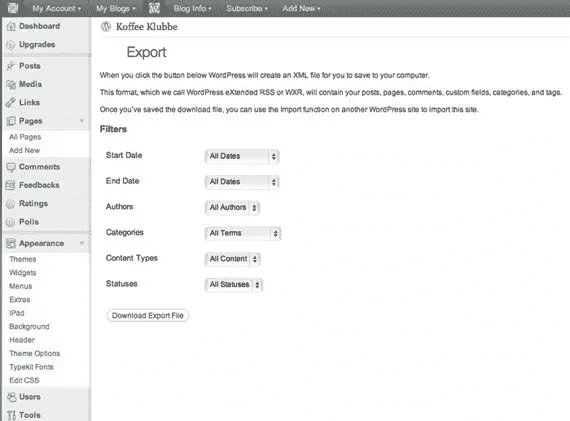

导出应该会导致下载一个带有时间戳的 xml 文件。将文件保存到本地目录，您马上就会用到它。

回到你的业务催化剂网站，点击**管理**，**导入数据**。选择**博客**导入。

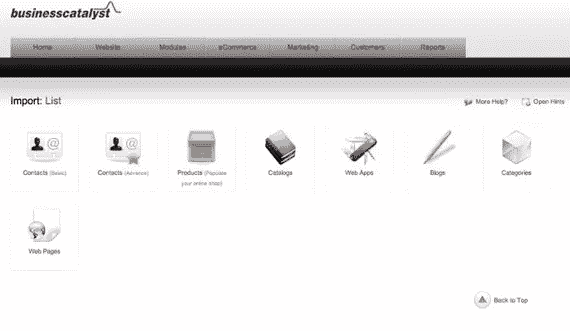

你必须选择要导入的博客，选择博客引擎，在这个例子中是“ **WordPress** ”，然后选择导出文件。点击**下一步**开始导入。

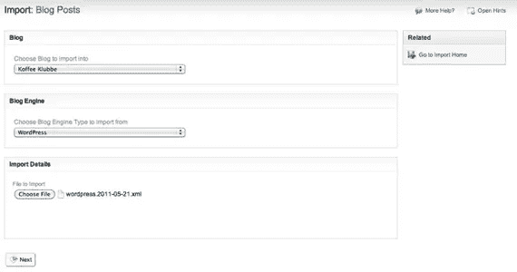

系统会提示您两次，确认您已经准备好进行导入—单击提示，您会看到一个成功的确认。

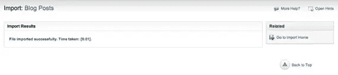

现在，进入**网站>博客**，点击右边导航中的**博客文章**，你会看到你所有的内容:

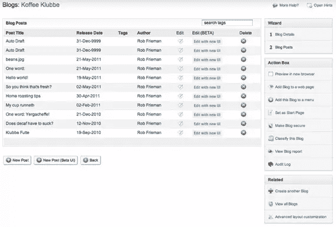

请记住，博客实际上只是一个数据驱动的应用程序——web 应用程序被设置为 Business Catalyst 中的**模块**，这为您扩展应用程序和跨应用程序共享数据提供了巨大的灵活性。

与其他 BC web 应用程序一样，您需要将它添加到页面中，以便查看您站点上的博客。

让我们使用**行动框**上方的右侧导航返回到**博客详情**页面，或者访问**网站>博客**并点击您的新博客。

在 action 框中，您将看到链接到设置为起始页的**。**

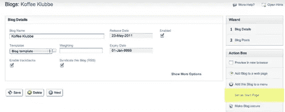

点击链接，你会看到一个模式，确认你的博客现在是你网站的默认页面。

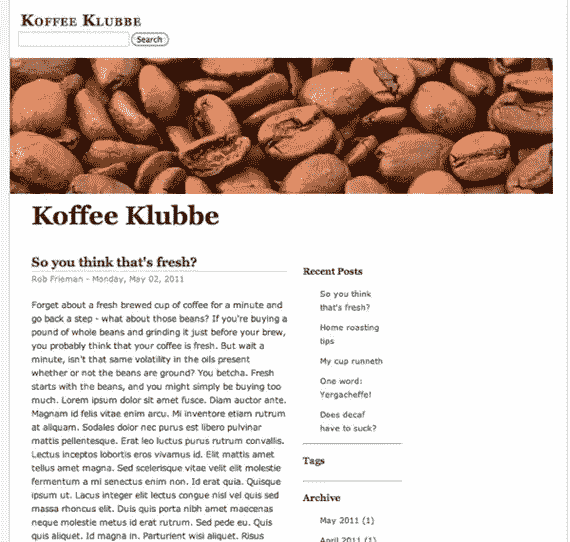

正如您所看到的，博客结构动态地构建了到最近文章、标签和每月存档的文章的导航。你可能还会发现导入并没有完全考虑你在 WP 上的格式。但是这是一个很好的理由去看看新的博客编辑器。导航回**博客>博客文章**，然后选择**用新 UI 编辑**链接。

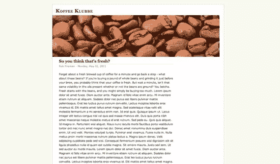

你可以编辑文章，添加标签，类别，更新发布日期，当然也可以使用所见即所得编辑器。

### 搜索

正如我上面提到的，你需要从你的模板中删除一些遗留的项目，其中之一就是搜索框。因为所有的底层内容都存储在数据库中，所以无需任何编码就可以轻松地为您的站点添加搜索功能。

导航到**模块>站点搜索**，你可以快速建立一个新的搜索门户。点击**创建新的搜索**，然后命名并确定您想要搜索的内容范围。我们将选择**博客**，然后**保存**搜索模块。

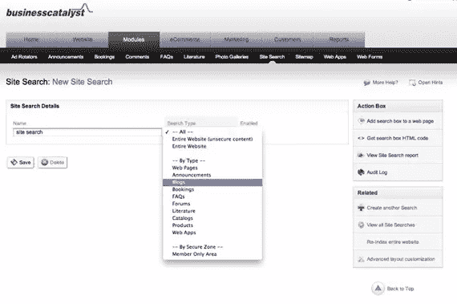

为了将搜索模块添加到您的站点，请返回到**管理>管理站点模板**并选择您要编辑的博客模板。

切换到 **HTML** 视图，为你的搜索模块创建一个新的`div`。从**动作**列表中选择**模块**，并选择一个**搜索表单**添加到您的页面。

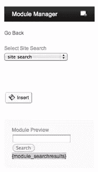

将光标放在新的`div`中，点击**插入**将搜索框代码放入模板中。insert 还会将搜索结果标记直接放在标记之后。我把我的移动到模板的主部分，就在`{tag_pagecontent}`标签的上面。对于 jQuery 来说，这是一个很好的选择，可以为您的搜索结果打开一个漂亮的窗口。你可以添加尽可能多的 chrome 和 UI 行为。

### 为什么要迁移？

如果您对现有的解决方案完全满意，您就不会考虑迁移策略。设计人员最常遇到的难题是持续维护的成本，以及维护分散在不同基础设施上的站点的工作。

像 [Business Catalyst](http://businesscatalyst.com/?sdid=ISTFH) 这样的平台的优势在于，你可以从一个平台管理你的整个在线业务，允许你在你网站上的所有网络应用程序中利用数据、分析和营销工具，而不仅仅是博客。将此视为一个机会，通过迁移到一个将随着您的业务增长而增长的托管平台，让您的解决方案经得起未来考验。内容管理、完全集成的电子商务、交叉销售能力、电子邮件营销都是由同一个底层平台驱动的。

从一个平台迁移到另一个平台从来都不是完全没有痛苦的，但是 [Business Catalyst](http://businesscatalyst.com/?sdid=ISTFH) 的工具可以让你设计网站、模板和博客，并且尽可能地控制细节。如果您遵循我上面概述的快速迁移路径，您仍然希望清理您的模板，以确保 CSS、JS 和相关资产都在您的控制之下，并且托管在同一个平台上。

有问题吗？评论？让我知道！

### 调音技巧:

这些是在你直接从 WordPress 导入你的站点后，你应该在你的站点模板中做的一些快速的改变。同样，您不需要执行站点导入步骤——如果您想从头开始设计一个新的站点，您的博客数据将流入您设计的任何模板中。

*   删除搜索框。
*   创建 CSS 和 JS 文件的本地版本。
*   从`head`中删除几乎所有的 meta 和 link 标签——在本地重新创建样式表之前，不要删除 CSS 链接。
*   移除`feedarea`
*   删除顶部记录生成页面所用时间的注释。
*   删除 RSS 源。
*   移除页脚。
*   替换`headerimage` `div`。

**note:**SitePoint Content Partner

本教程是在 Adobe 的支持下完成的。我们与 Adobe 合作，由 SitePoint 独立编写，努力共同开发对您最有用和最相关的内容。

## 分享这篇文章