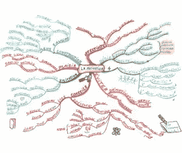
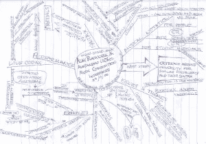
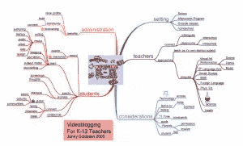

# 大脑冷冻？如何用思维导图解冻你的思维

> 原文：<https://www.sitepoint.com/mind-maps-for-business/>

我们都被困住了。无论是当试图提出一个新的设计，感觉我们的业务停滞不前，或者只是完全被我们盘子里的东西淹没。思维导图可以成为突破这些挑战的有效方法，因为它们激发创造力，产生新的想法，帮助解决问题，并清理你的头脑。

**什么是思维导图？**

心理学作家[托尼·布赞](http://en.wikipedia.org/wiki/Tony_Buzan)，被认为是发明了思维导图的[过程。思维导图基本上是头脑风暴的视觉版本。思维导图不是为你头脑中的当前问题列出一个潜在的解决方案，而是消除可能阻止你将几个想法联系起来以创建更好的解决方案的线性限制。它们可以是图形化的、图标化的、关键字驱动的或彩色的信息树。以下是一些例子:](http://www.buzanworld.com/Mind_Maps.htm)

如何创建思维导图？

虽然思维导图可以用一张白纸和一支铅笔手工绘制，但你也可以使用思维导图软件来创建一个(见下面的一些工具)。无论你如何创建你的思维导图，这里有一些基本的东西:

*   将页面的中心作为整个思维导图的主要概念
*   使用关键词、图像和颜色
*   使用线条和箭头创建分支，并将一个想法连接到另一个想法
*   避免想太多，只要把你想到的想法写下来
*   发挥创造力，制定自己的规则

你会使用什么工具？

如果你想尝试使用思维导图软件来帮助你创建自己的思维导图，这里有一些值得探索的选择。但是不要忘记你只需要一张纸和一支铅笔就可以开始了！

这是一个基于 Java 的工具，提供拖放选项，导出到 HTML 和一键导航。
费用:免费

iMindMap
它包括一个素描工具，模板和各种导出选项。
价格:有三种版本，起价 99 美元

这个工具是一个基于浏览器的在线工具，提供协作、键盘快捷键、拖放和缩放功能。
费用:免费

这款基于网络的工具的显著特点包括导出选项、协作能力和离线访问。
费用:免费至每月 6 美元

这是一个基于网络的工具，提供了许多导出选项、自定义样式、文本注释和共享功能。
费用:免费至每月 6 美元

[PersonalBrain](http://www.thebrain.com/#-47)
该工具适用于 Windows、Mac 和 Linux，包括内置的 HTML 编辑器、搜索功能和备份选项。
费用:免费至 249.95 美元

你用过思维导图吗？你觉得有用吗？你在什么情况下使用它？

*地图#1 功劳:[菲利普布科布扎](http://www.flickr.com/photos/philippeboukobza/2240996789/)地图#2 功劳:[蒂姆里甘](http://www.flickr.com/photos/dumbledad/309553705/)地图#3 功劳:[乔尼戈德斯坦](http://www.flickr.com/photos/jonnygoldstein/50135789/)*

## 分享这篇文章