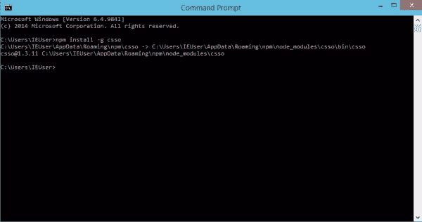

# 用 CSS 优化器缩小 CSS

> 原文：<https://www.sitepoint.com/minifying-css-with-css-optimizer/>

下面是我们的书《CSS 大师》的摘录，作者是蒂芙尼·布朗。世界各地的商店都有出售，或者你可以在这里买到电子书。

开发人员工具可以帮助你发现并修复渲染问题，但是效率呢:我们的文件大小已经尽可能小了吗？为此，我们需要**缩小**工具。

CSS 环境中的缩小仅仅意味着删除多余的字符。例如，考虑这段代码:

```
h1 {
    font: 16px / 1.5 'Helvetica Neue', arial, sans-serif;
    width: 80%;
    margin: 10px auto 0px;
}
```

它有 98 个字节长，包括换行符和空格。让我们看一个简化的例子:

```
h1{font:16px/1.5 'Helvetica Neue',arial,sans-serif;width:80%;
↵margin:10px auto 0}
```

现在我们的 CSS 只有 80 字节长，减少了 18%。当然，更少的字节意味着你和你的用户更快的下载时间和数据传输的节省。

在这一节，我们将看看 CSS 优化器，或 CSSO，一个运行在 [Node.js](https://nodejs.org/en/) 上的缩小工具。要安装 CSSO，你首先要安装 Node.js 和 [NPM](https://www.npmjs.com/) 。NPM 是作为 Node.js 安装过程的一部分安装的，所以您只需要安装一个包。

使用 CSSO 确实需要您熟练使用命令行界面。Linux 和 OS X 用户可以使用终端应用程序(适用于 OS X 的应用程序> Terminal.app)。如果您使用的是 Windows，请使用命令提示符。转到开始或 Windows 菜单，在搜索框中键入`cmd`。

### 安装 csgo

一旦你设置好 Node.js 和 NPM，你就可以安装 CSSO 了。在命令行提示符下，键入:

NPM install-g csso
-g 标志全局安装 csso，以便我们可以从命令行使用它。OS X 和 Linux 用户可能需要使用 sudo ( `sudo npm install -g csso`)。当 NPM 把它的安装路径打印到命令行窗口时，你就知道它已经安装了，命令行提示符再次出现，如图 3.25 所示。



图 3.25。使用 Windows 的命令提示符安装 CSSO

现在我们准备缩小我们的 CSS。

### 用 CSSO 缩小

要缩小 CSS 文件，运行`csso`命令，将文件名作为参数传递:

这将执行基本的压缩。CSSO 去掉不需要的空格，删除多余的分号，并删除 CSS 输入文件中的注释。

一旦完成，CSSO 将打印优化的 CSS 到标准输出，这意味着当前的终端或命令提示符窗口。然而，在大多数情况下，我们希望将输出保存到一个文件中。为此，将第二个参数传递给被缩小的文件的名称`csso`。例如，如果我们想要将 style.css 的缩小版本保存为 style.min.css，我们将使用以下代码:

默认情况下，csso 会重新排列你的 css 的一部分。例如，它将合并带有重复选择器的声明块，并移除一些被覆盖的属性。考虑以下 CSS:

正文{
边距:20px 30px
填充:100px
左边距:0px
}

h1 {
字体:200 36px / 1.5 无衬线字体；

h1 {
颜色:# ff6600
}
在这个代码片段中，`margin-left`覆盖了之前的保证金声明。我们还重复使用 h1 作为连续声明块的选择器。经过优化和缩小，我们最终得到了这个:

```
body{padding:100px;margin:20px 30px 20px 0}h1{font:200 36px/1.5
↵ sans-serif;color:#f60}
```

CSSO 删除了多余的空格、换行符和分号，并将`#ff6600`缩短为`#f60`。CSSO 还将`margin`和`margin-left`属性合并成一个声明(`margin: 20px 30px 20px 0`，并将我们分开的 h1 选择器块合并成一个。

现在，如果你怀疑 CSSO 将如何重写你的 CSS，你可以禁用它的重构功能。只需使用`--restructure-off`或`-off`标志。例如，运行`csso style.css style.min.css -off`会给我们带来以下结果:

```
 `body{margin:20px 30px;padding:100px;margin-left:0}h1{font:200 36px/
↵1.5 sans-serif}h1{color:#f60}` 
```

 `现在我们的 CSS 缩小了，但没有优化。禁用重构将使你的 CSS 文件尽可能的小。除非遇到问题，否则避免禁用重组。

在第九章中介绍的预处理程序，提供了作为其工具集一部分的缩小功能；然而，使用 CSSO 可以削减额外的字节从您的文件大小。` 

## `分享这篇文章`