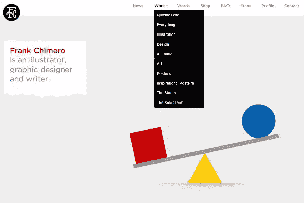
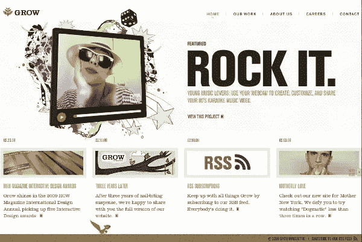
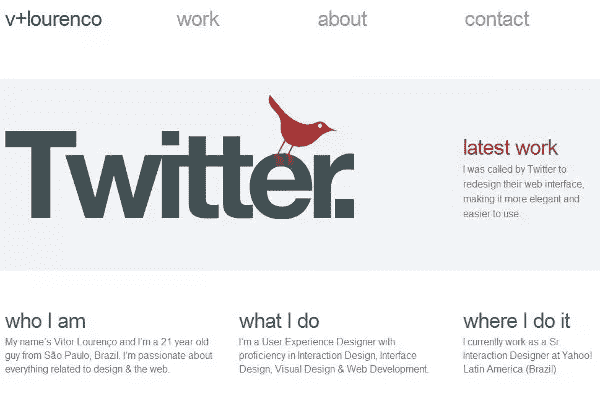
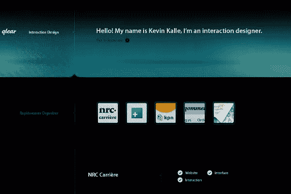
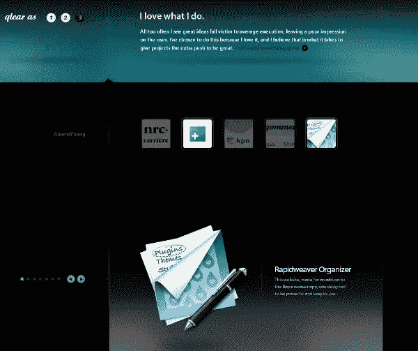
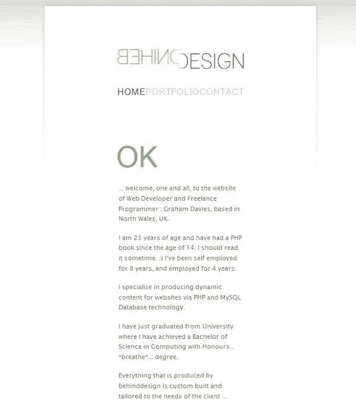

# 极简主义还在流行吗？你打赌

> 原文：<https://www.sitepoint.com/minimalist/>

工程和设计中的自然美往往是精致简约的结果。对于那些不知道的人来说，*极简主义网页设计*指的是网站设计已经去除了所有多余的亮片，只剩下最基本的功能和支持它们的基本元素。

用一位设计师的话说:“网站工作方式和外观之间的平衡”是极简主义哲学的基础。以这种方式评估美学和功能可以等同于建造一棵树的叶子，形式，颜色和功能的完美结合。因此，极简网站在很大程度上模仿了自然。让我们来看看网络上的一些优秀例子。

弗兰克·奇梅罗是一名插画师、作家和平面设计师，在密苏里州立大学教授设计和排版。Frank 的客户从《纽约时报》到星巴克，他在包括动画图形在内的几个社区中声名鹊起。他的网站是我见过的同类网站中最好的一个。利用平衡的留白方法，在简单的导航上加上一点点运动图形，Frank 为这种类型创造了一个海报儿童。

素雅——平面设计的内在标志

Grow 是 Grow Interactive 的网站，这是一家专注于从在线广告到社交网络和病毒式营销的技术公司。他们的网站不仅简单而整洁，而且最初的 flash 演示通过从观众的屏幕上逐渐变大来翻译 Grow 徽标主题。这不是很多人认为的真正的极简主义，因为它更像是一个超级简单的设计，稍微超越了极简主义而变得华丽。下图很好地说明了这一点。读者可以在网站的底部看到一只小的动画松鼠(一个可爱的触摸)，这进一步传达了一种自然和互动的感觉，而没有过度。

简单点，添加一点点 flash -很快

网络和交互设计师熊伟·洛伦索的网站运作在一个简单的层面上，它是如此的简单。仔细看看这个网站，尤其是熊伟的其他作品，揭示了他的极简主义疯狂的方法。熊伟是雅虎的高级用户体验设计师。巴西，最近担任 Twitter 的视觉和界面设计师。正如他的主页所展示的那样，他擅长于互动和美学上的设计。

几乎太简单了——几乎

glear 是互动设计师凯文·卡勒的网站。这个设计非常漂亮，它也反映了一种平衡，这是所有伟大的网站所固有的。卡勒自己的一句话最好地表达了这一思想:

> 如果它的工作方式和外观没有一个适当的平衡，你就剩下一盘肉汤了。

黑暗劝导的极简设计

在我参观的所有景点中，卡勒的可能是最引人注目的。这是一个完美的例子，说明了如何通过形式和颜色来突出功能。设计师创建了一个完全符合“平衡”哲学的网站，从文本到每一分钟的功能，该网站为访问者提供了独特的清晰体验。出色的设计——句号。

每一个字母，每一个按钮都是经过深思熟虑的。

设计网站背后的[是简洁和使用空白空间清洁的终极表达。Graham Davies 是英国的自由程序员和 Web 开发人员，他是一个神童，从 14 岁开始阅读 PHP，15 岁开始工作。洗掉白色空间和突出黑色文字的戏剧性效果对我的口味来说有点不平衡，但它是另一种设计艺术的典范。](http://www.behinddesign.co.uk/home.php?/Home)

空白极限——阅读或其他命题

我不是图形设计或编码专家，但对于经常光顾这些网站的人来说，看到网页设计中的形式和功能之美是非常清楚的。不管你是不是这种风格的粉丝(最明显的例子是谷歌的丑陋)，很明显，坚持“平衡”原则的人有很多优点。在一个充满过度设计创新的互联网上，我认为可以从这种理念的最佳设计师那里学到很多东西。或许教训是:为你想要达到的目标设定目标，并且只比别人做得更好。我希望你喜欢这些网站，并希望你能与社区分享一些其他伟大的例子。

## 分享这篇文章