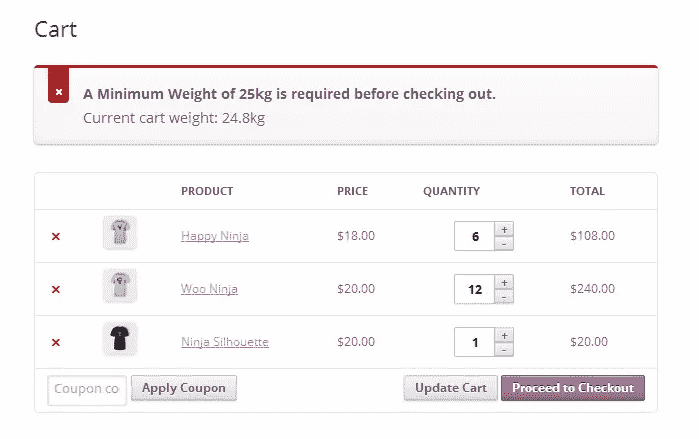
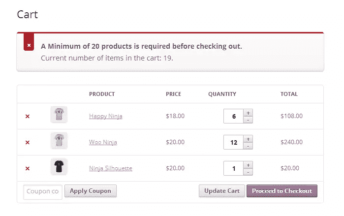
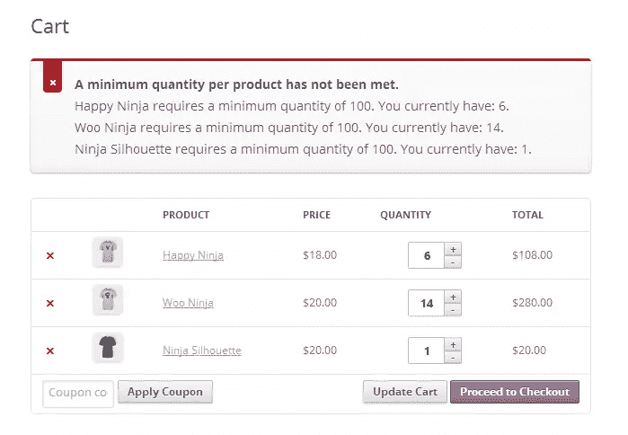
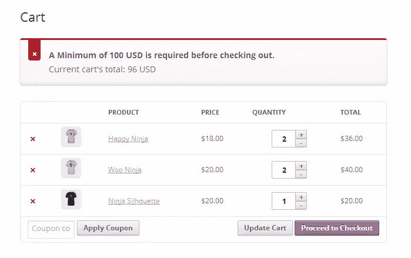

# 在 WooCommerce 中设置最低结账要求

> 原文：<https://www.sitepoint.com/minimum-checkout-requirements-in-woocommerce/>

在顾客结账之前，你可能想对你的 WooCommerce 商店设定一些最低要求。以下是如何设置这些要求和限制的指南，根本不需要使用任何插件:

*   设定每个订单的最小重量要求
*   设定每个订单所需产品的最小数量
*   设定每种产品的最小数量
*   设定每份订单的最低金额

### 本文中使用的方法

在 WooCommerce 中，设定最低要求的方式总是不止一种；结果甚至可能是相同的。但是我认为下面描述的方法是正确的(或者更好的)方法。任何关于如何完成这些任务或进一步改进的建议都将受到欢迎和好评。

以下代码已经在 WordPress (3.9.1)和 WooCommerce (2.1.12)的最新版本中测试过。当你安装插件时，我们将使用为 WooCommerce 提供的虚拟数据。代码应该放在你的主题的 functions.php 文件中，并且有大量的注释，这样如果需要的话更容易理解和/或修改。

我们将使用 WooCommerce 提供的`woocommerce_check_cart_items`动作来运行我们的函数和执行我们的代码。访问下面的链接获得一个完整的 [WooCommerce 行为和过滤器](http://docs.woothemes.com/document/hooks/ "WooCommerce actions and filters")，也称为钩子。

### 设定每个订单的最小重量要求



限制您的顾客在没有达到最低重量要求的情况下完成结账过程通常是有用的。最低重量要求有助于使您的运输成本更易于管理，并使运输过程更加简化。不要忘记将最小重量要求改为最适合你的，并且记住重量是以你在 woo commerce-> Settings-> Products 下设置的任何重量单位计算的。

```
// Set a minimum weight requirement before checking out
add_action( 'woocommerce_check_cart_items', 'spyr_set_weight_requirements' );
function spyr_set_weight_requirements() {
	// Only run in the Cart or Checkout pages
	if( is_cart() || is_checkout() ) {
		global $woocommerce;
		// Set the minimum weight before checking out
		$minimum_weight = 25;
		// Get the Cart's content total weight
		$cart_contents_weight = WC()->cart->cart_contents_weight;
		// Compare values and add an error is Cart's total weight
	    // happens to be less than the minimum required before checking out.
		// Will display a message along the lines of
		// A Minimum Weight of 25kg is required before checking out. (Cont. below)
		// Current cart weight: 12.5kg
		if( $cart_contents_weight < $minimum_weight  ) {
			// Display our error message
			wc_add_notice( sprintf('<strong>A Minimum Weight of %s%s is required before checking out.</strong>'
				. '<br />Current cart weight: %s%s',
				$minimum_weight,
				get_option( 'woocommerce_weight_unit' ),
				$cart_contents_weight,
				get_option( 'woocommerce_weight_unit' ),
				get_permalink( wc_get_page_id( 'shop' ) )
				),
			'error'	);
		}
	}
}
```

### 设定每个订单所需产品的最小数量



另一个有效的场景是，在允许客户全额支付订单和发货之前，设置一次必须订购的产品的最小数量。将“20”改为最适合您需求的值。和前面的例子一样，您希望确保只在购物车和结帐页面上运行这段代码。这是我们使用的 is_cart()和 is_checkout()，当我们在这两个特定的页面上时，它们返回“true”。了解更多关于 [WooCommerce 条件标签](http://docs.woothemes.com/document/conditional-tags/ "WooCommerce Conditional Tags")的信息。

```
// Set a minimum number of products requirement before checking out
add_action( 'woocommerce_check_cart_items', 'spyr_set_min_num_products' );
function spyr_set_min_num_products() {
	// Only run in the Cart or Checkout pages
	if( is_cart() || is_checkout() ) {
		global $woocommerce;

		// Set the minimum number of products before checking out
		$minimum_num_products = 20;
		// Get the Cart's total number of products
		$cart_num_products = WC()->cart->cart_contents_count;

		// Compare values and add an error is Cart's total number of products
	    // happens to be less than the minimum required before checking out.
		// Will display a message along the lines of
		// A Minimum of 20 products is required before checking out. (Cont. below)
		// Current number of items in the cart: 6	
		if( $cart_num_products < $minimum_num_products ) {
			// Display our error message
	        wc_add_notice( sprintf( '<strong>A Minimum of %s products is required before checking out.</strong>' 
	        	. '<br />Current number of items in the cart: %s.',
	        	$minimum_num_products,
	        	$cart_num_products ),
	        'error' );
		}
	}
}
```

### 设定每种产品的最小数量



设定每种产品的最低数量是 WooCommerce 商店的一个普遍要求，特别是如果你是批发销售。设置最低数量将限制您的客户购买较少数量的特定产品。为了检查最小数量，我们需要遍历购物车中的每一个产品，并根据我们设定的每个产品的最小数量要求进行检查。

要设置这些限制，您需要创建一个数组，将您的规则/限制保存在另一个数组中。编辑此数组时要小心，确保所有代码都输入准确，以防止出现错误和意外结果。您需要使用的格式如下:

```
// Product Id and Min. Quantities per Product
// id = Product ID
// min = Minimum quantity
$product_min_qty = array( 
	array( 'id' => 47, 'min' => 100 ),
	array( 'id' => 37, 'min' => 100 ),
	array( 'id' => 34, 'min' => 100 ),
	array( 'id' => 31, 'min' => 100 ),
);
```

这就是奇迹发生的地方。

```
// Set minimum quantity per product before checking out
add_action( 'woocommerce_check_cart_items', 'spyr_set_min_qty_per_product' );
function spyr_set_min_qty_per_product() {
	// Only run in the Cart or Checkout pages
	if( is_cart() || is_checkout() ) {	
		global $woocommerce;

		// Product Id and Min. Quantities per Product
		$product_min_qty = array( 
			array( 'id' => 47, 'min' => 100 ),
			array( 'id' => 37, 'min' => 100 ),
			array( 'id' => 34, 'min' => 100 ),
			array( 'id' => 31, 'min' => 100 ),
		);

		// Will increment
		$i = 0;
		// Will hold information about products that have not
		// met the minimum order quantity
		$bad_products = array();

		// Loop through the products in the Cart
		foreach( $woocommerce->cart->cart_contents as $product_in_cart ) {
			// Loop through our minimum order quantities per product
			foreach( $product_min_qty as $product_to_test ) {
				// If we can match the product ID to the ID set on the minimum required array
				if( $product_to_test['id'] == $product_in_cart['product_id'] ) {
					// If the quantity required is less than than the quantity in the cart now
					if( $product_in_cart['quantity'] < $product_to_test['min'] ) {
						// Get the product ID
						$bad_products[$i]['id'] = $product_in_cart['product_id'];
						// Get the Product quantity already in the cart for this product
						$bad_products[$i]['in_cart'] = $product_in_cart['quantity'];
						// Get the minimum required for this product
						$bad_products[$i]['min_req'] = $product_to_test['min'];
					}
				}
			}
			// Increment $i
			$i++;
		}

		// Time to build our error message to inform the customer
		// About the minimum quantity per order.
		if( is_array( $bad_products) && count( $bad_products ) > 1 ) {
			// Lets begin building our message
			$message = '<strong>A minimum quantity per product has not been met.</strong><br />';
			foreach( $bad_products as $bad_product ) {
				// Append to the current message
				$message .= get_the_title( $bad_product['id'] ) .' requires a minimum quantity of '
						 . $bad_product['min_req'] 
						 .'. You currently have: '. $bad_product['in_cart'] .'.<br />';
			}
			wc_add_notice( $message, 'error' );
		}
	}
}
```

### 设定每份订单的最低金额



最后但并非最不重要的一点是，您可能希望设置一个最低金额，在允许您的客户结账之前，必须支付该金额。请注意，我们是使用小计计算总价值，然后将运费和税添加到最终订单总额中。

```
// Set a minimum dollar amount per order
add_action( 'woocommerce_check_cart_items', 'spyr_set_min_total' );
function spyr_set_min_total() {
	// Only run in the Cart or Checkout pages
	if( is_cart() || is_checkout() ) {
		global $woocommerce;

		// Set minimum cart total
		$minimum_cart_total = 10;

		// Total we are going to be using for the Math
		// This is before taxes and shipping charges
		$total = WC()->cart->subtotal;

		// Compare values and add an error is Cart's total
	    // happens to be less than the minimum required before checking out.
		// Will display a message along the lines of
		// A Minimum of 10 USD is required before checking out. (Cont. below)
		// Current cart total: 6 USD 
		if( $total <= $minimum_cart_total  ) {
			// Display our error message
			wc_add_notice( sprintf( '<strong>A Minimum of %s %s is required before checking out.</strong>'
				.'<br />Current cart\'s total: %s %s',
				$minimum_cart_total,
				get_option( 'woocommerce_currency'),
				$total,
				get_option( 'woocommerce_currency') ),
			'error' );
		}
	}
}
```

### 结论

如你所见，WooCommerce 允许你使用动作和过滤器来改变正常的结账流程。所有商店都是不同的，能够在需要时设置这些限制是至关重要的。对于我们这些需要完成这些任务的开发人员来说，知道如何去做是至关重要的。

感谢您的阅读，欢迎对如何改进代码提出意见或建议。如果你对某个特定的 WooCommerce 修改有想法，不要害羞，在评论里贴一个链接来讨论。

## 分享这篇文章