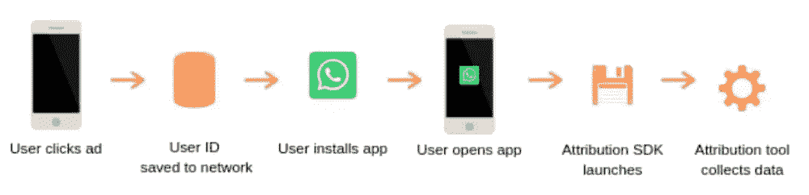
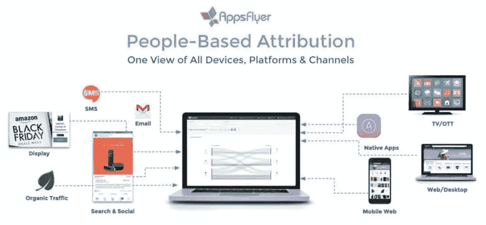
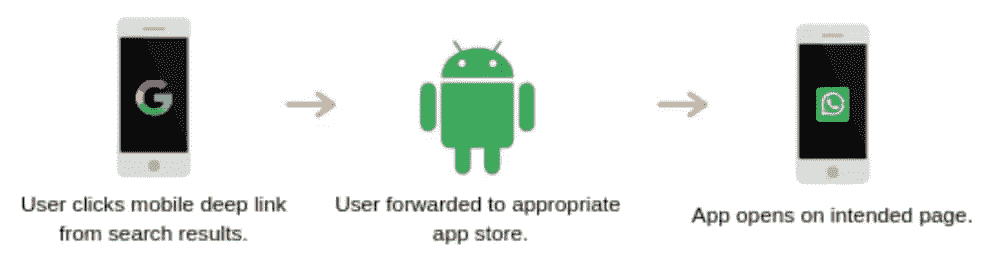

# 移动归因 101:每个开发者都需要知道的

> 原文：<https://www.sitepoint.com/mobile-attribution-101/>

*本文是与 [StudioWorks](http://studioworks.me/) 合作创作的。感谢您对使 SitePoint 成为可能的合作伙伴的支持。*

优化你的应用程序的用户体验对它的成功至关重要，而最好的方法就是收集用户如何与之互动的数据。虽然常规分析工具做得很好，但现在有一种更好的方法。

欢迎来到**移动归属地**。这种衡量应用性能的方法可以让您发现用户在哪里以及如何与您的应用进行交互，并将他们与应用之旅中的关键点联系起来。

但是*到底是什么*移动归属地，怎么用？坚持读书学习。

## 移动归属地解释

**移动归因**是衡量两个指标的过程，如广告支出和应用安装。鉴于[移动广告行业到 2020 年](https://www.statista.com/statistics/280640/mobile-advertising-spending-worldwide/)将超过 2440 亿美元，你需要知道哪些策略和渠道在浪费你的钱或产生最大的回报。

移动归属也有助于移动应用开发者和公司确定用户如何与应用和移动广告互动。这些信息可用于优化营销活动、应用程序的用户体验等。

简而言之，这个过程看起来像这样:

How mobile attribution works

不[利用移动归属地](https://www.appsflyer.com/product/mobile-attribution/)意味着你不会有关于你的移动应用及其广告表现的最详细、最准确的数据。这会导致机会出现时错失良机，或者发现问题时为时已晚。

Appsflyer is a market leader in ad attribution and analytics with their proprietary “People-based Attribution” technology

接下来，我们来谈谈*为什么*你应该使用移动属性。

## 移动归属地的优势

这些是利用移动归属地的一些主要优势。

### 跟踪用户事件以优化您的应用

你将能够在你的应用中追踪用户如何与移动广告活动互动的每个细节。这包括他们最初在哪里找到您的应用程序，他们导航到哪些页面，以及他们与哪些功能交互最多。

这些信息是无价的。它会准确地告诉你用户最喜欢哪些页面和功能，哪些频道带来了最多的流量，以及哪些活动为你的应用程序带来了最多的结果。

然后，您可以将更多资金投入到盈利渠道，将喜爱的功能推到最前面，并改善每个用户参与您的应用程序的方式。

### 减少广告支出，提高活动绩效

想象一下，能够快速发现哪些广告活动和渠道*是*而*不是*推动结果。你可以削减输家，向赢家投入更多资金。多亏了移动定位技术，这才成为可能。

移动属性将向您展示哪些广告、活动和个人网络为您的应用程序带来了最多的流量、安装和转化。

许多公司在表现不佳的活动和渠道上投入了令人难以置信的大量资金，因为[他们没有移动归因可以提供的数据](https://www.information-age.com/mobile-attribution-trends-123482621/)。不要成为他们中的一员。

## 如何使用移动归属地

移动归因是很棒的，但是你实际上是怎么做的呢？

第一种方式是使用**手机 app 深度链接**。这可以用来收集用户如何与你的应用程序交互的数据。深度链接也能够增加安装和品牌知名度。

深度链接适用于 iOS 和 Android 设备。通过向移动应用程序添加特定的代码行，开发人员能够将用户推到应用程序商店下载他们的应用程序(如果他们没有的话)，然后将他们转发到预定位置。

Mobile app deep linking example

**深层链接**，顾名思义，链接到应用程序中更深层的功能，而不是欢迎屏幕。这节省了用户的时间，并允许他们更快地到达他们想去的地方。

你可以关注官方 Android 文档和 T2 苹果文档，学习如何在你的应用中添加深层链接，开始享受移动属性带来的好处。

此外，公司可以投资移动归属服务。这些为您提供了收集用户群和应用深度分析所需的所有工具和仪表盘。

## 结论

移动归属允许开发人员在用户和应用程序之间架起一座桥梁，以收集关键信息。这些数据可用于优化用户体验、广告和营销活动。

你现在就可以开始使用移动属性，方法是在你的或应用程序中启用深度链接，或者投资属性服务，这些服务会代表你完成大部分繁重的工作。

到目前为止，你对移动归因有什么体验？

## 分享这篇文章