# 如何设置移动开发环境

> 原文：<https://www.sitepoint.com/mobile-development-environment/>

在过去十年中，移动设备的使用显著增加。自从[移动浏览接管桌面](https://www.sitepoint.com/browser-trends-december-2016-mobile-overtakes-desktop/)以来，已经过去两年多了。移动设备的可用性也呈爆炸式增长。移动设备现在拥有强大的处理能力。

我们经常认为移动平台是开发人员的重要工作，但今天，我们可以利用移动便携性的优势，每年都有更接近桌面的灵活性。

这篇文章解释了使用 Samsung Dex 在移动设备上运行 Linux 开发环境的过程。

## 三星 Dex 简史

Samsung Dex 是一个平台，允许您使用移动设备的计算能力来运行类似桌面的环境。它于 2017 年推出，此后一直在积极发展。能够运行 Dex 的设备数量稳步增长。在这篇文章中，我们将探讨如何通过 Samsung Dex 建立一个 Linux 开发环境。

自推出以来，三星 Dex 已在三星的所有旗舰设备上提供。它们是:

*   银河 S8/S8+
*   附注 8
*   银河 S9/S9+
*   附注 9
*   银河标签 S4
*   最近，S10 家族

三星 Dex 推出了名为[的对接配件 Dex Station](https://www.samsung.com/us/mobile/mobile-accessories/phones/dex-station---black-ee-mg950tbegus/?cid=pla-ecomm-pfs-cha-22019-22505&gclid=Cj0KCQjwn8_mBRCLARIsAKxi0GLAwgHYz_8lJbrhTawDfWugWANHJT-gVqCo90bZbnweBR5Y2u25X44aAsn8EALw_wcB&gclsrc=aw.ds) 。您必须将移动设备连接到 Dex Station，该设备通过 HDMI 端口提供输出设备，通过 USB 和 USB-C 端口提供输入设备(如鼠标和键盘)。

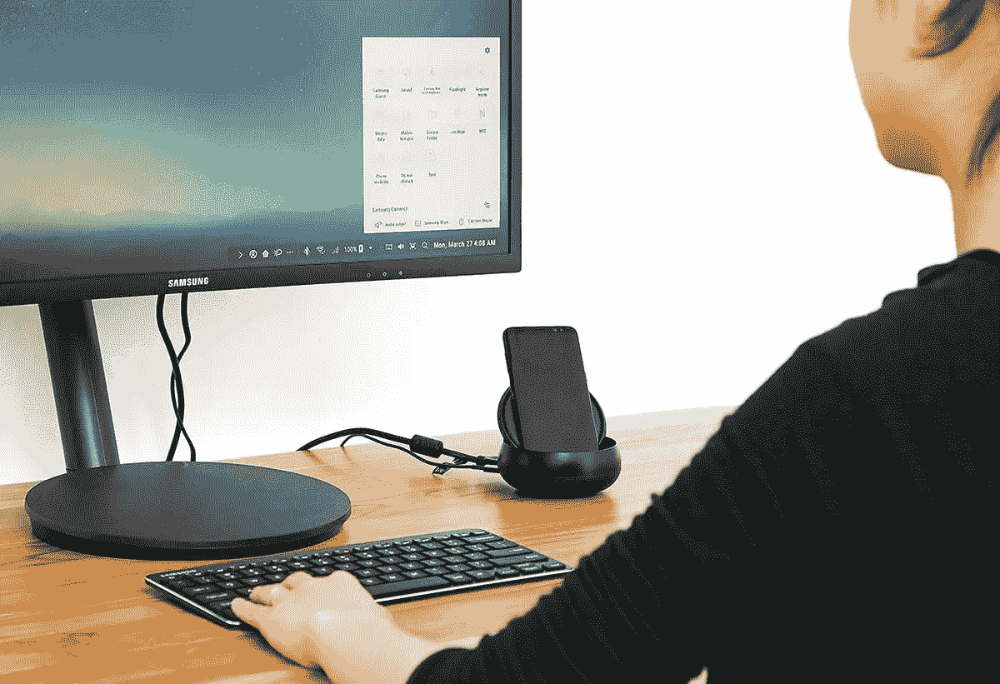 *三星 Dex 站([来源](https://wccftech.com/galaxy-s9-dex-pad-accessory/) )*

虽然最初使用 Dex 工作站是强制性的，但在最近的设备中，这一标准已经放宽。如果你使用的是 Galaxy Note 9 或更新的设备，USB-C 到 HDMI 转换器可以帮助你连接到显示器，蓝牙可以用于外设。

三星最近推出了便携式版本的 Dex Station[Dex Pad](https://www.samsung.com/us/mobile/mobile-accessories/phones/dex-pad-ee-m5100tbegus/)，除了 HDMI 和 USB 端口之外，它还内置了无线充电和冷却风扇。

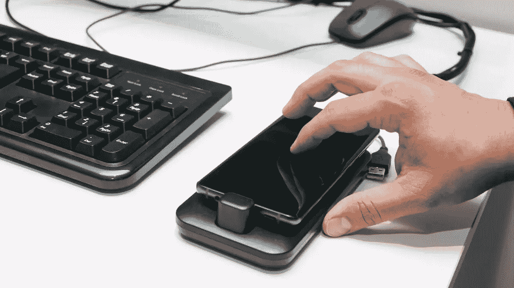 *三星 Dex Pad ( [来源](https://www.cnet.com/news/samsung-dex-pad-galaxy-s9-touchpad-pc-mwc-2018-b2b/) )*

假设您满足了硬件需求，那么您需要两个应用程序来创建一个 Linux 开发环境。首先，你需要安装 [Samsung Dex](https://www.samsung.com/global/galaxy/apps/samsung-dex/) 应用来启用 Samsung Dex 体验。接下来，你需要 Dex 上的[Linux](https://play.google.com/apps/testing/com.samsung.android.lxd)应用，它目前处于测试模式。你可以通过谷歌 Play 商店申请进入。

现在我们已经解决了流程的需求，让我们开始吧！

## 在 Samsung Dex 上配置 Linux 环境

Linux on Dex 应用程序显示了您在设备上创建的虚拟容器列表。让我们试着通过点击屏幕右下角的“+”按钮来创建我们的第一个。

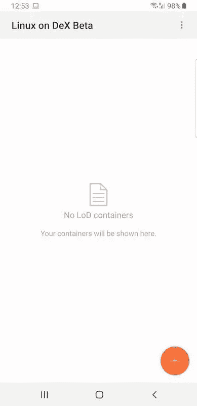

创建容器时，需要使用 Linux 映像。目前，仅支持 Ubuntu 16.04 LTS 版。该图像可以从三星 Dex 服务器下载。需要使用 Ubuntu 的修改版本来遵守 Android 的安全政策。

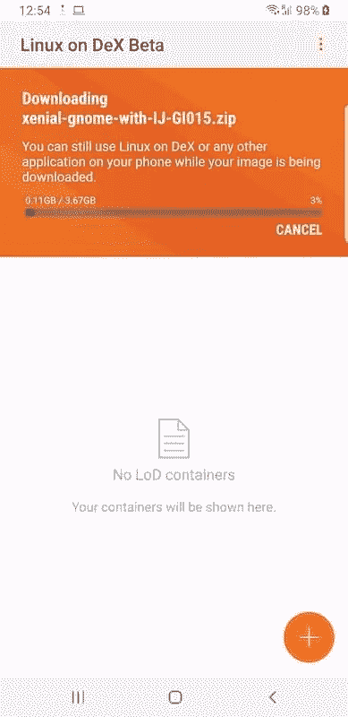 *下载三星*提供的定制 Linux 镜像

下载完成后，您需要提取图像。

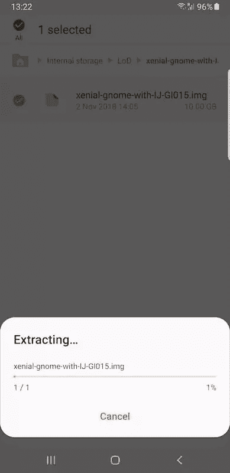 *解压下载的 Linux 镜像*

要创建一个新的容器，请浏览到文件系统上解压缩后的图像的位置，并提供图像的名称和描述。您还需要指定要分配给该映像的存储空间。这可以在以后成功创建容器时进行更改。至少需要 10 GB。

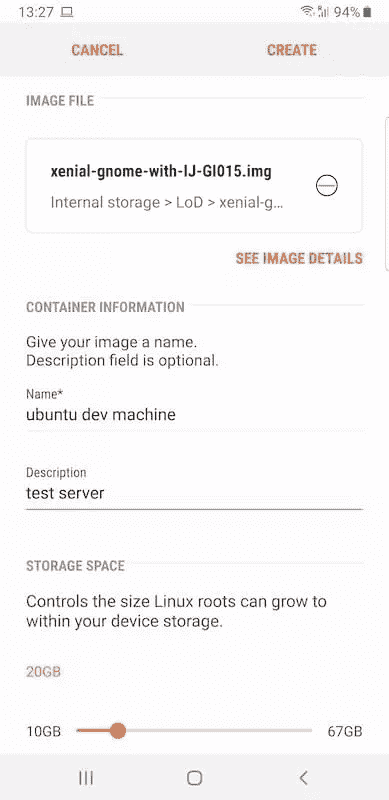 *选项创建一个容器*

创建容器并不需要很长时间——三星提供的 Linux 操作系统的定制映像已经与 Dex 兼容。默认用户为`dextop`，密码为`secret`。

创建容器后，您可以在应用程序上查看容器列表。选择一个容器以查看其详细信息。

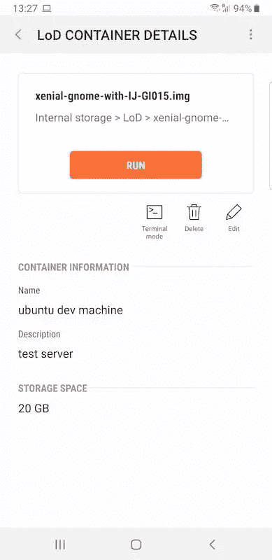 *集装箱详情*

## 在手机和三星 Dex 上测试 Linux 环境

在连接到外部显示器之前，您仍然可以通过启动终端从 Linux on Dex 应用程序访问容器。在上面显示的详细信息页面中选择“终端模式”选项来启动终端。

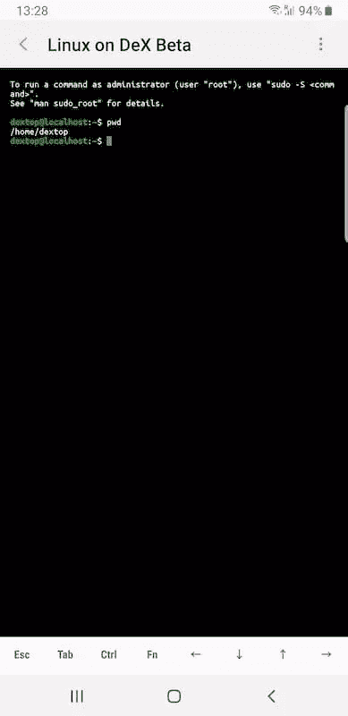 *在手机上运行集装箱的终端*

您可以在这个终端中运行 Python 解释器，并测试一些基本语句。

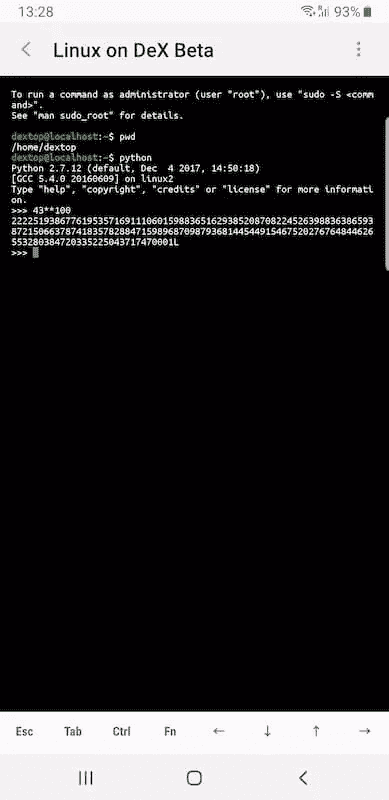 *在手机上运行 Python 解释器的容器*

要在桌面设置中使用 Linux 环境，请将您的移动设备连接到外部显示器。此时，您可能没有运行 Linux on Dex 应用程序。当桌面版本载入显示屏时，您将在显示屏上看到 Samsung Dex 徽标。

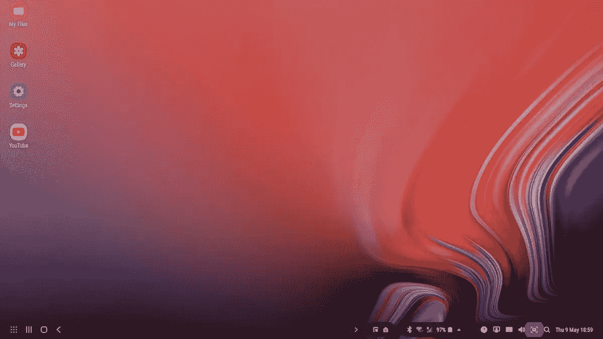 *三星 Dex 开机桌面*

加载 Samsung Dex 后，您可以将连接的移动设备用作触控板，或者使用连接的鼠标和键盘。导航到移动设备中已安装的应用程序，并选择 Linux on Dex 应用程序。您将能够在应用程序中看到所有可用容器的列表。选择要运行的容器。

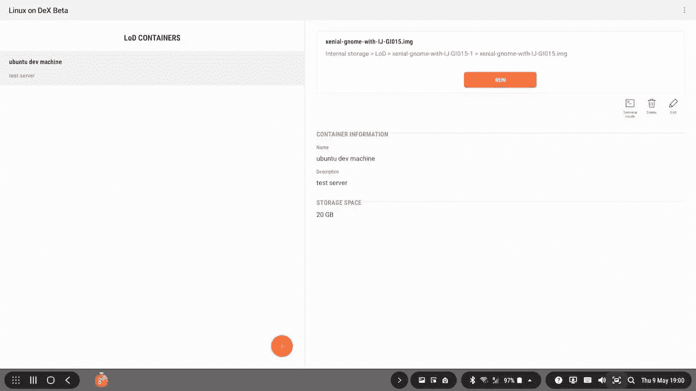

点击 run 按钮进入 Linux 环境。

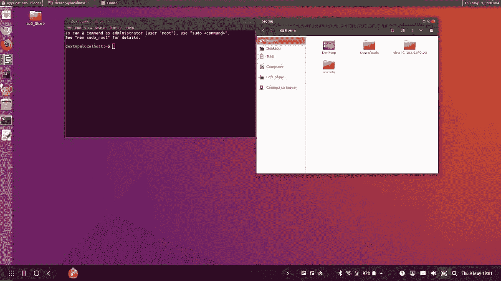

您将进入 Samsung Dex 中的 Linux 环境。您仍然可以访问 Dex 环境的底部菜单，我已经用它截图了。

Dex 上的 Linux 仍处于萌芽阶段，您可以运行各种应用程序，但性能与桌面计算机不可同日而语。Linux on Dex 的目标用户主要是开发人员，也许这是一群能够以当前形式使用它的用户。

## 最后的想法

一台装有 Samsung Dex 的 Linux 开发机器在功能上可以模拟一台台式电脑。至关重要的是，基于云的服务越来越受欢迎，减少了对传统存储需求的依赖。

与在台式机上运行 Linux 相比，计算能力不是很强，这不是最棒的体验。此外，对各种设备的支持是有限的，Linux on Dex 仍处于测试阶段。但是考虑到我们的移动设备变得更强大的速度，在未来几年，终端用户在移动设备上用容器取代传统的个人电脑并不奇怪。

你试过 Linux on Dex 吗？你认为它会补充(甚至取代！)您当前的开发设置？请在下面的评论中告诉我们！

## 分享这篇文章