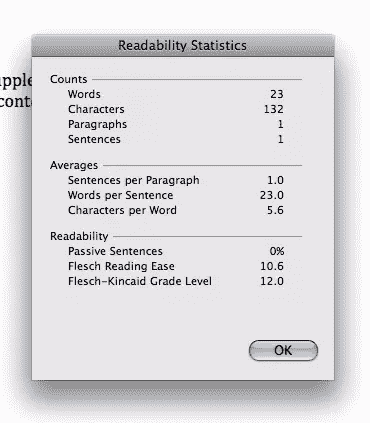

# 移动优先内容战略

> 原文：<https://www.sitepoint.com/mobile-first-content-strategy/>

如果为网络写作已经被视为一个网站成功的主要因素，那么为手机写作将成为数字内容创作者的下一个典型。一个同样充满挑战的世界。

移动优先的方法不仅适用于设计，也同样适用于内容。在本帖中，我们将看看两个工具，你可以用它们来评估书面内容是否适合手机，或者完善你自己的内容。

### WCAG 2.0

正如 4 Syllables 咨询公司在他们的[网页作者可访问性](http://www.4syllables.com.au/2010/09/accessibility-web-writers-part-1/)系列中所解释的那样，许多广受欢迎的网页内容可访问性指南都与文本内容密切相关:

*   2.4.2 页面标题:页面标题应该描述页面内容
*   2.4.4 和 2.4.9 链接目的:链接应该有意义
*   2.4.6 标题和标签:标题和标签应该有意义
*   2.4.10 章节标题:使用标题来组织和显示内容的结构
*   3.1.2 部件语言:使用标记来识别外语单词和短语
*   3.1.3 不常用词:定义或解释非字面意思的措辞或行话
*   3.1.4 缩写:定义或链接到缩写形式的定义
*   3.1.5 阅读水平:在初中水平写作，用其他媒体补充困难的文本，或提供初中水平写作内容的替代版本

乍一看，这些指导方针似乎不言自明——甚至不言自明。但是许多“创意者”认为它们是限制性的。他们剥夺了作者的“自由”他们控制着“声音”

移动设备的问题是，尤其是手机这样的小设备，人们没有时间或注意力去感受你散文的抒情美。

你的文本的可用性(阅读:有用性)归结于理解、记忆和适用性。在这种背景下，阅读水平值得特别关注。

### 为什么阅读水平很重要

我曾经是一个阅读水平的怀疑论者。阅读水平似乎很好，但我的读者比八年级学生更聪明，我的品牌也很有声望。盲目地坚持一个阅读水平会侮辱我的读者，破坏我的雇主精心培养的品牌。

如果你是这么想的，没关系。但是现在，让我们把这些反对意见放在一边，关注你的数字文本的有用性。

弗莱施阅读难易程度分数和 T2 弗莱施-金凯等级分数考虑了影响理解的三个语言因素:

1.  句子长度
2.  字长
3.  音节计数

正如你所看到的，这些元素与移动环境非常相关——通过移动环境，我们可以也应该推断出比设备、屏幕尺寸和下载速度更多的信息。手机作者需要意识到手机用户阅读文本的情况。这更可能涉及设备的物理移动、噪音、屏幕反射和污垢等。

出于这些以及环境原因，移动设备上显示的文本能够被快速阅读和掌握是非常重要的。如果在电脑显示器上阅读是一种拖累，那么在手机上阅读就是一种折磨。你的读者比以往任何时候都更需要事实和答案，而且他们迫切需要。

在这种情况下，用更短、更常见的单词写短句是非常有意义的。

### 创作天赋呢？

说这些阅读分数破坏了创造力，就像说一个艺术家仅靠油画棒创作不出任何像样的东西。或者水彩画。或者一支铅笔。

这完全取决于艺术家。

手机作家的创作挑战是交流。举个例子，让我们用 4 个音节来描述阅读水平(在我们之前的列表中编号为准则 3.1.5):

> 在初中水平上写作，用其他媒体补充困难的文本，或提供在初中水平上写作的内容的替代版本

如果你想知道，我用的是 4 音节版本，因为它在可读性方面比官方的 WCAG 2.0 版本好得多。

要测试该内容的阅读分数，您可以将其复制到 MS Word 中，并进行拼写和语法检查。完成后，会出现一个小对话框告诉你阅读分数。

这个 4 音节句子的阅读难易程度得分为 10.6(这意味着只有受过大学教育的人才能理解它——这是在最好的情况下)。它的 Flesch-Kincaid 等级水平是 12.0，表明你需要十二年级的教育才能理解那句话。作为对比，这篇文章的阅读难易程度得分为 52.1，其年级水平为 8.6。

让我们假设我们都完成了高中和/或上了大学，所以我们在理解 4 个音节的描述方面没有困难。有什么大不了的？

想象一下，你在一辆拥挤的回家的火车上，被其他乘客挤来挤去，一只胳膊肘插在你的左耳上，你右边一个通勤者的耳机里传出死亡金属的声音。你又累又饿。你今天过得很糟糕。每当火车遇到颠簸或转弯时，你就会被甩到车门上。

这样写的句子不是更容易阅读和理解吗？

> “为八年级学生写作——如果他们懂了，大多数人都会懂。如果内容真的很复杂，用不同的内容类型来解释。”

根据肉感阅读难易程度计算(74.8)，16 岁左右及以上的人将能够理解那些句子。你甚至不需要读完初中就能掌握它:弗莱施-金凯分数是 5.8。

也许语气太随意，但你明白了。该文本的第二个版本使用自然语言，我认为，在读者阅读时，更容易在他们的脑海中被“听到”，并且声音更大，因为它更熟悉。它也有更自然的节奏。而且更短的句子意味着更多的大写字母——这让你的通勤读者在与下一个 bend 的 g-forces 战斗后更容易找到他们的位置。

### 其他挑战

我们可以把每一句话都简化成适合八年级学生的语言，这种想法充满了善意的希望……但这可行吗？

WACG 建议，如果你的文本不能如此简化，你应该写第二个版本，解释八年级术语中所有复杂的部分。但是我曾经为之工作过的客户中，没有一个人乐意为此付出额外的钱。

在下一篇文章中，我将谈论手机作者在实践中使用阅读分数时面临的一些挑战——以及我们如何解决它们，使我们的文本在移动设备上可用。

## 分享这篇文章