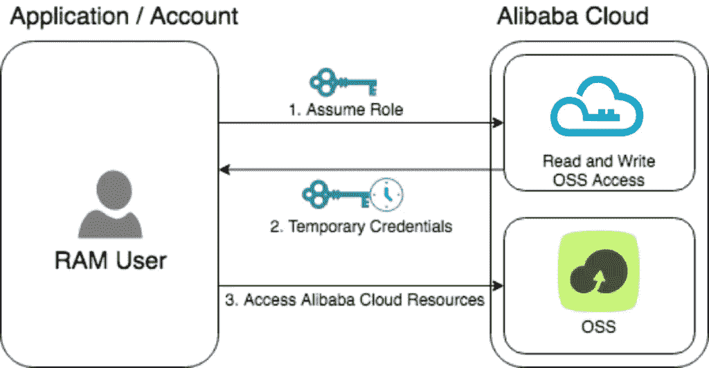
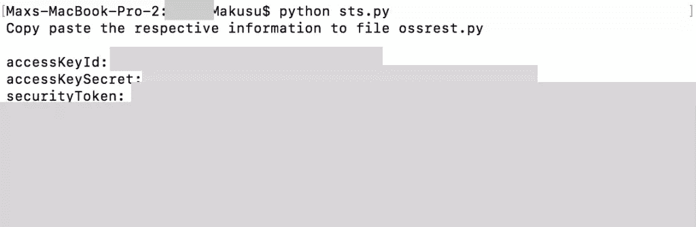
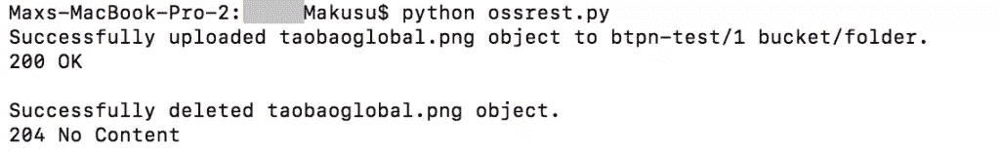

# 移动游戏:使用对象存储服务构建安全令牌服务

> 原文：<https://www.sitepoint.com/mobile-gaming-build-a-security-token-service-with-object-storage-service/>

*本文原载于[阿里云](https://int.alibabacloud.com/m/1000013624/)。感谢您对使 SitePoint 成为可能的合作伙伴的支持。*

**你认为充分利用阿里云服务有更好的建议吗？请告诉我们，并有机会赢取 Macbook Pro(以及其他很酷的东西)。[点击](https://www.sitepoint.com/alibaba-competition)了解更多信息。**

在移动游戏中，许多应用程序要求开发人员隔离玩家资源。这包括一系列事情，从保存文件到处理用户配置文件信息。使用传统方法，开发人员可以管理这种隔离，但是必须考虑许多其他问题，例如安全性、可伸缩性和 API。

随着云技术的发展，对更高级别的可用性和特性的需求也在增加。借助对象存储服务，客户可以轻松高效地存储和管理他们的对象。OSS 在线提供实时图像处理服务。一些客户可能希望获得额外的功能，例如允许用户对 OSS 等服务进行有限的访问，但同时享受安全、集中管理的便利。

安全令牌服务为阿里云账号或 RAM 用户提供短期访问权限管理。通过 STS，您可以向在本地帐户系统中管理的联邦用户颁发一个访问凭证，该凭证可以定制过期时间和访问权限。联盟用户可以使用 STS 临时访问凭证直接调用阿里云服务 API，或者登录阿里云管理控制台访问经过认证的资源。

在这个场景中，我们使用 OSS 测试 STS 的功能。

## 先决条件

它需要能够调整[资源访问管理(RAM)](https://int.alibabacloud.com/m/1000012782/) 设置和角色。更多信息，请参见[角色](https://int.alibabacloud.com/m/1000012783/)。

示例代码是用 Python 编写的。虽然不是必需的，但对计算机编程有基本的了解是一个优势。本教程中提供的示例代码可以作为一个模板，可以对其进行修改以满足您的特定需求。许多人目前使用原始 API 来管理环境或应用程序。虽然 SDK 有多种语言版本，但原始 API 提供了更大的灵活性。

## 体系结构



在这个图中，一个 ram 用户想要将图像上传到一个 [OSS](https://int.alibabacloud.com/m/1000012781/) 桶中的一个单独的文件夹中。

上传过程如下:

1.  用户通过调用 AssumeRole 来承担对阿里云中特定文件夹的读写 OSS 访问的 RAM 角色。
2.  STS 返回一组临时安全凭证。
3.  用户应用临时安全凭证来访问 OSS。然后，用户可以对该对象进行读取或写入调用。

这里我们以 OSS 为例。但是，STS 可以用于授予对多种阿里云服务的临时访问权限。在本教程中，我们使用细粒度的 STS 权限来限制对特定 OSS 存储桶的访问。

## 履行

示例代码中的三个文件如下:

*   sts.py
    *   这是承担角色并检索基本信息(如 accessKeyId、accessKeySecret 和 securityToken)的代码。

可用的功能如下:

*   生成签名以保证请求的真实性
*   获取 HTTPS 请求

文件“sts.py”的示例代码如下:

```
from base64 import b64encode
from datetime import datetime
from Crypto.Hash import SHA, HMAC
import md5, httplib, urllib, uuid, json
##### CONFIG MANAGEMENT
accessKeyId = "<access_key_id>"
accessKeySecret = "<access_key_secret>"
##### FUNCTION MANAGEMENT
def generateSignature(accessKeySecret, stringToSign):
    hmac = HMAC.new(accessKeySecret, stringToSign, SHA)
    return b64encode(hmac.digest())
def getHttpsRequest(host, verb, path):
    conn = httplib.HTTPSConnection(host)
    conn.request(verb, path)
    return conn.getresponse()
# ###### STS MANAGEMENT
host = "sts.aliyuncs.com"
verb = "GET"
bucketName = "<bucket_name>"
folderName = "1"
policy = '{"Statement": [{"Effect": "Allow","Action": ["oss:*"],"Resource": ["acs:oss:*:*:' + bucketName + '/' + folderName + '","acs:oss:*:*:' + bucketName + '/' + folderName + '/*"]}],"Version": "1"}'
dictionaryParams = {
    "AccessKeyId": accessKeyId,
    "Action": "AssumeRole",
    "DurationSeconds": "3600",
    "Format": "JSON",
    "Policy": policy,
    "RoleArn": "acs:ram::5081099437682835:role/ramtestossreadwrite",
    "RoleSessionName": "<session_name>",
    "SignatureMethod": "HMAC-SHA1",
    "SignatureNonce": str(uuid.uuid1()),
    "SignatureVersion": "1.0",
    "Timestamp": datetime.strftime(datetime.utcnow(), "%Y-%m-%dT%H:%M:%SZ"),
    "Version": "2015-04-01"
}
stringToSign = ""
for key in sorted(dictionaryParams.iterkeys()):
    value = urllib.quote(dictionaryParams[key], safe="")
    if stringToSign != "":
        stringToSign += "&"
    stringToSign += key + "=" + value
stringToSign = verb + "&%2F&" + urllib.quote(stringToSign)
signature = generateSignature(accessKeySecret + "&", stringToSign)
dictionaryParams["Signature"] = signature
params = urllib.urlencode(dictionaryParams)
path = "/?" + params
response = getHttpsRequest(host, verb, path)
if response.status == 200:
    jsonData = json.loads(response.read())
    print "Copy paste the respective information to file ossrest.py\n"
    print "accessKeyId: " + jsonData['Credentials']['AccessKeyId']
    print "accessKeySecret: " + jsonData['Credentials']['AccessKeySecret']
    print "securityToken: " + jsonData['Credentials']['SecurityToken'] 
```

*   ossrest.py
    *   这是上传和删除对象的代码。

可用的功能如下:

*   生成签名
*   生成标题
*   发出 HTTP 请求
*   上传对象
*   删除对象

文件“ossrest.py”的示例代码如下:

```
from base64 import b64encode
from datetime import datetime
from Crypto.Hash import SHA, HMAC
import md5, httplib, urllib, uuid
##### MAIN CONFIG (STS)
accessKeyId = "<access_key_id>"
accessKeySecret = "<access_key_secret>"
securityToken = "<security_token>"
##### FUNCTION MANAGEMENT
def generateSignature(accessKeySecret, stringToSign):
    hmac = HMAC.new(accessKeySecret, stringToSign, SHA)
    return b64encode(hmac.digest())
def generateHeaders(verb, canonicalizedResource = "/", canonicalizedOSSHeaders = {}, signature = {}):
    # authorization
    stringToSign = verb + "\n"
    if "content" in signature:
        stringToSign += md5.new(signature["content"]).digest()
    stringToSign += "\n"
    if "content_type" in signature:
        stringToSign += signature["content_type"]
    stringToSign += "\n"
    date = datetime.strftime(datetime.utcnow(), "%a, %d %b %Y %H:%M:%S GMT")
    stringToSign += date + "\n"
    if len(canonicalizedOSSHeaders):
        for index, value in canonicalizedOSSHeaders.items():
            stringToSign += index.lower() + ":" + value + "\n"
    stringToSign += canonicalizedResource
    signature = generateSignature(accessKeySecret, stringToSign)
    # headers
    headers = {"Date": date, "Authorization": "OSS " + accessKeyId + ":" + signature}
    headers.update(canonicalizedOSSHeaders)
    return headers
def sendHttpsRequest(host, verb, headers, path = "/", params = ""):
    conn = httplib.HTTPSConnection(host)
    conn.request(verb, path, params, headers)
    return conn.getresponse()
##### OBJECT MANAGEMENT
canonicalizedOSSHeaders = {"x-oss-acl": "public-read", "x-oss-security-token": securityToken}
bucketName = "<bucket_name>"
host = bucketName + ".oss-ap-southeast-1.aliyuncs.com"
hostMain = "oss-ap-southeast-1.aliyuncs.com"
folderName = "1"
fileName = "<filename>"
### UPLOAD OBJECT
verb = "PUT"
canonicalizedResource = "/" + bucketName + "/" + folderName + "/" + fileName
headers = generateHeaders(verb, canonicalizedResource, canonicalizedOSSHeaders)
response = sendHttpsRequest(host, verb, headers, "/" + folderName + "/" + fileName, open(fileName, "rb"))
print "Successfully uploaded " + fileName + " object to " + bucketName + "/" + folderName + " bucket/folder."
print response.status, response.reason
print response.read()
### DELETE OBJECT
verb = "DELETE"
canonicalizedResource = "/" + bucketName + "/" + folderName + "/" + fileName
headers = generateHeaders(verb, canonicalizedResource, canonicalizedOSSHeaders)
response = sendHttpsRequest(host, verb, headers, "/" + folderName + "/" + fileName)
print "Successfully deleted " + fileName + " object."
print response.status, response.reason
print response.read() 
```

*   other_sample.py
    *   这是其他场景的代码。这些样本可能不直接适用于 STS，但作为示例提供。

可用的功能如下:

*   创建存储桶
*   列出存储桶
*   上传对象
*   列出对象
*   删除对象
*   删除存储桶

文件“other_sample.py”的示例代码如下:

```
bucketName = "<bucket_name>"
host = bucketName + ".oss-ap-southeast-1.aliyuncs.com"
fileName = "<file_name>"
### CREATE BUCKET
verb = "PUT"
signature = {}
canonicalizedResource = "/" + bucketName + "/"
headers = generateHeaders(verb, signature, canonicalizedResource, canonicalizedOSSHeaders)
response = sendRequest(host, verb, headers)
print "Successfully created " + bucketName + " bucket."
print response.status, response.reason
print response.read()
### LIST BUCKET
host = "oss-ap-southeast-1.aliyuncs.com"
verb = "GET"
signature = {}
canonicalizedResource = "/"
headers = generateHeaders(verb, signature, canonicalizedResource, canonicalizedOSSHeaders)
response = sendRequest(host, verb, headers)
print "Successfully listed buckets."
print response.status, response.reason
print response.read()
### UPLOAD OBJECT
verb = "PUT"
signature = {}
canonicalizedResource = "/" + bucketName + "/" + fileName
headers = generateHeaders(verb, signature, canonicalizedResource, canonicalizedOSSHeaders)
response = sendRequest(host, verb, headers, "/" + fileName, open(fileName, "rb"))
print "Successfully uploaded " + fileName + " object to " + bucketName + " bucket."
print response.status, response.reason
print response.read()
### LIST OBJECT
verb = "GET"
signature = {}
canonicalizedResource = "/" + bucketName + "/"
headers = generateHeaders(verb, signature, canonicalizedResource, canonicalizedOSSHeaders)
response = sendRequest(host, verb, headers)
print "Successfully listed objects in " + bucketName + " bucket."
print response.status, response.reason
print response.read()
### DELETE OBJECT
verb = "DELETE"
signature = {}
canonicalizedResource = "/" + bucketName + "/" + fileName
headers = generateHeaders(verb, signature, canonicalizedResource, canonicalizedOSSHeaders)
response = sendRequest(host, verb, headers, "/" + fileName)
print "Successfully deleted " + fileName + " object."
print response.status, response.reason
print response.read()
### DELETE BUCKET
verb = "DELETE"
signature = {}
canonicalizedResource = "/" + bucketName + "/"
headers = generateHeaders(verb, signature, canonicalizedResource, canonicalizedOSSHeaders)
response = sendRequest(host, verb, headers)
print "Successfully deleted " + bucketName + " bucket."
print response.status, response.reason
print response.read() 
```

预期的反应如下:

`sts.py`:



`ossrest.py`:



## 结论

这个例子关注的是 [OSS](https://int.alibabacloud.com/m/1000012781/) ，但是 STS 服务也可以用来控制对其他阿里云服务的访问。我们在本教程中描述的用例是游戏。需要短期访问开放源码软件的其他情况或服务可能包括:

*   网络应用
*   移动应用

## 附加说明

*   [STS 简介](https://www.alibabacloud.com/help/doc-detail/28756.htm?spm=a2c63.p38356.a3.3.466734b84KzkLW)
*   [使用 STS 访问 OSS](https://www.alibabacloud.com/help/doc-detail/32122.htm?spm=a2c63.p38356.a3.4.466734b84KzkLW)

## 分享这篇文章