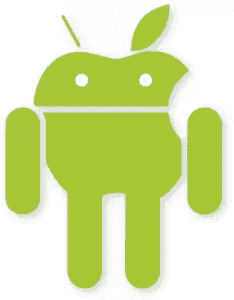

# 2014 年值得关注的移动平台

> 原文：<https://www.sitepoint.com/mobile-platforms-watch-2014/>

图片来自 gordonkelly.com

iOS 和 Android 的平均全球市场份额为 85-95%，是目前移动操作系统领域的主导者。那么，为什么要费心去研究或开发其他平台呢？

首先，你可能是一个好奇的人，可能只是对探索新的系统和概念感兴趣。第二，科技领域什么时候停滞不前过？今天的主要参与者可能不会在六个月后成为主要参与者，关注失败者和新进入者是值得的。毕竟市场变化可能很突然。这一点尤其重要，因为许多新兴市场对低端智能手机的采用正变得越来越成熟——在这些新兴的巨大市场中，这是任何人的游戏。

这是我作为 SitePoint 移动编辑器的第一篇文章，那么还有什么比浏览你可能还没有考虑过的移动平台更好的方法呢？预计在接下来的几个月里会有更深入的探讨。

## windows 手机

将 [Windows phone](https://www.windowsphone.com) 放在“其他”平台的名单上可能是一个有争议的选择，但对许多人来说，它仍然没有被认真对待，仍然是许多笑话的笑柄。[随着最近的 8.1 更新](http://www.windowsphone.com/en-us/features-8-1)，它已经成为一个对微软传道者之外的消费者和开发者更有吸引力和更可行的平台，并可能成为前 3 名的竞争者。

在某些方面，微软引领了最近兴起的扁平简洁的设计概念，或“真正的数字化”，摒弃了许多过时的 UX 式的类比。该平台专注于严格的设计原则，没有界面混乱，并通过“动态磁贴”等功能为用户提供持续更新。微软正努力在他们的硬件产品中创造一致性和平等性，虽然并不完全成功，但感觉他们正在慢慢取得进展，并接受用户的反馈。

对于一家几十年来一直在制作开发工具的公司来说，为 Windows phone 开发应用程序有几种选择是不足为奇的，包括 Silverlight，。Net 和 Visual studio。要为 Windows Phone 开发，你需要 Visual studio，它只支持 Windows(期待不久的教程)。

**市场**
关于 Windows phone 的市场份额经常有争议和矛盾。过去一年，它在大多数市场平均上涨了 7%。这并不算大，但仍然有很多人，许多人预测明年该平台可能会进一步增长。微软经常为他们的平台开发提供现金或实物奖励，所以如果你有一点好奇，可能是时候调查一下了。

## Ubuntu 手机

Canonical (Ubuntu 的母公司)去年创造了历史，发起了有史以来规模最大的众筹活动，[试图为他们新颖的双桌面和手机设备 Ubuntu Edge 筹集 3200 万美元](http://techcrunch.com/2013/08/22/edge-crowdfunding-fail/)。这项活动少了几百万，但作为移动平台的营销活动是成功的，它与桌面版的 Ubuntu 有许多共同之处。

**概念**
[Ubuntu phone](http://www.ubuntu.com/phone) 重在自己独特的概念，引入了许多不同的想法。其中包括:

*   个性化锁屏
*   Scopes 是一种基于主题或个人使用将应用和数据组织到相关类别中的方法
*   从屏幕边缘侧向滑动用于访问应用程序和其他快捷方式
*   通知不会打扰你，而是放在通知抽屉里等着你去查看。
*   内容不是控制。控件在屏幕上是隐藏的，向上滑动屏幕就可以使用，这使得应用程序的内容成为焦点。
*   桌面相似性——很多努力都是为了将 Ubuntu 的桌面优势引入手机操作系统，包括安全、搜索和通用更新。

**发展**
也许 Ubuntu 手机普及的最大障碍之一是它的发展道路。HTML5 应用是可能的，但要本地化，你必须学习一种全新的开发语言和环境， [QML](http://developer.ubuntu.com/apps/qml/) (或 [Qt](http://qt-project.org/) )。Qt 并不是 Ubuntu 独有的，QML 也是“类 JavaScript ”,所以它可能不像最初看起来那样是个大障碍。你还需要运行 Ubuntu，但这是免费的，你可以在一个虚拟机上运行它，所以再次强调，这不是一个巨大的障碍。

市场
Ubuntu phone 专注于支持制造商，而不是运营商或制造本身。Canonical 已经拥有几家主要的全球运营商，并瞄准了亚洲和欧洲的“中高端”市场。其潜在的应用程序市场目前尚不明朗，进展缓慢，也许世界上的 Linux 粉丝们会开始争夺移动生态系统的第 3 或第 4 名。

## Tizen

 [Tizen](https://www.tizen.org/) 被视为三星试图从根本上摆脱对安卓和谷歌的依赖(不是它的第一次尝试，Tizen 取代[巴达](http://www.bada.com/))。到目前为止，它只在两种非手机设备(Gear 2 可穿戴设备)上实现，许多人觉得它甚至在离开起跑线之前就已经跌跌撞撞了。不过，Tizen 有三星的支持，三星是世界上最大的手机制造商之一，随着可穿戴设备成为一个不断发展的“移动”平台，这场比赛还远未结束。

**概念**
Tizen 基于 Linux，有点像“安卓克隆版”,加入了一些三星的元素，比如 Touchwiz，还有一些额外的想法:

*   窗口小部件和图标是一回事，事实上窗口小部件是扩展的图标，根据它们的大小可以有不同的表现。
*   通知显示为网格，而不是列表。

**开发**
HTML 5 应用是一个简单的选项，已经有一些跨平台的开发选项，如 Sencha。与 Android 的 Java 完全相反，Tizen 的原生开发是在 C 或 C++中进行的，因此再次强调，学习一种新的语言和/或平台可能是必要的。

从言外之意来看，似乎 Tizen 的目标是不断增长的市场。它的界面指南和方法非常简单易用。Tizen 目前正在与英特尔、Sprint、沃达丰、富士通、NEC、松下和许多其他公司合作开发，但硬件或应用程序尚未浮出水面。除了三星现有的市场主导地位之外，它与安卓相比没有什么优势。这将为它进入消费者的口袋提供一个简单的途径，许多人会购买“三星”而不是“安卓”，不在乎或不知道这种区别。

## 火狐操作系统

火狐操作系统似乎是每个人都想成功的玩家，也许是因为火狐仍然普遍受到喜爱和认可，并且缺乏任何主要的企业支持者。就像它的浏览器名字一样，它的目标是开源，并且比许多其他手机操作系统竞争对手更加分散。

设计
Firefox OS 声称并致力于“赋予你充分享受每一刻的能力”，其设计理念相当熟悉，有点像 Android/iOS 的大杂烩。随着 2.0 版的发布，Firefox 操作系统已经成熟，并开始获得更多的特性，如:

*   活动锁定屏幕
*   列表屏幕上的“转到顶部”栏，即消息
*   一个干净的“平面”风格的用户界面
*   没有小部件(目前)

**开发** Firefox OS 是基于 Linux 的(名为 Gonk，其内核基于 Android 开源项目)，但一个关键的区别点是，整个用户界面(Gaia)是基于利用 Gecko 渲染引擎的 web 技术，从而大大降低了开发门槛。Mozilla 已经拥有了一个健康开发者生态系统和支持网络，这将延续到它的移动产品中，拥有令人印象深刻的文档和资源。

市场
Firefox OS 目前与制造商和电信公司有一些主要的合作关系，包括 LG、Telefonica、中兴、Alcatel、Sprint 和 SingTe，并且似乎正在瞄准硬件价格在 25 美元或更低的低端/新兴市场。这可能意味着一个非常大的市场潜力，或者极低的利润率，使营销和其他成本难以满足。

## 其他人

### 黑莓

或许这是一个有争议的条目，但在特定的应用、地理和行业市场，黑莓仍然是一个相当大的玩家。如果你在这些领域工作，它仍然是一个可行的开发平台。

### 旗鱼操作系统

另一个基于 Linux 的手机操作系统，使用 Qt 框架开发自己的本地应用，但也可以运行 Android 应用和 HTML 应用。Sailfish OS 对用户界面和硬件设计有一些令人着迷的想法，但关于他们的目标市场和计划还不太清楚。

### 个人电话

Indiephone 的目标是打造一款完全具有隐私意识的开源手机，同时拥有出色的用户体验，这是一个不小的成就。它将于今年开始众筹，所以请保持警惕。

### 衣服

在本文中，我们将重点关注手机和平板电脑操作系统，但“移动”是一个广泛的主题，可以包括任何类型的便携式计算设备。在未来几年，这将意味着越来越多的可穿戴设备，从手表到腕带和定量自我测量设备。这个市场将如何发展还有待观察，无论你对可穿戴设备的个人看法如何，这都将是一个巨大而竞争激烈的市场。在接下来的几个月里，我们将推出大量关于这个主题的内容。

你对上述平台有什么想法？遗漏或错过了什么？

## 分享这篇文章