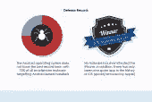

# 移动安全摊牌:Android vs. iPhone

> 原文：<https://www.sitepoint.com/mobile-security-showdown-android-vs-iphone/>

黑客攻击是一件非常严重的事情。我们经常看到用户在互联网上丢失他们的敏感信息，这导致电子邮件帐户受损，进而可能迅速发展为网上银行漏洞、身份盗窃，甚至更糟。

大多数安全专业人士都会同意，主动防止个人数据被盗比从数据泄露的后果中恢复要容易得多。随着移动技术发展如此迅速，有时很难确定安全性是否跟上了硬件、软件、智能手机和平板电脑的更新。

下面的信息图考察了 iPhone 和 Android 在一个很少受到关注的标准上进行比较时的匹配情况…移动安全。比较显示了这些竞争产品之间一些惊人的相似之处，但也说明了一些惊人的差异。有趣的是，Android 在硬件和软件方面都享有更大的市场份额，但它也存在更大的安全漏洞。许多人认为这两者密切相关。

这张信息图还观察了下载应用程序时的消费者行为，并观察了两款手机的防御和漏洞。它还强调了具有高度敏感信息的应用程序(例如银行应用程序)可以使用各种技术和最佳实践来增强其安全性的一些方法。

点击下图查看信息图。

(信息图由[立博游戏](http://games.ladbrokes.com/en)提供。)

对于 iPhones 和 Android 手机，以及 iOS 和 Android 操作系统在安全性方面的比较，你有什么看法？你更相信其中一个吗？你偏好的依据是什么？你认为任何软件领域的主流产品(Windows、Internet Explorer、Android)都必须应对大部分的安全攻击吗？

## 分享这篇文章