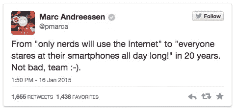
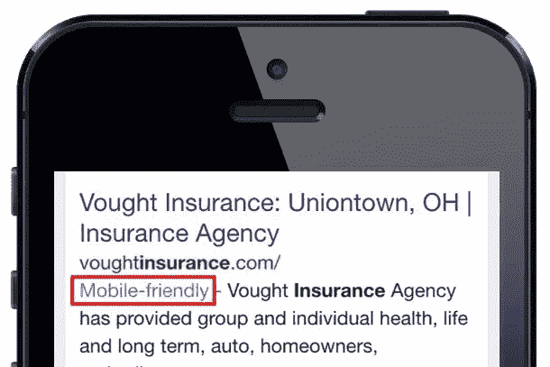
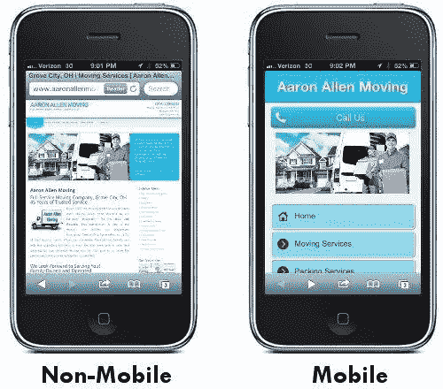
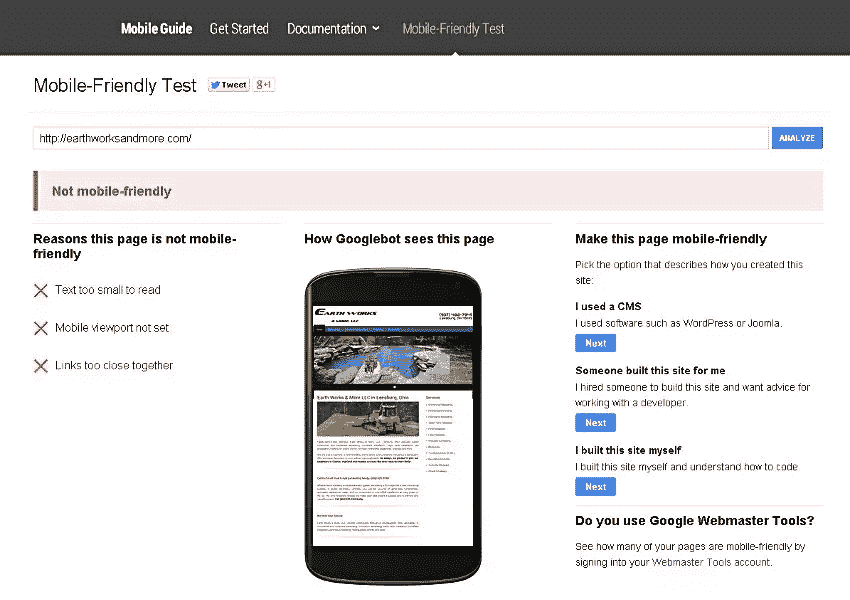
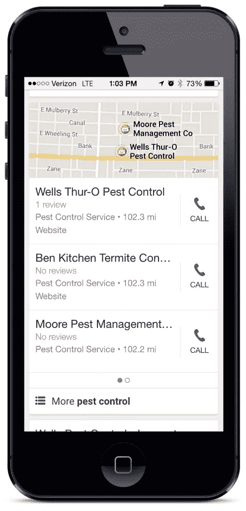

# 移动搜索引擎优化:移动友好网站的 6 个步骤

> 原文：<https://www.sitepoint.com/mobile-seo-6-steps-mobile-friendly-website/>

*本文由 [SEO PowerSuite](http://www.link-assistant.com/?utm_source=sitepoint&utm_medium=mobile_seo_tagline&utm_campaign=sitepoint) 赞助。感谢支持 SitePoint 的赞助商*。

大约在 1878 年，电话开始商业化，但是过了 71 年，半数美国家庭才拥有一部电话。这给了 1907 年典型的企业主 50 年的时间来决定他是否需要在他的店里安装一个。

相比之下，2007 年普通企业主只有 50 个月的时间为智能手机的突然崛起做准备。这似乎是一段很长的时间；然而，只有[6%的中小企业拥有手机友好网站](http://marketingland.com/survey-online-6-percent-smbs-mobile-sites-45-percent-dont-site-73937)——45%的中小企业根本没有网站。

如果你发现自己站在移动爆炸的错误一边，不用担心。这篇文章将带你找到一个适合移动访问者的网站。

## 为什么移动设备现在变得至关重要

正如 SEO PowerSuite 的[最近的移动友好网站指南](http://www.link-assistant.com/news/mobile-seo.html?utm_source=sitepoint&utm_medium=mobile_seo_link1&utm_campaign=sitepoint)中提到的，90%的用户在设备之间切换以实现一个目标——主要是购物。这就是移动设备现在成为任务关键型设备的原因。

### 1.手机已经成为主流

2007 年，苹果推出了第一款 iPhone。在接下来的 12 个月里，其他手机制造商开始发布产品与之竞争。今天，美国近 75%的手机用户拥有智能手机。

这高于 2013 年 12 月的 65.2%，预计到年底将超过 80%。智能手机已经成为主流。

### 2.移动搜索者有更高的购买意愿

**消费者使用智能手机做出购买决定**

超过 50%的手机用户[会用他们的智能手机](http://www.telmetrics.com/2014/06/xad-and-telmetrics-release-3rd-annual-u-s-mobile-path-to-purchase-study-revealing-mobile-dominance-in-consumers%E2%80%99-purchase-decisions/)来决定买什么以及在哪里买。搜索之后最常见的第二个动作是打电话。

事实上，2013 年，移动搜索引擎给美国企业打了 300 亿个呼入电话。这个数字还在增长。根据[最近的一份报告](http://www.biakelsey.com/Research-and-Analysis/Coverage-Areas/Mobile/insight-report-phonecalls-smartphone-era.asp)，到 2018 年，移动搜索将为企业产生**730 亿次呼叫**。报告接着说:

> 在媒体崇拜了十年之后，点击和印象对于企业来说没有电话铃声那么重要。在一个智能手机渗透率不断增长的世界里，电话已经成为一种有价值的货币，这种货币将低漏斗购买意愿与准备拨打电话的设备(手机)联系在一起。

**78%的本地移动搜索转化为购买**

[另一项研究](http://searchengineland.com/study-78-percent-local-mobile-searches-result-offline-purchases-188660)显示，在智能手机上搜索本地商家的消费者中，78%最终进行了购买。

### 3.移动搜索者更快采取行动

同一项研究还显示，四分之三(76%)的购买发生在同一天，大多数(63%)发生在几个小时内。

### 4.谷歌对移动的日益重视

去年 11 月，谷歌的移动流量首次超过了桌面访问量。

谷歌现在面临着将超过一半的用户引导至无法在移动设备上正常显示的网站。这给用户带来了不好的体验，也反映了公司的不良形象。这就是为什么他们推动企业和组织制作手机友好型网站。

**移动友好即将成为排名因素**

2014 年 11 月，谷歌[宣布](http://googlewebmastercentral.blogspot.com/2014/11/helping-users-find-mobile-friendly-pages.html)移动友好网站将在其移动搜索结果中获得“移动友好”标签。

> 我们认为这些标签是帮助移动用户获得更好的移动网络体验的第一步。我们也在尝试使用手机友好的标准作为排名信号。

“实验”结束了。4 月 21 日，谷歌将正式开始在移动搜索结果中使用[移动友好标准作为排名信号](http://googlewebmastercentral.blogspot.com/2015/02/finding-more-mobile-friendly-search.html)。

**红色“慢速标签”**

2010 年，谷歌增加了页面速度作为排名因素。上个月，搜索引擎圆桌会议[报告](https://www.seroundtable.com/google-slow-label-19914.html)一个红色的“慢”标签出现在一个移动搜索结果中。

尽管谷歌还没有官方消息，但可以合理地假设他们正在测试一种新的标签，警告用户某个网页加载缓慢。

## 什么是手机友好型网站？

以下是谷歌对手机友好网站的标准:

*   避免在移动设备上不常见的软件，如 Flash
*   使用无需缩放即可阅读的文本
*   根据屏幕调整内容大小，这样用户就不必水平滚动或缩放
*   将链接放得足够远，以便可以轻松点击正确的链接

不得不滚动和缩放让移动用户感到沮丧。事实上，如果你的网站不支持移动设备，61%的人会离开你的网站，去竞争对手的网站。

不确定你的网站是否适合移动设备？使用谷歌的[手机友好测试页面](https://www.google.com/webmasters/tools/mobile-friendly/)来找出答案。如果失败，您将看到以下内容:

## 实现移动友好的 6 个步骤

### 1.针对移动本地搜索进行优化

谷歌每天 40 亿次搜索中有 20%是本地搜索。而在手机上，这一比例接近 50%。如果你是本地企业，你必须采取措施在[本地搜索](http://www.haineslocalsearch.com/whats-local-search/)中被找到。以下是开始的方法。

**在谷歌、雅虎和必应的“本地”栏目中注册**

每个搜索引擎都有一个专门为本地企业保留的部分。(只有实际地址在搜索查询城市内的公司才会出现在此部分。)[认领每一个清单](http://www.haineslocalsearch.com/claim-your-google-listing/)会增加你出现在这里的可能性。

本地列表出现在有机结果的上方。在移动设备上，这意味着你的本地列表有可能成为用户浏览任何付费列表时看到的第一样东西。

**其他本地列表**

大约一半的移动本地搜索发生在应用程序中。虽然谷歌地图是最受欢迎的，但雅虎、Mapquest、必应、Yellowbook、Yelp、Superpages 和苹果地图拥有超过一半的应用市场份额。因此，重要的是要在这些目录中列出。

事实上，有超过 250 个本地搜索目录、互联网黄页和评论网站，你的本地业务应该被列在上面。这些目录的列表来自四个主要的数据供应商:Infogroup、Localeze、Acxiom 和 Factual。前三种允许你将你的商业信息添加到他们的数据库中——当然是收费的。一旦你这样做了，你的商业信息将最终被包括在他们提供数据的每个目录中。

有关声明列表和列表提交的更多信息，请参见【本地搜索引擎优化:基础】([https://www.sitepoint.com/basics-local-seo/](https://www.sitepoint.com/basics-local-seo/))。

**在谷歌上做广告**

根据你的预算和市场的竞争力，付费广告可能是从移动搜索者那里获得线索的有效方式。在移动设备上，付费广告出现在本地部分的上方:

### 2.选择移动解决方案

创建移动网站的三种方法是:响应式设计、并行移动和动态服务。

**响应式设计**是一种灵活的布局，可以自动“响应”(即调整大小)正在使用的设备的屏幕尺寸。

**Parallel Mobile** 是一个独立 URL 上的重复移动站点。手机游客被重定向到 m.example.com 的 T4，而不是 www.example.com 的 T2。

**动态服务**根据不同的设备提供不同的页面，但是在相同的 URL 上。

从发展的角度来看，各有各的问题。更多信息，SEO PowerSuite [移动友好网站指南](http://www.link-assistant.com/news/mobile-seo.html?utm_source=sitepoint&utm_medium=mobile_seo_link2&utm_campaign=sitepoint#part2)详细分析了每种网站的优缺点。

#### WordPress 网站的移动选项

如果你在自己的域名上有一个现有的 WordPress 网站，使用谷歌的[手机友好测试页面](https://www.google.com/webmasters/tools/mobile-friendly/)来看看它是否是手机友好的。如果不是，你有两个选择:

*   许多较新的主题是有反应的。考虑将切换到一个。

*   如果改变主题不可行，有很多免费和付费的插件可以解决这个问题。

### 3.让移动搜索者更容易打电话或找到你

你的移动网站上的用户活动是另一个排名因素。因此，确保访问者可以方便地使用“点击呼叫”按钮和地图。

### 4.确保你的页面不慢

减少 HTTP 请求的数量，优化你的图片，会让你的网站加载更快。谷歌的 [PageSpeed Insight](https://developers.google.com/speed/pagespeed/insights/) 会告诉你你的网站到底有什么问题，以及如何修复它们。下面我列出了常见的。

**减少 HTTP 请求**

每个图像、CSS 和 JavaScript 文件都是对服务器的另一个 HTTP 请求。这里有一些技巧来减少他们的数量。

1.  确保只有一个[外部 CSS 文件](http://www.w3schools.com/css/css_howto.asp)和一个[外部脚本文件](http://www.w3schools.com/tags/att_script_src.asp)。

2.  将内部 JavaScript [放在 html 的底部](http://robertnyman.com/2008/04/23/where-to-include-javascript-files-in-a-document/)，在结束 body 标签之前。

3.  [缩小](http://en.wikipedia.org/wiki/Minification_%28programming%29) CSS 和 JavaScript。

4.  CSS 精灵可以将多个图片请求合并成一个。

5.  使用[日期 URIs](http://webdesign.tutsplus.com/tutorials/the-what-why-and-how-of-data-uris-in-web-design--webdesign-8648) 。

6.  通过消除断开的链接来避免不良的 HTTP 请求。

7.  启用[浏览器缓存](http://www.feedthebot.com/pagespeed/leverage-browser-caching.html)。

**优化图像**

1.  [优化网页图片](http://www.uxbooth.com/articles/speed-up-your-website-with-better-image-optimization-in-photoshop/)加快下载速度是网页设计 101。确保您遵循最佳实践。

2.  使用一个 [jQuery 插件](http://responsiveimg.com/)或[响应图像解决方案](http://www.smashingmagazine.com/2013/07/08/choosing-a-responsive-image-solution/)用较小的图像替换较大的图像。

### 5.避免常见错误

**使用弹出窗口**

弹出窗口在移动设备上不起作用。它们占据了整个屏幕，找到一个小小的 x 来关闭它们几乎是不可能的。

**阻止 CSS、JavaScript 或图像**

谷歌的索引系统过去类似于老式的纯文本浏览器，所以搜索引擎不需要抓取或索引这些文件。为了防止不必要的抓取，网站管理员通常会在 robots.txt 中阻止这些文件，内容管理平台(如 Joomla 2014 年 7 月之前)通常会默认阻止这些文件。

然而，2014 年 11 月，谷歌[正式宣布](http://googlewebmastercentral.blogspot.de/2014/10/updating-our-technical-webmaster.html)这样做会干扰你的网站被索引的方式，并会损害你的排名。

**错误的重定向**

如果你有一个单独的并行移动网站，移动用户必须被重定向到相应的移动版本的每一页。

如果你的网站将移动用户重定向到移动网站的主页(不管他们请求的是哪个 URL)，这对谷歌机器人和你的用户都是一个问题。如果有错误的重定向，谷歌会降级你的手机页面。

### 6.使用这些工具来跟踪和提高移动排名

**追踪您的手机排名**

SEO PowerSuite 的[排名跟踪器](http://www.link-assistant.com/rank-tracker/?utm_source=sitepoint&utm_medium=mobile_seo_link3&utm_campaign=sitepoint)可以跟踪你的网站在移动搜索引擎中的有机排名。

**了解谷歌的更新将如何影响你**

担心你会因为谷歌即将到来的手机友好更新而失去排名？查看搜索引擎网站的[指南](http://searchengineland.com/much-traffic-will-lose-upcoming-mobile-seo-pocalypse-216564)来估计你潜在的流量损失。

**目标手机专用关键词**

你是否错过了用户在移动设备上使用而在桌面搜索中不用的关键词？谷歌关键词规划器将帮助你进行[移动关键词研究](http://marketingland.com/can-keyword-planner-tell-us-mobile-search-behavior-82339)。

## 结论

我用一句引言开始这篇文章，我将用另一句留给你:

> 这些发现和调查结果……至少应该给那些迄今为止在移动领域一直拖拖拉拉或投资不足的营销人员当头一棒。现在是认真对待的时候了——否则可能会失去一半的观众。–格雷格·斯特林，[营销土地](http://marketingland.com/pc-free-46-used-only-mobile-devices-in-purchase-process-according-to-new-study-41846)

*你对谷歌所谓的“mobilepocalypse”做好准备了吗？移动改变了你的 SEO 策略吗？请在下面的评论中告诉我们你的想法。*

## 分享这篇文章