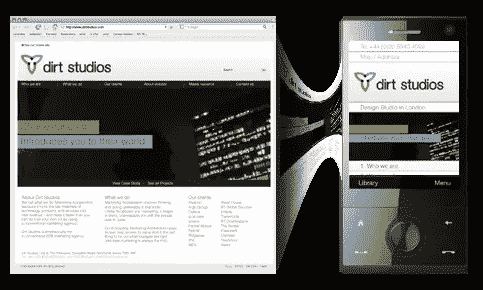

# 移动搜索引擎优化神话曝光

> 原文：<https://www.sitepoint.com/mobile-seo-myths-exposed/>

2008 年是关于移动搜索引擎优化和移动网站的文章层出不穷的一年。这种议论在下半年逐渐减少；然而,“移动搜索引擎优化”和“移动网站”的查询数量在不断上升——至少在我看来是这样。我认为今天写一篇关于移动搜索引擎优化的文章更有道理，因为 SitePoint 最近发表了一篇关于 Swift 的文章，这是一个让任何人都能创建移动网站的平台。

你可能听说过许多“专家”建议你为手机优化你的网站，或者创建一个“手机”版本的网站，并为“手机搜索”进行优化。过程早已被定义为“移动 SEO”，已经有很多 SEO 公司通过“创建移动网站”和做“移动 SEO”来赚钱。

我不是说创建一个移动网站有什么问题，但是有几件事你应该知道，这可能会在将来为你节省很多麻烦和金钱。

首先，你应该知道**你不需要购买一个. mobi 域名来使你的网站符合移动平台的要求。一个. com 网站在手机上运行良好，所有其他域名扩展也是如此。**

诚然，图像大小在使网站“移动友好”方面起着重要的作用，但缩小图像或完全消除图像并不是强制性的。iPhone 加载图像的方式和电脑一样，其他一些智能手机也是如此，比如黑莓 Storm。当然，并不是所有用户都用智能手机浏览网页，但考虑到全球移动技术的发展，这只是个时间问题。

从营销的角度来看，传统网站和移动网站最好使用相同的 URL:用户不必记住两个不同的 URL。

此外，仅使用一个 URL 避免了创建重复内容的风险。为相同的内容创建两个不同的网站是没有意义的。

**传统的 SEO 最佳实践也适用于“移动 SEO”**，但除此之外，还有一些步骤可以让网站做好移动准备:

*   建议使用符合 W3C 的 XHTML 代码和符合基本[可访问性标准](https://www.w3.org/TR/mobile-bp/)的页面，但这不是强制性的
*   将你的网站提交给移动搜索引擎。
*   通过将您网站的内容数据库与用户代理检测相结合来创建动态移动页面。动态转换页面代码是一项相当复杂的任务，只适合熟练的程序员。未来的智能手机不需要这个。
*   当你在手机上搜索谷歌时，你会看到和在电脑上几乎一样的搜索结果。这意味着谷歌移动搜索不会优先列出移动网站。

总之:如果你正在考虑创建一个移动版本的网站，那可能是时候重新考虑你的努力了。回到 2006 年，当“移动”开始时，这是有道理的:移动电话不像今天这样先进，那些先进的也不是那么实惠。再过一年，所有手机都将具备“智能”浏览网页的能力，用户可能不会对查看网站的中继版本感兴趣。

与其计划开发一个“移动”网站，不如坚持一些基本的设计原则:让你的网站兼容所有浏览器，确保它在任何屏幕分辨率下都可读，让所有人都可以访问，确保它加载速度快。

至于搜索引擎优化，传统的方式仍然是黄金:相关的页面标题，良好的页面描述，良好的页面标题，适当的标签，当然还有高质量的链接。

如果你坚持要创建一个. mobi 网站，现在你可以通过使用 dotMobi 最近发布的即时移动器，以很小的成本做到这一点。当您从本页中[列出的任何 dotMobi 合作伙伴处购买. mobi 域名时，该软件将免费添加到您的软件包中。在同一个网站上，你也可以](http://instantmobiliser.com/our-partners.htm)[测试你的网站](http://instantmobiliser.com/test-your-site.htm)，看看它在手机上是什么样子。

Instant Mobilizer 是一个新工具，可以将标准网站转换为移动网站。

To check whether your site will display on a mobile phone, visit [ready.mobi](http://ready.mobi/).

如果你对这个话题有更多的想法和想法， ***请在*下面的评论中加入讨论。**

## 分享这篇文章