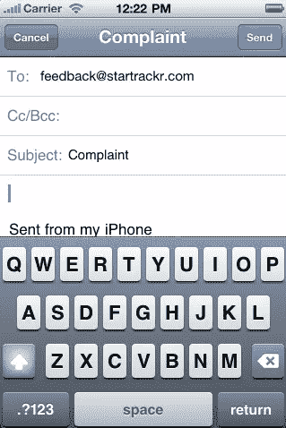
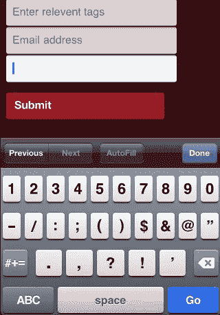

# 移动网络应用:速赢

> 原文：<https://www.sitepoint.com/mobile-web-apps-quick-wins/>

这是《为智能设备建立移动网站和应用程序》一书的下一段摘录，作者是[厄尔·卡斯尔丁](http://twitter.com/#!/mrspeaker)、[迈尔斯·埃夫托斯](http://twitter.com/#!/madpilot)和[马克斯·惠勒](http://twitter.com/#!/makenosound)。BuildMobile 独家出版了这本书的一个完整章节，关于移动网络应用的章节，这是关于“速赢”的第三部分。

## 3.速赢

当我们浏览这本书的时候，我们会遇到一些相对复杂的代码来重新创建自然的效果和行为。然而，多亏了一些(相当)标准的钩子和 API，我们可以使用一些技巧来给我们的应用程序增加一点活力，而不需要做太多的工作。

### 3.1.漂亮的链接

出于安全原因，移动 web 应用程序远离移动设备的许多内置功能；例如，与原生应用不同，它们不能检索用户的联系人列表，也不能用设备的摄像头拍照。然而，他们确实有能力打开一些核心应用程序，并通过使用一些精心构建的超链接向它们填充数据。

#### 3.1.1.电子邮件

其中最简单的是众所周知的 mailto: URI 方案。在桌面上，这些将启动您的默认邮件应用程序，智能手机也是如此:

```
<a href="mailto:feedback@startrackr.com?subject=Complaint">
  Send complaint
</a>
```

这将打开设备的电子邮件应用程序，主题行填充有我们传入的变量，如图 4.3，“mailto: links 将打开手机的电子邮件应用程序”所示。

[](https://www.sitepoint.com/wp-content/uploads/2011/07/fig_4_email.png)

#### 3.1.2.电话号码

我们也可以帮助拨打电话号码使用电话:URI 计划。这将调出(当然不是拨号)一个电话号码:

```
<a href="tel:1-408-555-5555">
  Call in a sighting!
</a>
```

事实上，对于 iPhone 来说，甚至不需要在超链接中包装号码。Mobile Safari 包含一项功能，可以自动检测页面中的电话号码，并将其转换为链接。“太棒了”，你可能会想——直到它第一次试图把你的产品 id 变成“可拨打”的电话号码！同样，还有一个功能可以将类似地址的文本转换成地图链接。但是像任何 automagic 功能一样，它并不总是你想要的。如果是这种情况，您可以在页面的头部包含标签来禁用这些功能:

同样，iPhone 支持但 Android 不支持的是 sms: URI 方案，它也接受电话号码，但打开了文本消息应用程序。在这一点上，你可能会担心有限的支持——幸运的是，如果一个设备不能识别 URI 方案，这不是一个大问题，因为没有什么会破坏；该链接将什么也不做。

#### 3.1.3.地图

现在来看地图，情况有点不太理想。如果你想打开一张地图并缩放到一个给定的位置，没有广泛实施的、标准定义的方法来做到这一点。一种常见的方法是简单地构造一个指向 http://maps.google.com/的 URL，并带有格式正确的纬度和经度。iOS 和 Android 都将使用内置的地图应用程序打开它，而不是通过浏览器中的链接:

```
<a href="http://maps.google.com.au/maps?q=sitepoint">Visit us!</a>
```

更符合标准的版本是 geo: URI，它接受各种值，这些值将被设备的地图应用程序解释为地图数据。你可以传递一个纬度和经度:

```
<a href="geo:-33.87034,151.2037">Visit us!</a>
```

或者街道地址或企业名称和位置:

```
<a href="geo:0,0?q=123+Fake+St">Visit me!</a>
```

这当然很棒，但是目前只支持 Android。

### 3.2.表单字段属性

我们的链接都磨光了，让我们转向形式。HTML5 将基本表单带入了未来，带来了一系列闪亮的新输入类型和表单属性，它们在当前的移动设备上得到了很好的支持。

输入字段的 HTML5 占位符属性将用用户提示填充该字段，当用户聚焦于它时，该提示消失。这通常用于避免需要字段标签，或者为用户提供额外的帮助文本:

```
<fieldset>
  <label for="name">
    <span>Who</span>
    <input type="text" name="name" placeholder="Star's name"/>
  </label>
  <label for="tags">
    <span>Tags</span>
    <input type="text" name="tags" placeholder="Tag your sighting"/>
  </label>
</fieldset>
```

iPhone 的键盘试图通过大写表单字段的首字母来帮助用户。大多数时候，这是你想要的——但并不总是这样；例如，在我们的示例表单的 tags 字段中。iPhone 还会尝试纠正它无法识别的单词，这可能会给我们的名人姓名字段带来问题。可以通过“自动更正”和“自动大写”属性禁用这些功能:

```
<fieldset>
  <label for="name">
    <span>Star</span>
    <input type="text" autocorrect="off" placeholder="Star's name"/>
  </label>
  <label>
    <span>Tags</span>
    <input type="text" autocapitalize="off" placeholder="Tag your sighting"/>
  </label>
</fieldset>
```

注意，这些属性是非标准的，因为它们不在 HTML 规范中——至少目前是这样。

### 关闭 Automagic

如果表单的大多数字段需要这些属性，您也可以将它们添加到

 `<form>

标签本身，默认情况下将它们应用于该表单中的所有字段。然后，您可以根据需要在任何给定字段上覆盖此设置。

另一个对移动网站有用的 HTML5 特性是增加了许多新的输入类型。除了传统的 type="text "，HTML5 还提供电子邮件、数字、url、日期，甚至颜色输入。这些都将在大多数浏览器上显示为简单的文本字段，但 iPhone 巧妙地为相关数据提供了合适的键盘——例如，包括@和的快捷键。(句号)当你使用 type="email "的时候。对于 type="number "，它将提供一个数字小键盘，而不是传统的键盘，如图 4.4，“在 iPhone 上聚焦一个数字输入时出现一个数字小键盘”。BlackBerry 浏览器甚至为日期和颜色输入类型提供了日期和颜色选择器。

[](https://www.sitepoint.com/wp-content/uploads/2011/07/fig_4_keypad.png)

下面是这些输入类型的一个实例:

```
<label>
  <span>Tags</span>
  <input type="text" autocapitalize="off" placeholder="Relevant tags">
</label>
<label>
  <span>Number of celebs</span>
  <input type="number" placeholder="Number of celebs">
</label>
<label>
  <span>Tags</span>
  <input type="email" placeholder="Your email address">
</label>
```

对所有这些特性的支持是不一致的，所以您需要测试您的目标设备。好消息是，即使缺乏支持，应用程序也不会出现故障。不支持的输入类型将简单地表现为常规的文本字段，用户不会知道。

因为 iPhone 是第一个上市的，许多 iOS 专有的技巧在其他设备上有广泛的支持；然而，并不是每个人都想实现竞争对手的功能！令人欣慰的是，对 HTML5 标准的支持正在增长，这应该很快会渗透到所有大型移动玩家。

### 构建移动图书

您可以从 Sitepoint 购买《为智能设备构建移动网站和应用程序》一书。阅读完整的[第 4 章。移动网络应用](https://www.sitepoint.com/build-mobile-book/)，独家在 BuildMobile，在下面的部分是免费的。

*   [开店](https://www.sitepoint.com/mobile-web-apps-setting-up-shop/)
*   [事件](https://www.sitepoint.com/mobile-web-apps-events/)
*   速赢
*   [加载页面](https://www.sitepoint.com/mobile-web-apps-loading-pages/)
*   Ajax
*   [模板化](https://www.sitepoint.com/mobile-web-apps-templating/)
*   我们有一个应用程序！

</form>` 

## `分享这篇文章`