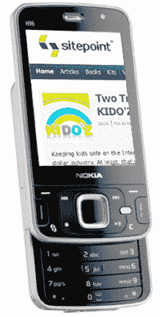
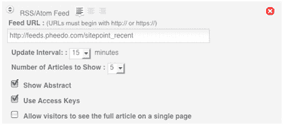
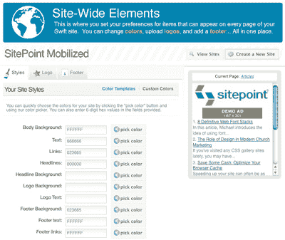
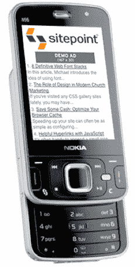

# 移动网页设计:要快！

> 原文：<https://www.sitepoint.com/mobile-web-design-be-swift/>

当一个国家的经济衰退严重影响全球其他地区时，很明显我们都生活在一个相互交织的系统中。互联网和个人电脑在将我们联系在一起的过程中发挥了重要作用，但是仍然有很大一部分人因为个人电脑的高昂价格而被排除在外。手机正在改变这一点，让世界各地的公民都能访问互联网，将地球变成一个真正的地球村，每个人都可以相互交流。

无论是伦敦南部的青少年，布宜诺斯艾利斯的家庭，还是坎帕拉的商人，全球的电脑用户现在都可以通过手机上网获取信息。这甚至可能比“每个孩子一台笔记本电脑”项目更令人兴奋。现在，知识比以往任何时候都更容易被所有人获取。这是个好消息，但是对于网站开发者来说，扩展移动网络访问会有什么后果呢？

##### 标准化之路

正如你所料，要想通过移动网络真正成为一个全球在线社区，还有一些障碍需要克服。小屏幕和缺乏 JavaScript 支持意味着大部分为电脑创建的网站在手机上浏览时无法正常工作；一个全尺寸的网站需要用户上下左右滚动才能看到全部内容。此外，大多数互联网运营商的网络是封闭的，这意味着…每个运营商都有自己的规则。根据运营商、国家和漫游费的不同，互联网费用会有很大差异。

制造商的手机和浏览器解读网页的方式之间的细微差异可以累加起来；有些甚至去掉了设备信息——使得你的网站不可能正确地为他们的客户服务。向大量的人推广你的移动网站是很困难的，而且你必须使用的屏幕尺寸和分辨率也很小。当然，从负面来看可能会让你觉得有太多的障碍需要解决，尤其是对设计师来说，但是这种媒介的潜力是巨大的。那里就像是蛮荒的西部，充满了各种机会。你还记得 1995 年的互联网吗？相比之下，今天的网络。可用性、用途和普遍性都有了巨大的飞跃。没有全球参与，就不会取得我们今天看到的进展。

一些组织正致力于制定更大规模的移动行业标准化路线图。W3C 的移动部门正在为移动网站开发最佳实践。移动营销协会正在解决营销问题，从盈利角度考虑，这对媒体的生存和发展至关重要。

通过移动设备更好地理解互联网的真正含义已经发生，也将会发生。作为一名网页设计师或营销专家，这对你来说意味着什么？一般的手机用户呢？普通用户想从这种媒介中得到什么？我们怎样才能让它变得更好？

回答这些问题的唯一方法是亲自参与进化。不管你是谁，也不管你以什么为生，移动网络是为像你这样的人准备的。

##### 甚至你的父母也能做到

通过创建自己的符合移动标准的网站来熟悉这种媒体。出乎意料的简单。有几家公司提供优秀的网站建设向导。他们将免费托管你的新移动网站，通常是以在你的页面上放广告作为交换，或者给你托管自己或使用自己的域名的选择。

Swift 为您提供了一个非常强大的界面，让您可以创建自己的移动网站。其他网站构建器也是可用的——我将在后面讨论这些——但我将使用 Swift 来演示如何创建一个移动友好的网站。在继续下去之前，我给你完整的免责声明:我曾经在 Proteus(现在被称为 2ergo)工作，Swift 背后的公司。我参与了其他项目，但我一直关注 Swift 的发展，因为我喜欢它将权力交到人们手中的方式。我把这种情况比作如果 Macromedia 在 1997 年免费赠送 Dreamweaver 会是什么样子；因此，他们将提供一个工具，让任何人都可以创建一个符合标准的网站，为每一个可能浏览它的浏览器或设备进行特别格式化。这是一件大事。

##### 试试看，我谅你也不敢！

Swift 的一个非常强大的方面是，它允许您获取内容的 RSS 提要。这意味着如果你有一个博客，你可以通过几个简单的步骤创建一个移动版本。或者，您可以创建一个包含您最喜欢的博客、新闻网站或任何其他通过 RSS 提供的内容的网站。俏皮！

Swift 还允许您添加颜色——使用模板或您自己的自定义颜色——上传您的徽标，并放入网站页脚。

一旦您使用 Swift 的功能对您的网站进行了个性化设置，您的博客就可以供任何拥有联网手机的人使用了。现在你需要做的就是让大众知道你的移动网站。转到 goodies 部分与朋友分享，发送短信或电子邮件，或创建一个小工具来集成到您自己的网站中(这可以让您的定期访问者给自己发送一个指向他们手机的链接)。

一旦你开始接待访客，你可以用内置的报告工具跟踪他们。

有几个其他产品也在做与 Swift 类似的事情。

所以，尝试一下，看看什么适合你。请记住，移动设备的网站内容在某些方面会与您习惯的内容有所不同。但是想想你可能接触到的广大观众。全球的通勤者会喜欢你对新兴科技的漫谈吗？他们能看到照片吗？他们的移动运营商是否有一个合理定价的数据计划，让网络真正有用？

这些都是需要解决的问题，能够回答这些问题的只有我们自己。大胆说出你的经历，因为你可以影响技术、价格结构，甚至移动网络的未来。互联网必须根据用户的需求发展，以达到 Web 2.0 的状态。这是你参与下一个大发展的机会。

## 分享这篇文章