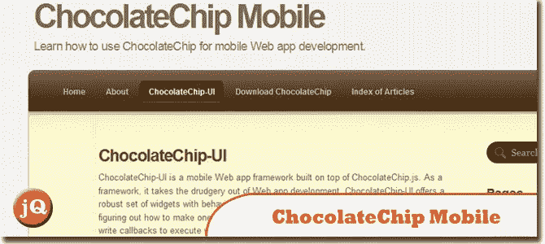
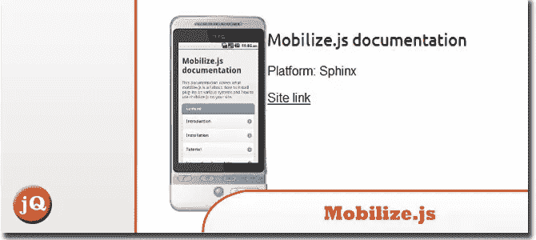
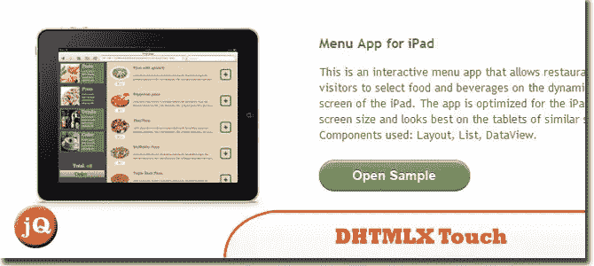
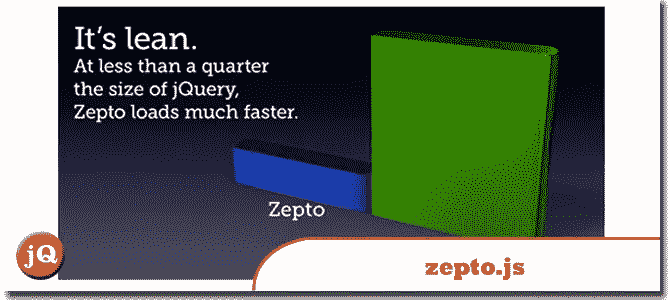
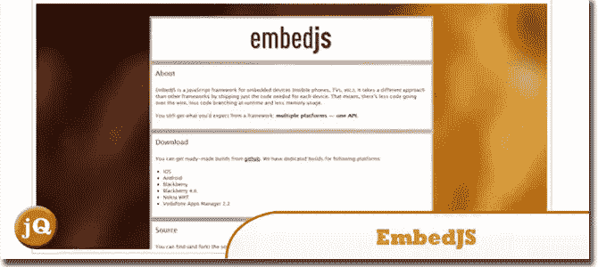
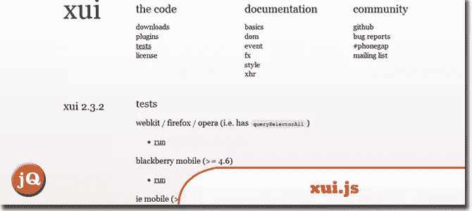
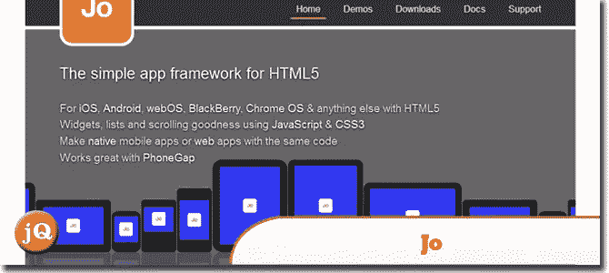
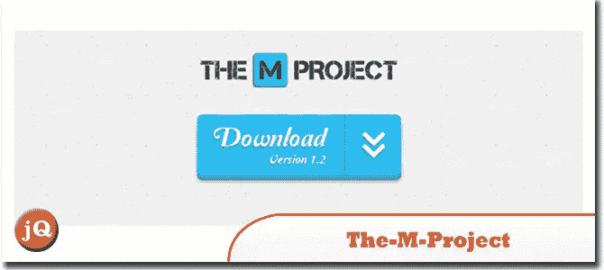
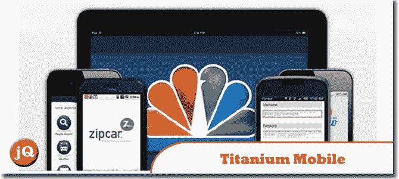
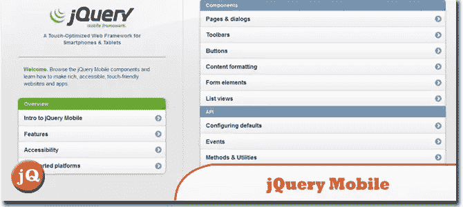

# 10 个最佳 JS 移动 Web 开发框架

> 原文：<https://www.sitepoint.com/mobile-web-development-frameworks/>

在今天的帖子中，我们将展示我们精选的 **JavaScript 移动 web 开发框架**，你应该考虑使用它们来构建你的下一个移动 web 应用或网站。JS mobile 框架的共同特点:跨平台，针对触摸屏设备优化，使用 HTML5 和 CSS3 标准。

**相关帖子:**

*   [**10 个超级 JavaScript 动画框架**](http://www.jquery4u.com/animation/10-super-javascript-animation-frameworks/)
*   [**10 个轻量级和极简 CSS 框架**](http://www.jquery4u.com/dynamic-css-2/10-lightweight-minimal-css-frameworks/)
*   [**10 JavaScript Web UI 库、框架和工具包**](http://www.jquery4u.com/javascript/10-javascript-web-ui-libraries-frameworks-toolkits/)

## 1.巧克力技术手机

它是一个面向未来 web 浏览器开发的 JavaScript 框架。它的语法类似于 jQuery 或 Prototype。
 
[源+演示](http://chocolatechipmobile.wordpress.com/)

## 2.Mobilize.js

它是一个 JavaScript 框架，用于将您现有的网站移植到一个移动友好的版本。I 支持 iPhone、Android、黑莓、Opera Mini 等多种浏览器和设备。
 
[来源](http://mobilizejs.com/) [演示](http://mobilizejs.com/examples/)

## 3.DHTMLX 触摸

针对触摸屏设备优化的免费 HTML5/JavaScript 框架让您能够快速制作精美的移动 web 应用。
 
[来源](http://dhtmlx.com/touch/) [演示](http://dhtmlx.com/touch/samples/)

## 4.zepto.js

是一个面向现代浏览器的极简 JavaScript 库，具有很大程度上兼容 jQuery 的 API。
 
[源+演示](http://zeptojs.com/)

## 5.EmbedJS

是一个用于嵌入式设备(包括手机、电视、平板电脑等等)的 JavaScript 框架。
 
[源+演示](http://uxebu.github.com/embedjs/)

## 6.xui.js 文件

为特定的移动浏览器(如 WebKit 和 IE mobile)提供有针对性的构建，以便您严格针对特定的移动设备操作系统开发应用程序。
 
[源+演示](http://xuijs.com/)

## 7.乔

是一个框架，面向在支持 HTML5 的移动设备上工作的开发人员，例如使用 iOS、webOS、Android 和 Chrome OS 平台的开发人员。
 
[来源](http://joapp.com/) [演示](http://joapp.com/demos.html)

## 8.M 项目

是另一个可靠的 JavaScript 框架，它利用 HTML5 的新特性来更轻松、更好地开发移动应用程序。
 
[源+演示](http://the-m-project.net/)

## 9.钛手机

支持 iOS 和 Android 的原生 UI 元素，如表格视图、标签、开关和弹出窗口。它还具有使您能够与移动设备的摄像头和本机文件存储系统进行交互的功能。
 
[源+演示](http://www.appcelerator.com/platform)

## 10.jQuery Mobile

这是一个框架，它将帮助您快速自信地开发跨流行的移动设备平台(如 iOS 和 Android)的移动应用程序用户界面，这可能是最受欢迎的项目。
 
[来源](http://jquerymobile.com/) [演示](http://jquerymobile.com/demos/1.0b2/)

## 分享这篇文章