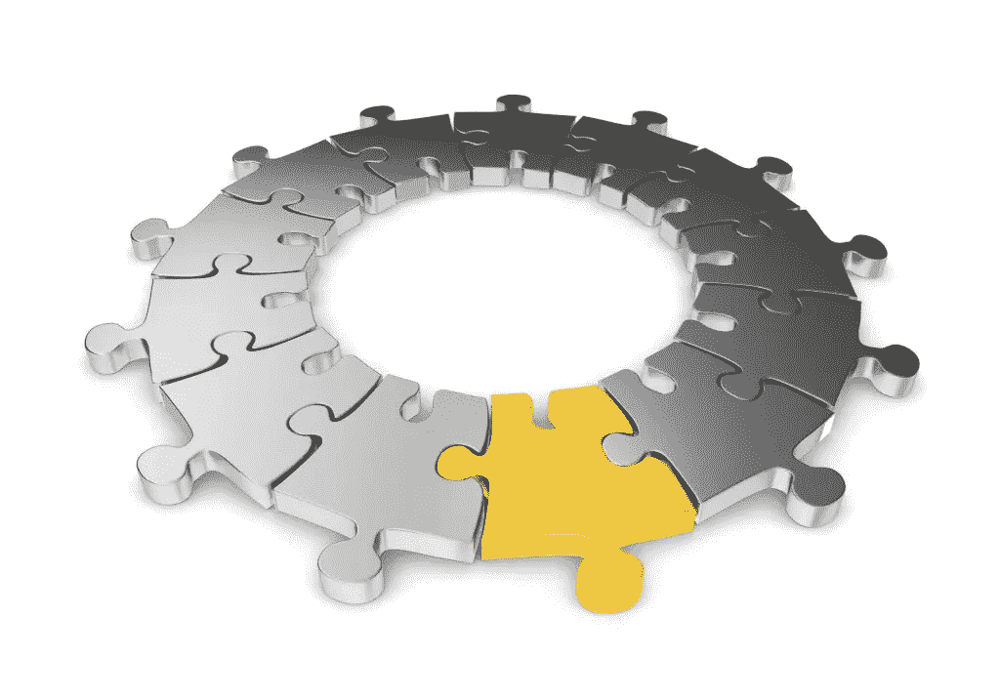

# 用口才建模集合

> 原文：<https://www.sitepoint.com/modeling-aggregate-eloquent/>

聚合模式是领域驱动设计的重要组成部分。它防止不一致，并负责在对象集合中实施业务规则。仅仅因为这些原因，就可以清楚地看到为什么它是一个领域模型的关键组件。

[架构建议推荐](http://blog.8thlight.com/uncle-bob/2012/08/13/the-clean-architecture.html)包含领域模型的层独立于基础设施。虽然这是个好建议，但另一方面，活动记录模式在数据库中包装一行。正因为如此，与持久层解耦几乎是不可能的。

将持久性问题混合到一个领域模型中会变得复杂，并导致许多糟糕的决策。这并不意味着不可能创建活动记录域模型。在本文中，我们将通过一个例子来构建一个聚合，它也扩展了雄辩:一个流行的活动记录表单。

## 什么是聚合？

聚合是作为单个单元的对象的集合，其中一个[对象作为聚合的根](http://martinfowler.com/bliki/DDD_Aggregate.html)。来自聚合外部的交互只能通过根对象进行通信。然后，聚合根可以管理其边界内所有对象的一致性。



聚合的边界定义了事务的范围。在提交事务之前，对对象集群的操作必须符合业务规则。在单个事务中只能提交一个聚合。其他聚合所需的任何更改最终都必须保持一致，并且发生在另一个事务中。

在他的书[实现领域驱动设计](https://vaughnvernon.co/?page_id=168#iddd)中，Vaughn Vernon 概述了一套指导方针，他称之为:“总体设计的规则”:

1.  在一致性边界中保护真正的不变量
2.  设计小骨料
3.  仅通过标识引用其他聚合
4.  使用一致性边界之外的最终一致性

## 示例博客

因为从技术上来说这是一篇博客文章，所以用博客作为我们的背景似乎是合适的。我们需要一个有自己身份的职位。一个`Post`将需要一个`Title`和`Copy`。帖子是由一个`Author`写的，可以被评论——但是如果`Post`被锁定了就不行。

`Post`是一个很好的聚合根，有`Title`和`Copy`值对象。`Author`但是将在我们的边界之外，并且仅由身份引用。但是`Comment`呢？

在我们的例子中，我们将把`Comment`建模为 Post 聚合中的一个实体。然而，重要的是要注意，在一个集合中聚集太多的概念将导致大量的对象被水合。这可能会对性能产生影响，所以要小心，并确保您用清晰定义的边界对[小聚集](http://dddcommunity.org/library/vernon_2011/)建模。

让我们先看看在没有扩展 ORM 的情况下，我们的 Post 聚合可能是什么样子:

```
final class Post
{
    /**
     * @var PostId
     */
    private $postId;

    /**
     * @var AuthorId
     */
    private $authorId;

    /**
     * @var Title
     */
    private $title;

    /**
     * @var Copy
     */
    private $copy;

    /**
     * @var Lock
     */
    private $locked;

    /**
     * @var array
     */
    private $comments;

    /**
     * @param PostId $postId
     * @param AuthorId $authorId
     * @param Title $title
     * @param Copy $copy
     */
    public function __construct(PostId $postId, AuthorId $authorId, Title $title, Copy $copy)
    {
        $this->postId = $postId;

        $this->authorId = $authorId;

        $this->title = $title;

        $this->copy = $copy;

        $this->locked = Lock::unlocked();

        $this->comments = [];
    }

    public function lock()
    {
        $this->locked = Lock::locked();
    }

    public function unlock()
    {
        $this->locked = Lock::unlocked();
    }

    /**
     * @param Message $message
     */
    public function comment(Message $message)
    {
        if ($this->locked->isLocked()) {
            throw new PostIsLocked;
        }

        $this->comments[] = new Comment(
            CommentId::generate(),
            $this->postId,
            $message
        );
    }
}
```

这里我们有一个简单的 post 类。在构造函数中，我们加强了不变量，确保没有基本信息就不能创建对象。如果要创建 post 对象，必须提供关键信息，如标题和副本。

我们也有锁定和解锁帖子的行为，以及添加评论。如果帖子通过抛出`PostIsLocked`异常被锁定，新评论将被阻止。这将业务规则封装在聚合中，使得不可能对锁定的帖子进行评论。

## 介绍口才

作为起点，我们在没有扩展 ORM 的情况下对我们的领域建模。让我们将雄辩术引入我们的`Post`课堂，并讨论这些变化:

```
final class Post extends Eloquent
{
    public function lock()
    {
        $this->locked = Lock::locked();
    }

    public function unlock()
    {
        $this->locked = Lock::unlocked();
    }

    /**
     * @param Message $message
     */
    public function comment(Message $message)
    {
        if ($this->locked) {
            throw new PostIsLocked;
        }

        $comment = new Comment;
        $comment->postId = $this->postId;
        $comment->message = (string) $message;

        $this->comments->add($comment);
    }

    public function comments()
    {
        return $this->hasMany(Comment::class);
    }

    public function getLockedAttribute($value)
    {
        return Lock::fromString($value);
    }

    public function setLockedAttribute(Lock $lock)
    {
        $this->attributes['locked'] = $lock->asBool();
    }
}
```

好吧，我们确实写了更少的代码。让我们仔细看看。

首先要注意的是类属性的删除。雄辩术将所有属性存储在每个类的一个受保护的`$attributes`数组中，并使用神奇的`__get()`和`__set()`方法进行访问和操作。

我们也不再有构造函数了。通过构造函数传入行数据，雄辩合并了对象的受保护的`$attributes`数组。雄辩术依靠这种能力来提供几个特性，例如加载关系。

最后，我们增加了一个额外的方法:`comments()`。实施这个新方法让我们可以快速利用[雄辩者的关系](http://laravel.com/docs/5.0/eloquent#relationships)。我们可以在不公开公共方法的情况下在`comment()`内部调用`hasMany()`，但是如果我们决定添加一个[活动记录查询存储库](http://adamwathan.me/2015/02/14/active-repository-is-an-antipattern)，这将防止急切加载。

### 属性

让我们来谈谈类属性的删除。这有很大的不同吗？我们原始类中的属性是私有的——将它们存储在受保护的`$attributes`数组中真的会有很大变化吗？

实际上，这可能是传统对象和活动记录之间最重要的变化。为什么？因为我们不再处理一个对象，我们正在处理一个数据结构。对象暴露行为，数据被隐藏。数据结构恰恰相反:它们公开数据，没有行为。

口才提供了一个公共的`__get()`魔术方法的数据访问。因为我们可以直接访问我们的数据，所以很容易过滤出应该在我们的模型中的行为。还记得这条商业规则吗:“你不能对锁定的帖子发表评论”？想象以下实现:

```
if ($post->locked->isLocked()) {
    throw new PostIsLocked;
}

$post->comment($message);
```

这很容易导致一个除了一些“获取者和设置者”之外几乎没有什么的域模型。相反，应用[告诉不要问](http://martinfowler.com/bliki/TellDontAsk.html)原则，告诉模型它需要做什么:

```
try {
    $post->comment($message);
}
catch (PostIsLocked $e)
{
    // Nope!
}
```

注意不要剥夺你的行为对象。仅仅因为你可以直接访问和操作你的数据并不意味着你应该这样做。

### 价值对象

我们的活动记录版本中增加了几个额外的方法，以允许使用`Lock`。我们的对象中的数据必须转换成标量类型，但是如果我们利用了雄辩的[访问器和赋值器](http://laravel.com/docs/5.0/eloquent#accessors-and-mutators)方法，我们仍然可以使用值对象。

```
public function getLockedAttribute($value)
{
    return Lock::fromString($value);
}

public function setLockedAttribute(Lock $lock)
{
    $this->attributes['locked'] = $lock->toBool();
}
```

正如您所看到的，这将额外的公共方法添加到一个专注于持久性映射的对象中——而不是提供行为。对于活动记录来说，这通常不是什么需要过分担心的事情，尤其是当你考虑到我们继承的基类已经包含了像`save()`和`forceDelete()`这样的公共方法的时候。当使用活动记录建模时，您将习惯于这种特殊的权衡。

在可能的情况下，您应该利用任何 ORM 特性来转换值对象。值对象强制它们自己的不变量，这些不变量不能是无效的。我们例子中的`Lock`类很简单，但是想象一个`Email`对象。你可以确定`Email`对象的实例是有效的。您甚至可能希望实施额外的业务规则，例如确保电子邮件只能属于特定的域。

### 不变量

不变量是在我们的定义域内[必须总是有效](http://codebetter.com/gregyoung/2009/05/22/always-valid/)的规则。根据定义，它们在一定的条件范围内是[常数。想象一下，如果我写这篇文章没有标题，会有效吗？没有名字的作者呢？没有 J 和 K 的字母表？](http://dictionary.reference.com/browse/invariant)

违反不变量将违反概念的本质。聚集根为其自身和聚集边界内的对象集群实施不变量。实体也执行它们自己的不变量，就像值对象一样，但是只有聚合根负责执行集群的规则。

我们可以通过使用类构造函数来加强不变量，并在对象实例化时明确要求参数。这将使一个物体更难处于违背这个概念的状态。然而，正如我们之前所讨论的，雄辩术要求构造函数水合一个对象。这意味着我们无法实施不变量，也无法保护我们的对象在实例化时不会无效。

乌迪·达汗建议我们不要直接创建聚合根，而是使用另一个对象的工厂方法来返回我们的新实例:

```
final class Author extends Eloquent
{
    // snip…

    /**
     * @param Title $title
     * @param Copy $copy
     * @return Post
     */
    public function draftPost(Title $title, Copy $copy)
    {
        return new Post([
            'title' => $title,
            'copy' => $copy,
            'author_id' => $this->id
                ]);
    }
}
```

在这个例子中，我们采纳了乌迪·达汗的建议，在另一个对象中使用工厂方法来构造我们的 Post。这允许我们使用商业语言来解释作者起草了一篇文章——但它也允许我们在其他情况下不能这样做时实施不变量。当使用活动记录建模时，使用这种方法需要更软的技能来实现和实施——因为我们不能阻止直接的对象实例化，所以团队必须了解创建集合的“内容和方式”。

另一种方法是在创建新实例时使用一个名为[的构造函数](http://verraes.net/2014/06/named-constructors-in-php/):

```
final class Post
{
    // snip…

    /**
     * @param AuthorId $authorId
     * @param Title $title
     * @param Copy $copy
     * @return static
     */
    public static function draft(AuthorId $authorId, Title $title, Copy $copy)
    {
        return new Post([
            'title' => $title,
            'copy' => $copy,
            'author_id' => $authorId
        ]);
    }
}
```

就像我们以前的工厂方法一样，我们使用业务语言来描述帖子的草稿被创建。我们还能够输入提示我们的值对象，并执行不变量。

同样，当我们考虑从活动记录 ORM 继承时，这种方法有一个明显的缺点。因为我们正在扩展 concertive，所以在对象图中已经有了许多静态方法。并不是所有的领域概念都会有很好的工作流标题，比如“草稿”。通常，描述创建的方法最合适的名字就是“创建”。可惜的是，雄辩已经有了一个静态的`create()`方法。

如果在你的环境中分离对象创建的责任是有意义的，还有其他的[创建模式](https://sourcemaking.com/design_patterns/creational_patterns)会有所帮助。

### 关系

聚合允许我们将一组对象视为一个单元。在我们的例子中，一篇文章可以有很多评论。我们该如何用雄辩来编码呢？

```
$post->comments()->save($comment);
```

当然，这将完成工作，但有一个问题。通过询问帖子的相关评论，我们完全绕过了聚合根。与聚合的所有通信都必须通过根，这样它才能执行业务规则。我们被告知“不能对锁定的帖子发表评论”，但是我们刚刚能够在不检查其锁定状态的情况下为帖子保存新的评论。

我们的示例将这个逻辑推入到`Post`类中，在那里它封装了`Comment`的创建以及对锁定状态的检查:

```
$post->comment($message);
```

通过这种方法，我们不再泄漏持久性问题。`$post`对象之外的代码不需要显式调用`save()`,因为它已经在内部被调用。

## 结论

我们已经展示了用活动记录建模一个聚集是可能的——但是它是复杂的并且有很多陷阱。如果您试图像对待传统对象一样对待活动记录，这可能会变得非常混乱。活动记录只与数据有关，而对象公开行为并隐藏数据。我们从根本上误用了活动记录模式——我们能做的最好的事情就是将行为添加到本质上是数据结构的东西中。

本文不是试图说活动记录不好，也不是呼吁总是使用它。它只是一个工具，我们可以根据情况使用。当专注于 RAD 时，活动记录是一个很好的工具，但是在某些情况下，它并不适合。我认为，由于所讨论的权衡，建模集合属于后者。

一些建模领域的开发团队可能很乐意做出必要的妥协，用活动记录来建模聚合。然而，其他人会认为拥有一个不能与基础设施分离的模型从来都不是一个好主意。

谁是正确的？所有问题的老答案是:视情况而定。

## 分享这篇文章