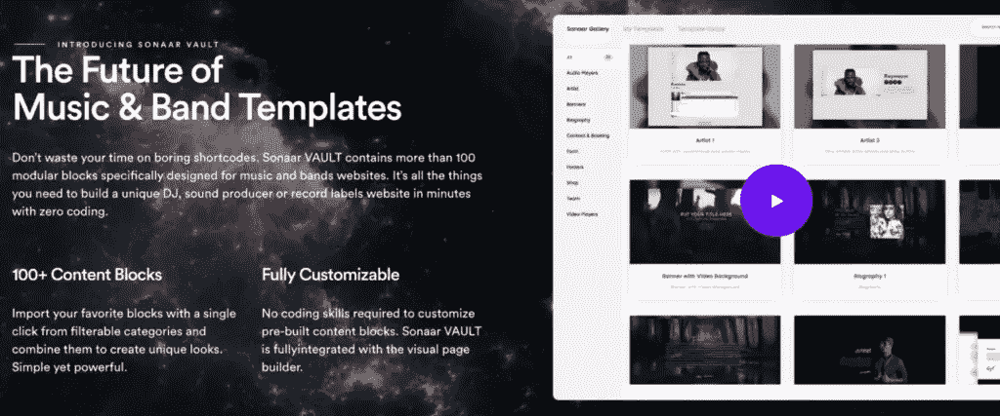
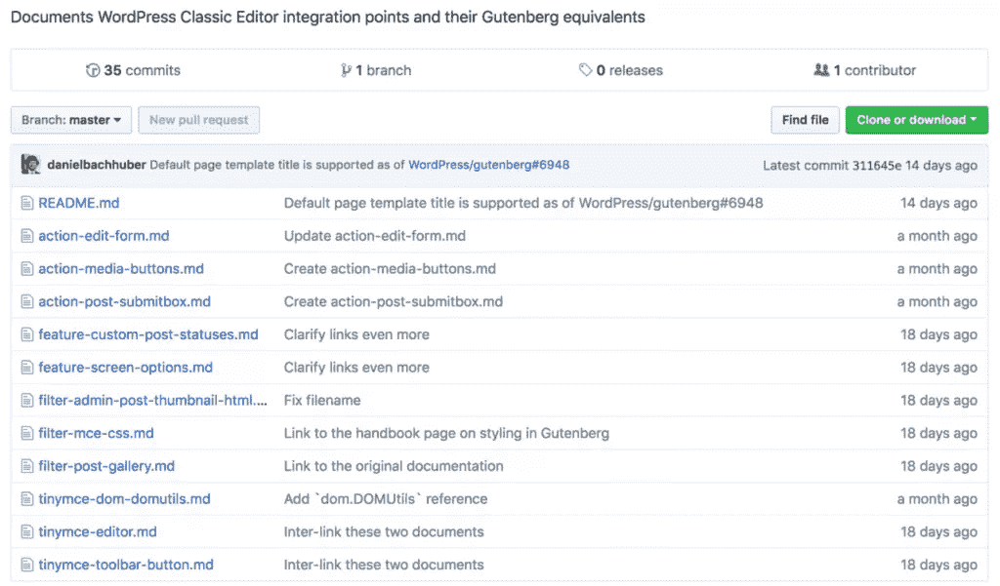
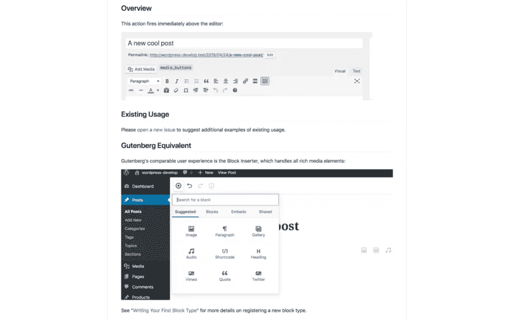

# 带有古腾堡迁移指南的现代 WordPress 插件

> 原文：<https://www.sitepoint.com/modern-wordpress-plugins-with-the-gutenberg-migration-guide/>

*这篇关于古腾堡迁移指南的文章[最初由 Torque 杂志](https://torquemag.io/2018/09/gutenberg-migration-guide/)发表，经允许在此转载。*

喜欢也好，讨厌也好，古腾堡会留在 T2。因此，让你的 WordPress 主题和插件与新的编辑器一起工作应该是首要考虑的问题。说实话，如果你现在只考虑这个方面，你就离目标很近了。然而，仍然有足够的时间来准备你的产品，尤其是在第三方的帮助下。

[Daniel Bachhuber 的](https://danielbachhuber.com/)古腾堡相关项目[之前在 Torque 博客](http://torquemag.io/2018/06/help-gutenberg-succeed/)上有过专题报道，这是另一个值得关注的项目。调整你的插件以兼容 Gutenberg 可能是一项棘手的任务，但是 [Gutenberg 迁移指南](https://github.com/danielbachhuber/gutenberg-migration-guide)应该可以帮助你实现这一转变。这是一个比较 WordPress 经典编辑器和 Gutenberg 定制点的便利参考指南。

在这篇文章中，我们将从整体上看这个项目，并讨论它是如何工作的。然后我们将讨论如何确保你的插件和主题是 Gutenberg-ready。我们开始吧！

## 古腾堡编辑器的当前状态

我们已经在 Torque 博客上[谈了很多关于古腾堡的历史](https://torquemag.io/2018/01/what-the-future-of-wordpress-development-looks-like-with-gutenberg/)，所以我们在这里就不赘述了。然而，提供一些背景知识，Gutenberg 最终将成为 WordPress 的新默认编辑器。它将取代目前正在使用的 [TinyMCE 版本](https://www.tinymce.com/)。虽然古腾堡是[现在出测试版](https://wordpress.org/plugins/gutenberg/)，我们仍然在等待插件被合并到核心平台。

然而，尽管 Gutenberg 的功能背后有着合理的推理，但迄今为止，许多人对编辑器缺乏修饰并不感兴趣。考虑到项目的当前状态，这种评估可能有些苛刻。无论如何，高水平的批评导致许多 WordPress 开发者缺乏行动，尤其是在让他们的产品达到标准的时候。

然而，这并没有阻止一些精明的开发者试图占领早期采用者市场。例如，非常受欢迎的 [Elementor Pro](https://elementor.com/) 页面生成器现在包括许多[古腾堡兼容的‘块’](https://elementor.com/introducing-blocks/)。其他开发人员也开始将此功能作为标准特性:

事实上，我们终于看到与古腾堡相关的特征出现在商业主题中，这应该让我们看清形势。换句话说，一些开发人员已经致力于他们的古腾堡解决方案一段时间了。现在，他们开始向公众提供。

如果你还没有开始这样做，你可能需要一些帮助来开始。幸运的是，有一个很好的倡议正好提供了这一点。

## 古腾堡迁移指南简介

在将您的功能迁移到 Gutenberg 时获得一些支持可能会受到许多开发人员的欢迎。出于这个原因，丹尼尔·巴赫胡伯——他最近成为了古腾堡相关倡议的焦点——创建了古腾堡迁移指南。

这是一个帮助开发者将他们以 TinyMCE 为中心的插件和主题移植到新编辑器的资源。它包括大量的截图，以及对古腾堡开发者手册的便捷参考。你可以把它看作古腾堡自己的“抄本”，尽管它没有被归类为 [WordPress 抄本](https://codex.wordpress.org/)的官方部分。

本指南还包括一个简短的概述，列出了每一个 TinyMCE 编辑器定制点和 Gutenberg 等价点。此外，它涵盖了所有受影响的挂钩和经典的编辑器功能。当您试图寻找将功能移植到 Gutenberg 的解决方案时，这显然是一个至关重要的资源。

### 如何帮助古腾堡迁移项目取得成功

正如四月底的一篇关于 Make WordPress 的博客文章所描述的，Daniel 希望众包这个项目，而不是保持唯一的贡献者。然而，尽管组成新编辑器的组件过多，但其他贡献却很少:

因此，特别是考虑到项目的高价值，需要更多的贡献者来帮助填写指南。要开始投稿，您可以像往常一样简单地发送一个 pull 请求，该请求将被批准并合并到指南中。你也可以通过[打开一个 GitHub 问题](https://github.com/danielbachhuber/gutenberg-migration-guide/issues)来建议一个新的钩子(或者问一个问题)。

## 如何使用 Gutenberg 迁移指南交付现代 WordPress 插件

实际上，使用 Gutenberg 迁移指南是一件轻而易举的事情，这主要是因为它的布局非常有条理:

你会在每一页的顶部找到相关 TinyMCE 编辑器动作或过滤器的参考，然后是在 WordPress 中使用它的一般例子。接下来，您将找到如何使用钩子的真实例子。这是该项目需要更多贡献的一个领域。有很多插件会将自己的功能添加到编辑器中，这需要记录下来。

在那下面，你会发现一个古腾堡内等价钩子的截图。这将伴随着一个简短的解释，告诉你在哪里可以找到这个钩子，以及关于它的使用的任何深奥的信息。最后，如果你需要更多的信息，这里有一个关于古腾堡开发者手册的便利参考。

总的来说，对于 Gutenberg 开发人员来说，这是一个非常有用的参考指南，应该在迁移过程中收藏起来。在我们看来，你应该检查的第一部分是还没有转换到 Gutenberg 的方面。例如，在 Gutenberg 中有许多`edit_form`动作不再兼容。根据你的主题或插件的功能，这可能需要一个全面的解决方案。

最后，Gutenberg 还没有引入的另外两个经典编辑器功能是 **[屏幕选项](https://github.com/danielbachhuber/gutenberg-migration-guide/blob/master/feature-screen-options.md)** 选项卡和非官方的 **[自定义帖子状态](https://github.com/danielbachhuber/gutenberg-migration-guide/blob/master/feature-custom-post-statuses.md)** 功能。前者可能是很多开发者更关心的，因为这是一个很多 WordPress 用户觉得有用的“强大”功能。

尽管有这些变化，确保你的主题和插件能适应两个编辑器是绝对重要的。如您所见，古腾堡迁移指南将带您到达目的地。

## 结论

古腾堡有它的批评者，但是每一个测试版的更新都给聚会带来了更多。新的编辑器正慢慢成为创建 WordPress 布局的强大方法，这对最终用户和开发者来说都是好消息。

更重要的是， [Daniel Bachhuber](https://danielbachhuber.com/) 提供的 [Gutenberg 迁移指南](https://github.com/danielbachhuber/gutenberg-migration-guide)对于那些需要快速适应自己项目的人来说是一个极好的资源。它使用起来非常简单，但是仍然需要 WordPress 社区的帮助来发挥它的全部潜力。为了帮助解决这个问题，你可以发送一个 pull 请求，[打开一个 GitHub 问题](https://github.com/danielbachhuber/gutenberg-migration-guide/issues)，或者甚至提供你自己的与 TinyMCE 编辑器功能相当的 Gutenberg 实例。

## 分享这篇文章