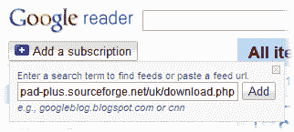
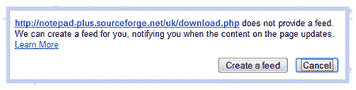
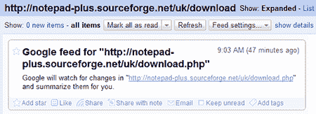

# 使用谷歌阅读器跟踪网站变化

> 原文：<https://www.sitepoint.com/monitor-website-changes-google-reader/>

RSS 是一项接收新闻和更新的伟大技术，但并不是每个网站都实现了提要。即使是这样的网站，也仍然依赖热切的内容作者来发布最新信息。

我已经用了 WatchThatPage.com 很多年了。尽管界面陈旧，但它是一个无价的免费工具，可以监控任意数量的网页，并在任何 URL 更新内容时向您发送电子邮件。在检查软件更新甚至监控未经授权的页面更改时，它会很有用。

谷歌阅读器也加入了类似的功能——该公司的在线 RSS 客户端。我从来都不是这个应用程序的狂热粉丝，我更喜欢[博客](http://www.bloglines.com/)，但这是一个有用的工具，可能会诱使我转行。

要监控任何网页:

1.点击**添加订阅**按钮，输入网址。在这种情况下，我选择了[记事本++下载页面](http://notepad-plus.sourceforge.net/uk/download.php)。点击**添加**，谷歌将检查页面现有的提要。

2.Google Reader 会告诉你找不到订阅源，并为你创建一个通知订阅源。点击**创建订阅源**继续。

3.Google Reader 将创建新的订阅，并在目标页面的内容发生变化时通知您。

你可以通过点击左下角的 **feed 设置**按钮或**管理订阅**来重命名 Feed。

然而，也许最有用的工具是更新提醒现在可以作为它们自己的 RSS 提要使用了！点击**显示详情**查看提要 URL。上述 Notepad++示例的提要可以从以下网址获得:

[http://www . Google . com/notification service/web changes/web feeds/13118522682655864878](http://www.google.com/notificationservice/webchanges/webfeeds/13118522682655864878)

因此，您可以在任何其他 RSS 客户端订阅该提要，如 Bloglines、桌面小部件、Microsoft Outlook 2007、Opera、Firefox Live 书签等。

你觉得这个功能有用吗？你会在哪里使用它？

## 分享这篇文章