# 使用 IFTTT 监控您的粒子设备

> 原文：<https://www.sitepoint.com/monitoring-your-particle-devices-with-ifttt/>

我在 SitePoint 制作了大量物联网演示，但有一件事我从未考虑过——跟踪我的设备是否在线！这是物联网的缺点之一…没有互联网，它们可能会变得相当无能为力！

在本文中，我们将探讨如何使用 IFTTT、Slack 和 Google 电子表格快速轻松地设置对 Core 和 Photon 等粒子设备的监控。我们会在 Slack 上收到关于我们的设备何时上线/下线的通知，我们会将其记录在谷歌电子表格中作为记录。

如果你对粒子生态系统完全陌生，你可以在粒子网站上找到更多信息。你可能知道他们是“火花核心”，因为这是他们更名前的名字。几周前，我还用[粒子核心和新像素](https://www.sitepoint.com/cloud-connected-neopixels-using-the-particle-core/)做了一个演示。它们基本上是云连接的微控制器，使用起来非常有趣！

## IFTTT 是什么？

IFTTT 是一个很棒的在线服务，是“如果这个那么那个”的缩写。它允许您为各种服务设置规则，这些服务要么提供可以远程触发的操作，要么为我们的操作提供触发器。例如，大约两个月前，我制作了一个关于使用 IFTTT 将 LIFX 灯泡连接到物联网的演示。在那个演示中，智能灯泡会根据我设置的各种规则改变颜色或开关。如果我把我的颚骨设置为睡眠模式，我的灯就会知道关闭。如果我最喜欢的运动队在比赛，我的灯可以改变颜色，以团队的颜色来激发团队精神！

## 将粒子连接到 IFTTT

本文假设您已经在 IFTTT 上有了一个帐户，并准备好了。如果没有，请在 [IFTTT 网站](https://ifttt.com)上注册开始。如果你需要更多的信息，我们在前面提到的【IFTTT 文章中有更详细的介绍。

要开始，前往[粒子 IFTTT 频道页面](https://ifttt.com/particle)(或在 IFTTT“频道”页面搜索)并点击“连接”:

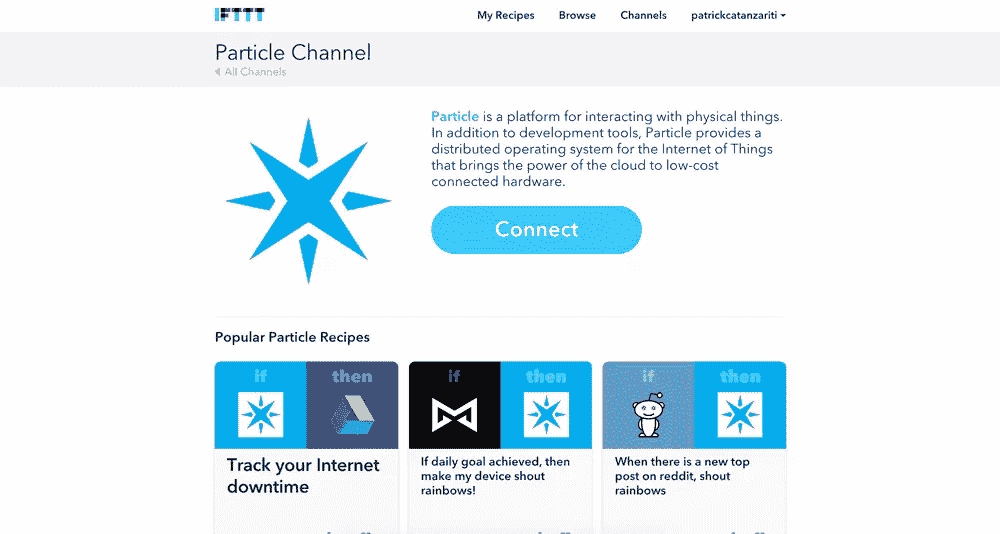

它会提示您输入粒子用户名和密码。在中输入这些信息，然后单击“登录”:

然后单击“确定”让 IFTTT 访问您的粒子数据:

如果一切顺利，你应该有一个“通道连接！”成功消息出现了一点点，粒子通道页面看起来像这样:

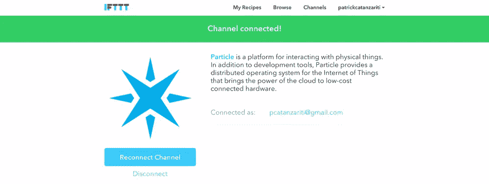

## 将 Slack 连接到 IFTTT

Slack 非常类似于连接粒子通道，但是它提出了更多的问题。从 [Slack IFTTT 频道页面](https://ifttt.com/slack)开始，点击“连接”:

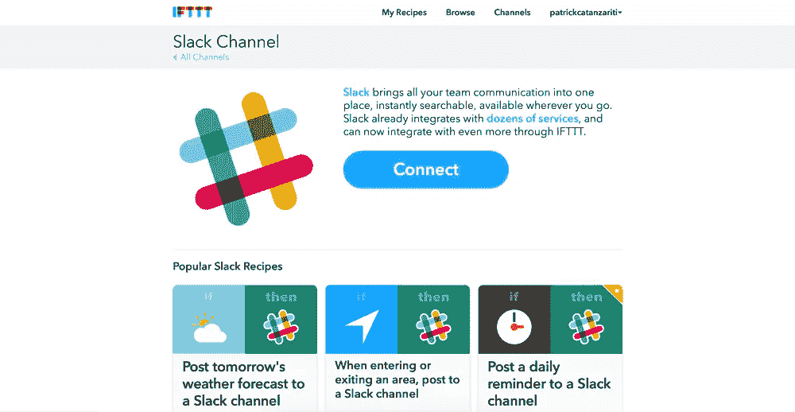

它会要求您登录到您希望消息出现在其中的 Slack 域。我使用了一个即将到来的网站项目的域名，而不是用我的粒子警报把 SitePoint 频道的人逼疯！

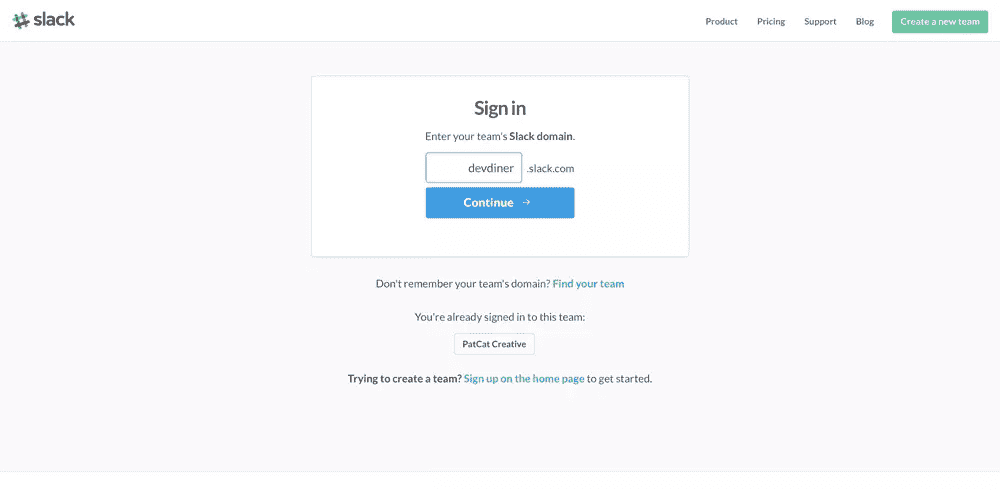

然后单击“授权”以允许 Slack 将消息发布到 Slack 域中。

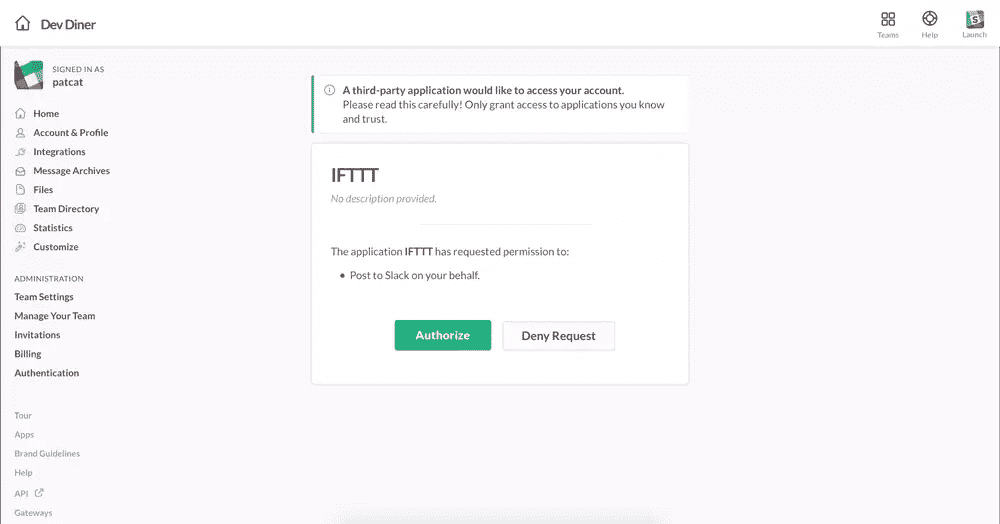

一旦您的 Slack 域和 IFTTT 能够相互通信，您应该有一个 Slack 通道页面，看起来像这样:

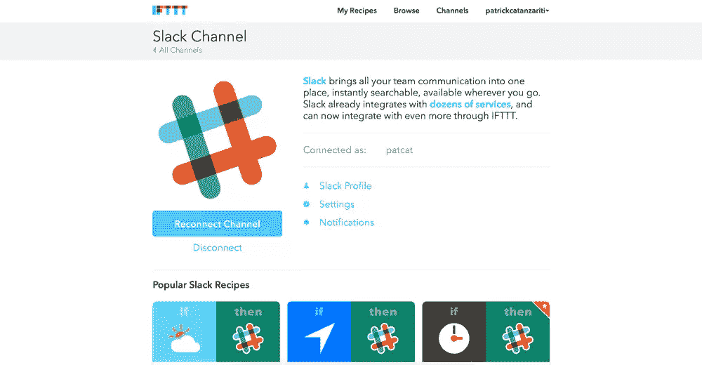

## 创建我们的粒子和松弛配方

现在我们已经将粒子和松弛连接到 IFTTT，让我们用它们创建我们的食谱。点击右上方带有您姓名的下拉菜单，然后选择“创建”来创建一个新的 IFTTT 配方:

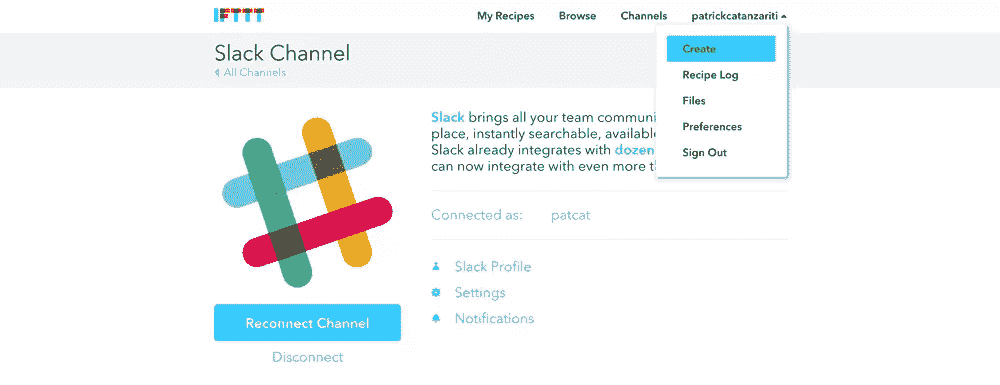

点击“此处”开始选择我们的触发器:

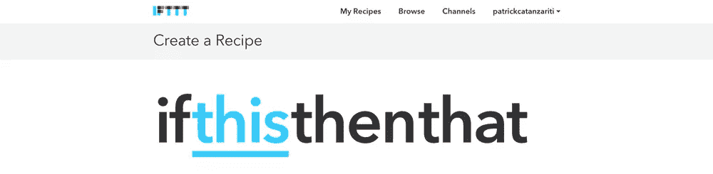

键入粒子找到粒子通道，并选择它作为我们的触发器:

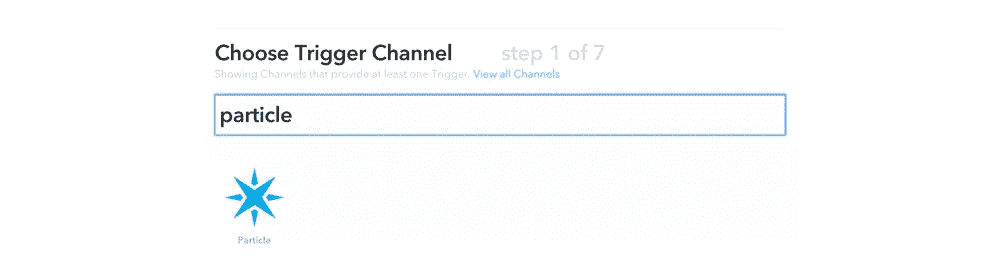

有一系列触发器可用于粒子通道。你可以让它在你在粒子上定义的事件触发时运行，或者当一个变量改变时运行。在我们的示例中，我们将选择“监控您的设备状态”,这将使我们能够访问设备何时上线或下线:

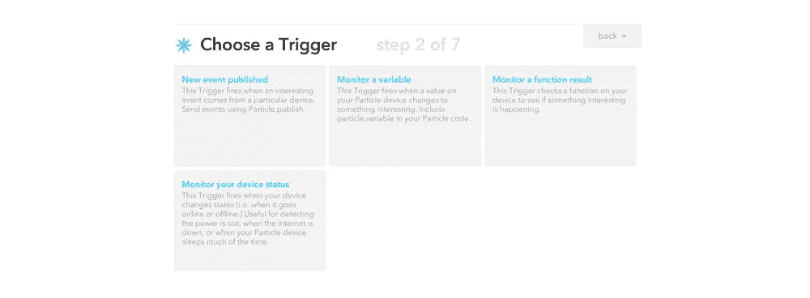

在下一个屏幕中，选择您想要监控的粒子设备。(我的名字叫做“IagoCore ”,原因我不太记得了。这是一个在当时有意义的狮子王参考。)然后选择您想要回复的状态。对于我的第一个规则，我选择了“离线”，这将告诉我粒子核心是否离线。一旦你做了所有重要的选择，点击“创建触发器”。

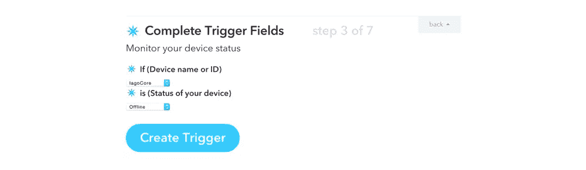

然后，我们选择“那个”来定义我们对粒子触发器的响应:

然后键入“Slack”找到松弛频道:

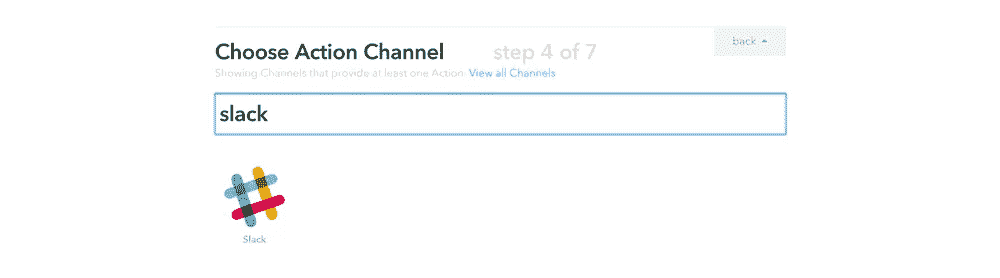

在撰写本文时，这里只有一个操作选项，所以这段应该很简单。选择“发布到频道”，因为这正是我们想要做的！

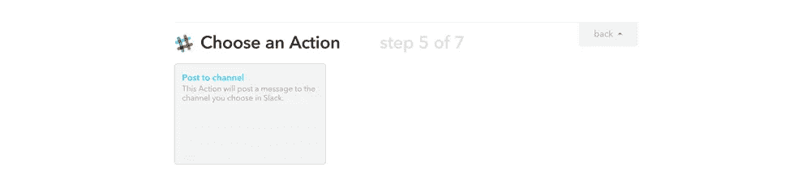

接下来，您可以选择您希望 IFTTT 发布到哪个频道。我选择了“通用”松弛通道。

事实证明，你也可以选择直接消息，所以如果我真的在 SitePoint 的 slack 频道设置了它，我就不需要让所有人都发疯了！我可以特别选择一个人！

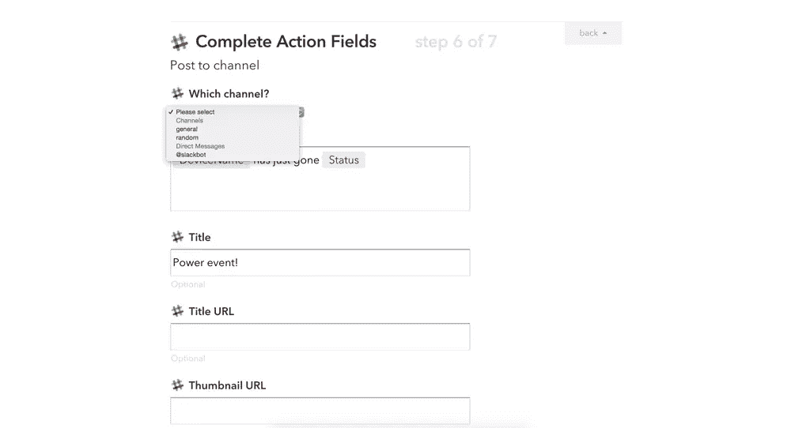

您还可以根据自己的喜好定制消息和消息标题。一旦你对它感到满意，点击“创建行动”。

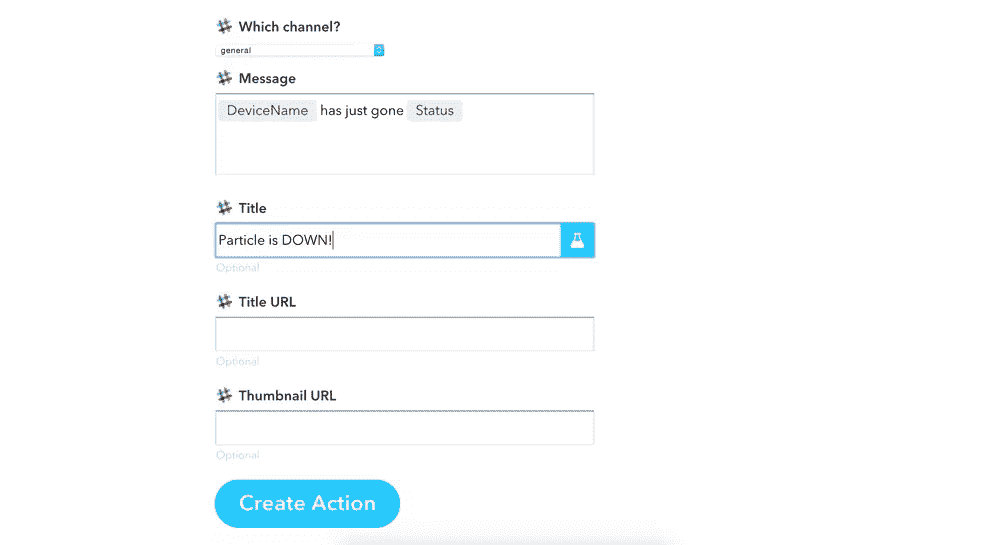

你可以自定义你制作的食谱的名称，或者点击“创建食谱”来保存它并开始运行。如果你想在你的设备停机时得到额外的提醒，你也可以勾选“当这个食谱运行时接收通知”，这样如果你安装了 IFTTT，它就会在你的手机上提醒你。

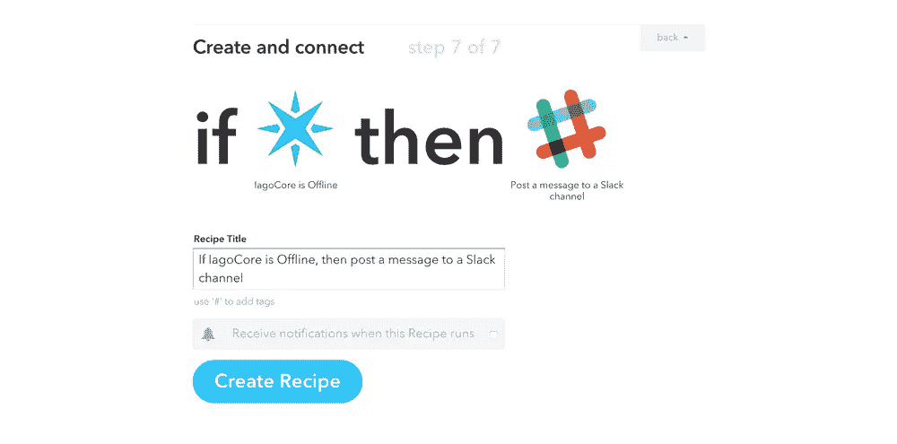

完成后，您会看到它在您的配方列表中等待粒子设备离线:

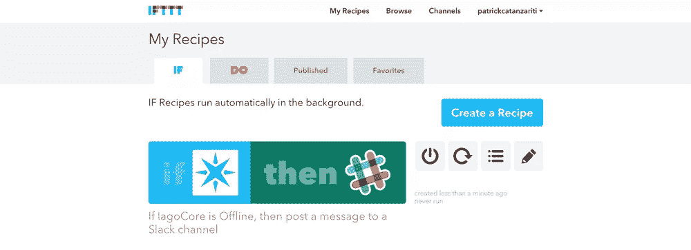

您可以重复这个过程来创建第二个配方，当它重新上线时运行。我为两个都创造了一个。这是我的粒子核心离线和在线时的样子:

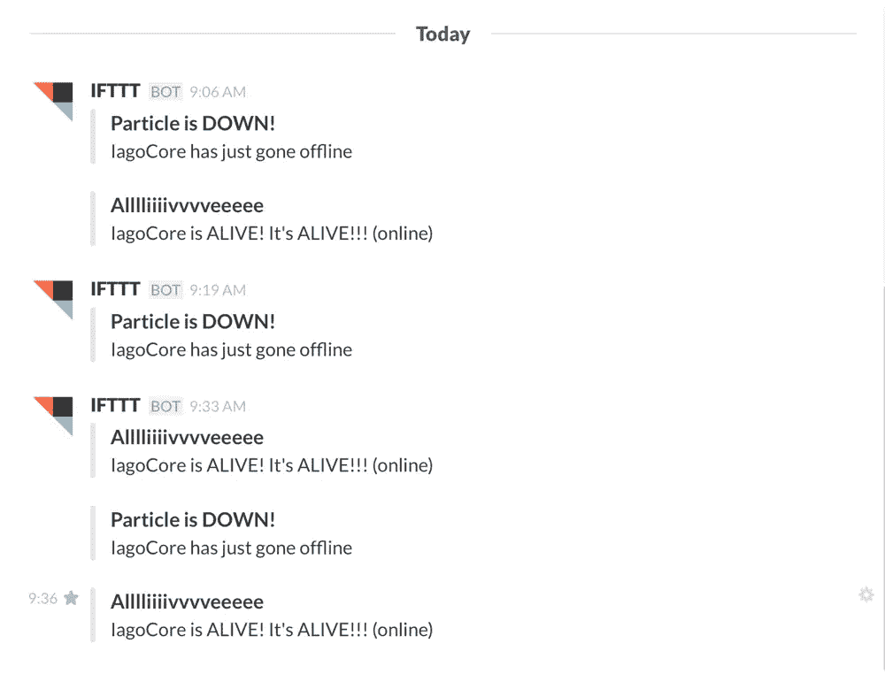

## 谷歌电子表格和粒子

您可以采取的另一个行动选项是通过 IFTTT 在 Google 电子表格中记录在线和离线活动。您可以同时运行这个和 Slack，这样您会收到警报，并有一个粒子设备在一周内上线/下线频率的良好历史记录。

回到“创建配方”页面，为你的粒子设备离线时设置另一个粒子触发器(就像我们之前做的一样)。

对于该操作，键入“Google”以找到“Google Drive”频道。选择那一个。

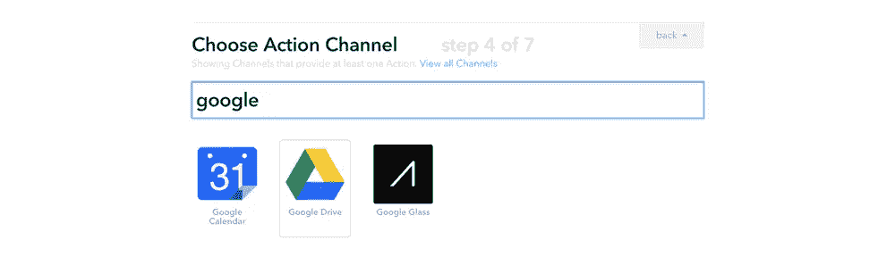

我们现在做事的顺序有点不同。很可能你还没有连接 Google Drive 频道。幸运的是，IFTTT 会提示您在继续之前连接它:

一旦你把它连接起来，你将进入“选择一个行动”屏幕。我们需要选择“向电子表格添加行”选项。

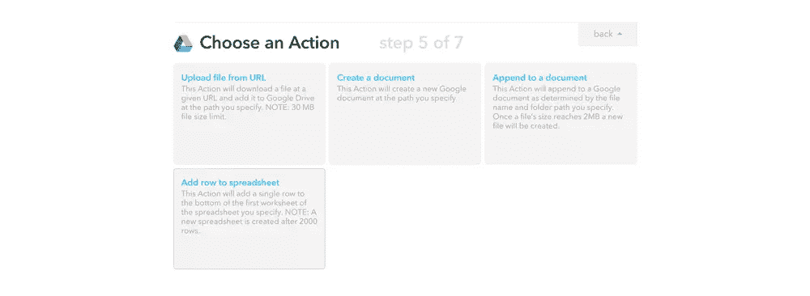

最后，我们可以设置电子表格设置。为电子表格设置一个名称——确保你想放入同一个电子表格的所有食谱的名称完全相同，否则你会有重复的食谱！如果没有找到同名的电子表格，它将创建一个新的电子表格。

如果您愿意，可以调整行内容(我保持它们不变)，列标有`|||`。您还可以设定想要将电子表格存储到哪个文件夹。当你对此感到满意时，点击“创建操作”。

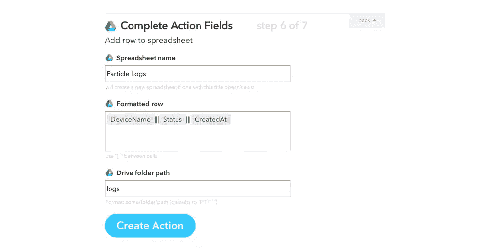

当它上线时，你也可以随意创建一个类似的食谱。然后看看你的谷歌电子表格，你应该有一个新的电子表格:

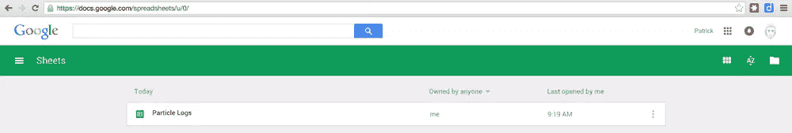

在该电子表格中，一旦您的粒子设备上线/下线几次，您应该有一组好的数据在等着您:

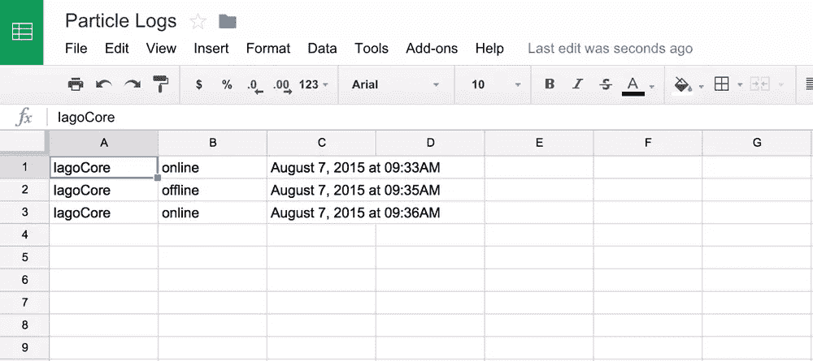

## 结论

如你所见，由于 IFTTT 的强大功能，为野外的粒子核心设置日志和警报非常简单！你有没有找到任何 IFTTT 通道来帮助你管理你的粒子设备？在评论里留言或者在 Twitter 上联系我( [@thatpatrickguy](http://www.twitter.com/thatpatrickguy) )！

## 分享这篇文章