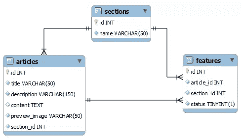

# PHPUnit 的数据库扩展提供了更多的防弹功能

> 原文：<https://www.sitepoint.com/more-bulletproofing-with-phpunit/>

在之前的一篇文章中，我讨论了如何通过自动化测试创建更健壮的查询关系数据库的代码。但是，如您所知，查询只是其中的一部分。还有其他数据库操作，即创建、更新和删除。就像检索一样，它们也应该被测试。

我将在本文中探索 PHPUnit 数据库扩展的其他特性，同时利用您在 PHP 中的数据库测试知识。具体来说，目标是:

1.  了解如何测试插入操作的结果
2.  使用 PHPUnit 的数据库断言 API 来测试操作

我写这篇文章是为了自成一体，这样你就不必事先阅读我的第一篇教程，但是如果你是测试驱动开发的新手，我强烈推荐你阅读它以及 Michelle Saver 的 PHPUnit 简介。

要阅读本文，您需要安装 PHPUnit 和 PHPUnit 数据库扩展。[配套代码](https://github.com/phpmasterdotcom/MoreBulletproofing "phpmasterdotcom/MoreBulletproofing")可以在 GitHub 上找到；随意克隆源代码并使用它。

## 安装

就像我的第一篇文章一样，我们将假设自己是一个虚构的网络杂志的后台专家。杂志由许多部分组成，每个部分都有由该部分的编辑设置的特写文章。

第一个文章应用程序缺乏将文章保存到数据库的实现，这是我们将要测试的功能。我们将假设已经有一个 web 界面，我们的编辑可以在其中编写文章，这将调用代码将文章保存到数据库。唯一缺少的是实现本身，当然还有测试。通过做这个假设，我们可以隔离出我们想要测试的行为。

第一步是使用源代码中包含的[数据库转储](https://github.com/phpmasterdotcom/MoreBulletproofing/blob/master/schema.sql)在 MySQL 中创建数据库。这是一个鸟瞰图:



由于我们正在编写数据库测试，下一步是设置数据。毕竟，我们需要一些东西来测试操作！创建一个名为`seed.xml`的 XML 文件，包含根元素`dataset`和一些示例数据。例如，以下是该文件的外观:

```
<dataset>       
 <table name="sections">
  <column>id</column>
  <column>name</column>
  <row>
   <value>1</value>
   <value>PHP</value>
  </row>
 </table>
 <table name="articles">
  <column>id</columm>
  ...
 </table>
</dataset>
```

我建议您编写自己的数据只是为了练习，尽管您可以随时使用 GitHub repo 中的样本数据集。那里所有的桌子都已经满了。

## 编写测试类

每次运行测试时，您都需要清除初始数据并将其插入到数据库中。这是通过在扩展`PHPUnit_Extensions_Database_TestCase`的类中覆盖一些方法来实现的。

```
<?php
class ArticleDaoTest extends PHPUnit_Extensions_Database_TestCase
{
    public function getConnection() {
        $pdo = new PDO("mysql:host=localhost;dbname=bulletproof",
            "root", "password");
        return $this->createDefaultDBConnection($pdo,
            "bulletproof");
    }

    public function getSetUpOperation() {
        // whether you want cascading truncates
        // set false if unsure
        $cascadeTruncates = false;

        return new PHPUnit_Extensions_Database_Operation_Composite(array(
            new PHPUnit_Extensions_Database_Operation_MySQL55Truncate($cascadeTruncates),
            PHPUnit_Extensions_Database_Operation_Factory::INSERT()
        ));
    }

    public function getDataSet() {
        return $this->createXMLDataSet("seed.xml");
    }
}
```

在上面的代码中，我们覆盖了`getConnection()`方法，告诉测试类连接到数据库，然后从我们也覆盖的`getDataSet()`方法的返回中获取测试数据。

每个测试将截断这些表，并使用`seed.xml`重新初始化数据库来重新填充它们。如果您正在使用 MySQL 5.5 或更高版本，您可能会遇到一个问题，因为对于使用外键约束的 InnoDB 表，不允许使用`TRUNCATE`命令。为了解决这个限制，我们需要覆盖它的`getSetUpOperation()`方法。

`getSetUpOperation()`中引用的`PHPUnit_Extensions_Database_Operation_MySQL55Truncate`类是`PHPUnit_Extensions_Database_Operation_Truncate`的自定义子类，它覆盖了`execute()`方法:

```
<?php
class PHPUnit_Extensions_Database_Operation_MySQL55Truncate extends PHPUnit_Extensions_Database_Operation_Truncate
{
    public function execute(PHPUnit_Extensions_Database_DB_IDatabaseConnection $connection, PHPUnit_Extensions_Database_DataSet_IDataSet $dataSet) {
        $connection->getConnection()->query("SET @PHAKE_PREV_foreign_key_checks = @@foreign_key_checks");
        $connection->getConnection()->query("SET foreign_key_checks = 0");
        parent::execute($connection, $dataSet);
        $connection->getConnection()->query("SET foreign_key_checks = @PHAKE_PREV_foreign_key_checks");
    }
}
```

看起来很可怕，`execute()`方法只是记住 MySQL 的外键设置，暂时关闭它以便`TRUNCATE`命令可以继续，然后恢复设置。

## 编写您的测试

现在是我们动手编写测试本身的时候了。假设我们同意对`IArticleDao`接口进行如下更新:

```
<?php
interface IArticleDao
{
    // here is the new method for saving
    public function save($article);

    // already implemented in the first article
    public function getArticles($sectionId);
}
```

要编写的第一个测试是保存文章的测试。它应该确保文章的数据进入`articles`表中的正确列。

```
<?php
class ArticleDaoTest extends PHPUnit_Extension_Database_TestCase
{
...
    public function testSaveArticle() {
        $article = new ArticleDAO();
        $article->save(array(
            "title" => "PHP is Great!",
            ...
            ));

        $resultingTable = $this->getConnection()
            ->createQueryTable("articles",
            "SELECT * FROM articles");

        $expectedTable = $this->createXmlDataSet(
            "expectedArticles.xml")
            ->getTable("articles");
        $this->assertTablesEqual($expectedTable,
            $resultingTable);   
    }
}
```

首先我们实例化一个`ArticleDAO`的实例，然后调用我们正在测试的新的`save()`方法，并传入表示文章的关联数组。保存文章后，我们想检查数据是否保存正确。我们查询表的内容，并将它们放在一个`QueryTable`的实例中。

对于`$resultingTable`中`save()`操作的结果，我们必须将其与预期的数据集进行比较。但是我们从哪里得到这个预期的数据集呢？来自方法`createXmlDataSet()`和 XML 文件`expectedArticles.xml`。

`getTable()`方法表明我们只想获取`articles`表的内容，因为这是我们想要与`$resultingTable`进行比较的内容。

最后一步是比较`$resultingTable`和`$expectedTable`，这是通过将两个变量输入到`assertTablesEqual()`方法来完成的。

`expectedArticles.xml`中数据集的设置与我们的`seed.xml`相同；这里有一个例子:

```
<dataset>
 <table name="articles">
  <column>id</column>
  <column>title</column>
...
  <row>
   <value>1</value>
   <value>PHP is Great!</value>
...
  </row>
 </table>
</dataset>
```

## 通过测试

在测试驱动开发中，失败是第一步。如果您现在运行测试，它将会失败，因为我们还没有编写实现。

```
jeune@Miakka:~/bulletproofing$ phpunit ArticleTest.php
PHPUnit 3.6.7 by Sebastian Bergman.

PHP Fatal error:  Class ArticleDAO contains 1 abstract method and must therefore be declared abstract or implement the remaining methods (IArticleDAO::save) in /bulletproofing/ArticleDao.php on line 12
```

下一步是编写让我们通过测试的代码(即，将文章保存到数据库)。让我们实现添加到我们的`IArticleDAO`接口的方法。

```
<php
class ArticleDAO implements IArticleDAO
{
...
    public function save($article) {
        $db = new PDO(
            "mysql:host=localhost;dbname=bulletproof", 
            "root", "password");

        $stmt = $db->prepare("INSERT INTO articles (title, description, content, preview_image, section_id) value (:title, :description, :content, :preview_image, :section_id)");
        $stmt->execute($article);                 
        return true;
    }
}
```

现在，如果我们再次运行，我们应该看到一个通过测试。

```
jeune@Miakka:~/Bulletproofing$ phpunit ArticleTest.php
PHPUnit 3.6.7 by Sebastian Bergman.

.

Time: 0 seconds, Memory: 3.00Mb

OK (1 test, 1 assertion)
```

## 摘要

在本教程中，我们看到了如何使用 PHPUnit 的数据库扩展在 PHP 中编写插入操作的数据库测试。本教程中介绍的技术也适用于删除和更新操作。

图片 via[Fotolia](http://us.fotolia.com/?utm_source=sitepoint&utm_medium=website_link&utm=campaign=sitepoint "Royalty Free Stock Photos at Fotolia.com")

## 分享这篇文章