# 更多等宽字体的好处:十种免费字体

> 原文：<https://www.sitepoint.com/more-monospaced-type-goodness-ten-free-fonts/>

去年夏天，克雷格写了一篇关于程序员最佳等宽字体的文章。等宽字体不仅仅是为开发者准备的，设计师也可以从中获得乐趣。因此，今天是字体星期五，我们有另一个精心挑选的字体供你设计。但是首先，如果你是印刷字体的新手，这里有一个简单的解释，是什么把这种字体和其他字体区分开来。

等宽或固定宽度字体是一种每个字母占据相同空间的字体。这些字体最初是为打字机设计的，外观非常独特。Courier 无疑是最著名的等宽字体之一，尤其是对网页设计师来说，因为它是网页安全字体之一。在下面的例子中，你可以看到顶行上的每个字母都是一样宽的。字母 l 与字母 o 在水平方向占据相同的空间。在 Times New Roman 中，每个字母的宽度都不同。

[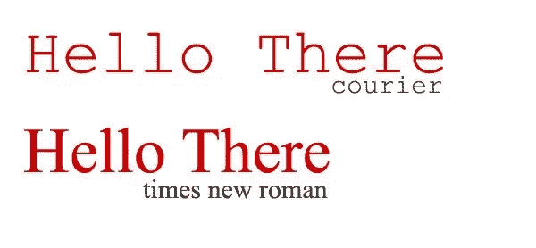](https://www.sitepoint.com/wp-content/uploads/2010/01/Monospaced.jpg)

所以让我们继续吧，这里有一堆好看的等宽字体，可以免费下载。像往常一样，检查每种字体的许可，了解如何使用该字体的完整信息。

[奇卡现代](http://www.urbanfonts.com/fonts/Chica_Mono.htm)

[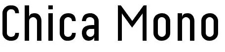](https://www.sitepoint.com/wp-content/uploads/2010/01/Chico.jpg)

[w . s . I .字体的未来固定宽度](http://www.urbanfonts.com/fonts/Futurist_Fixed-width.htm)

[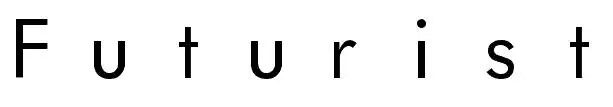](https://www.sitepoint.com/wp-content/uploads/2010/01/Futurist.jpg)

Tobias B. Koehler 的 Monofur

[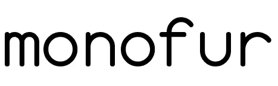](https://www.sitepoint.com/wp-content/uploads/2010/01/monofur.png)

雷·拉腊比

[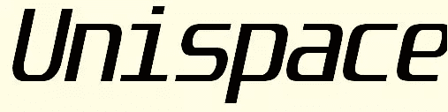](https://www.sitepoint.com/wp-content/uploads/2010/01/unispace.jpg)

[B.P. Mono](http://www.fontspace.com/backpacker/bpmono) (还有一个斜体和粗体版本)

[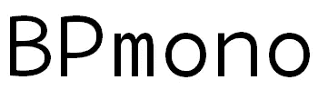](https://www.sitepoint.com/wp-content/uploads/2010/01/BPMono.png)

罗杰·怀特的《纽波特哥特式》

[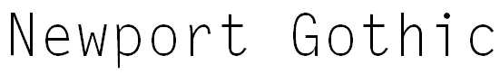](https://www.sitepoint.com/wp-content/uploads/2010/01/Newport.png)

[等宽打字机](http://www.fontsquirrel.com/fonts/MonospaceTypewriter)由曼弗雷德·克莱恩字体

[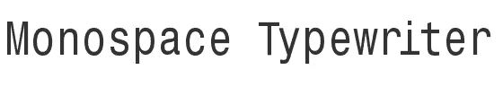](https://www.sitepoint.com/wp-content/uploads/2010/01/MonospaceType.png)

微软的 Andale Mono

[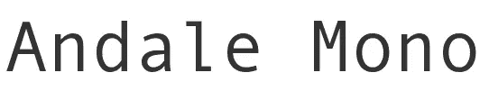](https://www.sitepoint.com/wp-content/uploads/2010/01/Andale.png)

马克·西蒙森的《无名氏》

[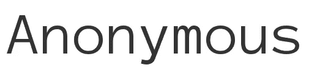](https://www.sitepoint.com/wp-content/uploads/2010/01/Anonymous.png)

写字间旁的

[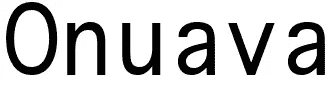](https://www.sitepoint.com/wp-content/uploads/2010/01/Onuava.png)

你还会推荐哪些等宽字体？

## 分享这篇文章