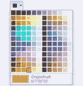
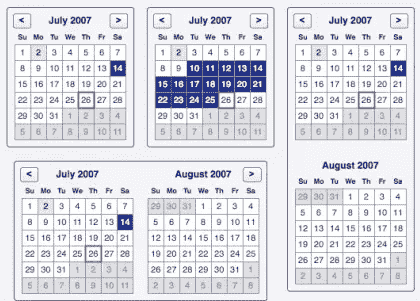
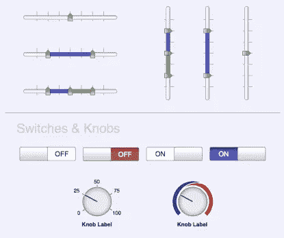
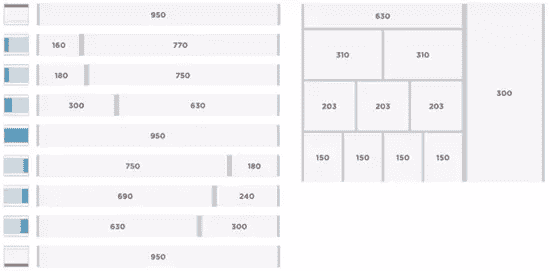
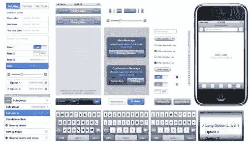
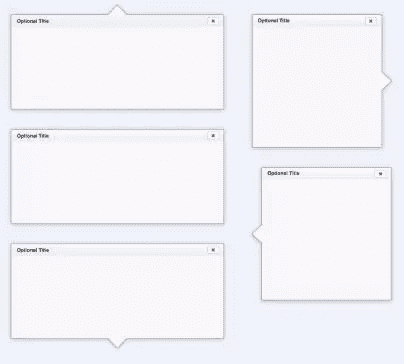

# 为设计师带来更多模板乐趣

> 原文：<https://www.sitepoint.com/more-stencil-fun-for-designers/>

本周早些时候，Alex 在 Sitepoint 博客上发表了一篇关于一个用于设计 iphone 应用程序的很酷的小模板工具包的文章。所以当我们考虑模板的时候，我想指出另一组可以免费下载的模板。去年，雅虎开发者网络为网页和应用程序设计者发布了一个非常方便的工具包，叫做[雅虎！设计模板工具包](http://developer.yahoo.com/ypatterns/wireframes/)，用好吃的东西填满巧克力块，让设计模型变得更容易。

工具箱里有什么？

 **该套件由 16 个独立的图形文件组成，您可以将它们用作自己设计的模板或指南。本作品根据知识共享署名 2.5 许可证进行许可。它们非常适合作为一个可以参考的库，而不是从头开始创建自己的图形。

 ***   广告单元:网络上使用的所有标准广告单元的完整图形模板。
*   日历
    
*   旋转木马
*   图表和表格
*   用户界面控件
    
*   表单元素
*   页面布局网格
    
*   Menus and Buttons for phone and web applications.

    

*   移动–常规
*   手机——iPhone:该图对用户界面进行了全面的分析。
    

*   导航和分页
*   OS 元素
*   占位符文本
*   屏幕分辨率
*   制表符
*   窗口和容器
    

要使用设计模板，请下载适合您正在使用的设计应用程序的模板工具包。启动程序并将模具对象添加到您的项目中。Adobe Illustrator、OmniGraffle 和 Visio 用户将能够使用矢量，因此可以取消组合模具对象以自定义和操作大小、布局和美观。的。png 文件可以在许多不同的图像编辑器中使用，而不仅仅是 Photoshop。

 **该工具包有多种格式可供免费下载；

*   Adobe Photoshop (PNG)文件
*   Adobe Illustrator (PDF 和 SVG)
*   [OmniGraffle](http://www.omnigroup.com/applications/OmniGraffle/)
*   Visio (XML)

你可以在这里下载模板工具包。

**相关阅读:**

*   [面向 iPhone 应用设计者的 UI 模板套件](https://www.sitepoint.com/ui-stencil-kit-for-iphone-app-designers)
*   [开发您的设计流程](https://www.sitepoint.com/developing-your-design-process/)
*   [16 种原型制作和线框制作工具](https://www.sitepoint.com/article/tools-prototyping-wireframing/)

你用过这个设计工具包或者类似的东西吗？对设计师有什么推荐吗？****** 

## ******分享这篇文章******