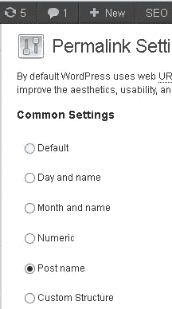
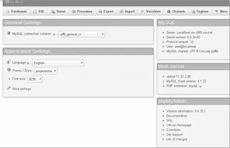

# 如何将 WordPress 迁移到一个新的服务器上(不丢失任何东西)

> 原文：<https://www.sitepoint.com/move-wordpress-new-server-without-losing-anything/>

像许多网络专业人士一样，我忙于为客户做事，可以说我自己的网站经常因为缺少时间而受到影响。一段时间以来，我一直想做的一件事是将这个 WordPress 网站转移到另一个服务器上，因为我对我目前的主机不太满意。

然而，这是我推迟做的事情之一，因为它看起来很麻烦，特别是因为我的主题是定制的，因此任何问题都需要时间来做(是的，我知道一个简单的备份会解决这个问题)。

记住所有这些，我可以想象许多人都有同样的问题，或者不知道从哪里开始，所以在这里你会找到如何进行这一点的说明，而不会丢失主题元素或以一个充满断开链接的站点结束。

## 保持相同的 URL

首先，值得注意的是，如果你没有真正优化网站，并打算保持所有的网址，域名和数据库将保持不变，那么这是一个简单的过程。

如果是这种情况，那么您只需将文件和数据库复制到新的服务器上。如果您想要更改数据库的名称或用户，您必须更改 edit.wp-config.php 文件以确保它具有正确的值。在根文件夹中找到以下内容，并进行相应的修改。

```
define('DB_NAME', 'user_wrdp1');
/** MySQL database username */
define('DB_USER', 'user_wrdp1');
/** MySQL database password */
define('DB_PASSWORD', 'password');
```

如果你改变服务器，但保留你的域名，那么你需要用你的新数据库和用户信息编辑 wp-config，然后把你所有的文件上传到新的服务器。

很明显，但值得重复的是，您应该对站点进行完整备份，备份应该包括以下内容:

*   插件
*   主题文件
*   你上传的任何东西
*   数据库

要做到这一点，您可以使用 [phpMyAdmin](http://sourceforge.net/projects/phpmyadmin/files/phpMyAdmin/4.0.8/phpMyAdmin-4.0.8-all-languages.zip/download#!md5!ffb755f553309b337ad799f316014388) ，这是一个用于管理 MySQL 数据库的开源工具，包含大量有用的工具。您可以选择以多种格式导出数据，如 CSV、SQL、XML、PDF、ISO/IEC 26300 等。或者，你可以使用一个插件，比如 [WP-DB-Backup](http://wordpress.org/plugins/wp-db-backup/) 。

## 从本地上传到远程安装

一旦你完全备份并准备好，首先你需要禁用永久链接。这可以在“**设置**菜单中的“永久链接”屏幕视图中完成。选择默认设置并点击保存。



然后，如果你还没有备份数据库，制作一个副本并重命名它。

## 在新服务器上安装 WordPress

像平常一样安装 WordPress，要么使用 FTP，要么通过 cPanel，然后使用 FTP 或 SFTP 将所有文件从本地 wp-content 文件复制到服务器上。接下来，您需要编辑数据库，以便用远程 URL 替换本地 URL。

为此，使用搜索和替换工具，最好不要使用文本编辑器，并将本地 URL 的每个实例都改为远程 URL。您可以使用 [SEARCH REPLACE DB](http://interconnectit.com/products/search-and-replace-for-wordpress-databases/) 来实现这一点，它应该安装在 WP 安装的根文件夹中以获得最佳结果。为了防止脚本被滥用，最好在做其他事情之前重命名它。

例如，如果您将其重命名为 newinstall.php，那么您将转到 http://yoursite.com/newinstall.php，并按照屏幕上的指示进行搜索和替换。完成这些操作后，为了保护数据库，还需要删除脚本，这一点很重要。

继续之前，请保存数据库。如果在你安装 WP 的时候已经创建了一个新的数据库，那么这个需要被删除。您可以通过以下方式做到这一点:

*   使用 phpMyAdmin，点击“**结构**选项卡
*   在表格列表下方，点击“**检查所有**
*   选中，从**菜单中选择**“下降****
*   当弹出消息询问是否要删除所有表时，选择“**是**
*   像上次安装时一样重新启用永久链接



你可以走了。

## 从一个主机移动到另一个主机

如果你把网站转移到一个新的主机上，这和你从本地服务器上传是完全一样的，一个关键的区别是你必须使用 FTP 从现有的主机上下载所有的文件。

## 更改 URL

如果您需要更改站点的 URL，因为它在子目录中或者是一个新的域名，您可以通过在主题的 functions.php 文件中添加一些行来实现，如下所示。

```
update_option('siteurl','http://www.new-site-address.com');update_option('home','http://www.new-site-address.com');
```

然后，加载新文件到网站上，它应该工作正常。不要试图复制所有的文件和数据库，因为这不会正常工作，你会以断开链接而告终。

一旦你加载了新的文件，测试并删除 functions.php 文件中的行，因为你的新设置将被保存在数据库中。

如果您需要设置 301 重定向，这对搜索引擎和用户都很重要，那么您需要连接到旧站点并编辑**。htaccess** 文件。找到该文件，然后将以下代码粘贴到该文件的顶部:

```
1 #Options +FollowSymLinks
2 RewriteEngine on
3 RewriteRule ^(.*)$ http://yoursite.com $1 [R=301,L]
```

一旦你完成了这些，回到新的站点并测试以确保已经成功地进行了更改。通过[网站管理员工具](http://www.google.com/webmasters/)向谷歌提交网址的变更也是一个好主意，你也需要验证它。

最后，一旦你确信一切正常，并且你已经检查和测试过了，记得告诉站点用户这个变化。你可以通过任何你认为最有效的方式来做到这一点，通过时事通讯、博客帖子或社交媒体，如果你仍然拥有旧域名，你可以设置一个临时重定向来捕捉任何最初落网的域名。

就是这样，所有你需要做的就是改变你的 WP 网站的位置，即使你使用的是一个新的 URL。

## 分享这篇文章