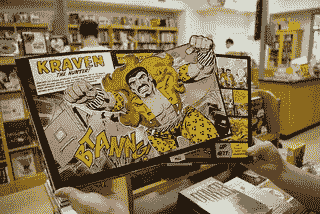
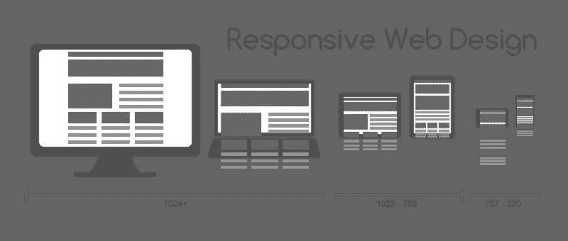
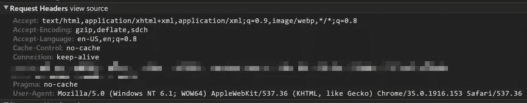
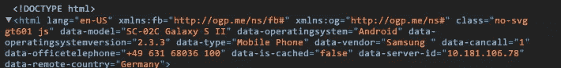
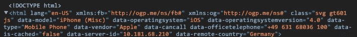

# 超越响应性网络，走向适应性网络

> 原文：<https://www.sitepoint.com/moving-beyond-responsive-web-adaptive-web/>

[](https://www.flickr.com/photos/atomicbartbeans/2753225952/)

照片:大猩猩的希望

让我们从响应式网页设计开始吧。

今天，没有一个网页开发者会对响应式网页设计(RWD)这个概念感到陌生。自从 Ethan Marcotte 在 2010 年 5 月创造了术语[以来，这个概念已经被接受为最佳实践，流程已经成熟，并且出现了多种选择和实现。](http://alistapart.com/article/responsive-web-design/ "Link to article: Responsive Web Design")

这有助于我们为用户现有的设备改造网络，并使其无论未来出现什么样的新设备都能正常工作。

然而，尽管 RWD 取得了巨大的成功，但它也不是没有缺点。

响应图像被证明是需要克服的更复杂的挑战之一，尽管我们最终通过 srcset 和图片元素的[原生浏览器实现来解决这一挑战。](http://css-tricks.com/srcset-chrome/)

`video`和`audio`标签通过提供多个源元素并让浏览器选择它最喜欢的一个来解决它们特定于媒体的问题。然而，这样做的代价是大量额外的加价——即使我们知道在给定的设备上只会使用一个源元素。



这两个问题都是一个更大挑战的一部分——内容和环境的挑战。移动环境是一个潜在限制的世界——包括带宽、屏幕尺寸和 CPU 能力。不管你的用户使用的是什么设备，作为开发人员，我们应该尽力只向他们发送他们实际使用的资产*。*

 *显然，对于上面列出的每一个例子，我们都发送了他们可能需要的所有东西，然后让浏览器进行分类。

除了这些大问题，我们还有更小的问题，比如设备功能，在整个页面下载完成后，我们通常使用 JavaScript 在前端解决这些问题。但是这给 JavaScript 带来了更多的负担，堆积了更多的代码供用户下载，并且当解决方案应用于页面时，经常会导致至少一些令人不安的重绘。

### 什么是适应性网页设计？

这一切将我们引向我所认为的网页开发的下一个增长阶段:适应性网页设计(AWD)。

这个概念有时被称为 [RESS](http://www.lukew.com/ff/entry.asp?1392 "Article describing RESS by LukeW") ，但是不管标签如何，它涉及到在服务器上做出决定，决定什么应该和不应该被发送给用户，因此没有什么是不会被使用的。

AWD 的一些好处是:

*   **Reduced bandwidth** – Because you can send something like this for each video on your site:

```
<video src="…"></video>
```

..而不是像这样:

```
<video>
 <source src="...mp4" type="video/mp4">
 <source src="...webm" type="video/webm">
 <object type="application/x-shockwave-flash" data="...swf">
 <param name="allowfullscreen" value="true">
 <param name="allowscriptaccess" value="always">
 <param name="flashvars" value="file=...mp4">
 <!--[if IE]><param name="movie" value="...swf"><![endif]-->
 <p>Your browser can't play HTML5 video. <a href="...webm"> Download it</a> instead.</p>
 </object>
</video>
```

*   **环境感知模块**–因此您可以将“呼叫我们”模块仅发送给支持呼叫的设备，将“相机”模块仅发送给带相机的设备，等等。
*   **用于渲染的服务器速度**–服务器通常比任何前端设备都要快得多，因此为什么不让服务器来完成繁重的工作，而只是将准备好渲染的内容交付给设备。
*   **在服务器**上缓存模块——一旦在服务器上完成这项艰苦的工作，就在那里缓存它，这样就不需要在每次页面加载时重新处理它了。
*   **更快的页面加载**–通过在服务器上构建和缓存这些模块，并与页面的其余部分一起交付，您可以避免延迟和额外的 HTTP 请求，如果 JavaScript 必须确定需要什么，然后通过 Ajax 请求它，这将是必需的。
*   **选择编程语言**——如果是在浏览器里，那就是 JavaScript。然而，您的服务器可以使用任何东西，只要它输出浏览器可以呈现的东西。

当然，设备检测的概念并不新鲜。这种情况在移动时代的早期就已经发生了(通常是将用户重定向到一个完全不同的站点和/或 URL)，甚至可以追溯到糟糕的旧时代，那时 JavaScript 被用于[浏览器嗅探](http://en.wikipedia.org/wiki/Browser_sniffing)用户代理字符串，以决定我们的意大利面条式代码如何运行。

我们后来了解到[特征检测](http://en.wikipedia.org/wiki/Feature_detection_(computer_vision))是一种更可靠和可扩展的方法，但这需要访问浏览器，这意味着它必须发生在前端。

那么，服务器如何识别哪个设备发出请求呢？

具有讽刺意味的是，我们又回到了用户代理嗅探——但这次是从服务器开始——并查看初始请求头中的用户代理字符串。

在 Chrome 的 DevTools 中会是这样的:



AWD 服务器代码将查看该信息，将其与数据库中的值进行比较，并返回关于该设备的信息。

很简单，对吧？

除了“数据库中的值”这一小段…

请注意，用户代理字符串中没有任何内容明确表示“桌面”或任何其他非常明显的内容。

这意味着需要人工操作，以收集和分类用户代理字符串及其相关设备类别的形式。这就是为什么任何遵循这条道路的人都很可能希望使用某种形式的服务来为他们完成所有的收集和关联工作(稍后将详细介绍)。

这似乎是提及 AWD 一些弱点的好时机:

*   **检测库维护**–当设备检测库更新时，它就过时了，因为新设备、新浏览器和新浏览器版本每天都在推出，似乎每纳秒都在推出…
*   **服务器检测期间可能出现的延迟**–根据您的设备检测库的工作方式，当服务器确定您的设备并开始呈现您的页面时，可能会导致轻微延迟。
*   **【不同设备上的不同站点】**–一些用户在一台设备上查看某个站点模块或内容时，可能会感到不安，但在另一台设备上却找不到该组件(尽管这可以通过始终提供指向您的站点的任何不同版本的链接来避免)。

所以 AWD 并不是所有网站都需要的。如果你的网站不需要为不同的上下文提供不同的内容，或者不使用大量的图片、音频或视频，你可能只需要 RWD 就可以了。

那就太好了！

任何设计和构造良好的流畅网站都应该在任何屏幕尺寸下都能正常工作，只要你没有用多余的代码堵塞管道来使事情正常工作，那么你的用户应该会喜欢你，并且希望会喜欢浏览你的网站。

还在吗？

如果你还在读这篇文章，那么你可能仍然感兴趣。很好。那我们就言归正传吧！

在这里，完全披露是恰当的，因为我为 Netbiscuits 工作，他们确实提供设备检测服务。然而，有几个选择，他们都不同，在他们提供什么和他们的成本，所以这是由你做一点功课，决定哪个服务或产品最能满足你的需求和你的预算。

无论您选择哪种解决方案，您的服务器模板最终都会是这样的:

```
if (device.type === 'mobile phone') {
// insert a module that will only go to mobile phones

} else if (device.type === 'tablet') {
// insert a module that will only go to tablets

} else {
// insert a module that will go to all other devices
}
```

或者:

```
if (device.video.format === 'mp4') {
// this device supports "mp4" so only send a <video> tag for that codec
echo '</video><video src="...mp4" type="video/mp4"></video>';

} else if (device.video.format === 'webm') {
// this device does not support "mp4", but does support "webm", so only send a <video> tag for that codec
echo '</video><video src="...webm" type="video/webm"></video>';

} else if (device.video.format === 'swf') {
// this device does not support either of the above, but does support "swf", so only send that code
echo '<object type="application/x-shockwave-flash" data="...swf">';
echo ' <param name="allowfullscreen" value="true"/>';
echo ' <param name="allowscriptaccess" value="always"/>';
echo ' <param name="flashvars" value="file=...mp4"/>';
echo ' <!--[if IE]><param name="movie" value="...swf"/>< ![endif]--> ';
echo '</object>';

} else {
// this device is pretty weak, so send the user a link and let them fend for themselves…
echo '<p>Your browser can't video. <a href="...webm">Download it</a> instead.</p>';

}
```

您为用户获得的能力和节省的成本完全取决于您选择使用的服务以及您利用它的程度。

例如，在 Netbiscuits 网站上，我们使用我们的设备检测服务来选择我们发送给用户的 CSS 文件，这决定了图标是作为 SVG 数据-URIs、PNG 数据-URIs、PNG URL 还是通过 IE 专用过滤器提供的 PNG URL，以实现透明性。

我们还可以访问设备操作系统、操作系统版本、浏览器名称和浏览器版本，所有这些都作为数据属性植入到 html 标签中，因此我们可以为那些讨厌的、不想表现的设备添加特定于设备的 CSS。

### 这里有两个例子:





由于这些值是在服务器上植入的，所以在任何东西被传送到设备之前，当 JavaScript 在前端确定正确的值时，不需要任何不和谐的视觉体验或重画。

所以，无论你现在是否需要一个适应性的网页设计解决方案，或者你可以用一个响应式的网页设计网站来凑合，希望你对 AWD 有更好的了解，对你和你的用户有更好的了解。

在我未来的博客中，我会更详细地探讨这两个概念，如果能听到你想让我回答的任何问题或想法，那就太好了。* 

## *分享这篇文章*