# 通过地理定位实现模块化承诺

> 原文：<https://www.sitepoint.com/moving-modularized-promises-via-geolocation/>

本文是微软网站开发系列的一部分。感谢您对使 SitePoint 成为可能的合作伙伴的支持。

## 从回电和信息传递过渡到承诺

前阵子儿子想在路边卖柠檬水。你知道故事是怎么发展的:我们去了商店，买了生活用品，做了柠檬水。然后他和他的小妹妹坐在路边。这是相当不错的第一天，因为他们在柠檬水销售中赚了大约 90 美元！唯一的缺点是……他一整天都在里面确保他的账目是正确的。“爸，我充够了吗？”“爸爸，这看起来是正确的数量吗？”“爸爸，你能去商店给我多买些柠檬水和杯子吗？”一天结束时，我们三个人讨论了如何构建一个应用程序来帮助他们跟踪自己的财务状况。他们认为，如果其他朋友也可以使用这个应用程序，并跟踪他们在哪里摆放柠檬水，以及他们的销售数量，那就太好了。

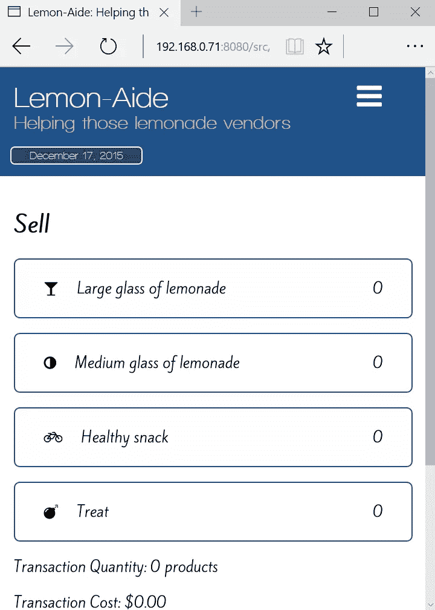

## 问题是

仔细思考这个应用程序，我想到了一些事情。首先，在浏览器中，我们需要与地理定位 API 进行交互，以找到设备的纬度和经度。这种浏览器交互本质上是异步的。其次，这个定位一个人的功能应该是可重用的，这样它就可以在其他项目中使用。第三，我们需要为主要的 JavaScript 代码指定一个架构(例如回调、消息或承诺),以便与模块化的地理定位模块进行交互。

我今天要展示的所有例子都是用 Visual Studio 代码编写的，这是一个适用于 Mac、Linux 或 Windows 的轻量级代码编辑器。

## 我在哪里:地理定位

所有的[现代浏览器](https://dev.windows.com/en-us/microsoft-edge/platform/status/?utm_source=SitePoint&utm_medium=article81&utm_campaign=SitePoint?filter=f3f0000bf&search=geolocation)都支持[地理定位 API](https://www.w3.org/TR/geolocation-API/) 和[获取](https://docs.webplatform.org/wiki/apis/geolocation/Geolocation/getCurrentPosition)设备位置。地理定位 API 是基于回调的，这意味着作为开发人员，我们需要将函数传递给 API，这些函数将在 API 完成处理后被调用。地理定位是异步的，这意味着它可能需要 100 毫秒或 100 秒…没有办法知道这将需要多长时间。我们所知道的是，当浏览器处理完地理定位请求后，作为回调函数传入的函数将被执行。

*地理定位的开端… [地理定位演示](https://github.com/DevelopIntelligenceBoulder/promise/blob/master/demos/geolocation.js)*

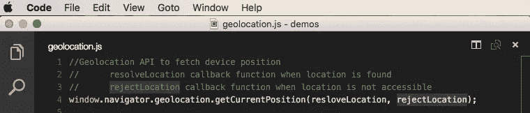

地理定位是通过`window.navigator`对象访问的。`geolocation.getCurrentPosition`方法有 3 个参数。为简单起见，我们将只使用前两个参数；找到设备位置时要调用的函数(即`resolveLocation`)和无法访问设备位置时要调用的函数(即`rejectLocation`)。

*一次成功的互动……[地理定位演示](https://github.com/DevelopIntelligenceBoulder/promise/blob/master/demos/geolocation.js)*

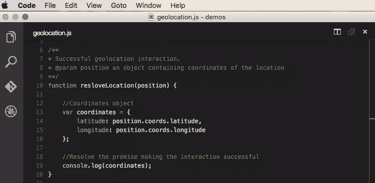

注意@ line 10 的`resolveLocation`回调函数被浏览器赋予了一个位置对象。这个位置对象包含所需的纬度和经度属性。它们是从`position.coords`对象中访问的。

*Aw，拒绝… [地理定位演示](https://github.com/DevelopIntelligenceBoulder/promise/blob/master/demos/geolocation.js)*

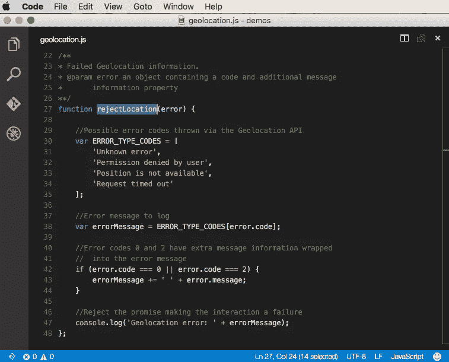

从浏览器给了回调@ line 27 一个错误对象。这个`error`对象包含错误代码和错误消息。错误代码是数字，范围从 0 到 3。在第 30 行的`ERROR_TYPE_CODES`推断常量数组中定义了 4 个不同的错误代码。应该注意的是，类型代码为 0 或 2 的错误具有额外的信息，因此`error.code`和`error.message`的`errorMessage`字符串串联。

## 重用:揭示模块模式

在以后的文章中，我们将深入讨论模块。在这次对话中，我们将简单地使用[揭示模块模式](https://www.christianheilmann.com/2007/08/22/again-with-the-module-pattern-reveal-something-to-the-world/?WT.mc_id=16545-DEV-sitepoint-article81)。它将允许我们将地理定位交互封装在一个模块中，该模块可用于任何项目，包括您当前正在进行的任何项目。

*模块进行封装&复用……[展示模块模式演示](https://github.com/DevelopIntelligenceBoulder/promise/blob/master/demos/revealing-module-pattern.js)*

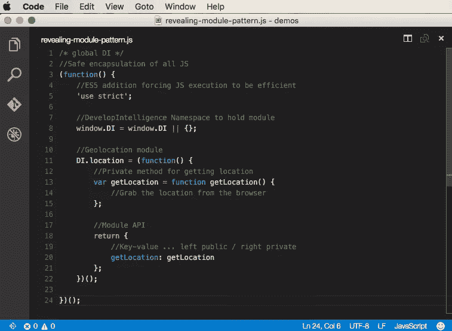

让我们从里到外解开这段代码。private/inner `getLocationfunction` @ line 12 将是用浏览器执行地理位置查找的函数。这个私有函数是通过模块 API(即`return block` @ line 17)公开的。返回块只是一个 JavaScript 对象，用于指定公共方法和它们隐藏的私有方法之间的关系。

注意，内部的`getLocation`和返回块被包装在一个立即调用的函数表达式中(即 IIFE)。最重要的是，IIFE 有一个被解析后浏览器调用的函数。这个调用通过第 21 行的`()`发生。其次，由于模块 API 从 IIFE 返回，形成了闭包。这种闭包允许模块的状态(即函数的执行上下文)在整个应用程序中保持有效！这个想法看起来很单一，因为这个模块只创建一次；然而，这不是单一模式。揭示模块在被解析后立即被实例化，而单件直到第一次使用才被实例化(例如，它们的`getInstance`被调用)。

揭示模块模式的核心允许封装私有变量，这些变量只能通过公共定义的 getters 和 setters 来访问和更改。在该位置模块中，内部/私有`getLocation`函数不可直接访问。只有通过对公共`DI.location.getLocation`方法的调用，才能提供调用匿名函数范围内的内部/私有`getLocation`函数的能力。

最后，我们在第 7 行创建了一个名称空间。在 [DevelopIntelligence](http://www.developintelligence.com/?WT.mc_id=16545-DEV-sitepoint-article81) 中，我们使用`DI`作为命名空间对象。这允许所有 DevelopIntelligence 代码只存储在一个附加到全局 JavaScript window 对象的对象上，最大限度地减少了全局对象的污染。

*与外部模块交互… [主调用代码](https://github.com/DevelopIntelligenceBoulder/promise/blob/master/demos/main.js)*

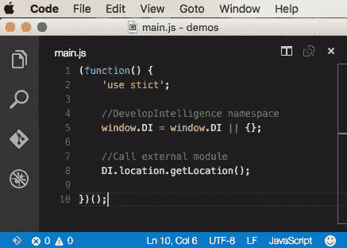

`main.js` JavaScript 文件通过 DI 名称空间调用位置模块的公共`getLocation`方法，DI 名称空间又执行私有的`getLocation`方法功能。

## 模块化地理定位

到目前为止，我们已经了解了如何在浏览器中利用地理定位。我们还看到了如何通过揭示模块模式来编写模块。让我们把这些放在一起，这样我们就有了一个实际的模块化地理定位交互。

*模块化地理定位… [定位模块演示](https://github.com/DevelopIntelligenceBoulder/promise/blob/master/demos/location-module.js)*

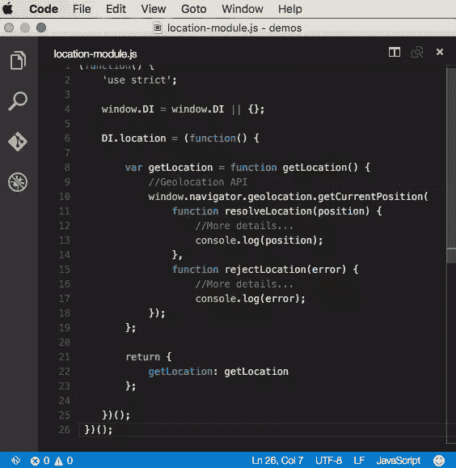

在上面的代码中，对地理位置 API 的调用被插入到私有/内部`getLocation` 函数@ line 9 中。以这种方式构建模块抽象出了处理地理定位的实现细节。它还允许在任何项目中使用`location-module.js`文件，而不必复制那些`resolveLocation`和`rejectLocation`函数的实现细节。

## 交流:讲模块，讲！

这个设置有一个明显的问题！在模块交互方面，我们还没有处理地理定位的异步特性。当 main.js 文件调用地理定位模块时，我们还没有定义一种方法来将经度和纬度属性传递出模块并返回到主调用代码中。在这一点上，我们只能告诉位置模块去做工作，但是无法知道它何时完成与数据的交互。让我们看看在架构上处理这个问题的几种不同方式:首先是回调，然后是消息传递，最后是承诺。

### 回收

回调在主调用代码和地理定位模块之间提供有保证的调用和响应。然而，这种有保证的交互是以紧密耦合为代价的。

当我们利用地理定位 API 时，我们已经在野外看到了回调架构。记住，当我们调用`window.navigator.geolocation.getCurrentPosition`函数时，我们必须传入当 API 处理完它的异步代码时将被调用的函数。这是紧密耦合的，因为调用代码需要知道如何处理传递回成功回调的位置对象的实现细节，以及如何处理传递回失败回调的错误代码和消息的实现细节。

*基于回调的地理定位方法……[回调调用代码示例](https://github.com/DevelopIntelligenceBoulder/promise/blob/master/callback/src/index.js)*

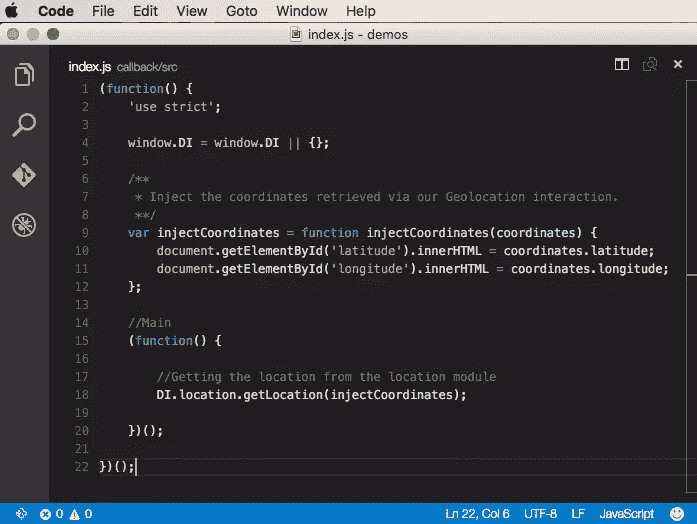

在@ line 18 上面的代码中，我们的主要 JavaScript 功能将一个回调函数引用传递给模块。当模块的异步代码完成时，模块将执行这个回调。基于回调的架构的美妙之处在于，它保证了传入的回调函数引用将在模块认为必要时被执行。

*基于回调的地理定位方法续……[回调模块代码示例](https://github.com/DevelopIntelligenceBoulder/promise/blob/master/callback/src/location.js)*

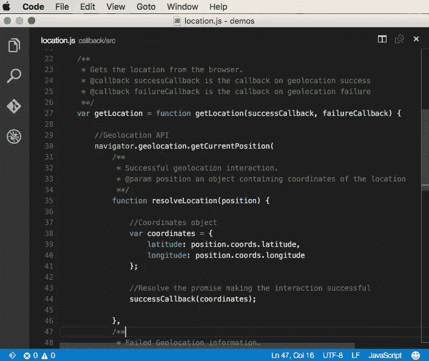

定位模块不再简单地通过控制台打印位置坐标。相反，在第 44 行，模块执行传递给`getLocation`函数签名的`successCallback`回调函数引用。记住，实际要调用的函数是位于 index.js JavaScript 文件中的`injectCoordinates`。当执行`injectCoordinates`函数时，经度和纬度将被注入 HTML。

回调提供了主 JavaScript 和被调用模块之间有保证的通信架构。然而，这种架构在可读性、可理解性和耦合性方面是有代价的，因为主 JavaScript 将应用程序控制权交给模块，以便在将来的某个时间点运行回调。

### 信息发送

消息传递为我们提供了一个松散耦合的架构，允许所有的实现细节隐藏在模块中。然而，这种松散耦合的体系结构的代价是不能保证模块对主调用代码的响应。

在消息传递架构中，主调用代码只需要知道如何向模块请求数据，以及如何侦听响应。异步代码在模块中运行后，包含数据的事件被触发，允许所有监听代码有机会与数据交互。

*基于消息的地理定位方法……[消息呼叫代码示例](https://github.com/DevelopIntelligenceBoulder/promise/blob/master/messaging/src/index.js)*

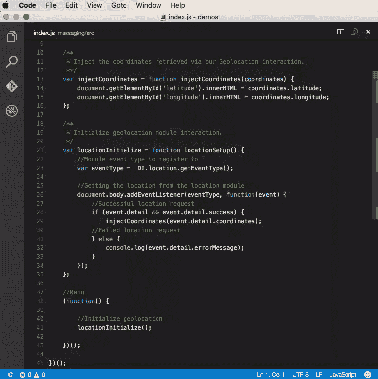

[自定义 JavaScript](https://developer.mozilla.org/en-US/docs/Web/API/CustomEvent) 事件用于创建消息传递架构。为了促进松散耦合，定位模块将公开该模块创建的自定义事件的类型。@ line 23 主调用代码存储自定义事件类型，然后@ line 26 为该特定事件类型注册一个事件侦听器。

当定位模块完成它的异步代码时，它将触发自定义事件，并且注册的事件侦听器的回调函数将被调用。在成功的交互@ line 28-29 中，将调用`injectCoordinatesfunction`并将经度和纬度插入 HTML。

*基于消息的地理定位方法……[消息模块代码示例](https://github.com/DevelopIntelligenceBoulder/promise/blob/master/messaging/src/location.js)*

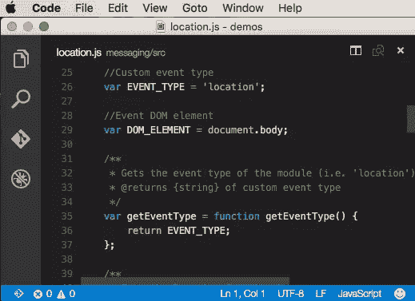

如上所述，基于消息的位置模块将通过`getEventType`函数公开自定义事件类型，并通过`getLocation`函数公开位置。这允许位置模块更改事件类型，而不必更改主 JavaScript 文件中的任何代码。换句话说，调用这个模块的代码不需要知道它是一个`location`类型的自定义事件。

*基于消息的地理定位方法续……[消息模块代码示例](https://github.com/DevelopIntelligenceBoulder/promise/blob/master/messaging/src/location.js)*

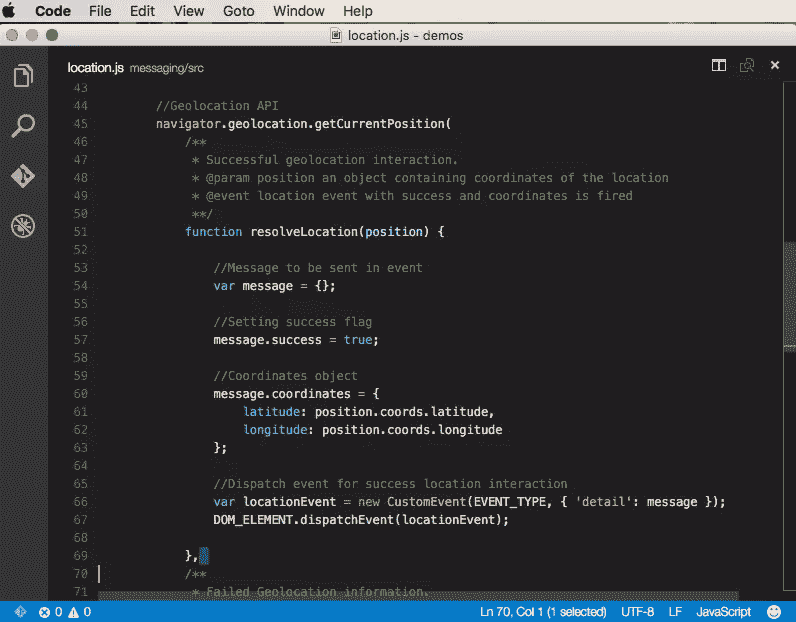

位置模块将创建一个新的自定义事件，传递从地理位置交互中检索到的数据。它利用 [CustomEvent](https://developer.mozilla.org/en-US/docs/Web/Guide/Events/Creating_and_triggering_events) 构造函数，将事件类型(即`location`)和`messageobject`设置为`detailproperty` @ line 66。`resolveLocation`成功的回调创建一个包含`coordinates.latitude`和`coordinates.longitude`属性的消息对象，以及一个设置为`true`的布尔`success`属性。

创建自定义事件后，模块触发/调度该事件。@ line 67 通过`document.body`元素调用`dispatchEvent`方法来触发创建的自定义事件。一旦事件被触发，浏览器就会运行之前在主 JavaScript 文件中注册的事件处理程序回调函数，该函数又会将纬度和经度插入到 HTML 中。

### 承诺

承诺为我们提供了回调和消息传递架构的好处。它们提供了有保证的数据传递，同时不强迫了解实现细节。在模块异步代码运行后，数据通过预定义的 API 传递回调用代码。

基于承诺的模块不同于基于回调的模块，因为它从不控制应用程序。调用代码要求 promise 模块做一些事情，当完成后，它将收集的数据返回给调用代码。promise 模块不负责在调用代码中调用方法。这意味着它永远不需要保留对主调用代码中定义的特定函数的引用，从而允许比基于回调的体系结构更松散耦合的体系结构。

基于承诺的模块不同于基于消息的模块，因为承诺架构保证对调用对象的响应。调用代码要求 promise 模块做一些事情，并且立即将交易收据(即 promise 对象)传递回调用代码。在交易收据上，调用代码设置一个回调函数，该函数将在 promise 模块完成时运行。这意味着不能猜测或希望调用代码已经向正确的 DOM 元素注册了正确的事件侦听器类型，从而保证调用代码在准备就绪时将获得所需的数据。此外，promise 架构提供了一个预定义的、一致的 API，消除了处理从模块数据返回异步数据的猜测。

*基于承诺的地理定位方法……[承诺调用代码示例](https://github.com/DevelopIntelligenceBoulder/promise/blob/master/promise-es6/src/index.js)*

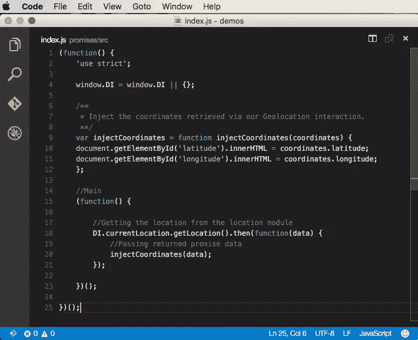

有许多不同的框架利用了基于承诺的架构。jQuery 利用了一个[延迟对象](https://api.jquery.com/category/deferred-object/)，Kris Kowal 创建了一个 [q 库](https://github.com/kriskowal/q)，Angular 在 [$q 服务](https://docs.angularjs.org/api/ng/service/%24q)中利用了该库的一种形式，现在 [ES6/ES2015 中加入了承诺](https://msdn.microsoft.com/en-us/library/dn802826(v=vs.94).aspx?WT.mc_id=16545-DEV-sitepoint-article81)。

以上是我们与 ES6/ES2015 承诺的互动。看到其他人在行动中点击我们的[发展智能 GitHub 回购承诺](https://github.com/DevelopIntelligenceBoulder/promise)。注意在调用代码的第 18 行，调用了`DI.currentLocation`模块。如前所述，交易收据会立即返回(即承诺对象)。这个 promise 对象公开了标准的 API 方法，供调用代码与之交互。

promise API 中最常用的方法是[。然后](https://msdn.microsoft.com/en-us/library/dn802833(v=vs.94).aspx?WT.mc_id=16545-DEV-sitepoint-article81)法。所有 promise 框架实现都支持它。在。然后，我们指定当`DI.currentLocation`模块处理完它的异步代码时将要运行的函数。在这种情况下，当浏览器解析纬度和经度时，`DI.currentLocation`模块通过。然后方法。作为旁注，与。那么方法可以被称为“解开承诺”

*基于承诺的地理定位方法……[承诺模块代码示例](https://github.com/DevelopIntelligenceBoulder/promise/blob/master/promise-es6/src/location.js)*

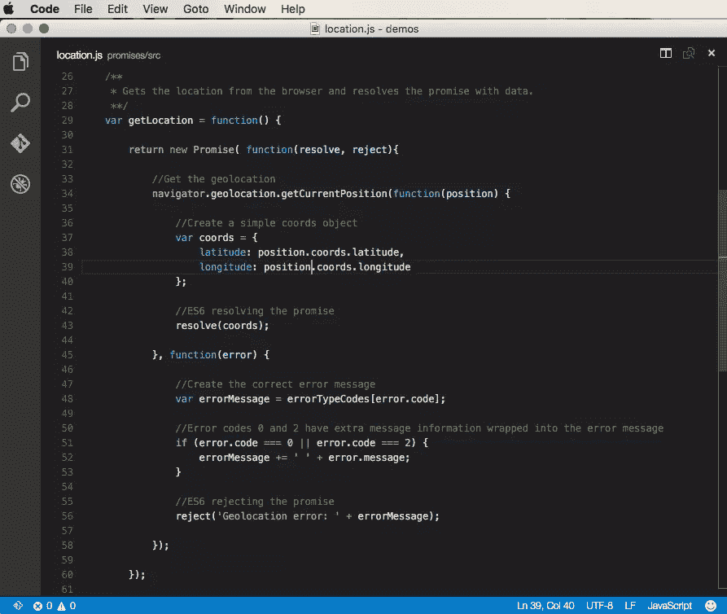

是时候让我们看看如何创造承诺，而不是回电或信息了。随着新的 [ES6 / ES2015 Promise 对象](https://msdn.microsoft.com/en-us/library/dn802826(v=vs.94).aspx?WT.mc_id=16545-DEV-sitepoint-article81)的加入，我们通过 new 操作符从`Promise`构造函数创建了一个 Promise 对象实例，如第 31 行所示。在 Promise 构造函数中，我们定义了一个接收`resolve`和`reject`回调方法的匿名函数。

回想一下上面的回调架构示例。在 promise 模块(即地理定位模块)中有类似的回调方法，它们被定义为`successCallback`和`failureCallback`。当异步数据可用于交互时，将调用`resolve`和`reject`回调。换句话说，当浏览器获取当前位置时，`resolve`方法被调用，坐标数据将被发送出模块。此时，调用脚本中定义的`.then`方法将被触发，位置数据将被处理并放置在浏览器上。

*见承诺在行动@[http://promise-blog.azurewebsites.net/promise-es6/](http://promise-blog.azurewebsites.net/promise-es6/)*

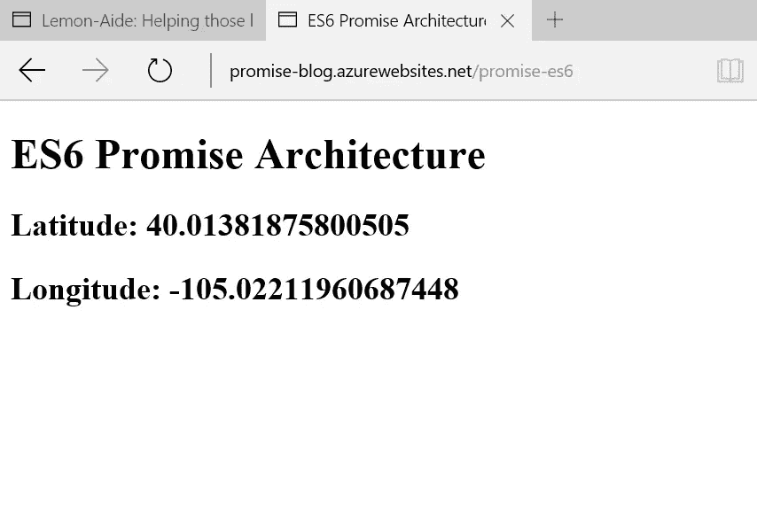

### 外卖

与异步数据交互会给应用程序带来复杂性。当与设备的地理位置进行交互时，作为开发人员，我们受到何时将数据提供给我们的应用程序进行处理的支配。承诺为我们提供了一个方便的、预定义的 API 来管理异步复杂性。它们为开发人员提供了一种方式，使消息传递体系结构松散耦合，并保证回调体系结构。

### 更多的 Web 开发实践

这篇文章是微软和 [DevelopIntelligence](http://www.developintelligence.com/) 关于实用 JavaScript 学习、开源项目和互操作性最佳实践的 web 开发系列的一部分，包括[微软 Edge](http://blogs.windows.com/msedgedev/2015/05/06/a-break-from-the-past-part-2-saying-goodbye-to-activex-vbscript-attachevent/?WT.mc_id=16545-DEV-sitepoint-article81) 浏览器和新的 [EdgeHTML 渲染引擎](http://blogs.windows.com/msedgedev/2015/02/26/a-break-from-the-past-the-birth-of-microsofts-new-web-rendering-engine/?WT.mc_id=16545-DEV-sitepoint-article81)。 [DevelopIntelligence](http://www.developintelligence.com/) 为技术团队和组织提供讲师指导的 [JavaScript 培训](http://www.developintelligence.com/catalog/javascript-training)、 [AngularJS 培训](http://www.developintelligence.com/catalog/web-development-training/angularjs)和其他 [Web 开发培训](http://www.developintelligence.com/catalog/web-development-training)。

我们鼓励您在 dev.microsoftedge.com 使用免费工具进行跨浏览器和设备测试，包括 Windows 10 的默认浏览器 Microsoft Edge:

*   [扫描你的网站，寻找过时的库、布局问题和可访问性](http://dev.modern.ie/tools/staticscan/?utm_source=SitePoint&utm_medium=article81&utm_campaign=SitePoint)
*   [下载适用于 Mac、Linux 和 Windows 的免费虚拟机](http://dev.modern.ie/tools/vms/windows/?utm_source=SitePoint&utm_medium=article81&utm_campaign=SitePoint)
*   [跨浏览器检查网络平台状态，包括微软 Edge 路线图](https://dev.modern.ie/platform/status/?utm_source=SitePoint&utm_medium=article81&utm_campaign=SitePoint)
*   [在您自己的设备上远程测试 Microsoft Edge](https://remote.modern.ie/?utm_source=SitePoint&utm_medium=article81&utm_campaign=SitePoint)

**向我们的工程师和传道者进行更深入的学习:**

*   **互操作性最佳实践** ( [系列](https://channel9.msdn.com/Blogs/BeLux-Developer/Riding-the-Modern-Web-5-things-to-consider-as-a-web-developer?WT.mc_id=16545-DEV-sitepoint-article81)):
    *   [如何避免浏览器检测](https://channel9.msdn.com/Blogs/BeLux-Developer/Riding-the-Modern-Web-Avoiding-Browser-Detection?WT.mc_id=16545-DEV-sitepoint-article81)
    *   [使用 CSS 前缀的最佳实践](https://channel9.msdn.com/Blogs/BeLux-Developer/Riding-the-Modern-Web-CSS-Vendor-Prefixes?WT.mc_id=16545-DEV-sitepoint-article81)
    *   [保持你的 JS 框架&库更新](https://channel9.msdn.com/Blogs/BeLux-Developer/Riding-the-Modern-Web-Dealing-with-JavaScript-Libraries?WT.mc_id=16545-DEV-sitepoint-article81)
    *   [构建插件免费网络体验](https://channel9.msdn.com/Blogs/BeLux-Developer/Riding-the-Modern-Web-Dealing-with-Plugins?WT.mc_id=16545-DEV-sitepoint-article81)
*   [GitHub 编码实验室:跨浏览器测试和最佳实践](https://github.com/deltakosh/interoperable-web-development?WT.mc_id=16545-DEV-sitepoint-article81)
*   哇，我可以在 Mac 电脑上测试 Edge & IE 浏览器& Linux！(来自雷伊·班戈)
*   [在不破坏网络的情况下推进 JavaScript】(来自 Christian Heilmann)](http://channel9.msdn.com/Events/WebPlatformSummit/2015/Advancing-JavaScript-without-breaking-the-web?WT.mc_id=16545-DEV-sitepoint-article81)
*   [用 WebGL 释放 3D 渲染](https://channel9.msdn.com/Events/WebPlatformSummit/2015/Unleash-3D-rendering-with-WebGL-and-Microsoft-Edge?WT.mc_id=16545-DEV-sitepoint-article81)(来自 David Catuhe)
*   托管网络应用和网络平台创新

**我们的社区开源项目:**

*   伏龙。JS (跨设备远程 JavaScript 测试)
*   [manifoldJS](http://manifoldjs.com/?WT.mc_id=16545-DEV-sitepoint-article81) (部署跨平台托管的 web 应用)
*   [babylonJS](http://babylonjs.com/?WT.mc_id=16545-DEV-sitepoint-article81) (轻松制作 3D 图形)

**更多免费工具和后端 web 开发工具:**

*   [Visual Studio 代码](https://code.visualstudio.com/?WT.mc_id=16545-DEV-sitepoint-article81)(用于 Mac、Linux 或 Windows 的轻量级代码编辑器)
*   [Visual Studio 开发基础知识](https://www.visualstudio.com/en-us/products/visual-studio-dev-essentials-vs.aspx?WT.mc_id=16545-DEV-sitepoint-article81)(基于订阅的免费培训和云优势)
*   [用节点编码。JS](https://www.microsoftvirtualacademy.com/en-US/training-courses/building-apps-with-node-js-jump-start-8422?WT.mc_id=16545-DEV-sitepoint-article81) 与[在蔚蓝云上试用](https://azure.microsoft.com/en-us/pricing/free-trial/?WT.mc_id=16545-DEV-sitepoint-article81)

## 分享这篇文章