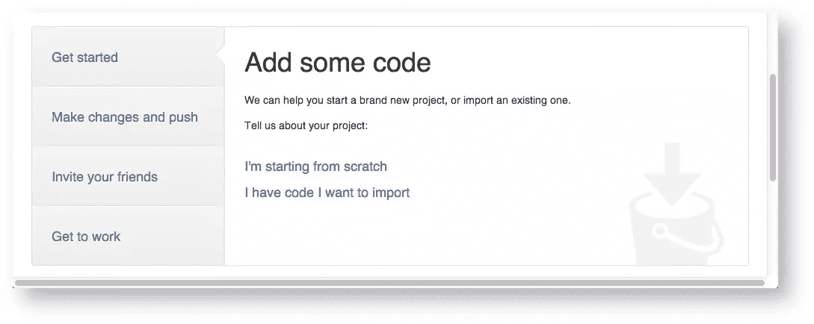
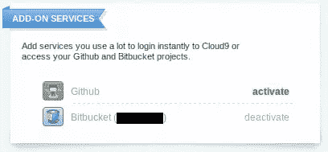

# 转向基于云的 Web 开发

> 原文：<https://www.sitepoint.com/moving-to-cloud-based-web-development/>

最近，我发现自己需要一台笔记本电脑或上网本，我已经多年没有用过了。我选定了三星的 Chromebook，因为价格合适，而且我喜欢谷歌。我知道这次购买 Chromebook 的设计没有硬盘，它更适合休闲上网者，而不是超级用户，但这并没有阻止我。我也知道我想充分利用 Chromium OS 作为一个移动平台，所以安装一个基于 LAMP 的开发环境或者对系统进行修补将会违背我的初衷。我决定是时候改变了，是时候解放了！

在本文中，我将与您分享我是如何从熟悉的桌面环境过渡到基于云的 web 开发的。

## 蒙蔽你的头脑

云并不新鲜。这不过是你已经非常熟悉的东西——互联网——的又一个流行词。云(呃，互联网)和互联网唯一的技术区别是你如何使用它。

在云中，你所有的工具和信息都在互联网上，而不是在你的本地机器上。这使您可以从任何地方、从几乎任何带有浏览器和互联网连接的设备上轻松访问您的文件。如果您的计算机崩溃或损坏，您所有的工具和数据都是安全的。换句话说，迁移到云仅仅是改变你保存数据的位置和访问数据的方式。

向前看，忘记你有一个硬盘。闭上眼睛，花一点时间把它从脑海中清除……呼吸……放松，你仍然可以保留你的存储卡和 u 盘；人们仍然需要每隔一段时间随身携带数据。

## Git 控件

向云过渡的第一步是找到一个版本控制系统来管理我的代码库。如果您以前从未使用过版本控制，这没什么。版本控制软件允许您:

*   签出您的代码
*   跟踪修订
*   击退
*   记录开发过程
*   与他人一起工作，但不覆盖彼此的工作
*   更多

它确实是一个任何开发人员、专业人员或业余爱好者都不应该缺少的工具。

有几个产品可供选择，其中有 [Mercurial](http://mercurial.selenic.com/ "Mercurial SCM") 和 [Subversion](http://subversion.apache.org/ "Apache Subversion") ，但我选择了 Git。Git 最初是由 Linus Torvalds 创建的，非常易于使用。虽然我是在我的本地桌面上安装 Git 的，但是当我在家里舒适的 LAMP 环境中开发时，有基于浏览器的 Git 客户端，所以我不需要在我碰巧使用的任何其他设备上再次安装它。

关于使用 Git 的详细解释超出了本文的范围，但是如果您想了解更多，可以随意阅读以下资料:

*   [Git 简介，第 1 部分](https://www.sitepoint.com/introduction-to-git-1/ "Introduction to Git, Part 1")
*   [Git 简介，第 2 部分](https://www.sitepoint.com/introduction-to-git-2/ "Introduction to Git, Part 2")
*   [Git 简介-第 2 轮(高级)](https://www.sitepoint.com/introduction-to-advanced-git/ "Introduction to Git – Round 2 (Advanced)")

在我的 Linux 桌面上，我通过执行以下命令来安装 Git:

```
sudo apt-get install git
git config --global user.name "First_name Last_name"
git config --global user.email "email@example.com"
```

对于 Windows 或 Mac，你可以[下载合适的安装程序](http://git-scm.com/downloads "GIt - Downloads")。安装后，打开程序并执行上面的最后两行配置。

## 代码库

随着 Git 的建立和运行，下一步是为我的代码库找到一个新的归宿，最好是没有额外的成本。我已经支付了一个控制面板和基于网络的文件管理器，但这将是一个痛苦做任何严重的编辑，这是一个好主意，将开发和生产代码放在不同的位置。

一些显而易见的选择是 [Dropbox](http://db.tt/9EMMLfjo "Dropbox") 或者 [Google Drive](https://drive.google.com/ "Google Drive") 。我也考虑过 [GitHub](https://github.com/ "GitHub") ，但是尽管我是开源的倡导者，我不喜欢他们强迫免费软件库公开的事实。我可能不想与世界上的其他人分享正在进行的工作。

最终我选择了使用 [Bitbucket](https://bitbucket.org/ "Bitbucket") ,尽管前面提到的任何选项都适用于 Git。

在注册了一个免费帐户并创建了一个私有存储库之后，我准备转移我的开发代码，但是首先我需要确保包含敏感信息的文件被忽略。为此，我在项目根目录下创建了一个名为`.gitignore`的文件，内容如下:

```
# files to ignore
lib/config.php
```

接下来，我创建了一个文件`lib/example.config.php`，仅供参考。然后，我使用终端导航到本地机器上的代码目录，用 Git 初始化它，将所有文件添加到源代码控制中，并提交代码:

```
cd /var/www/my_project
git init
git add .
git commit -m "adding source control to my project"
```

在我的新 Bitbucket 存储库的仪表板上，我找到了**入门**面板，并选择“我有想要导入的代码”



该网站又给了我几个在我的终端上执行的命令，例如:

```
git remote add origin https://username@bitbucket.org/username/repo_name.git
git push -u origin --all   # to push up the repo for the first time
```

现在我在 Bitbucket 上保存了我的代码的完整副本。

## 选择 IDE

作为一个从 Windows 的记事本开始的人，我并不偏爱任何特定的 IDE 如果它有行号和语法突出，我非常高兴。然而，由于现在我正在寻找一个好的基于浏览器的 IDE，最好有一些具体的特性:

*   与即时可用的 Git 集成
*   测试 PHP 的内置服务器
*   将文件上传到我的生产服务器的能力

在考虑 Dropbox 和 Google Drive 时，我能找到的最好的 IDE 是 [ShiftEdit](https://shiftedit.net/ "ShiftEdit - Online IDE | ShiftEdit") ，但测试服务器端代码的唯一方法似乎仅限于 FTP，这感觉太 90 年代了。我找到了 [Codenvy](https://codenvy.com/ "Codenvy") ，但是和 GitHub 一样，他们强迫所有的项目都是公开的，除非你想付费。

我最终选择了允许一个免费私人项目的云 9，这就是我真正需要的。作为额外的奖励，一旦你注册并查看你的仪表板，你可以将你的帐户绑定到 Bitbucket，它会自动导入你的项目。



在 Cloud 9 中创建新项目时，有几个选项可用。我创建了一个托管 PHP 项目，它让我可以访问一个带有内置终端的虚拟机来执行 Unix 命令，这样我就可以编辑`php.ini`，更改我正在使用的 PHP 版本，安装 MySQL 等等。

目前看来，它符合我的所有要求。我可以为我的生产服务器设置一个类似的环境，直接从 IDE 测试运行代码，通过 FTP 将代码上传到我的生产服务器，并且我可以将源代码更改推回到 Bitbucket，以确保我的存储库始终是最新的。厉害！

```
git pull origin # make sure I'm working with the latest version of my code
git status # see if any modified files need to be added or committed
git push # update repository
```

## 摘要

在本文中，我与您分享了我如何安装 Git 进行版本控制，如何将代码从本地开发环境转移到远程代码存储库，以及如何从基于浏览器的 IDE 访问存储库，所有这些都是为了从本地开发过渡到基于云的开发。

如果您已经过渡到在云中工作，或者使用过我提到的任何工具(或者我可能没有提到的其他工具)，请在评论中分享！

图片 via[Fotolia](http://us.fotolia.com/?utm_source=sitepoint&utm_medium=website_link&utm=campaign=sitepoint "Royalty Free Stock Photos at Fotolia.com")

## 分享这篇文章