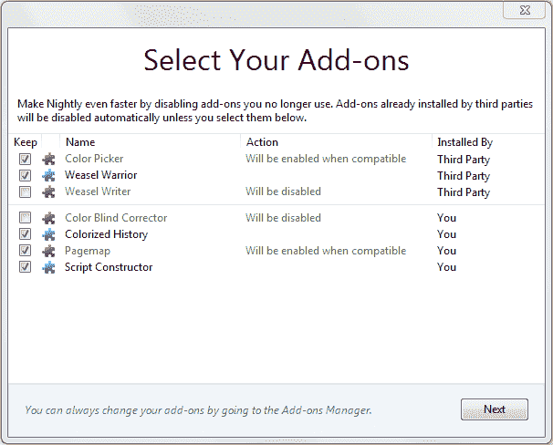
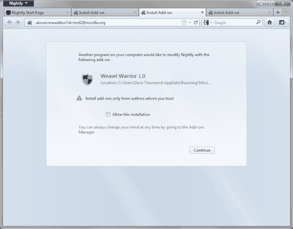

# Mozilla 在 Firefox 中屏蔽了不想要的插件

> 原文：<https://www.sitepoint.com/mozilla-blocks-unwanted-add-ons-in-firefox/>

火狐的成功很大程度上归功于附加组件。第三方扩展有数千个，每天下载 150 万个。Firebug 是 web 开发人员的必备工具，我还使用了十几个其他插件，让生活变得更加轻松。

不幸的是，一些无良软件供应商已经利用了 Firefox 的扩展系统。第三方应用程序经常捆绑隐藏在安装设置中或未经用户同意安装的偷偷摸摸的附加组件。许多供应商声称他们的插件是一种浏览增强功能*(同样，许多人声称他们的操作系统启动过程有助于用户体验)*。事实是，这些附加软件中很少有真正有用的；许多软件功能很差，界面混乱，占用大量内存，增加启动时间。

不仅仅是来自可疑供应商的软件。你会发现插件隐藏在微软、谷歌、雅虎、甲骨文、诺基亚和大多数反病毒公司的产品中。有几家是 Mozilla 的竞争对手——这些公司会在乎 Firefox 插件是否经过严格测试、速度慢、不稳定或不可靠吗？在更糟糕的情况下，附加组件对安全性有负面影响，很少更新或阻止卸载。

关于火狐的速度，Mozilla 已经受到了严厉的批评。虽然有些是合理的，但它通常来自用户运行大量他们不一定授权的插件。最后，Mozilla 决定纠正这种情况…

## 浏览器升级选择加入

当用户升级到带有插件屏蔽的 Firefox 版本时，他们会看到一个已安装插件的列表。默认情况下，用户先前未授权的功能将被禁用:

确认对话框将总结用户的选择。

## 附加选择加入将变得至关重要

启动时，Firefox 会禁用所有未经用户授权的新插件。要启用该功能，用户必须勾选确认框:

Mozilla 的附加博客写道:

> 我们知道有些第三方附加组件安装有合法的使用案例，这些开发人员要求用户选择加入附加组件，遵循我们的性能最佳实践，并提供良好的用户体验，这是正确的做法。不幸的是，通过这些方法安装的不需要的附加组件的范围促使我们采取行动，但我们相信，当 Firefox 提示他们时，真正希望安装这些附加组件的用户会选择加入。

是时候了。平心而论，Mozilla 不可能预见到插件的成功，也不可能预见到它们会如何被劫持，但这个功能早在几年前就应该添加了。

火狐 8.0 将出现插件拦截。我们现在只有第 5 版，但是 Mozilla 的快速更新时间表意味着它应该会在 2012 年初出现。

## 分享这篇文章