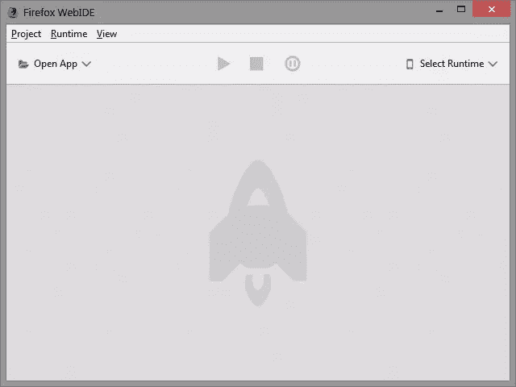
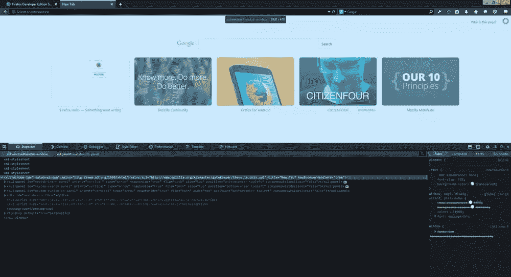
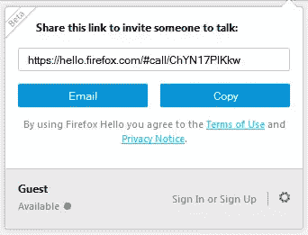
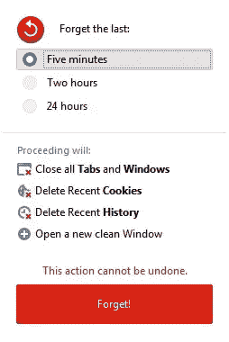

# Mozilla 推出 Firefox 开发者版

> 原文：<https://www.sitepoint.com/mozilla-introduces-firefox-developer-edition/>

就在几天前，Mozilla 庆祝了 Firefox 10 周年纪念日，Firefox 早在 2004 年就打破了微软多年来对 Internet Explorer 的垄断，开启了“浏览器战争”的新篇章。

作为庆祝活动的一部分，Mozilla 推出了新的 [Polaris Privacy Initiative](https://blog.mozilla.org/privacy/2014/11/10/introducing-polaris-privacy-initiative-to-accelerate-user-focused-privacy-online/) 和更大的鼓点: [Firefox 开发者版](https://www.mozilla.org/en-US/firefox/developer/)浏览器。

开发者版做了它已经写在罐子上的事情:它围绕着开发者的需求。不多不少。

在下面的视频中，Firefox 开发者工具总监 Dave Camp 介绍了新的 Firefox 开发者版，简要介绍了浏览器的新功能和变化:

[//www.youtube.com/embed/Fg3gyzAkTd0](//www.youtube.com/embed/Fg3gyzAkTd0)

Camp 强调开发者版非常贴近 Mozilla 的内心，并解释说由于专注于主流用户，Mozilla 有时不得不在 Firefox 中“妥协开发者体验以改善消费者体验”。然而，Mozilla 承诺用开发者版来改变这种情况。

Mozilla 还解释了为什么现在是为开发者定制浏览器的好时机:

> “十年前，我们为早期用户和开发者开发了 Firefox，让他们有更多的选择和控制。Firefox 集成了 WebAPIs 和附加组件，使人们能够充分利用网络。现在，我们将整个浏览器作为一个安全帽区域提供给开发者，允许我们将与他们最相关的功能放在最前面和中心。拥有专用的开发人员浏览器意味着我们可以根据开发人员的日常工作来定制浏览体验。”

## 新闻和变化

新的开发者版本包括了所有 Mozilla 的开发者工具，这些工具最初只作为附加组件提供，比如 Firefox Tools Adapter(新名称为“Valence”)，它为 WebIDE 提供了额外的功能。这允许你在 iOS 上连接到 Chrome for Android 或 Safari，并修改网页内容，模拟 Firefox 环境。

另一方面，WebIDE 在 Firefox 33 中作为 beta 特性引入(默认禁用)，现在正式包含在开发者版本中。它允许您在模拟器、Firefox OS 设备中使用 Firefox OS 应用程序，或者通过集成编辑器使用 Firefox for Android。

自动完成功能、详述函数参数的弹出窗口和清单验证是它包含的一些新的巧妙技巧。您还可以暂停应用程序，并使用内置调试器检查元素。

然而，更引人注目的是 Firefox 开发者版中新的深色 UI，包括像 Firefox 29 Australis 之前的方形标签。如果你不习惯黑暗主题，你可以通过“定制”命令来改变界面主题。这似乎是一个有趣的方法，到处添加了许多细节。

Firefox 开发者版取代了 Firefox 桌面上的 Aurora 频道，但 Android 版的 Aurora 将保持原样。对于那些不熟悉的人来说，Firefox Aurora 位于 Nightly 和 Beta 开发通道之间，开发从 Nightly 开始，是最新鲜的 Firefox 代码，每天晚上都用最新的功能构建。

每夜之后是极光，包括实验性功能，然后进入测试版，最终在稳定版中可用。你可以在 Mozilla Wiki 上找到更多关于 Firefox [发布管理的详细文档。](https://wiki.mozilla.org/Release_Management/Release_Process)

Firefox 中的两个最新特性也打包到了 Firefox 开发者版中，然后才在 Firefox 稳定版中发布。第一个是 Firefox Hello，这是一个由 WebRTC 驱动的工具，它可以直接从浏览器与他人通话和视频聊天，而不需要任何插件或附件。

第二个漂亮的工具是“忘记”按钮。顾名思义，它可以让你“忘记”过去 5 分钟、过去 2 小时或 24 小时内打开的 cookies、历史记录、标签和窗口。

## 其他工具

开发人员版中还包括许多其他小工具:

*   **响应式设计模式**向您展示您的网站或应用在不同屏幕尺寸下的外观，无需手动调整浏览器的大小。
*   **页面检查器**可以让你检查任何网页的 HTML 和 CSS，并轻松修改其结构或布局。
*   **Web 控制台**显示与网页链接的日志信息，并允许您使用 JavaScript 来处理它。
*   **JavaScript 调试器**允许您检查或修改 JavaScript 代码状态，以便更容易地找出错误。
*   *网络监视器*显示您的浏览器发出的网络请求，每个请求需要多长时间，还会将技术细节与每个请求关联起来。
*   **样式编辑器**允许您查看和编辑与网页相关的 CSS 样式，创建新的样式，并将现有的 CSS 样式表应用于任何页面。
*   **网络音频编辑器**允许你实时检查网络音频 API 并与之交互，以确保所有音频节点都以预期的方式连接。

关于火狐开发者版的所有变化，你可以查看 Mozilla 发布说明中的细节[。](https://developer.mozilla.org/en-US/Firefox/Releases/35)

## 进化还是革命？

看到 Mozilla 向“一种新的”方向迈出一步，这绝对是一种有趣的方式。尽管传统的 Firefox 浏览器主要被普通互联网用户视为浏览器，但它还没有被开发人员充分利用。

Mozilla 计划用开发者版来改变这一点，这似乎是这一努力的良好开端。我们将不得不等待，看看这将如何在未来的版本中发展，以及它将对开发者产生什么影响。

## 分享这篇文章