# 多设备启动:我们能从 Mint & Expensify 中学到什么？

> 原文：<https://www.sitepoint.com/multi-device-onboarding-what-we-can-learn-from-mint-expensify/>

每当我注册一个新的网络应用程序，我都会立即下载配套的移动应用程序(反之亦然)。毕竟，我几乎可以互换使用笔记本电脑和 iPhone，经常在一台设备上开始一项任务，然后在另一台设备上完成。我打赌你也一样。

在创建者方面，拥有桌面、移动和潜在的平板电脑版本的应用程序给新用户带来了挑战:如何创建跨设备的入职体验？

同样的流程在大型电脑显示器、qa 笔记本电脑甚至 iPad 上完美运行，但对于小手机屏幕来说可能太复杂了。此外，虽然自动填充使在计算机上完成表单变得相当容易，但用户仍然需要在手机上手动输入文本。更棘手的是，使用键盘和鼠标或触控板导航与使用触摸手势完全不同。

尽管如此，[设计一个适用于不同设备的有凝聚力的入职流程](https://www.sitepoint.com/improving-apps-onboarding-ux/)并非不可能。让我们来看两个例子——[Expensify](http://expensify.com)和[Mint](http://mint.com)——看看他们是如何成功做到的。

## 费用化

Expensify 的口号是“*不烂的费用报告*”，这立刻告诉我该产品将易于使用(或者应该易于使用)。

### 桌面

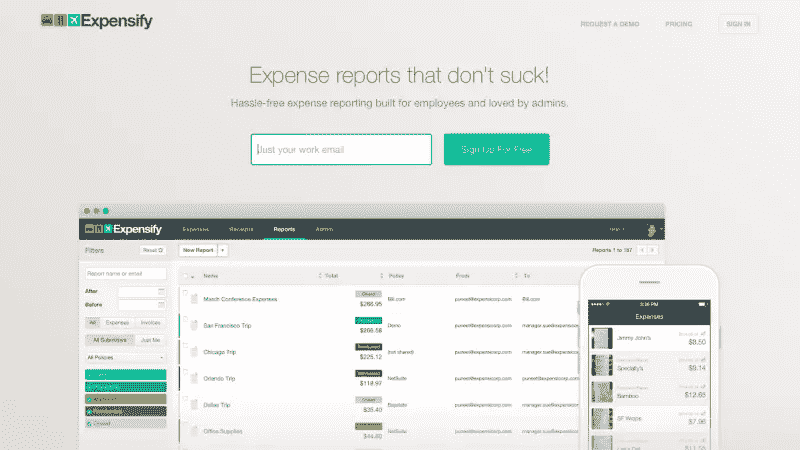

扩展桌面

在我点击“注册”后，Expensify 要求我提供工作邮箱。我输入它，并立即缩放到我新创建的仪表板。

根据我的计时器，这个任务花了三秒钟。真是令人印象深刻。

扩展桌面

“礼宾”入职界面也给我留下了深刻的印象。真正的礼宾入职需要一个真实的人来指导你完成这些步骤，这对用户来说非常有帮助，但对公司来说是时间和劳动密集型的。Expensify 的自动化版本更具可扩展性。

我唯一的吹毛求疵？受到一个像“门房卡罗尔”这样的人物的问候会比一个会说话的铃铛更友好一些。在你的应用程序中融入鲜明的个性可以让你的应用程序更令人难忘，更吸引人。

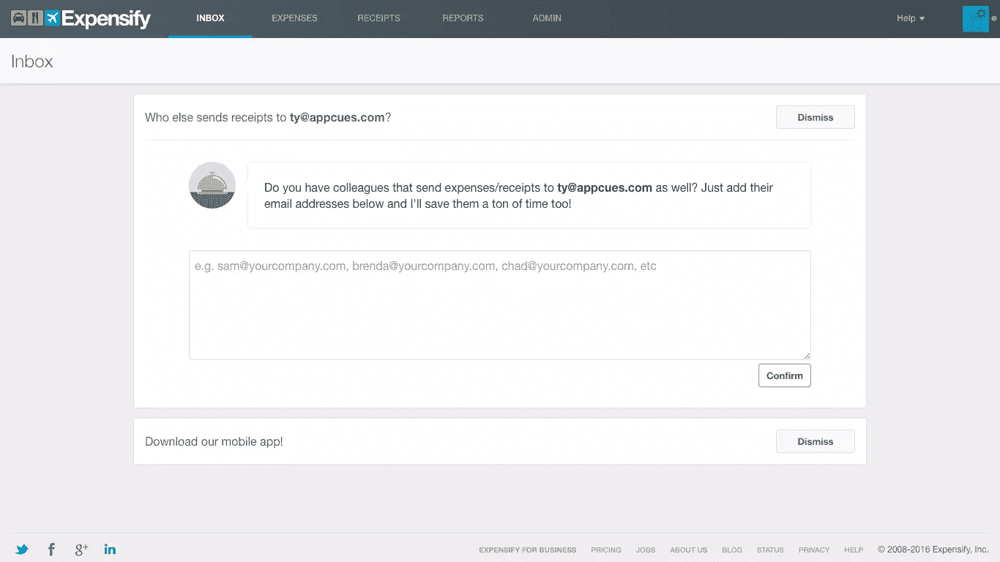

"请向我们的会说话的铃提问。"

该应用程序询问我希望将我的费用报告发送给谁。在我上传我的收据之前就要求一个电子邮件地址是明智的；我在 Expensify 中创建网络的速度越快，我就越有可能继续使用它。

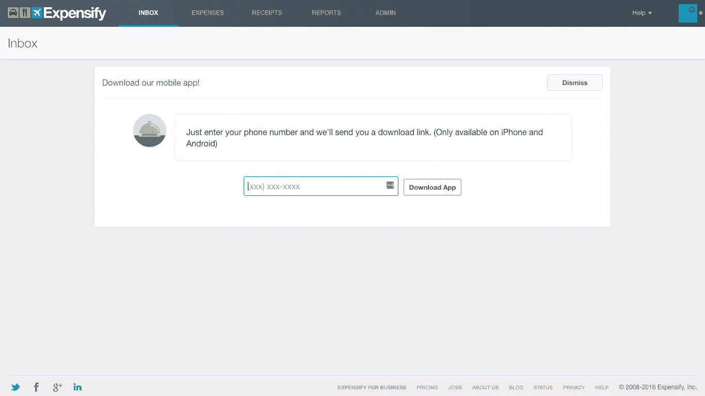

通过链接下载手机应用程序。

接下来，系统会提示我下载手机应用程序。我喜欢下载的快速和简单——我可以给自己发一个链接，而不是自己在应用程序或谷歌 Play 商店中找到应用程序——但这种模式在点击“发送费用/收据”和实际上传收据之间又进了一步。

更好的流程可能是:

点击“发送费用/收据”→选择收款人→上传并发送收据→接收链接下载手机 app

有了这个修改后的流程，你就可以让用户在从" ***开始得意忘形的时候下载应用了！*** “瞬间。

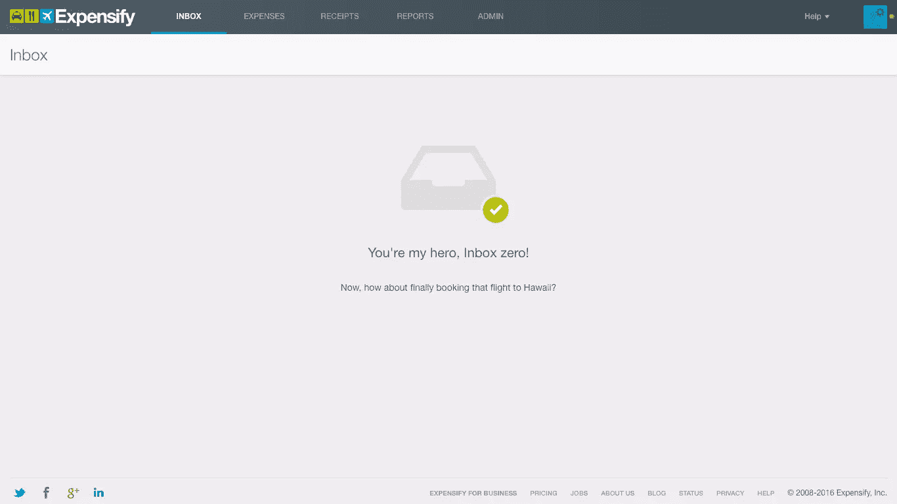

你是我的英雄。收件箱零！

一旦我完成了，Expensify 就会把我带到我的仪表盘上。令人愉快的贺电让我微笑。显然没有导游或步行指南；事实上，当我点击“帮助”时，我发现甚至没有一个 FAQ。然而，我不觉得我需要更多的帮助:导航栏简单直观，我现在知道如何发送费用。看起来 Expensify 的桌面应用实现了它的承诺，让消费过程变得不那么糟糕。但是手机应用程序也会这样做吗？让我们找出答案。

### 手机

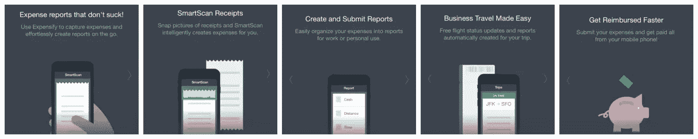

有趣的是，Expensify 的[移动入职流程](https://www.sitepoint.com/the-21-step-checklist-for-bulletproof-mobile-user-onboarding/)以一系列解释应用价值的屏幕开始。这种方法被称为“以利益为导向的入职”，但还有另外两种选择。

“面向功能的入职培训”教你如何使用该产品。“渐进式入职”会在您浏览应用程序时向您显示相关信息。

为什么要排除 Expensify 的 web onboarding 带来的收益下降？我猜更多的用户首先下载移动应用，然后使用网站，而不是相反。

就我个人而言，我不太喜欢直通旋转木马。我最终会反复戳我的屏幕，这样我就可以尽快找到好的东西(即应用程序本身)。UX 的研究表明我不是唯一一个。

一过屏幕，我就进入了我的仪表盘。一切看起来和行为都很熟悉，就像我以前已经使用过这个应用程序一样——可能是因为界面看起来像 Swarm 和 Snapchat 的结合体。这是一个很好的提醒，如果你想减少用户的学习曲线，使用熟悉的图标、交互和设计模式。

[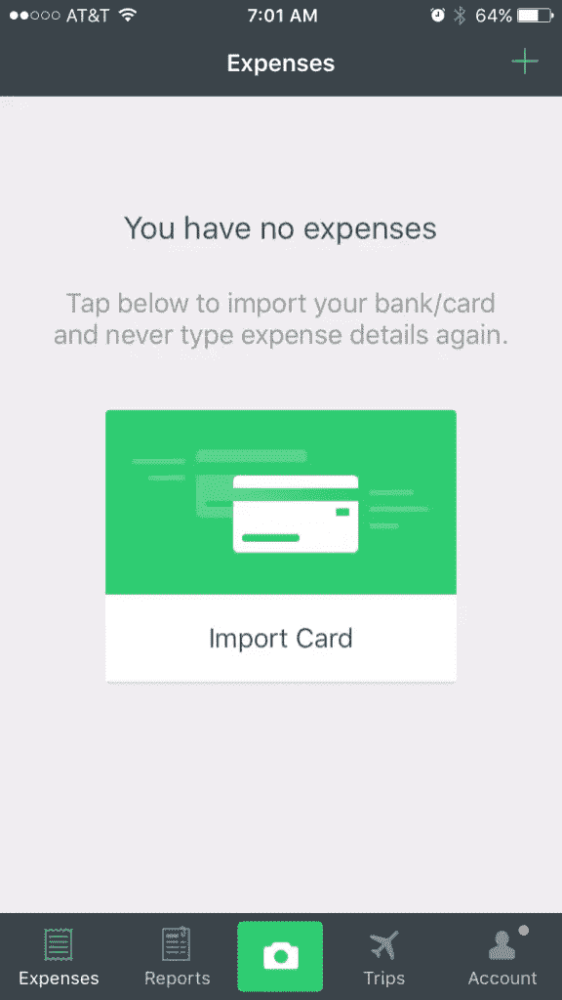](https://www.sitepoint.com/multi-device-onboarding-what-we-can-learn-from-mint-expensify)

与桌面应用程序一样，没有传统的入职流程。由于应用程序还没有我的任何信息，每个屏幕都提示我采取不同的行动(连接我的银行账户，创建费用报告等)。)当然，菜单中间还有一个大大的绿色摄像头，让我可以随时给我的收据拍照。

只要我在应用程序中采取任何行动，我就会第一次“啊哈！”瞬间。Expensify 值得大力支持，因为它如此快速、无缝地传递价值，而且没有给我传统的指导。

### **等级:A-**T2

Expensify 的桌面和移动入职流程配合得很好。两者都促使我上传和发送我的第一笔费用，但它们都各自适合自己的媒介。如果 Expensify 摆脱了它的移动屏幕传送带，我会把它的评级提高到 A；我不认为你需要用它来传达这个应用的价值，因为仅仅通过使用它就已经很明显了。

## 薄荷

Mint 被宣传为一个全面的个人财务应用程序，给你一个单一的数字场所来设定预算，支付账单，跟踪你的支出，检查你的信用评分，甚至获得财务建议。

### 桌面

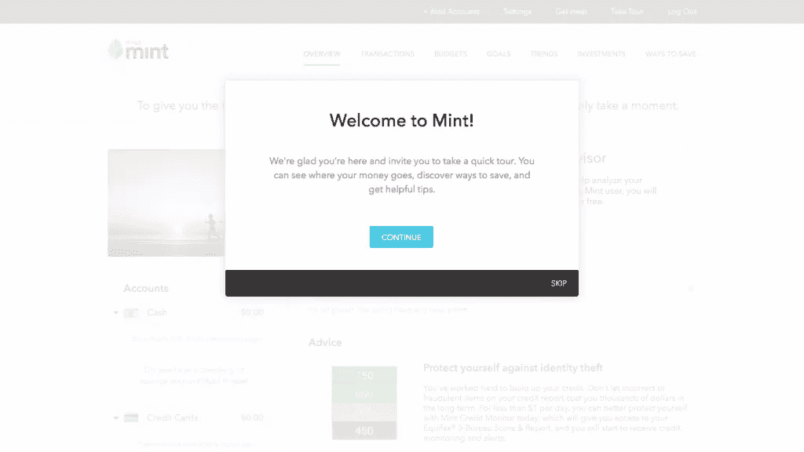

当我看到我的电子邮件和密码都是双输入字段时，我很高兴我没有首先尝试移动注册。由于使用 Mint 将需要我的敏感财务信息，所以拥有双电子邮件和双密码表单感觉比我在不同的应用程序中创建帐户更合理，但它仍然有点乏味。

注意边栏告诉我为什么我会喜欢薄荷。如果你有一个很长的注册过程，添加一个视觉提醒你的应用程序的好处会激励你的用户继续下去。

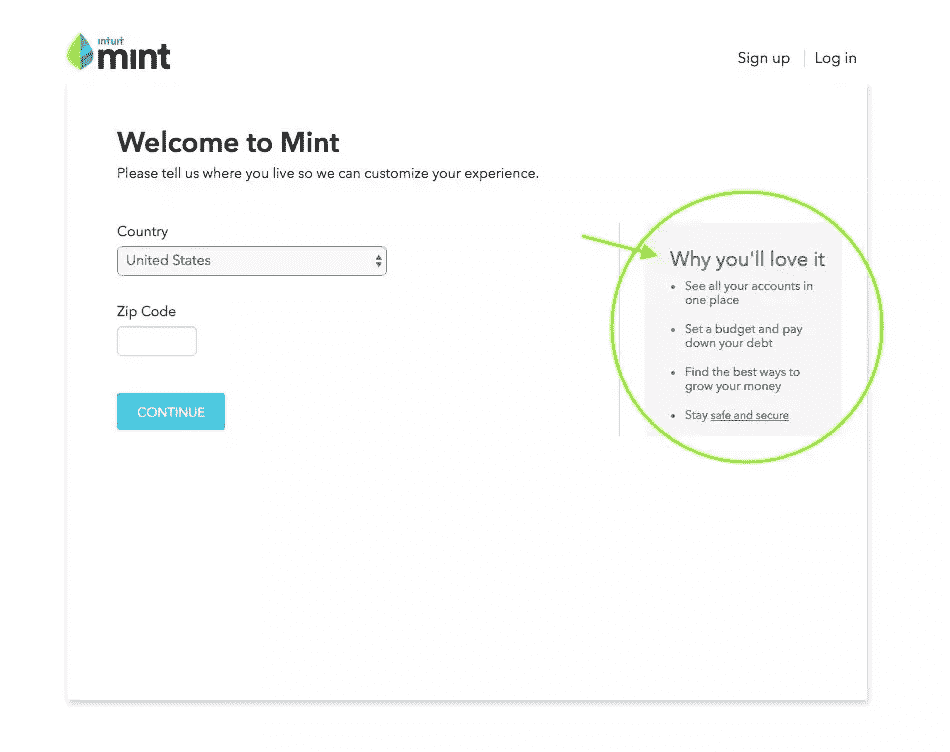

现在我必须输入我的位置。嗯，这真的是如此重要的信息，它不能等到我的帐户被创建吗？

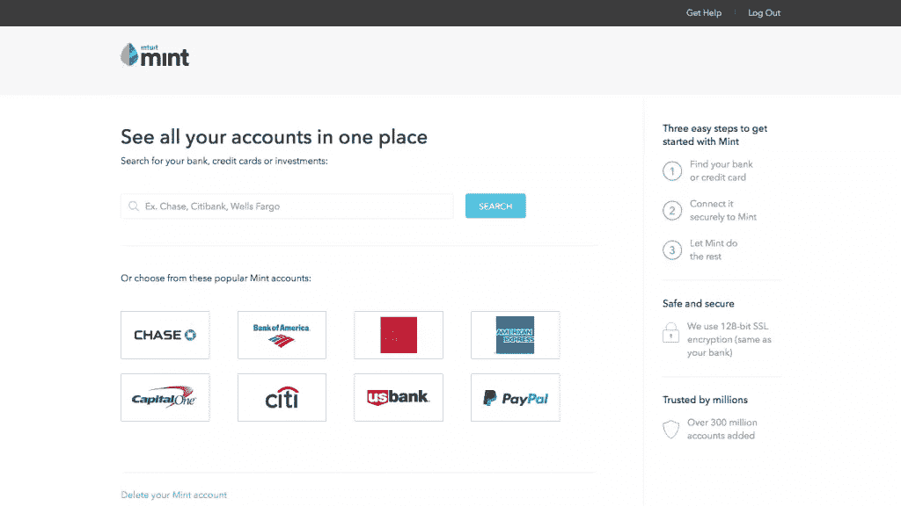

接下来，我连接我的银行账户。我不喜欢横幅广告:“在一个地方查看您的所有帐户。”毕竟，我只有一个账户:我注册使用 Mint 的预算功能。

选择一个更普遍的价值主张，比如“*看看你的钱去了哪里*”或者“*控制你的支出*”，可能会更有效。

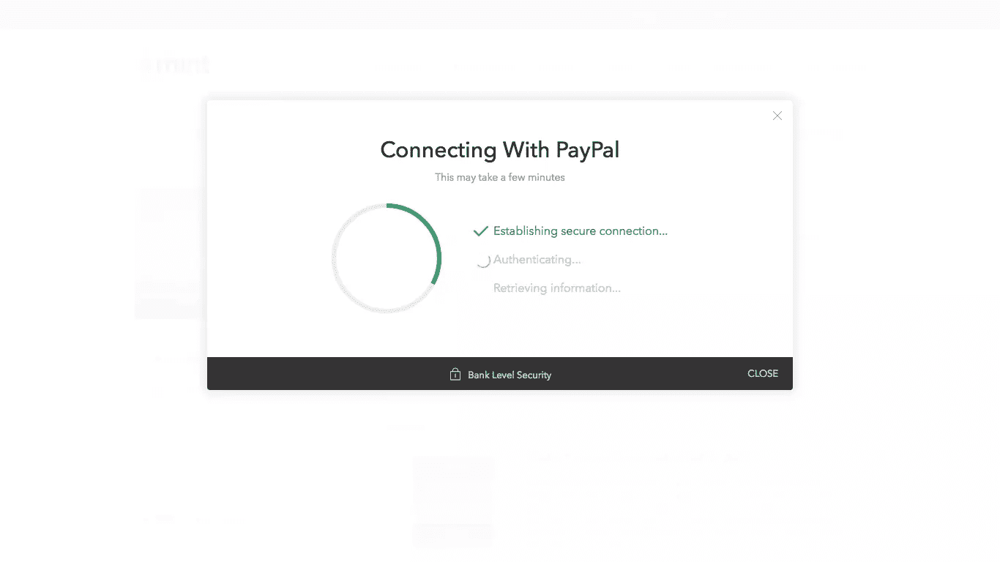

看看这个漂亮的加载屏幕。十有八九，[这个屏幕上的里程碑是人为的](https://uxmag.com/articles/let-your-users-wait)，但我不在乎——当你在用户等待时向他们提供正在发生的事情的微小更新时，时间过得更快。

一个模型弹出来邀请我参观。好消息是:这个教程可以让你跳转到特定的功能，所以如果你有兴趣，比如说，设置一个预算，你可以点击“告诉我:预算。”这个选项展示了 Mint 的广泛功能，同时让用户使用隐喻的轮子。

更好的是，每个技巧都有一个行动——所以我可以立即从特性中获得价值。例如，在解释目标如何工作的部分，有一个设置我的第一个目标的链接。

坏消息是:旅程真的很长。我选择完成整件事，这意味着我读了九盒文字。我有点累了，被结局压垮了。

如果像 Mint 一样，你已经有了一个相当全面的产品，考虑将你的旅程限制在四到五个核心特性，并通过生命周期电子邮件解释其他特性。

### 手机

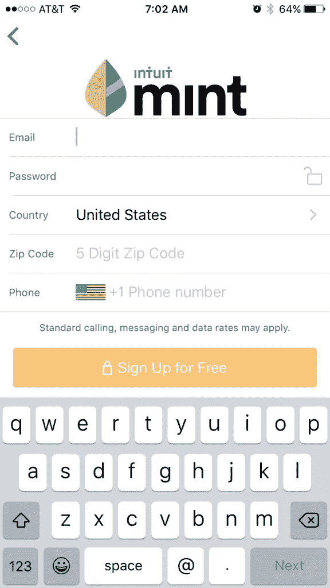

我很好奇 Mint 将如何调整其相当激烈的手机入职流程。我下载了这个应用程序，用不同的邮箱创建了一个新账户。

当应用程序要求我输入两次我的电子邮件和密码时——更不用说我的位置和邮政编码了——我有点不满。在小键盘上敲这么多字并不好玩；此外，我正在为一个屏幕填写许多表格。

为了避免这个问题，许多应用程序会在多个屏幕上显示内容或表单字段，而不是将所有内容都塞进一两个屏幕。

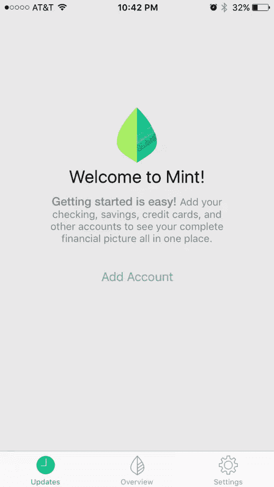

Mint 现在提示我连接我的银行账户。这个流将桌面流镜像到 t。

甚至加载更新(“建立安全连接”、“下载交易”等)。)都一样。

然而，当应用程序完成与我的银行的连接，我进入仪表板时，就没有游览了。

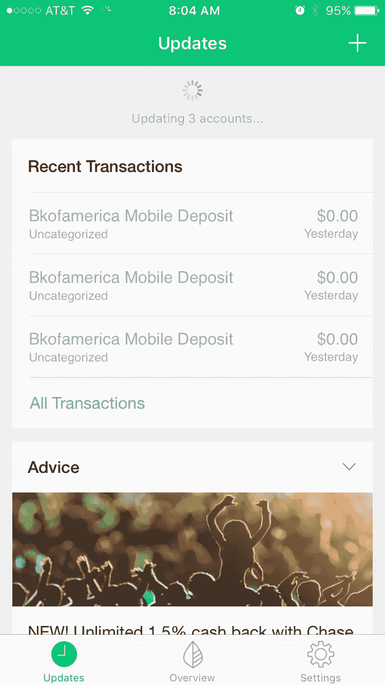

我四处查看是否会出现任何工具提示或模态，但是很明显，入职过程已经结束了。

虽然这可能会令人不安，但我其实并不介意。Mint 的移动应用程序非常容易导航，这要归功于精心选择的图标和简单明了的复制。我立即明白了如何使用主要功能(管理我的最新交易和监控我的总体支出)。有了这些，我可以在自己的时间里慢慢探索次要功能(比如获得建议和检查我的信用评分)。

### **等级:B+**

Mint 最初的注册表格有点过于雄心勃勃——我希望该应用程序能够剔除内容，这样过程就更容易管理。

此外，桌面版的九点之旅让我晕头转向。但 Mint 通过其移动入职流程获得了大量失地。在费力的注册之后，弄清楚这个应用程序是如何工作的是容易和令人愉快的，即使实际上没有更多的入职。

*你认为为移动和网络设计入职流程的最大挑战是什么？*

## 分享这篇文章