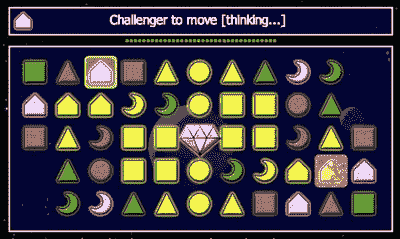

# JavaScript 中的多线程

> 原文：<https://www.sitepoint.com/multi-threading-javascript/>

**好了，在我们开始之前，让我来澄清一下，承认这篇文章的标题有点煽情！JavaScript 并没有真正的多线程能力，JavaScript 程序员对此无能为力。在所有的浏览器中——除了谷歌 Chrome——JavaScript 运行在一个单独的执行线程中，事实就是如此。**

然而，我们能做的是*模拟*多线程，因为它带来了多线程环境的一个好处:**它允许我们运行极其密集的代码**。这段代码可能会冻结浏览器，并在 Firefox 中生成一个“无响应脚本”警告。

## 时间不等人

这一切都取决于异步计时器的使用。当我们在异步计时器中运行重复代码时，我们给浏览器的脚本解释器时间来处理每次迭代。

实际上，`for`迭代器中的一段代码要求解释器立即做所有事情:“尽可能快地运行这段代码 *n 次*”然而，异步计时器中的相同代码将代码分解成小的、离散的块；也就是，“尽可能快地运行这个代码一次”，然后等待，然后“尽可能快地运行这个代码一次”，等等， *n* 次。

诀窍在于，每次迭代中的代码都足够小和简单，解释器可以在计时器的速度内完全处理它，无论是 100 毫秒还是 5000 毫秒。如果满足了这个要求，那么整个代码有多密集并不重要，因为我们并不要求它同时运行。

##### “太激烈”到底有多激烈？

通常，如果我在写一个被证明过于密集的剧本，我会考虑重新设计它；如此显著的速度下降通常表明代码有问题，或者应用程序的设计有更深层次的问题。

但有时不会。有时候，根本没有办法避免特定操作的强度，除非根本不使用 JavaScript。

在特定情况下，这可能是最好的解决方案；也许应用程序中的一些处理需要转移到服务器端，在服务器端，应用程序有更强的处理能力和真正的线程化执行环境(web 服务器)。

但是最终你可能会发现这不是一个选项 JavaScript 简单地说就是*必须*能够做一些事情，否则就会被诅咒。这就是我在开发我的火狐扩展 [Dust-Me 选择器](https://www.sitepoint.com/dustmeselectors/)时发现自己的处境。

该扩展的核心是测试应用于页面的 CSS 选择器的能力，以查看它们是否被实际使用。其本质是使用来自[base 2](http://code.google.com/p/base2/)的`matchAll()`方法的一组评估:

```
for(var i=0; i<selectors.length; i++) 

{ 

  if(base2.DOM.Document.matchAll 

    (contentdoc, selectors[i]).length > 0) 

  { 

    used ++; 

  } 

  else 

  { 

    unused ++; 

  } 

}
```

很简单，当然。但是`matchAll()`本身是非常紧张的，因为它必须解析和评估任何 CSS1 或 CSS2 选择器，然后遍历整个 DOM 树寻找匹配；这个扩展为*每个单独的选择器*做这些，选择器可能有几千个。这个过程表面上看起来很简单，但实际上却非常密集，以至于整个浏览器都停止了。这就是我们的发现。

锁定浏览器显然不是一个选项，所以如果要这样做，我们必须找到一种方法让它运行时不出错。

## 一个简单的测试用例

让我们用一个简单的涉及两个迭代级别的测试用例来演示这个问题；内层故意太密集，以便我们可以创建竞争条件，而外层相当短，以便它模拟主代码。这是我们所拥有的:

```
function process() 

{ 

  var above = 0, below = 0; 

  for(var i=0; i<200000; i++) 

  { 

    if(Math.random() * 2 > 1) 

    { 

      above ++;       

    } 

    else 

    { 

      below ++; 

    } 

  } 

} 

function test1() 

{ 

  var result1 = document.getElementById('result1'); 

  var start = new Date().getTime(); 

  for(var i=0; i<200; i++) 

  { 

    result1.value =  'time=' +  

      (new Date().getTime() - start) + ' [i=' + i + ']'; 

    process(); 

  } 

  result1.value = 'time=' +  

    (new Date().getTime() - start) + ' [done]'; 

}
```

我们开始我们的测试，并从一个简单的形式获得我们的输出(这是测试代码，不是产品，所以请原谅我使用内联事件处理程序):

```
<form action=""> 

  <fieldset> 

    <input type="button" value="test1" onclick="test1()" /> 

    <input type="text" id="result1" /> 

  </fieldset> 

</form> 
```

现在让我们在 Firefox 中运行这段代码(在这种情况下，是在 2GHz MacBook 上运行 Firefox 3)…不出所料，浏览器 UI 在运行时会冻结(例如，无法按下刷新并放弃该过程)。大约 90 次迭代后，Firefox 会产生一个“脚本无响应”的警告对话框。


如果我们允许它继续，在另一个 90 次迭代之后，Firefox 再次产生相同的对话框。

Safari 3 和 Internet Explorer 6 在这方面的行为类似，都有一个冻结的 UI 和一个产生警告对话框的阈值。在 Opera 中没有这样的对话框——它只是继续运行代码，直到它完成——但是浏览器 UI 同样被冻结，直到任务完成。

显然，我们在实践中不能运行这样的代码。因此，让我们重新考虑它，并在外部循环中使用异步计时器:

```
function test2() 

{ 

  var result2 = document.getElementById('result2'); 

  var start = new Date().getTime(); 

  var i = 0, limit = 200, busy = false; 

  var processor = setInterval(function() 

  { 

    if(!busy) 

    { 

      busy = true; 

      result2.value =  'time=' +  

        (new Date().getTime() - start) + ' [i=' + i + ']'; 

      process(); 

      if(++i == limit) 

      { 

        clearInterval(processor); 

        result2.value = 'time=' +  

          (new Date().getTime() - start) + ' [done]'; 

      } 

      busy = false; 

    } 

  }, 100); 

}
```

现在，让我们再次运行它…这一次，我们收到完全不同的结果。当然，代码需要一段时间才能完成，但是它一直成功地运行到最后，没有 UI 冻结，也没有关于脚本运行过慢的警告。

[View the test page](https://i2.sitepoint.com/examples/jsmultithreading/test.html)

(`busy`标志用于防止定时器实例冲突。如果下一次迭代到来时，我们已经在子流程的中间，我们只需等待下一次迭代，从而确保一次只有一个子流程在运行。)

所以你看，虽然我们可以在*内部*进程上做的工作仍然很少，但是我们可以运行那个进程的*次数*现在是无限的:我们可以基本上永远运行外部循环，并且浏览器永远不会冻结。

这还差不多，我们可以在野外使用它。

## 你疯了！

我已经能听到反对者了。事实上，我自己也可能是其中之一:你为什么要这么做——什么样的疯子坚持把 JavaScript 推向所有这些它从未被设计去的地方？你的代码太紧张了。这不是适合这项工作的工具。如果你不得不跳过这些类型的圈，那么你的应用程序的设计从根本上就是错误的。

我已经提到了一个例子，我必须找到一种方法让繁重的脚本工作；要么这样，要么整个想法都得放弃。如果你不相信这个答案，那么文章的其余部分可能也不会吸引你。

但是如果你是——或者至少，如果你愿意被说服的话，这里有另一个真正的例子:**使用 JavaScript 编写游戏，你可以在电脑上玩**。

## (赛场局势发生变化后表明)胜负难料

我在这里说的是理解游戏规则所需的代码，它可以评估情况和策略，以便在游戏中击败你。复杂的东西。

为了说明这一点，我将看一个我已经兼职开发了一段时间的项目。我说的“一小会儿”指的是三年(T1)，其中大部分时间是在一个平台上度过的，在这个平台上，游戏理论上可以运行，但太紧张了，无法使用……直到我想到了这个方法。这款游戏是一款基于颜色和形状匹配的竞争性拼图游戏。



总结一下:你可以通过相邻的形状和颜色匹配来实现全面发展。例如，如果你从一个绿色三角形开始，那么你可以移动到任何其他三角形，或者任何其他绿色形状。你的目标是拿到中间的水晶，然后把它拿到棋盘的另一边，而你的对手也试图这么做。你也可以从对手那里偷水晶。

因此，我们有逻辑规则决定运动，我们也可以看到战术的出现。例如，为了避免让你的对手够到水晶，或者从你那里偷走它——你可以选择一个动作来阻止他们，或者尝试在他们够不到的地方结束。

计算机的工作是找到任何给定情况下的最佳移动，所以让我们用伪代码总结一下这个过程:

```
function compute()  

{  

  var move = null;  

  move = tactic1();  

  if(!move) { move = tactic2(); }  

  if(!move) { move = tactic3(); }  

  if(move)  

  {  

    doit();  

  }  

  else  

  {  

    pass();  

  }  

}
```

我们评估一个策略，如果它给了我们一个好的移动，那么我们就完成了；否则，我们评估另一个策略，等等，直到我们或者有一个动作，或者得出结论，没有一个，我们必须通过。

这些战术功能中的每一个都运行一个昂贵的过程，因为它必须评估棋盘上的每个位置，以及潜在的未来位置，可能根据各种因素对每个位置进行多次评估。这个例子只有三种战术，但是在真实的游戏中有几十种不同的可能性，每一种评估起来都很昂贵。

这些评估中的任何一个都可以，但是所有的评估加在一起，连续运行，会导致一个过于激烈的过程，使浏览器冻结。

所以我所做的是将主代码分成谨慎的*任务*，每一个任务都是用一个`switch`语句选择的，并使用一个异步计时器进行迭代。这个逻辑和我小时候读过的那些[选择你自己的冒险](http://en.wikipedia.org/wiki/Choose_Your_Own_Adventure)的书差不了多少，在这些书里，每个任务都以选择进一步的任务而结束，所有这些都是实时的，直到我们到达终点:

```
function compute()  

{  

  var move = null;  

  var busy = false, task = 'init';  

  var processor = setInterval(function()  

  {  

    if(!busy)  

    {  

      switch(task)  

      {  

        case 'init' :   

          move = tactic1();  

          if(move) { task = 'doit'; }  

          else { task = 'tactic2'; }  

          busy = false;  

          break;  

        case 'tactic2' :   

          move = tactic2();  

          if(move) { task = 'doit'; }  

          else { task = 'tactic3'; }  

          busy = false;  

          break;  

        case 'tactic3' :   

          move = tactic3();  

          if(move) { task = 'doit'; }  

          else { task = 'pass'; }  

          busy = false;  

          break;  

        case 'doit' :  

          doit();  

          task = 'final';  

          busy = false;  

          break;  

        case 'pass' :  

          pass();  

          task = 'final';  

          busy = false;  

          break;  

        case 'final' :   

          clearInterval(processor);  

          busy = false;  

          break;  

      }  

    }  

  }, 100);  

}
```

这段代码比原来的代码要冗长得多，所以如果减少代码大小是唯一的必要条件，这显然不是正确的做法。

但是我们在这里试图做的是**创造一个没有上限**的执行环境，也就是说，一个在复杂度和长度方面没有上限的过程；这就是我们所做的。

这种模式可以无限扩展*，拥有数百甚至数千个任务。它可能需要很长时间才能运行，但它会运行，而且只要每个*个体*的任务不太激烈，它就会运行而不会杀死浏览器。*

 *##### 一条不归路

这种方法的优点也是它的主要缺点:因为内部函数是异步的，我们**不能从外部函数**返回值。因此，例如，我们不能这样做(或者说，我们可以，但没有意义):

```
function checksomething()  

{  

  var okay = false;    

  var i = 0, limit = 100, busy = false;  

  var processor = setInterval(function()  

  {  

    if(!busy)  

    {  

      busy = true;  

      if(condition)  

      {  

        okay = true;  

      }  

      if(++i == limit)  

      {  

        clearInterval(processor);  

      }  

      busy = false;  

    }  

  }, 100);  

  return okay;    

}
```

那个`checksomething()`函数将*总是*返回`false`，因为内部函数是异步的。外部函数将在内部函数的第一次迭代之前返回！

下一个例子同样毫无意义:

```
if(++i == limit)  

{  

  clearInterval(processor);  

  return okay;  

}
```

我们在外部函数的范围之外，因此我们不能从它返回；返回值无用地消失在以太中。

这里我们*可以*做的是借鉴 Ajax 编码技术，使用`callback`函数(在这个例子中我称之为“oncomplete”):

```
function checksomething(oncomplete)  

{  

  var okay = false;  

  var i = 0, limit = 100, busy = false;  

  var processor = setInterval(function()  

  {  

    if(!busy)  

    {  

      busy = true;  

      if(condition)  

      {  

        okay = true;  

      }  

      if(++i == limit)  

      {  

        clearInterval(processor);  

        if(typeof oncomplete == 'function')  

        {  

          oncomplete(okay);  

        }  

      }  

      busy = false;  

    }  

  }, 100);  

}
```

因此，当我们调用`checksomething()`时，我们传递一个匿名函数作为它的参数，当作业完成时，这个函数用最终值调用:

```
checksomething(function(result)  

{  

  alert(result);  

});
```

优雅？不。但功能强大？是的。这才是重点。使用这种技术，我们可以编写原本不可能的脚本。

## 机器人会梦到硅羊吗？

在我们的工具包中有了这项技术，我们现在有了一种处理 JavaScript 项目的方法，这在以前是不可能的。我为这个模式开发的游戏有相当简单的逻辑，因此有相当简单的*大脑*，但是对于传统的迭代来说还是太多了；还有很多其他游戏需要更大的影响力！

我的下一个计划是使用这种技术实现一个 JavaScript 象棋引擎。国际象棋有大量可能的场景和战术，导致决策可能需要非常长的时间来计算，远远超过没有这种技术可能实现的时间。即使是最基本的思维机器也需要密集的计算，我承认我对这种可能性感到非常兴奋。

如果我们能玩出这样的把戏，谁能说什么是可能的呢？自然语言处理、启发式……也许我们有用 JavaScript 开发人工智能的构件！

如果你喜欢读这篇文章，你会爱上[可学的](https://learnable.com/)；向大师们学习新技能和技术的地方。会员可以即时访问 SitePoint 的所有电子书和交互式在线课程，如[网页 JavaScript 编程](https://learnable.com/courses/javascript-programming-for-the-web-40)。

对本文的评论已经关闭。有关于 JavaScript 的问题吗？为什么不在我们的[论坛](https://www.sitepoint.com/forums/forumdisplay.php?15-JavaScript-amp-jQuery?utm_source=sitepoint&utm_medium=link&utm_campaign=forumlink)上问呢？

图片来源:[兰登·L·皮特森](http://www.flickr.com/photos/chefranden/310767408/)* 

## *分享这篇文章*