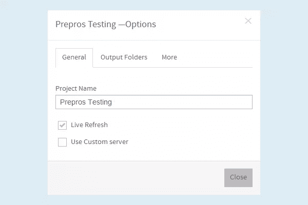
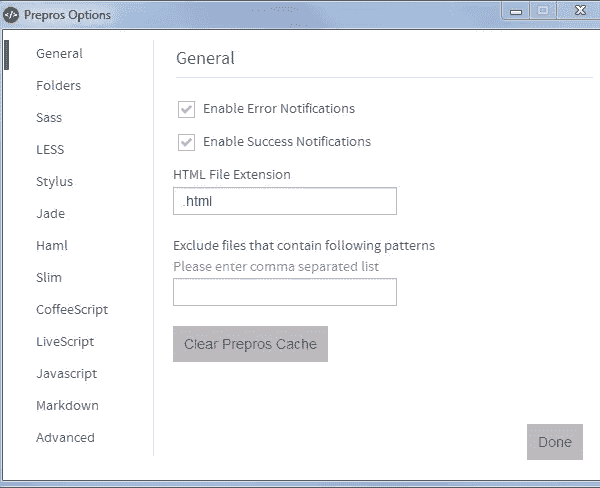
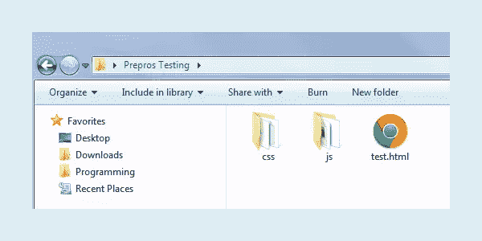
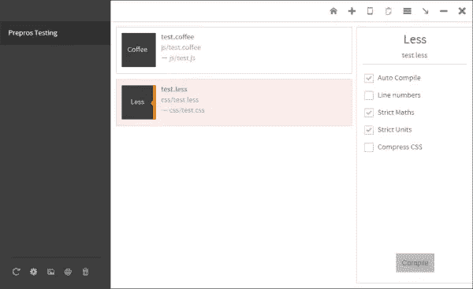
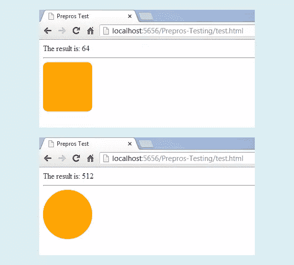

# 使用预处理程序的多语言预处理

> 原文：<https://www.sitepoint.com/multilingual-preprocessing-with-prepros/>

在今天的 web 开发中，预处理扮演着重要的角色。预处理语言，也称为预处理器，使编写 HTML，CSS 和 JavaScript 更快，更容易，更灵活。但是在我们使用它们之前，我们需要在我们的机器上安装和配置它们。

当我们只使用一个时，例如 CoffeeScript，这不是什么大问题。但是我们的项目经常需要将几个预处理程序组合起来，这样事情会变得有点复杂。我们需要安装所有需要的语言，并正确设置它们来编译我们的文件。当然，这意味着额外的工作。幸运的是，有一个更简单的解决方案——一体化解决方案。

由 [Subash Pathak](https://twitter.com/sbspk) 创建的 Prepros ，是一个可以自动处理我们所有预处理需求的工具。它是一个开源的 GUI 编译器，类似于 CodeKit，用于预处理 LESS、Sass、Compass、Stylus、Markdown、CoffeeScript 等语言。有了 Prepros，多语言预处理不再是问题。它可以在 Win 和 Mac 上运行，自 2013 年 5 月 1 日首次发布以来，它一直在积极开发，并定期添加新功能。

听起来不错？好的。让我们快速看一下 Prepros 能为我们做什么。

## 特点和优势

下面是 Prepros 在撰写本文时提供的所有酷功能和优点的概述:

*   多语种一体化解决方案。Prepros 可以编译当今最流行的预处理语言。其中包括:LESS、Sass、SCSS、Compass、CoffeeScript、LiveScript、Stylus、Jade、Slim、Markdown 和 Haml。
*   没有依赖。只需安装 Prepros，你就可以了。没有其他需要安装或配置的东西。不要在命令行上浪费时间。只需运行应用程序并开始工作。很简单。
*   时尚简单，但功能强大的图形用户界面。拜拜命令行:)
*   多个定制级别。您可以为所有项目全局配置预处理，特别是为每个项目和每个文件单独配置预处理。每个文件都可以根据您的需要手动或自动编译。
*   JavaScript 缩小和连接。当您在编辑器中更改文件时，预处理程序可以实时缩小和连接您的 JavaScript 文件。
*   图像优化。Prepros 可以优化 PNG，JPG 和 GIF 图像，只需点击一下，以加快页面加载时间，提高您的整体网站性能。
*   `@imports`探测和观察。为您的文件改变预编程手表和编译他们在飞行中。
*   内置 http 服务器。Prepros 内置了一键静态 http 服务器，可以测试你所有的东西，没有文件 URL 限制。
*   实时浏览器刷新。Prepros 可以在文件发生变化时实时刷新浏览器。如果你使用内置的 http 服务器，这个功能可以在 Firefox，Chrome，Opera 和 IE10 中使用，但是要使用自定义服务器或文件 URL，你必须安装一个浏览器扩展。
*   多设备实时刷新。Prepros 支持在连接到您网络的多个设备中测试您的网页。每当您更改文件时，它会实时刷新所有浏览器和设备。
*   错误和成功通知。Prepros 会在每次文件编译成功时通知您，每当编译失败时，它会弹出一条错误消息并记录错误以便于调试。
*   它是跨平台的(目前在 Win 和 Mac 上运行)。
*   它是完全免费和开源的。

## 它是如何工作的

为了使用 Prepros，你首先需要有一个项目。项目只是一个文件夹，其中包含所有放置在同一文件夹和/或子文件夹中的预处理文件。要添加您的项目，只需将项目文件夹拖放到应用程序窗口，Prepros 将列出它可以编译的所有文件。

当一个文件由另一个文件导入时，导入的文件不会显示在文件列表中，但导入的文件会在后台被监视，并且只要导入的文件发生更改，父文件就会被编译。您还必须记住，在向项目文件夹中添加新文件或从另一个文件导入一个文件后，您必须刷新项目才能看到更改。

添加项目后，Prepros 有许多选项，您可以根据自己的需要进行定制。

您可以单独配置每个文件。只需选择它，并在应用程序窗口右侧的面板中编辑设置。

您也可以使用应用程序窗口左下角的工具栏来管理您的项目。当一个项目被选中时，你可以通过点击项目工具栏上的齿轮图标打开**项目选项**窗口。



对于全局配置，需要打开**预处理选项**窗口。只需点击应用程序窗口右上角的菜单图标，然后选择**预处理选项**。在这里，您可以设置适用于所有项目的选项。



## 尝试一下

现在，让我们做一个快速测试，看看应用程序的运行情况。首先，下载并安装适用于您的操作系统的 Prepros 版本。

我们将在示例中使用 LESS 和 CoffeeScript 来演示该应用程序的工作原理。首先，您需要创建一个名为“Prepros Testing”的项目文件夹。还要添加“css”和“js”子文件夹。然后用以下内容创建一个`test.html`文件:

```
<!DOCTYPE  HTML>
<html>
<head>
    <meta charset="utf-8" />
    <title>Prepros Test</title>
    <link href="css/test.css"  rel="stylesheet" type="text/css" />
    <script src="js/test.js"  type="text/javascript"></script>
</head>

<body>

<hr />

<div  class="round-rect"></div>

</body>
</html>
```

在`head`部分，我们将添加由预处理程序编译的文件的引用。然后在`body`部分我们添加一个带有类`round-rect,`的`div`，我们将使用它来进行 CSS 演示。



接下来，创建`test.less`文件并将其放在“css”文件夹中。代码如下:

```
.rounded-corners  (@radius: 5px) {
  -webkit-border-radius: @radius;
  -moz-border-radius: @radius;
  -ms-border-radius: @radius;
  -o-border-radius: @radius;
   border-radius: @radius;
}

.round-rect {
    width: 100px;
    height: 100px;
    background-color: orange;
    .rounded-corners(10px);
}
```

好的。现在在“js”文件夹中创建`test.coffee`文件。代码如下所示:

```
square = (x)  -> x * x
cube   = (x) -> square(x) * x
getCube =  ->
  document.write "The result is: " +  cube(4)

getCube()
```

现在我们已经准备好测试了。首先启动 Prepros 并添加我们的测试项目。



然后右键单击项目名称并选择**编译所有文件**。如果你看一下“js”和“css”文件夹，你会看到 Prepros 已经自动创建了`test.js`和`test.css`。

现在点击项目工具栏中的**打开项目直播网址**(地球图标)并选择`test.html`。您应该会看到“结果是:64”语句，以及下面的橙色圆角矩形。

打开`test.coffee`并确保你能看到你的浏览器和编辑器。现在只需将`cube()`函数中的参数从`4`改为`8`。保存文件后，您应该会在浏览器中看到所做的更改。然后打开`test.less`，将半径从`10px`更改为`100px`并保存。您现在应该会看到一个橙色的圆圈。



好的。它工作了。恭喜你！你的新秘密网络开发武器已经测试成功，并准备好了。

## 结论

如您所见，预处理可以极大地简化您的预处理工作流。它只是把艰苦的工作留给我们，把酷的东西留给我们。预处理是一项强大的技术，由于 Prepros 这样的应用程序，我们可以轻松有效地利用它。

这篇文章只是对这个奇妙的预处理工具的一个快速介绍。更多细节，此处未提及，请查看 [Prepros](http://alphapixels.com/prepros/) 网站上的文档。

## 分享这篇文章