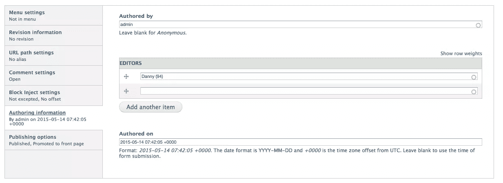

# Drupal 7 中每个节点有多个编辑器

> 原文：<https://www.sitepoint.com/multiple-editors-per-node-drupal-7/>

Drupal 的优点之一是它灵活的用户权限系统。我们都熟悉的现成权限网格涵盖了控制用户可以做什么和不可以做什么的大多数用例。模块开发人员也很容易创建新的权限和角色来限制他们实现的逻辑。


然而，我遇到了一个实际的用例，默认的配置选项是不够的。也就是说，如果您需要多个用户有权编辑给定类型的特定节点，但不一定有权编辑相同类型的其他节点。换句话说，下一篇好文章应该由劳拉和格伦编辑，而不是他们的同事。然而，开箱即用，特定角色的用户可以是他们自己的内容或某一类型的所有内容的主人。所以这不可能马上实现。

在本文中，我将以一个简单的名为`editor_list`的定制模块的形式向您展示我对这个问题的解决方案。文章节点将有一个字段，您可以在其中选择用户，只有这些用户(或那些拥有完全访问权限的用户)将能够编辑该特定节点。你可以在这个 [git 库](https://github.com/upchuk/d7-editor-list)中找到这个模块，你可以把它安装在你的站点上快速开始。请记住，它依赖于[实体引用](https://www.drupal.org/project/entityreference)模块，我们马上就会看到这一点。

我将尽量减少代码注释以节省空间，但是如果你愿意，你可以在资源库中找到它们。本教程的剩余部分假设了 Drupal 7 的基础知识。

## 脚手架

我们首先需要模块的`editor_list.info`文件来启动我们:

```
name = Editor List
description = Module illustrating a custom solution for having multiple editors on a node.
core = 7.x
dependencies[] = entityreference
```

接下来，我们需要我们的`editor_list.module`文件，我们的大部分业务逻辑将位于该文件中。因此，继续创建它，我们将继续填充它。

最后，尽管这里没有涉及，我们可以有一个`editor_list.install`文件，在这里我们可以实现`hook_install()`和`hook_update`钩子来创建字段和/或部署配置。在存储库中，您会发现我提供了一个安装挂钩，它已经创建了一个名为`field_editors`的实体引用字段，并将其附加到文章内容类型。如果您一直在做，但是没有使用存储库中的代码，那么您应该继续通过 UI 手动创建字段。这是一个引用用户实体的简单字段，允许无限制的选择。没什么大事。

## 节点访问

回到我们的`.module`文件，是时候实现我们的访问逻辑了。首先，为了使事情尽可能灵活和可重用，让我们用一个简单的函数来返回一个节点类型数组，我们将访问逻辑应用于该数组:

```
function editor_list_node_types() {
  return array('article');
}
```

因为我们只针对文章，这就足够了。但是我们将在多个地方使用这个函数，所以如果我们需要针对其他类型，我们只需要更新这个数组。

接下来，让我们编写另一个有用的函数，它返回给定节点的 editors 字段中设置的所有用户 id。我们还将在多个地方使用它:

```
function editor_list_uids_from_list($node) {
  $users = field_get_items('node', $node, 'field_editors');

  $allowed_uids = array();
  if ($users) {
    $allowed_uids = array_map(function($user) {
      return $user['target_id'];
    }, $users);
  }

  return $allowed_uids;
}
```

我相信这个函数是不言自明的，所以我不会在这里赘述。相反，我们可以转向我们的`hook_node_access()`实现，每当用户试图用节点做*某事*(查看、编辑或删除)时，Drupal 就会调用这个实现:

```
/**
 * Implements hook_node_access().
 */
function editor_list_node_access($node, $op, $account) {
  $node_types = editor_list_node_types();

  if ( ! is_object($node) || ! in_array($node->type, $node_types) || $op !== 'update') {
    return NODE_ACCESS_IGNORE;
  }

  $allowed_uids = editor_list_uids_from_list($node);

  if (empty($allowed_uids)) {
    return NODE_ACCESS_IGNORE;
  }

  if (in_array($account->uid, $allowed_uids)) {
    return NODE_ACCESS_ALLOW;
  }
}
```

这里发生了什么？

首先，我们使用之前声明的 helper 函数来获取我们想要定位的节点类型的列表，如果当前访问的节点的节点类型不在我们的列表中，或者如果用户尝试的操作不是“update”类型，我们基本上忽略这种情况并返回。然后，我们使用另一个助手函数来检查该节点的编辑器列表中是否有任何用户，如果没有，则再次忽略这种情况。然而，如果有，并且我们的访问用户在其中，我们返回`NODE_ACCESS_ALLOW`常量，它基本上给予用户执行尝试操作的访问权。仅此而已。

你可以[查看文档](https://api.drupal.org/api/drupal/modules%21node%21node.api.php/function/hook_node_access/7)以获得更多关于这个钩子如何工作的信息。

假设您有可以创建和编辑任何类型内容的管理员用户和不能编辑文章的普通认证用户(除了他们自己创建的文章)。将后面这些用户中的一个添加到节点的编辑器列表中，将赋予他们访问该特定节点的权限。另一件很棒的事情是，由于这一切都被很好地集成，上下文过滤器和选项卡也考虑到了这些动态权限。

## 现场访问

我们现在有了一个工作模块，它完成了我最初为它设定的任务。但是假设您的管理员用户是唯一负责将用户添加到编辑列表的人。换句话说，您担心如果您的编辑者可以编辑他们的节点并从列表中删除他们自己，他们将被锁定在他们应该工作的节点之外。

为了解决这种情况，我们需要实现一个字段访问检查，并消除编辑篡改该字段的可能性。实现 [hook_field_access](https://api.drupal.org/api/drupal/modules%21field%21field.api.php/function/hook_field_access/7) 应该可以很好地完成这个任务。如果您想知道，这个钩子类似于`hook_node_access()`，但是负责单个字段而不是整个节点(还有一些其他的小区别)。

```
/**
 * Implements hook_field_access().
 */
function editor_list_field_access($op, $field, $entity_type, $entity, $account) {
  $node_types = editor_list_node_types();
  if ($entity_type === 'node' && is_object($entity) && in_array($entity->type, $node_types)) {
    return editor_list_control_field_access($op, $field, $entity_type, $entity, $account);
  }
}
```

现在我们有了。还有几个参数，因为这个钩子会被所有实体调用，而不仅仅是节点。但是，我们再次检查当前访问的节点是否是我们之前定义的节点之一(并且实体实际上是一个节点),这一次委托给另一个函数以使事情更整洁:

```
function editor_list_control_field_access($op, $field, $entity_type, $entity, $account) {
  if ($op !== 'edit') {
    return;
  }

  $uids = editor_list_uids_from_list($entity);
  if (!in_array($account->uid, $uids)) {
    return;
  }

  $deny = array('field_editors');
  if (in_array($field['field_name'], $deny)) {
    return false;
  }
}}
```

因为我们只关心用户是否试图*更新*一个特定的字段，如果不是这样，我们不返回任何东西。请记住，这里的 op 字符串是`edit`而不是另一个钩子中的`update`。这只是我们来到*后非常喜欢*的那些 Drupal 不一致的怪癖之一。和以前一样，我们忽略当前用户不在编辑列表中的情况。

然后，我们定义一个我们想要拒绝访问的字段名数组(在我们的例子中只有一个，但是我们可以根据用例添加)。最后，如果当前访问的字段是我们的`$deny`数组的一部分，我们返回 false。这里的另一个区别是，我们必须返回一个布尔值，而不是像以前那样返回一个常量。

现在，给定节点列表中的编辑者不能删除自己或向列表中添加任何人。但是，在某些情况下，您可能需要这个功能，而在其他情况下则不需要。这取决于你。

## 整理

我在这里要展示的最后一件事与组织有关，也许还有一点用户体验。在我们当前的实现中，文章节点上的编辑器列表字段出现在表单的某个地方(编辑字段设置时拖放到的地方)。然而，如果它自动成为页面底部的`Authoring information`组的一部分不是很好吗？大概是这样的:



我也这么认为让我们看看我们能做些什么。

首先，我们需要实现`hook_form_alter`或者它的一个变体。我更喜欢最有针对性的方法，以避免不必要的调用和一堆条件检查:

```
/**
 * Implements hook_form_BASE_FORM_ID_alter().
 */
function editor_list_form_article_node_form_alter(&$form, &$form_state, $form_id) {
  $form['#after_build'][] = 'editor_list_node_form_after_build';
}
```

我们在这里使用了 article 节点的`BASE_FORM_ID`,所以如果我们将应用程序扩展到其他类型，我们也会对它们做同样的事情。在内部，我们只定义了一个`#after_build`函数，当表单构建完成时触发这个函数。这是为了确保所有的表单更改已经由贡献的模块完成。剩下要做的就是编写负责修改表单的函数:

```
function editor_list_node_form_after_build($form, &$form_state) {
  $field = field_info_field('field_editors');
  if ( ! field_access('edit', $field, 'node', $form['#entity'])) {
    return $form;
  }

  if ($form['author']['#access'] === 0) {
    return $form;
  }

  $field_editors = $form['field_editors'];
  $field_editors['#weight'] = 0;
  $form['author']['additional_authors'] = $field_editors;
  $form['field_editors'] = array();

  return $form;
}
```

这看起来很复杂，但实际上并不复杂。我们首先加载编辑器列表字段的字段定义。这样我们就可以对它运行`field_access`检查，如果当前用户没有访问该字段的权限，就返回表单数组不变。接下来，如果当前用户无权访问表单上的`author`组(这是我们希望将字段放入的`Authoring information`组)，我们将执行相同的操作。最后，我们复制字段定义，更改它的权重并将其放入组中，然后取消设置原始定义以避免重复。

差不多就是这样。现在，编辑列表字段应该和与作者身份相关的其他信息放在一起了。

## 结论

在本文中，我们为 Drupal 7 无法解决的内容编辑问题创建了一个解决方案。然而，它确实为我们提供了必要的开发工具，使这在定制模块中成为一项简单的任务。

现在，我们在文章节点表单上有了一个编辑器列表字段，通过它我们可以准确地指定哪些用户可以访问特定的节点。但是请记住，为了使这一点有用，您添加到这些列表中的用户不能拥有允许他们编辑所有文章节点的角色。否则你看不出有什么不同。

## 分享这篇文章