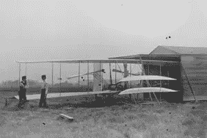

# 什么是 MVP(最小可行产品)？

> 原文：<https://www.sitepoint.com/mvp-minimum-viable-product/>

几周前，我们有幸请到了威尔·戴布尔(Will day ble )( T1 ),向我们介绍他对应用程序设计和 MVP(最小可行产品)的想法。威尔因他的[用户醉酒](http://www.youtube.com/watch?v=r2CbbBLVaPk)视频而声名狼藉。

热情是一件美妙的事情，当你有了一个伟大的核心想法时，你很容易对你的第一个版本要求过高。你想让这东西彻底摇滚，对吧？！？

问题是，复杂的事情会以许多不同的方式失败。如果你曾经看过那些令人痛心的“空难调查”电视节目，你会很好地意识到一架现代飞机可能会出多少看似无关紧要的问题。

莱特兄弟正在制作他们的 MVP。奥维尔:好吧，好吧，好吧……我们至少可以在*有杯托吗？！*

 *莱特兄弟的第一架飞机是制造 MVP 的完美例子。几乎可以肯定的是，如果他们坚持在最早的传单中加入折叠式餐桌和点心车，他们就不会进行著名的首次飞行。值得庆幸的是，他们专注于他们 MVP 最基本的功能，剩下的就是航空历史。

因此，跟随威尔，他将向你展示将你的项目削减到最低限度的基本过程。

享受吧。

[//www.youtube.com/embed/jHyU54GhfGs?rel=0](//www.youtube.com/embed/jHyU54GhfGs?rel=0)* 

## *分享这篇文章*