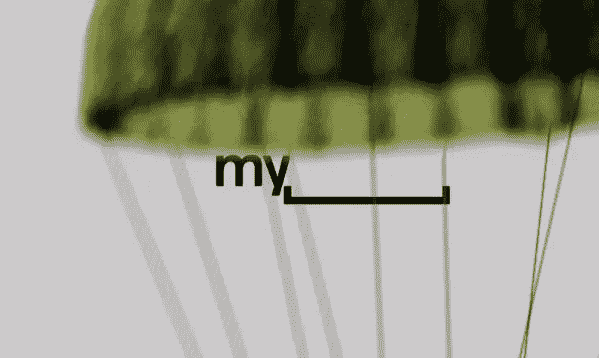
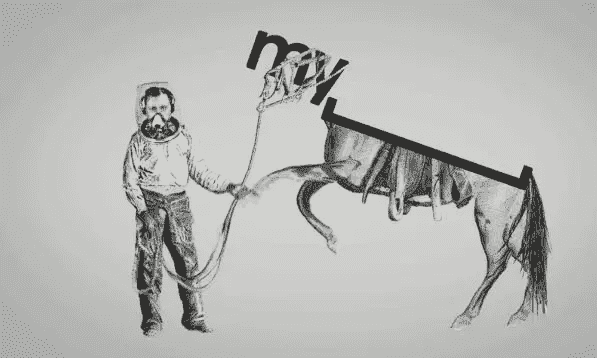
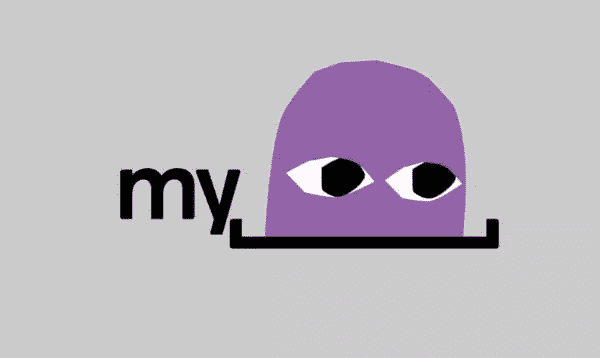
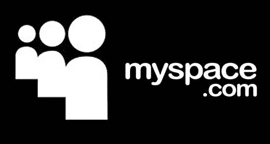
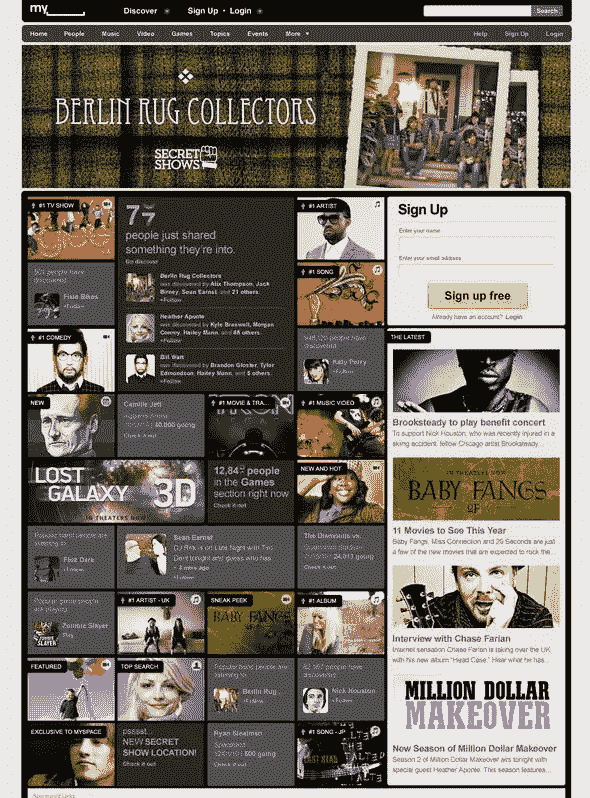

# MySpace 成为我的 _ &获得了新的标识和网站重新设计

> 原文：<https://www.sitepoint.com/myspace-becomes-my-gets-a-new-logo-and-site-redesign/>

新的一天，新的重新设计的标志。今天，轮到了社交媒体网站 Myspace，或者将来会被称为，带有小写字母“s”的 MySpace。与脸书和 Twitter 等网站相比，MySpace 已经落后于时代，正试图东山再起。昨天，该网站宣布了一项改造计划(包括新的标志)，并表示它将不再试图与上述社交网络竞争，而是将努力成为“y 一代的社交娱乐目的地”。Myspace 近年来在视频和音频页面上推广乐队方面取得了成功，但在设计方面一直是一团糟。未来将会强调它的优势，放弃网站的一些社交网络方面。在昨天发布的[视频中，我们可以看到 My_ logo(它实际上更像一个侧括号，而不是下划线)以各种姿势出现，卡通人物、舞者和直升机与“空间”互动](http://www.myspace.com/index.cfm?fuseaction=vids.individual&videoId=106899829)*新的 My_ logo 作为昨天视频发布的动画*  *旧的 logo* 就这样告别了三个圆头人，向方括号问好。我不得不承认，乍一看，我确实在想“亲爱的上帝，那是什么？”但奇怪的是，我开始喜欢它了。可能是因为我喜欢的视频，也可能是因为新外观的简洁。这是 Myspace 相当大的变化和相当大胆的举措。它让你觉得少了点什么，那就是空间。如果你的观众已经熟悉这个名字，大概这样的事情会更容易实现。

> 徽标中的括号代表一个人们可以表达自己的空间，使用户能够个性化徽标并使其成为自己的——就像他们在 Myspace 上一样。

在该公司首席执行官迈克·琼斯的一份声明中，他说，“Myspace 是独一无二的，因为它是由我们用户的热情所驱动的，他们通过表达兴趣，分享关于特定主题的品味和知识，以及寻找新兴的亚文化来编写网站，”琼斯在声明中说。“这只是第一步，还会有更多的功能、程序和改进。”该网站的重新设计正在进行中，将于 11 月底在全球范围内推出，并将为用户提供以个人娱乐为主的主页，根据他们的兴趣进行更新。从截图来看，我看到它看起来像一个更干净的设计，尽管仍然保留了相当多的信息，新的标志也很合适。  **你觉得新 logo 怎么样？你是 Myspace 用户还是觉得现在已经无关紧要了？**

## 分享这篇文章