# 使用 PHP 和 MySQL 构建自己的数据库驱动网站，第 3 部分:PHP 简介

> 原文：<https://www.sitepoint.com/mysql-3-getting-started-php/>

在[第一章:安装](https://www.sitepoint.com/article/php-amp-mysql-1-installation/)中，我们安装并设置了两个软件程序:带有 PHP 的 Apache web 服务器和 MySQL 数据库服务器。在[第 2 章:介绍 MySQL](https://www.sitepoint.com/article/getting-started-mysql/) 中，我向您展示了如何使用结构化查询语言(SQL)处理 MySQL 数据库。现在，有趣的事情开始了。在这一章中，我将向你介绍 PHP 脚本语言，你可以用它来构建动态网页，向你的访问者展示最新的信息。

如果你想离线阅读本教程，你可以[下载 PDF 格式的章节](https://www.sitepoint.com/books/phpmysql4/samplechapters.php)。

PHP 是一种服务器端语言。这个概念可能有点难以理解，尤其是如果您习惯于只使用 HTML、CSS 和 JavaScript 等客户端语言来设计页面。

服务器端语言类似于 JavaScript，它允许你将小程序(脚本)嵌入到网页的 HTML 代码中。当执行时，这些程序可以让你比 HTML 更好地控制浏览器窗口中显示的内容。JavaScript 和 PHP 的关键区别在于加载网页的阶段，在这个阶段执行这些嵌入式程序。

从 web 服务器下载网页(嵌入式程序和所有程序)后，客户端语言(如 JavaScript)由 web 浏览器读取和执行。相比之下，像 PHP 这样的服务器端语言是在将网页发送到浏览器之前由 web 服务器运行的。客户端语言允许您控制页面在浏览器中显示后的行为，而服务器端语言允许您在页面发送到浏览器之前动态生成定制页面。

一旦 web 服务器执行了嵌入在 web 页面中的 PHP 代码，该代码的执行结果将取代页面中的 PHP 代码。当浏览器收到页面时，看到的只是标准的 HTML 代码，因此得名:服务器端语言。让我们回头看看第一章[中的`today.php`示例，安装](https://www.sitepoint.com/article/php-amp-mysql-1-installation/):

```
<!DOCTYPE html PUBLIC "-//W3C//DTD XHTML 1.0 Strict//EN" 

    "https://www.w3.org/TR/xhtml1/DTD/xhtml1-strict.dtd"> 

<html  xml:lang="en" lang="en"> 

  <head> 

    <title>Today&rsquo;s Date</title> 

    <meta http-equiv="content-type" 

        content="text/html; charset=utf-8"/> 

  </head> 

  <body> 

    <p>Today&rsquo;s date (according to this web server) is 

      <?php 

      echo date('l, F dS Y.'); 

      ?> 

    </p> 

  </body> 

</html>
```

其中大部分是普通的 HTML 但是，`<?php`和`?>`之间的线是 PHP 代码。`<?php`标志着一个嵌入式 PHP 脚本的开始，`?>`标志着这样一个脚本的结束。web 服务器被要求解释这两个分隔符之间的所有内容，并在将网页发送到请求浏览器之前将其转换为常规的 HTML 代码。浏览器将显示以下内容:

```
<!DOCTYPE html PUBLIC "-//W3C//DTD XHTML 1.0 Strict//EN" 

    "https://www.w3.org/TR/xhtml1/DTD/xhtml1-strict.dtd"> 

<html  xml:lang="en" lang="en"> 

  <head> 

    <title>Today&rsquo;s Date</title> 

    <meta http-equiv="content-type" 

        content="text/html; charset=utf-8"/> 

  </head> 

  <body> 

    <p>Today&rsquo;s Date (according to this web server) is 

      Wednesday, April 1st 2009\.    </p> 

  </body> 

</html>
```

注意，PHP 代码的所有符号都消失了。在它的位置，出现了脚本的输出，它看起来就像标准的 HTML。这个例子展示了服务器端脚本的几个优点:

**没有浏览器兼容性问题**

PHP 脚本由 web 服务器单独解释，所以不需要担心访问者的浏览器是否支持您使用的语言。

**访问服务器端资源**

在上面的例子中，我们根据 web 服务器将日期放入 web 页面。如果我们使用 JavaScript 插入日期，我们只能根据运行 web 浏览器的计算机来显示日期。当然，还有更多利用服务器端资源的令人印象深刻的例子；更好的例子可能是插入从 MySQL 数据库中提取的内容(提示，提示…)。

**客户端负载减少**

JavaScript 会显著延迟网页在较慢计算机上的显示，因为浏览器必须先运行该脚本才能显示网页。使用服务器端代码，这一负担被传递给 web 服务器，您可以根据应用程序的需要使它变得足够强大。

##### 基本语法和语句

任何了解 C、C++、C#、Java、JavaScript、Perl 或任何其他 C 派生语言的人都会非常熟悉 PHP 语法。如果您对这些语言中的任何一种都不熟悉，或者一般来说您是编程新手，那么没有必要为此担心！

PHP 脚本由一系列命令或语句组成。每条语句都是一条指令，web 服务器必须遵循这条指令才能进入下一条语句。PHP 语句和上述语言中的语句一样，总是以分号(`;`)结尾。

这是一个典型的 PHP 语句:

```
echo 'This is a <strong>test</strong>!';
```

这是一个`echo`语句，用来生成要发送给浏览器的内容(通常是 HTML 代码)。一个`echo`语句简单地获取给定的文本，并将其插入到页面的 HTML 代码中包含它的 PHP 脚本的位置。

在本例中，我们提供了一个要输出的文本字符串:`'This is a <strong>test</strong>!'`。注意，文本字符串包含 HTML 标签(`<strong>`和`</strong>`)，这是完全可以接受的。因此，如果我们将这条语句放到一个完整的网页中，结果代码如下:

```
<!DOCTYPE html PUBLIC "-//W3C//DTD XHTML 1.0 Strict//EN" 

    "https://www.w3.org/TR/xhtml1/DTD/xhtml1-strict.dtd"> 

<html  xml:lang="en" lang="en"> 

  <head> 

    <title>Simple PHP Example</title> 

    <meta http-equiv="content-type" 

        content="text/html; charset=utf-8"/> 

  </head> 

  <body> 

    <p><?php echo 'This is a <strong>test</strong>!'; ?></p> 

  </body> 

</html> 
```

如果您将此文件放在 web 服务器上，请求该页面的浏览器将会收到以下内容:

```
<!DOCTYPE html PUBLIC "-//W3C//DTD XHTML 1.0 Strict//EN" 

    "https://www.w3.org/TR/xhtml1/DTD/xhtml1-strict.dtd"> 

<html  xml:lang="en" lang="en"> 

  <head> 

    <title>Simple PHP Example</title> 

    <meta http-equiv="content-type" 

        content="text/html; charset=utf-8"/> 

  </head> 

  <body> 

    <p>This is a <strong>test</strong>!</p> 

  </body> 

</html>
```

我们之前看到的例子包含了一个稍微复杂一点的 echo 语句:

```
echo date('l, F dS Y.');
```

该语句调用一个名为`date`的内置函数，并向其传递一个文本字符串:`'l, F dS Y.'`，而不是给`echo`一个简单的文本字符串。您可以将内置函数想象成 PHP 知道如何完成的任务，而无需您详细说明。PHP 有许多内置函数，可以让你做任何事情，从发送电子邮件到处理存储在各种类型的数据库中的信息。

当你在 PHP 中调用一个函数时，我们说你正在调用那个函数。大多数函数在被调用时都会返回值；然后 PHP 在执行语句时用该值替换函数调用。在这种情况下，我们的`echo`语句包含对`date`函数的调用，该函数以文本字符串的形式返回当前日期(其格式由函数调用中的文本字符串指定)。因此，`echo`语句输出函数调用返回的值。

您可能想知道为什么我们需要用括号(`()`)和单引号(`''`)将文本字符串括起来。和在 SQL 中一样，引号在 PHP 中用来标记文本字符串的开始和结束，所以引号的存在是有意义的。括号有两个用途。首先，它们表明`date`是一个你想要调用的函数。其次，它们标记了您希望提供的参数(或自变量)列表的开始和结束，以便告诉函数要做什么。对于 date 函数，您需要提供一个文本字符串来描述您希望日期显示的格式。日期功能的[在线文档中提供了完整参考。稍后，我们将查看接受多个参数的函数，我们将用逗号分隔这些参数。我们还会考虑不带任何参数的函数。这些函数仍然需要括号，尽管没有必要在它们之间键入任何内容。](http://www.php.net/date/)

##### 变量、运算符和注释

PHP 中的变量与大多数其他编程语言中的变量是相同的。对于门外汉来说，变量可以被认为是一个虚构的盒子的名字，任何文字值都可以放在这个盒子里。下面的语句创建了一个名为`$testvariable`的变量(PHP 中的所有变量名都以美元符号开头)，并为它指定了一个文字值`3`:

```
$testvariable = 3;
```

PHP 是一种松散类型的语言。这意味着单个变量可以包含任何类型的数据，可以是数字、文本字符串或其他类型的值，并且可以在其生命周期内改变类型。因此，如果您在上面的语句之后键入下面的语句，它会为现有的`$testvariable`赋予一个新值。在这个过程中，变量改变了类型:它以前包含一个数字，现在包含一个文本字符串:

```
$testvariable = 'Three';
```

我们在最后两条语句中使用的等号叫做赋值操作符，因为它是用来给变量赋值的。其他运算符可用于对值执行各种数学运算:

```
$testvariable = 1 + 1;  // Assigns a value of 2 

$testvariable = 1 - 1;  // Assigns a value of 0 

$testvariable = 2 * 2;  // Assigns a value of 4 

$testvariable = 2 / 2;  // Assigns a value of 1
```

从上面的例子中，你大概可以看出`+`是加法运算符，`-`是减法运算符，`*`是乘法运算符，`/`是除法运算符。这些都被称为算术运算符，因为它们对数字执行算术运算。

上面的每一行都以注释结束。注释是描述代码正在做什么的一种方式。他们在你的代码中插入解释文本 PHP 解释器会忽略这些文本。注释以//开始，并在同一行的末尾结束。如果你需要一个跨越几行的注释，你可以用`/*`开始注释，用`*/`结束。PHP 解释器将忽略这两个分隔符之间的所有内容。我将在本书的其余部分使用注释来帮助解释我所展示的一些代码。

回到操作符，还有另一个将文本字符串连接在一起的操作符，称为字符串连接操作符:

```
$testvariable = 'Hi ' . 'there!';  // Assigns a value of 'Hi there!'
```

变量几乎可以用在任何使用文字值的地方。考虑这一系列陈述:

```
$var1 = 'PHP';          // Assigns a value of 'PHP' to $var1 

$var2 = 5;              // Assigns a value of 5 to $var2 

$var3 = $var2 + 1;      // Assigns a value of 6 to $var3 

$var2 = $var1;          // Assigns a value of 'PHP' to $var2 

echo $var1;             // Outputs 'PHP' 

echo $var2;             // Outputs 'PHP' 

echo $var3;             // Outputs '6' 

echo $var1 . ' rules!'; // Outputs 'PHP rules!' 

echo "$var1 rules!";    // Outputs 'PHP rules!' 

echo '$var1 rules!';    // Outputs '$var1 rules!'
```

请特别注意最后两行。如果用双引号而不是单引号将字符串括起来，可以将变量名包含在文本字符串中，并将值插入到它的位置。将变量名转换为变量值的过程称为变量插值。但是，正如最后一行所示，用单引号括起来的字符串不会插入它所包含的变量名。

##### 数组

数组是一种包含多个值的特殊变量。如果你把一个变量想象成一个包含一个值的盒子，那么一个数组就可以想象成一个有隔间的盒子，每个隔间可以存储一个单独的值。

在 PHP 中创建数组最简单的方法是使用内置的`array`函数:

```
$myarray = array('one', 2, '3');
```

这段代码创建了一个名为`$myarray`的数组，其中包含三个值:`'one'`、`2`和`'3'`。就像普通变量一样，数组中的每个空格可以包含任何类型的值。在这种情况下，第一个和第三个空格包含字符串，而第二个包含数字。

要访问存储在数组中的值，需要知道它的索引。通常，数组使用从零开始的数字作为索引来指向它们包含的值。也就是说，数组的第一个值(或元素)有索引`0`，第二个有索引`1`，第三个有索引`2`，依此类推。所以一般来说，一个数组的第 n 个元素的索引是`n–1`。一旦知道了感兴趣的值的索引，就可以通过将该索引放在数组变量名后面的方括号中来检索该值:

```
echo $myarray[0];       // Outputs 'one' 

echo $myarray[1];       // Outputs '2' 

echo $myarray[2];       // Outputs '3'
```

存储在数组中的每个值称为该数组的一个元素。您可以使用方括号中的索引来添加新元素，或者为现有数组元素分配新值:

```
$myarray[1] = 'two';    // Assign a new value 

$myarray[3] = 'four';   // Create a new element
```

您可以像往常一样使用赋值运算符将元素添加到数组的末尾，但是变量名后面的方括号要留空:

```
$myarray[] = 'the fifth element'; 

echo $myarray[4];       // Outputs 'the fifth element'
```

然而，数字只是数组索引最常见的选择；还有一种可能。你也可以使用字符串作为索引来创建所谓的关联数组。这种类型的数组称为关联数组，因为它将值与有意义的索引相关联。在本例中，我们将日期(以字符串形式)与三个名称相关联:

```
$birthdays['Kevin'] = '1978-04-12'; 

$birthdays['Stephanie'] = '1980-05-16'; 

$birthdays['David'] = '1983-09-09';
```

array 函数还允许您创建关联数组，如果您喜欢这种方法的话。下面是我们如何使用它来创建`$birthdays`数组:

```
$birthdays = array('Kevin' => '1978-04-12', 

    'Stephanie' => '1980-05-16', 'David' => '1983-09-09');
```

现在，如果我们想知道 Kevin 的生日，我们使用姓名作为索引来查找:

```
echo 'My birthday is: ' . $birthdays['Kevin'];
```

这种类型的数组对于 PHP 中的用户交互尤其重要，我们将在下一节中看到。我将在本书中演示数组的其他用途。

##### 用户交互和表单

对于目前大多数数据库驱动的网站，你需要做的不仅仅是基于数据库数据动态生成页面；你还必须提供一定程度的交互性，即使它只是一个搜索框。

JavaScript 老手倾向于从事件处理程序的角度考虑交互性，事件处理程序让您直接对用户的动作做出反应——例如，光标在页面上的链接上的移动。当涉及到对用户交互的支持时，服务器端脚本语言(如 PHP)的范围更有限。因为 PHP 代码只有在向服务器发出请求时才被激活，所以用户交互只能以来回的方式进行:用户向服务器发送请求，服务器用动态生成的页面进行回复。

***Ajax 的崛起***
*某种程度上，过去几年 Ajax 技术在 JavaScript 世界的崛起改变了这一点。JavaScript 代码现在可以响应用户的动作，比如鼠标移动，向 web 服务器发送请求，调用 PHP 脚本。然而，出于本书的目的，我们将坚持使用非 Ajax 应用程序。如果您想学习如何使用 PHP 和 Ajax，请查看 Matthew Eernisse 的文章[构建您自己的 AJAX Web 应用程序](https://www.sitepoint.com/books/ajax1/)(墨尔本:SitePoint，2006)。*

用 PHP 创建交互性的关键是理解我们可以用来发送用户交互信息以及新网页请求的技术。事实证明，PHP 让这变得相当容易。

我们可以用来发送信息和页面请求的最简单的方法是使用 URL 查询字符串。如果您曾经看到过一个 URL 的文件名后面有一个问号，那么您就见证了这种技术的使用。例如，如果您在 Google 上搜索“SitePoint ”,它会将您带到以下 URL 来查看搜索结果:

```
http://www.google.com/search?hl=en&q=SitePoint&btnG=Google+Search&meta=
```

看到网址里的问号了吗？看看问号后面的文本是如何包含诸如您的搜索查询(`SitePoint`)和您点击的按钮名称(`Google+Search`)之类的内容的？这些信息将和对`http://www.google.com/search`的请求一起发送。

让我们自己编写一个简单的例子。创建一个名为`welcome1.html`的常规 HTML 文件(不需要`.php`文件扩展名，因为该文件中没有 PHP 代码)并插入以下链接:

```
<a href="welcome1.php?name=Kevin">Hi, I&rsquo;m Kevin!</a>
```

这是一个到名为`welcome1.php`的文件的链接，但是除了链接到该文件之外，您还将一个变量与页面请求一起传递。变量作为查询字符串的一部分传递，查询字符串是 URL 中问号后面的部分。这个变量叫做`name`，它的值是`Kevin`。重申一下，您已经创建了一个加载`welcome1.php`的链接，并通知该文件中包含的 PHP 代码`name`等于`Kevin`。

要真正理解这个环节的效果，需要看一下`welcome1.php`。将它创建为一个新的 HTML 文件，但是，这一次，注意文件扩展名`.php`——这告诉 web 服务器它可以解释文件中的一些 PHP 代码。在这个新网页的`<body>`中，键入以下内容:

```
<?php  

$name = $_GET['name'];  

echo 'Welcome to our web site, ' . $name . '!';  

?>
```

现在，将这两个文件(`welcome1.html`和`welcome1.php`)放到您的 web 服务器上，并在您的浏览器中加载第一个文件(URL 应该类似于`http://localhost/welcome1.html`，或者如果您的 web 服务器运行在`80`之外的端口上，则类似于`http://localhost:8080/welcome1.html`)。单击第一页中的链接来请求 PHP 脚本。您应该看到结果页面显示“欢迎访问我们的网站，Kevin！”，如下图所示。

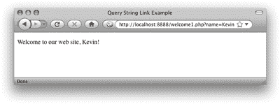

让我们仔细看看使这成为可能的代码。最重要的一行是这一行:

```
$name = $_GET['name'];
```

如果您密切关注“数组”一节，您会认识到这一行是干什么的。它将存储在名为`$_GET`的数组的“`name`”元素中的值赋给一个名为`$name`的新变量。但是`$_GET`阵从何而来？

原来`$_GET`是 PHP 从浏览器接收请求时自动创建的变量之一。PHP 将`$_GET`创建为一个数组变量，其中包含查询字符串中传递的任何值。`$_GET`是一个关联数组，所以查询字符串中传递的 name 变量的值可以作为`$_GET['name']`来访问。您的`welcome1.php`脚本将这个值赋给一个普通的 PHP 变量(`$name`)，然后使用`echo`语句将它显示为文本字符串的一部分:

```
echo 'Welcome to our web site, ' . $name . '!';
```

使用字符串连接操作符(`.`)将`$name`变量的值插入到输出字符串中，我们在“变量、操作符和注释”一节中看到了该操作符。

但是要小心！这段代码中潜伏着一个安全漏洞！尽管 PHP 是一种容易学习的编程语言，但事实证明，如果您不知道应该采取什么预防措施，使用 PHP 也很容易给网站带来安全问题。在我们继续学习这门语言之前，我想确保您能够发现并修复这个特殊的安全问题，因为这可能是当今网络上最常见的安全问题。

这里的安全问题源于这样一个事实，即`welcome1.php`脚本正在生成一个包含受用户控制的内容的页面——在本例中，是由`$name`变量控制的。虽然`$name`变量通常会从`welcome1.html`页面上链接的 URL 查询字符串中获得值，但是恶意用户可以编辑 URL 来为`name`变量发送不同的值。

要查看这是如何工作的，再次点击`welcome1.html`中的链接。当您看到生成的页面(带有包含姓名“Kevin”的欢迎消息)时，请查看浏览器地址栏中的 URL。它应该看起来像这样:

```
http://localhost/welcome1.php?name=Kevin
```

编辑 URL，在名称前插入一个`<b>`标记，在名称后插入一个`</b>`标记，如下所示:

```
http://localhost/welcome1.php?name=<b>Kevin</b>
```

按 Enter 键加载这个新的 URL，注意页面中的名称现在是粗体的，如下所示。


看到这里发生了什么吗？用户可以在 URL 中键入任何 HTML 代码，而您的 PHP 脚本会毫无疑问地将它包含在生成的页面的代码中。如果代码像一个`<b>`标签一样无害，那就没有问题，但是恶意用户可能会包含复杂的 JavaScript 代码，这些代码会执行恶意操作，比如窃取用户的密码。那么，攻击者所要做的就是在攻击者控制下的其他站点上发布修改后的链接，然后引诱您的某个用户点击它。攻击者甚至可以将链接嵌入到电子邮件中并发送给您的用户。如果您的某个用户点击了该链接，攻击者的代码就会包含在您的页面中，陷阱就会被触发！

我不想用恶意黑客攻击你的用户来吓唬你，尤其是当你刚刚开始学习这门语言的时候。然而，事实是，作为一种语言，PHP 最大的弱点是很容易引入这样的安全问题。有些人可能会说，你花在学习按照专业标准编写 PHP 的大部分精力都花在了避免安全问题上。然而，你越早接触这些问题，你就越早习惯于回避它们，它们就越不会成为你前进的绊脚石。

那么，我们如何生成一个包含用户名的页面，而不被攻击者滥用呢？解决方案是将为`$name`变量提供的值视为要在页面上显示的纯文本，而不是包含在页面代码中的 HTML。这是一个微妙的区别，所以让我告诉你我的意思。

复制您的`welcome1.html`文件，并将其重命名为`welcome2.html`。编辑它包含的链接，使它指向`welcome2.php`而不是`welcome1.php`:

```
<a href="welcome2.php?name=Kevin">Hi, I&rsquo;m Kevin!</a>
```

复制您的`welcome1.php`文件，并将其重命名为`welcome2.php`。编辑它包含的 PHP 代码，如下所示:

```
<?php  

$name = $_GET['name'];  

echo 'Welcome to our web site, ' .  

    htmlspecialchars($name, ENT_QUOTES, 'UTF-8') . '!';  

?>
```

这段代码中有很多内容，所以让我来给你分解一下。第一行和之前一样，将来自`$_GET`数组的元素`name`的值赋给`$name`。但是，它后面的 echo 语句完全不同。之前，我们只是简单地将`$name`变量裸转储到`echo`语句中，这个版本的代码使用内置的 PHP 函数`htmlspecialchars`来执行关键转换。

请记住，安全漏洞来自于这样一个事实，即在`welcome1.php`中，`$name`变量中的 HTML 代码被直接转储到生成页面的代码中，因此可以做 HTML 代码可以做的任何事情。`htmlspecialchars`所做的是将类似于`<`、`>`的“特殊 HTML 字符”转换成类似于`&lt;`、`&gt;`的 HTML 字符实体，防止它们被浏览器解释为 HTML 代码。一会儿我会给你们演示一下。

首先，让我们仔细看看这个新代码。对`htmlspecialchars`函数的调用是本书中第一个使用多个参数的 PHP 函数的例子。下面是函数调用本身:

```
htmlspecialchars($name, ENT_QUOTES, 'UTF-8')
```

第一个参数是`$name`变量(要转换的文本)。第二个参数是 PHP 常量`ENT_QUOTES`，它告诉`htmlspecialchars`转换单引号和双引号以及其他特殊字符。PHP 常量就像一个变量，它的值是不能改变的。与变量不同，常量不以美元符号开头。PHP 附带了许多内置常量，如`ENT_QUOTES`，用于控制内置函数，如`htmlspecialchars`。第三个参数是字符串`'UTF-8'`，它告诉 PHP 使用什么字符编码来解释您给它的文本。

***用 PHP 开发 UTF-8 的好处和陷阱***

*你可能已经注意到，本书中所有的 HTML 示例页面都在顶部附近包含了下面的`<meta>`标签:*

```
<meta http-equiv="content-type" content="text/html; charset=utf-8"/>
```

这个标签告诉接收这个页面的浏览器，这个页面的 HTML 代码被编码为 UTF 8 文本。UTF-8 是在计算机内存中将文本表示为一系列 1 和 0 的许多标准之一，称为字符编码。如果你想了解所有关于字符编码的知识，请查看[网页字符编码权威指南](https://www.sitepoint.com/article/guide-web-character-encoding/)。

再过几页，我们将到达构建 HTML 表单的部分。通过将您的页面编码为 UTF-8，您的用户可以提交包含数千个外国字符的文本，否则您的站点将无法处理这些文本。

*不幸的是，PHP 的许多内置函数，比如`htmlspecialchars`，默认假设您使用的是更简单的 ISO-8859-1 字符编码。因此，当你使用这些功能时，你需要让他们知道你正在使用 UTF-8。*

如果可以的话，你还应该告诉你的文本编辑器将你的 HTML 和 PHP 文件保存为 UTF-8 编码的文本，但是只有当你想在你的 HTML 或 PHP 代码中输入高级字符(如弯引号或破折号)或外来字符(如“γ”)时才需要这样做。本书中的代码为了安全起见，使用了 HTML 字符实体(例如，【T2；对于一个右引号)，不管怎样它都会起作用。

在浏览器中打开`welcome2.html`，点击现在指向`welcome2.php`的链接。您将再次看到欢迎信息“欢迎访问我们的网站，Kevin！”。正如您之前所做的，修改 URL，在名称周围包含`<b>`和`</b>`标记:

```
http://localhost/welcome2.php?name=<b>Kevin</b>
```

这一次，当您按 Enter 键时，您应该看到您键入的实际文本，而不是页面中的名称变成粗体，如下所示。

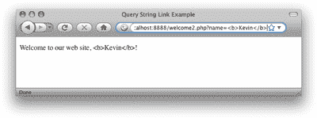

如果您查看页面的源代码，您可以确认`htmlspecialchars`函数完成了它的工作，将提供的名称中的“`<`和“`>`”字符分别转换成了`&lt;`和`&gt;` HTML 字符实体。这可以防止恶意用户将不需要的代码注入到您的站点中。如果他们尝试这样做，代码会无害地显示为页面上的纯文本。

我们将在本书中广泛使用`htmlspecialchars`函数来防范这种安全漏洞。如果你现在还不能掌握如何使用它的细节，不必太担心。不久，你会发现它的使用成为第二天性。现在，让我们来看看一些更高级的方法，在我们请求时将值传递给 PHP 脚本。

在查询字符串中传递单个变量很好，但是事实证明，如果您愿意，您可以传递多个值！让我们看一下上一个例子的稍微复杂一点的版本。将您的`welcome2.html`文件的副本保存为`welcome3.html`，并使用如下查询字符串将链接更改为指向`welcome3.php`:

```
<a href="welcome3.php?firstname=Kevin&amp;lastname=Yank">Hi, I&rsquo;m Kevin Yank!</a>
```

这次，我们的链接传递了两个变量:`firstname`和`lastname`。查询字符串中的变量由一个&符号(`&`，在 HTML 中必须写成`&amp;`)分隔。通过用“与”符号将每一个`name=value`对与下一个分开，您可以传递更多的变量。

和以前一样，我们可以在我们的`welcome3.php`文件中使用两个变量值:

```
<?php  

$firstname = $_GET['firstname'];  

$lastname = $_GET['lastname'];  

echo 'Welcome to our web site, ' .  

    htmlspecialchars($firstname, ENT_QUOTES, 'UTF-8') . ' ' .  

    htmlspecialchars($lastname, ENT_QUOTES, 'UTF-8') . '!';  

?>
```

echo 语句现在变得相当大，但对您来说仍然有意义。它使用一系列字符串连接(`.`)，输出“欢迎来到我们的网站”，后面是值`$firstname`(使用`htmlspecialchars`使显示变得安全)、一个空格、`$lastname`的值(再次使用`htmlspecialchars`处理)，最后是一个感叹号。

结果如下所示。

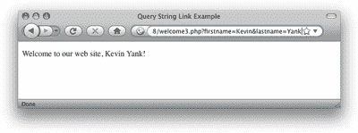

这一切都很好，但是我们仍然没有达到真正的用户交互的目标，用户可以输入任意信息，并由 PHP 处理。继续我们的个性化欢迎消息的例子，我们想邀请用户输入他或她的名字，并让它出现在结果页面中。为了让用户能够输入值，我们需要使用一个 HTML 表单。

创建一个名为`welcome4.html`的新 HTML 文件，并键入以下 HTML 代码来创建表单:

```
<form action="welcome4.php" method="get">  

  <div><label for="firstname">First name:  

    <input type="text" name="firstname" id="firstname"/></label>  

  </div>  

  <div><label for="lastname">Last name:  

    <input type="text" name="lastname" id="lastname"/></label></div>  

  <div><input type="submit" value="GO"/></div>  

</form>
```

***自闭标签***

*出现在这些标签中的斜线(如`<input .../>`)不会引起恐慌。编码网页的 XHTML 标准要求在任何没有结束标签的标签中使用斜线，包括`<input/>`和`<meta/>`标签等等。*

许多开发人员更喜欢按照 HTML 标准编码，而不是采用 XHTML，事实上，这在 web 开发界是一个有争议的问题。即将到来的 HTML 5 标准将选择权留给了开发人员，因此没有一种方法比另一种方法更“正确”。

*如果你对自己做决定时要考虑的因素感到好奇，请查看[SitePoint HTML 参考](https://reference.sitepoint.com/html/html-vs-xhtml)的相关页面。*

这段代码生成的表单如下所示。

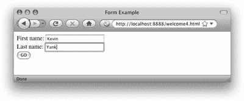

我同意你的看法，这份表格很简单。一些明智的 CSS 应用会使这一页——以及本书的所有其他页面——看起来更有吸引力。然而，因为这是一本关于 PHP 和 MySQL 的书，所以我坚持使用简单的外观。查看 SitePoint 的书籍，如[CSS 的艺术&科学](https://www.sitepoint.com/books/cssdesign1/) (Melbourne: SitePoint，2007)来获得关于用 CSS 设计表单的建议。

还制作了一个`welcome3.php`的副本，命名为`welcome4.php`。这个文件中没有什么需要修改的。

这个表单与我们看到的第二个链接(查询字符串中有`firstname=Kevin&amp;lastname=Yank`)具有完全相同的效果，除了您现在可以输入任何您喜欢的名称。当您单击 submit 按钮(标记为 GO)时，浏览器将加载`welcome4.php`并将变量及其值自动添加到查询字符串中。它从`<input type="text"/>`标签的名称属性中检索变量的名称，并从用户输入文本字段的文本中获取值。

***表单字段中的撇号***

如果你背负着大多数程序员(包括我自己)膨胀的自我，你可能会借此机会在这个表格中输入你自己的名字。谁能怪你呢？

如果你的姓氏碰巧包含一个撇号(例如，莫莉·奥莱利)，你看到的欢迎信息可能在撇号前包含一个杂散的反斜杠(即，“欢迎来到我们的网站，莫莉·奥莱利！”).

*这个烦人的反斜杠是由于一个叫做**魔法引号**的 PHP 安全特性，我们将在[第四章:在网上发布 MySQL 数据](https://www.sitepoint.com/article/publishing-mysql-data-web/)中了解到。在那之前，请原谅我。*

标签的 method 属性用来告诉浏览器如何发送变量和它们的值以及请求。get 值(如上面的`welcome4.html`中所使用的)导致它们在查询字符串中被传递(并出现在 PHP 的`$_GET`数组中)，但是还有一个替代方法。让这些值出现在查询字符串中可能是不可取的，甚至在技术上是不可行的。如果我们在表单中包含一个`<textarea>`标签，让用户输入大量文本，会怎么样？如果一个 URL 的查询字符串包含几个段落的文本，那么这个 URL 就会长得离谱，可能会超过当今浏览器中 URL 的最大长度。另一种方法是让浏览器在幕后以不可见的方式传递信息。

复制一个`welcome4.html`，命名为`welcome5.html`。这个新页面中的表单代码完全相同，但是在上一个示例中我们将表单方法设置为 get，在这里我们将其设置为 post。当然，我们还将动作属性设置为指向`welcome5.php`:

```
<form action="welcome5.php" method="post">  

  <div><label for="firstname">First name:  

    <input type="text" name="firstname" id="firstname"/></label>  

  </div>  

  <div><label for="lastname">Last name:  

    <input type="text" name="lastname" id="lastname"/></label></div>  

  <div><input type="submit" value="GO"/></div>  

</form>
```

method 属性的这个新值指示浏览器不可见地发送表单变量，作为页面请求的一部分，而不是将它们嵌入到 URL 的查询字符串中。

再次，复制一个`welcome4.php`，命名为`welcome5.php`。

由于我们不再将变量作为查询字符串的一部分发送，它们不再出现在 PHP 的`$_GET`数组中。相反，它们被放在另一个专门为“posted”表单变量保留的数组中:`$_POST`。因此，我们必须修改`welcome5.php`来从这个新数组中检索值:

`<?php  
$firstname = $_POST['firstname'];  
$lastname = $_POST['lastname'];  
echo 'Welcome to our web site, ' .  
   htmlspecialchars($firstname, ENT_QUOTES, 'UTF-8') . ' ' .  
   htmlspecialchars($lastname, ENT_QUOTES, 'UTF-8') . '!';  
?>`

下图显示了这个新表单提交后的结果页面。

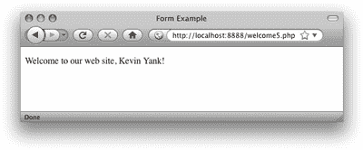

该表单在功能上与前一个相同；唯一的区别是，当用户单击 GO 按钮时加载的页面的 URL 没有查询字符串。一方面，这允许您在表单提交的数据中包含大值或敏感值(如密码)，而不会出现在查询字符串中。另一方面，如果用户将表单提交后的页面加入书签，那么这个书签就没有用了，因为它缺少提交的值。顺便说一句，这是搜索引擎使用查询字符串提交搜索词的主要原因。如果你在 Google 上给一个搜索结果页面加了书签，你可以用那个书签在以后再次执行同样的搜索，因为搜索词包含在 URL 中。

有时，您希望访问一个变量，而不必担心它是作为查询字符串的一部分还是作为表单 post 发送的。在这种情况下，特殊的`$_REQUEST`数组就派上了用场。它包含了在`$_GET`和`$_POST`中出现的所有变量。使用这个变量，我们可以再一次修改表单处理脚本，以便它可以从任意一个源接收用户的名字和姓氏:

```
<?php  

$firstname = $_REQUEST['firstname'];  

$lastname = $_REQUEST['lastname'];  

echo 'Welcome to our web site, ' .  

    htmlspecialchars($firstname, ENT_QUOTES, 'UTF-8') . ' ' .  

    htmlspecialchars($lastname, ENT_QUOTES, 'UTF-8') . '!';  

?>
```

这涵盖了使用表单与 PHP 进行基本用户交互的基础知识。我们将在后面的例子中研究更高级的问题和技术。

##### 控制结构

到目前为止，我们看到的所有 PHP 代码示例要么是向 web 页面输出文本字符串的单语句脚本，要么是按顺序一个接一个执行的一系列语句。如果你曾经用其他语言(JavaScript、C 或 BASIC)编写过程序，你就会知道实际的程序很少这么简单。

就像任何其他编程语言一样，PHP 提供了使您能够影响控制流的工具。也就是说，该语言包含特殊的语句，您可以使用这些语句来偏离到目前为止在我们的示例中占主导地位的一个接一个的执行顺序。这种语句被称为控制结构。不懂？放心吧！几个例子就能很好地说明问题。

最基本、最常用的控制结构是`if`语句。通过 if 语句的程序流程可以如下图所示。

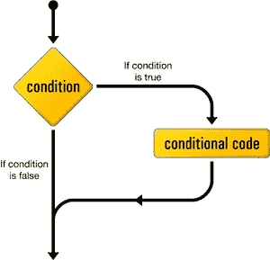

(这张图和这本书里的几个类似的图最初是卡梅隆·亚当斯为我们一起写的书 [Simply JavaScript](https://www.sitepoint.com/books/javascript1/) (墨尔本:SitePoint，2006)设计的。在他的允许下，我在这里重新使用了它们，我表示感谢。)

PHP 代码中的`if`语句是这样的:

```
if (condition)   

{   

  // conditional code to be executed if condition is true   

}
```

这个控制结构让我们告诉 PHP 只有在满足某些条件时才执行一组语句。

如果您愿意暂时满足我的虚荣心，这里有一个例子，它显示了我们之前创建的个性化欢迎页面的一个变形。首先制作一个名为`welcome7.html`的`welcome6.html`副本。为了简单起见，让我们改变它包含的表单，以便它向`welcome7.php`提交单个名称变量:

```
<form action="welcome7.php" method="post">   

  <div><label for="name">Name:   

    <input type="text" name="name" id="name"/></label></div>   

  <div><input type="submit" value="GO"/></div>   

</form>
```

现在做一个`welcome6.php`的副本叫做`welcome7.php`。用下面的代码替换它包含的 PHP 代码:

```
$name = $_REQUEST['name'];   

if ($name == 'Kevin')   

{   

  echo 'Welcome, oh glorious leader!';   

}
```

现在，如果传递给页面的 name 变量的值为`'Kevin'`，将显示一条特殊消息，如下所示。

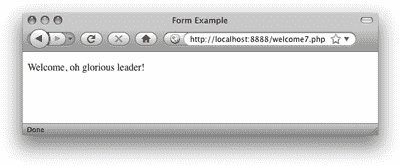

如果输入 Kevin 以外的名字，这个例子将变得不友好——`if`语句中的条件代码将无法执行，结果页面将是空白的！

为了向所有与 Kevin 同名的平民提供空白页的替代，我们可以使用一个`if-else`语句来代替。一条`if-else`语句的结构如下所示。

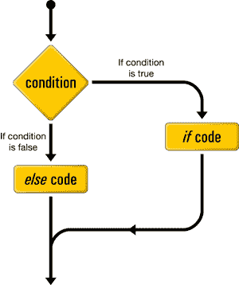

`if-else`语句的 else 部分被附加到`if`部分的末尾，如下所示:

```
$name = $_REQUEST['name'];   

if ($name == 'Kevin')   

{   

  echo 'Welcome, oh glorious leader!';   

}   

else   

{   

  echo 'Welcome to our web site, ' .   

      htmlspecialchars($name, ENT_QUOTES, 'UTF-8') . '!';   

}
```

现在，如果您提交的名字不是 Kevin，您应该会看到如下所示的欢迎消息。


上面条件中使用的`==`是等号运算符，用于比较两个值，看它们是否相等。
双重麻烦

记得键入双等号(`==`)。初级 PHP 程序员的一个常见错误是用一个等号键入这样的条件:

```
if ($name = 'Kevin')     // Missing equals sign!
```

这个条件使用了赋值操作符(`=`)，这是我在“变量、操作符和注释”一节中介绍的，而不是等号操作符(`==`)。因此，它不是将`$name`的值与字符串‘凯文’进行比较，而是将`$name`的值设置为`'Kevin'`。哎呀！

更糟糕的是，`if`语句将使用这个赋值操作作为条件，它将认为这是真的，因此`if`语句内的条件代码将总是被执行，而不管`$name`的初始值碰巧是什么。

条件可能比单一的相等检查更复杂。回想一下，我们前面的例子会收到一个名和一个姓。如果我们想只为一个特定的人显示一条特殊的消息，我们必须检查两个名字的值。

为此，首先制作一个名为`welcome8.html`的`welcome6.html`(包含表单的两字段版本)的副本。将`<form>`标签的动作属性改为指向`welcome8.php`。接下来，制作一个名为`welcome8.php`的`welcome7.php`副本，并更新 PHP 代码以匹配以下内容:

```
$firstname = $_REQUEST['firstname'];   

$lastname = $_REQUEST['lastname'];   

if ($firstname == 'Kevin' and $lastname == 'Yank')   

{   

  echo 'Welcome, oh glorious leader!';   

}   

else   

{   

  echo 'Welcome to our web site, ' .   

      htmlspecialchars($firstname, ENT_QUOTES, 'UTF-8') . ' ' .   

      htmlspecialchars($lastname, ENT_QUOTES, 'UTF-8') . '!';   

}
```

当且仅当`$firstname`的值为`'Kevin'`并且`$lastname`的值为`'Yank'`时，更新后的条件才会成立。只有当两个比较都为真时，条件中的 and 运算符才会使整个条件为真。一个类似的操作符是 or 操作符，如果两个简单条件中的一个或两个都为真，则整个条件为真。如果您更熟悉这些操作符的 JavaScript 或 C 形式(分别用`&&`和`||`表示 and 和 or)，这没问题——它们在 PHP 中也可以工作。

下图显示，在这个例子中，只有一个名字是正确的，但这并不能解决问题。

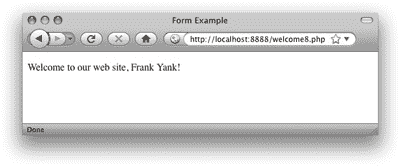

必要时，我们会考虑更复杂的情况。目前，对`if-else`语句有一个大致的了解就足够了。

另一个常用的 PHP 控制结构是`while`循环。`if-else`语句允许我们根据某些条件选择是否执行一组语句，而`while`循环允许我们使用一个条件来决定重复执行一组语句的次数。

下图显示了 while 循环的工作方式。

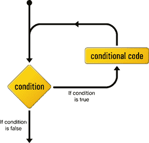

下面是`while`循环在代码中的样子:

```
while (condition)   

{   

  // statement(s) to execute repeatedly as long as condition is true   

}
```

`while`循环的工作方式与`if`语句非常相似。当条件为真且语句被执行时，差异就出现了。不再继续执行右大括号(`}`)后面的语句，而是再次检查条件。如果条件仍然为真，则第二次、第三次执行语句，并且只要条件保持为真，就会继续执行。条件第一次评估`false`(无论是第一次检查，还是第 101 次)，执行会立即跳转到`while`循环后面的语句，在右大括号之后。

当你处理一长串条目时(比如存储在数据库中的笑话…提示，提示)，这样的循环很方便，但是现在我将用一个简单的例子来说明，数到十:

```
$count = 1;   

while ($count <= 10)   

{   

  echo "$count ";   

  ++$count;   

}
```

我知道这段代码看起来有点吓人，但是让我一行一行地告诉你:

```
$count = 1;
```

第一行创建了一个名为$count 的变量，并赋予它一个值`1`。
while ( `$count <= 10`)

第二行是一个`while`循环的开始，其条件是`$count`的值小于或等于(`<=`)到`10`。
`{`

左括号标志着`while`循环的条件代码块的开始。这种条件代码通常被称为循环体，只要条件成立，就会被反复执行。

`echo "$count ";`

这一行只是输出`$count`的值，后面跟一个空格。为了使代码尽可能具有可读性，我使用了一个双引号字符串来利用变量插值(如“变量、操作符和注释”一节中所解释的)，而不是使用字符串连接操作符。
`++$count`；

第四行给`$count`的值加 1(`++$count`是`$count = $count + 1`的快捷方式——两者都可以)。


右大括号标志着 while 循环体的结束。

这是这段代码执行时的情况。第一次检查条件时，`$count`的值是`1`，所以条件肯定是真的。输出`$count` ( `1`)的值，$count 被赋予新的值`2`。第二次检查时，条件仍然为真，因此输出值(`2`)并分配一个新值(`3`)。这个过程继续，输出值`3`、`4`、`5`、`6`、`7`、`8`、`9`和`10`。最后，`$count`被赋予值`11`，发现条件为假，结束循环。

代码的最终结果如下所示。

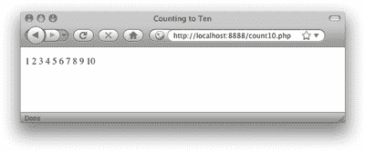

本例中的条件使用了一个新运算符:`<=`(小于或等于)。这种类型的其他数值比较运算符包括`>=`(大于或等于)、`<`(小于)、`>`(大于)和`!=`(不等于)。顺便说一下，最后一个也适用于比较文本字符串。

另一种类型的循环是专门为处理上述例子而设计的，在这种循环中，我们对一系列值进行计数，直到满足某个条件，这种循环被称为`for`循环。下图显示了一个`for`回路的结构。

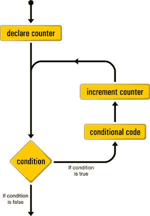

下面是它在代码中的样子:

```
for (declare counter; condition; increment counter)   

{   

  // statement(s) to execute repeatedly as long as condition is true   

}
```

declare counter 语句在循环开始时执行一次；每次循环时，在执行主体中的语句之前，都会检查条件语句；increment counter 语句每次都在循环中执行，位于语句体之后。

下面是用`for`循环实现的“数到 10”的例子:

```
for ($count = 1; $count <= 10; ++$count)   

{   

  echo "$count ";   

}
```

如您所见，初始化和递增`$count`变量的语句在`for`循环的第一行加入了条件。虽然乍一看，代码似乎有点难以阅读，但是将所有处理控制循环的代码放在同一个地方实际上会使您在习惯语法后更容易理解。本书中的许多例子会用到`for`循环，所以你会有很多机会练习阅读它们。

##### 隐藏接缝

现在，您已经掌握了 PHP 编程语言的基本语法。您知道您可以获取任何 HTML 网页，使用. php 文件扩展名对其进行重命名，并向其中注入 PHP 代码，使其动态生成部分或全部页面内容。对于一天的工作来说还不错！

然而，在我们进一步讨论之前，我想停下来，用批判的眼光审视一下我们到目前为止讨论过的例子。假设您的目标是创建符合专业标准的数据库驱动的网站，那么我们需要清理一些难看的瑕疵。

本章剩余部分中的技术将增加一层专业的光泽，使你的工作从业余 PHP 开发人员中脱颖而出。在本书的其余部分，我将依靠这些技术来确保，无论这个例子有多简单，你都可以对你交付的产品质量充满信心。

##### 避免宣传你的技术选择

到目前为止，我们看到的例子混合了普通的 HTML 文件(文件名以`.html`结尾)，以及混合了 HTML 和 PHP 的文件(文件名以`.php`结尾)。尽管文件类型之间的这种区别可能对开发人员有用，但是您的用户没有理由需要知道站点的哪些页面依赖于 PHP 代码来生成它们。

此外，尽管 PHP 是构建几乎任何数据库驱动的网站的一个非常强有力的技术选择，但有一天你可能会想从 PHP 转向某种新技术。当那一天到来的时候，你真的希望你的站点上所有动态页面的 URL 都变成无效的，因为你改变了文件名来反映你选择的新语言吗？

如今，专业开发人员非常重视他们对外发布的 URL。一般来说，URL 应该尽可能永久，所以用你用来构建每个页面的编程语言的小“广告”来弱化它们是没有意义的。

去除 URL 中文件扩展名的一个简单方法是利用目录索引。当一个 URL 指向你的 web 服务器上的一个目录，而不是一个特定的文件时，web 服务器将在该目录中查找一个名为`index.html`或`index.php`的文件，并显示该文件以响应请求。

举个例子，就拿我在[第 1 章安装](https://www.sitepoint.com/article/php-amp-mysql-1-installation/)最后介绍的`today.php`页面来说。将其从`today.php`更名为`index.php`。然后，不要把它放在 web 服务器的根目录下，而是创建一个子目录名，并把`index.php`文件放在那里。现在，在您的浏览器中加载`http://localhost/today/`(或者`http://localhost:8080/today/`，或者类似的，如果您需要为您的服务器指定一个端口号)。

下图显示了使用新 URL 的示例。这个 URL 省略了不必要的`.php`扩展名，而且更短、更容易记忆——这两者都是当今 URL 的理想品质。

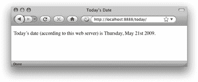

##### 使用 PHP 模板

在我们到目前为止看到的简单例子中，将 PHP 代码直接插入 HTML 页面是一种合理的方法。然而，随着用于生成普通页面的 PHP 代码数量的增长，维护这种 HTML 和 PHP 代码的混合会变得难以管理。

特别是如果你在一个团队中工作，而这个团队的网页设计师对 PHP 并不熟悉，那么将大量晦涩的 PHP 代码与 HTML 混合在一起就是一个灾难。设计师很容易意外修改 PHP 代码，导致他们无法修复的错误。

一个更健壮的方法是将 PHP 代码的大部分分离出来，让它驻留在自己的文件中，让 HTML 基本上不受 PHP 代码的污染。

做到这一点的关键是 PHP 包含语句。使用 include 语句，您可以将另一个文件的内容插入到 PHP 代码中该语句的位置。为了向您展示这是如何工作的，让我们重新构建我们之前看到的“从一数到十”的循环示例。

首先创建一个名为`count10`的新目录，并在这个目录中创建一个名为`index.php`的文件。打开文件进行编辑，并键入以下代码:

```
<?php    

$output = '';    

for ($count = 1; $count <= 10; ++$count)    

{    

  $output .= "$count ";    

}    

include 'count.html.php';    

?>
```

是的，这是这个文件的完整代码。它不包含任何 HTML 代码。现在，您应该对 for 循环很熟悉了，但是让我指出这段代码中有趣的部分:

```
$output = '';
```

这个脚本不是回显数字 1 到 10，而是将这些数字添加到一个名为`$output`的变量中。因此，在这个脚本的开始，我们将这个变量设置为包含一个空字符串。

```
$output .= "$count ";
```

这一行将每个数字(后跟一个空格)添加到`$output`变量的末尾。您在这里看到的`.=`操作符是一种将赋值操作符和字符串连接操作符合二为一，向现有字符串变量末尾添加值的快捷方式。这一行的手写版本是`$output = $output . "$count ";`，但是`.=`操作符为您节省了一些输入。

```
include 'count.html.php';
```

这是一个`include`语句，它指示 PHP 在这个位置执行`count.html.php`文件的内容。

在本书之外，你会经常看到用括号将文件名括起来的 includes 代码，好像 include 是一个类似于`date`或`htmlspecialchars`的函数，实际情况远非如此。这些括号在使用时，只会使文件名表达式变得复杂，因此在本书中避免使用。另一个流行的俏皮话`echo`也是如此。

由于该文件的最后一行包含了`count.html.php`文件，您应该接下来创建它:

```
<!DOCTYPE html PUBLIC "-//W3C//DTD XHTML 1.0 Strict//EN"    

    "https://www.w3.org/TR/xhtml1/DTD/xhtml1-strict.dtd">    

<html  xml:lang="en" lang="en">    

  <head>    

    <title>Counting to Ten</title>    

    <meta http-equiv="content-type"    

        content="text/html; charset=utf-8"/>    

  </head>    

  <body>    

    <p>    

      <?php echo $output; ?>    

    </p>    

  </body>    

</html>
```

这个文件几乎完全是普通的 HTML，除了输出`$output`变量值的那一行。这是由`index.php`文件创建的同一个`$output`变量。

我们在这里创建的是一个 PHP 模板——一个 HTML 页面，其中只有很小的 PHP 代码片段，可以将动态生成的值插入到一个静态的 HTML 页面中。在这种情况下，我们没有在页面中嵌入生成这些值的复杂 PHP 代码，而是将生成这些值的代码放在一个单独的 PHP `script - index.php`中。

像这样使用 PHP 模板可以让你把模板交给精通 HTML 的设计者，而不用担心他们会对你的 PHP 代码做什么。它还可以让您专注于您的 PHP 代码，而不会被周围的 HTML 代码分散注意力。

我喜欢用`.html.php`来命名我的 PHP 模板。虽然，就你的网络服务器而言，这些仍然是`.php`文件，但是`.html.php`后缀是一个有用的提醒，这些文件包含 HTML 和 PHP 代码。

##### 许多模板，一个控制器

使用`include`语句加载 PHP 模板文件的好处在于，在一个 PHP 脚本中可以有多个 include 语句，并让它在不同的环境下显示不同的模板！

通过选择几个 PHP 模板中的一个来填充并发送回浏览器请求的 PHP 脚本通常被称为控制器。控制器包含控制将哪个模板发送到浏览器的逻辑。

让我们再看一个本章前面的例子:提示访问者输入名字和姓氏的欢迎表单。

我们将从表单的 PHP 模板开始。为此，我们可以重用之前创建的`welcome8.html`文件。创建一个名为 welcome 的目录，并将名为`form.html.php`的`welcome8.html`的副本保存到这个目录中。在这个文件中，您需要更改的惟一代码是`<form>`标记的 action 属性:

```
<!DOCTYPE html PUBLIC "-//W3C//DTD XHTML 1.0 Strict//EN"    

    "https://www.w3.org/TR/xhtml1/DTD/xhtml1-strict.dtd">    

<html  xml:lang="en" lang="en">    

  <head>    

    <title>Form Example</title>    

    <meta http-equiv="content-type"    

        content="text/html; charset=utf-8"/>    

  </head>    

  <body>    

    <form action="" method="post">    

      <div><label for="firstname">First name:    

        <input type="text" name="firstname" id="firstname"/></label>    

      </div>    

      <div><label for="lastname">Last name:    

        <input type="text" name="lastname" id="lastname"/></label>    

      </div>    

      <div><input type="submit" value="GO"/></div>    

    </form>    

  </body>    

</html>
```

如您所见，我们将 action 属性留空。这告诉浏览器将表单提交回它接收表单的同一个 URL——在本例中，是包含该模板文件的控制器的 URL。

让我们看看这个例子的控制器。在表单模板旁边的`welcome`目录中创建一个`index.php`脚本。在该文件中键入以下代码:

```
<?php    

if (!isset($_REQUEST['firstname']))    

{    

  include 'form.html.php';    

}    

else3    

{    

  $firstname = $_REQUEST['firstname'];    

  $lastname = $_REQUEST['lastname'];    

  if ($firstname == 'Kevin' and $lastname == 'Yank')    

  {    

    $output = 'Welcome, oh glorious leader!';    

  }    

  else    

  {    

    $output = 'Welcome to our web site, ' .    

        htmlspecialchars($firstname, ENT_QUOTES, 'UTF-8') . ' ' .    

        htmlspecialchars($lastname, ENT_QUOTES, 'UTF-8') . '!';    

  }    

  include 'welcome.html.php';5    

}    

?>
```

乍一看，这段代码应该非常熟悉；这很像我们之前写的`welcome8.php`脚本。让我解释一下不同之处:

```
if (!isset($_REQUEST['firstname']))    

{

The first thing the controller needs to do is decide whether the current request is a submission of the form in form.html.php or not. You can do this by checking if the request contains a firstname variable. If it does, PHP will have stored the value in $_REQUEST['firstname'].

```

```
isset is a built-in PHP function that will tell you if a particular variable (or array element) has been assigned a value or not. If $_REQUEST['firstname'] has a value, isset($_REQUEST['firstname']) will be true. If $_REQUEST['firstname'] lacks a value, isset($_REQUEST['firstname']) will be false.

为了可读性，我喜欢将发送表单的代码放在我的控制器中。因此，我们需要这个 if 语句检查的是是否没有设置`$_REQUEST['firstname']`。为此，我们使用 not 操作符(`!`)。通过将该操作符放在函数名之前，可以将函数返回值从`true`反转为`false`，或者从`false`反转为`true`。

因此，如果请求不包含`firstname`变量，那么`!isset($_REQUEST['firstname'])`将返回`true`，并且`if`语句的主体将被执行。

```

```
include 'form.html.php';

If the request is not a form submission, the controller includes the form.html.php file to display the form.

```

```
}    

else    

{

如果请求是表单提交，则执行`else`语句的主体。

这段代码从`$_REQUEST`数组中取出`firstname`和`lastname`变量，然后为提交的名字生成适当的欢迎消息:

```

```
$firstname = $_REQUEST['firstname'];    

$lastname = $_REQUEST['lastname'];    

if ($firstname == 'Kevin' and $lastname == 'Yank')    

{    

  $output = 'Welcome, oh glorious leader!';    

}    

else    

{    

  $output = 'Welcome to our web site, ' .    

      htmlspecialchars($firstname, ENT_QUOTES, 'UTF-8') . ' ' .    

      htmlspecialchars($lastname, ENT_QUOTES, 'UTF-8') . '!';    

}

控制器将欢迎消息存储在一个名为`$output`的变量中，而不是回显欢迎消息。

```

```
 include 'welcome.html.php';    

}

After generating the appropriate welcome message, the controller includes the welcome.html.php template, which will display that welcome message.

剩下的就是写`welcome.html.php`模板了。这是:

```

```
<!DOCTYPE html PUBLIC "-//W3C//DTD XHTML 1.0 Strict//EN"    

    "https://www.w3.org/TR/xhtml1/DTD/xhtml1-strict.dtd">    

<html  xml:lang="en" lang="en">    

  <head>    

    <title>Form Example</title>    

    <meta http-equiv="content-type"    

        content="text/html; charset=utf-8"/>    

  </head>    

  <body>    

    <p>    

      <?php echo $output; ?>    

    </p>    

  </body>    

</html>
```

就是这样！打开你的浏览器，指向`http://localhost/welcome/`(或者`http://localhost:8080/welcome/`或者类似的，如果你需要为你的网络服务器指定一个端口号)。系统会提示您输入姓名，当您提交表单时，您会看到相应的欢迎消息。在整个过程中，URL 应该保持不变。

在提示用户输入名称和显示欢迎消息的整个过程中维护同一个 URL 的好处之一是，用户可以在这个过程中的任何时候为页面添加书签，并获得一个合理的结果:当用户下次返回时，无论表单页面或欢迎消息是否被添加了书签，表单都将再次出现。在本例的上一版本中，欢迎消息有自己的 URL，如果不提交表单就返回到该 URL，将会生成一条不完整的欢迎消息(“欢迎访问我们的网站！”).

***为什么这么健忘？***

在第 9 章，Cookies，Sessions 和 Access Control 中，我将向你展示如何在两次访问之间记住用户的名字。

##### 打开数据库

在这一章中，我们已经看到了 PHP 服务器端脚本语言的作用，因为我们已经探索了所有基本的语言特性:语句、变量、操作符、注释和控制结构。我们看到的示例应用程序相当简单，但尽管如此，我们还是花时间确保它们有吸引人的 URL，并且它们生成的页面的 HTML 模板被控制它们的 PHP 代码整理得井井有条。

正如您可能已经开始怀疑的那样，PHP 的真正强大之处在于它的数百个(甚至数千个)内置函数，这些函数允许您访问 MySQL 数据库中的数据、发送电子邮件、动态生成图像，甚至动态创建 Adobe Acrobat PDF 文件。

在[第 4 章:在 Web 上发布 MySQL 数据](https://www.sitepoint.com/article/publishing-mysql-data-web/)中，我们将深入研究 PHP 内置的 MySQL 函数，并了解如何在[第 2 章:在 Web 上介绍 MySQL](https://www.sitepoint.com/article/getting-started-mysql/) 中发布我们创建的笑话数据库。这一章将为这本书的最终目标做准备——用 PHP 和 MySQL 为你的网站创建一个完整的内容管理系统。

## 分享这篇文章