# 使用打包的应用程序进行 MySQL 管理

> 原文：<https://www.sitepoint.com/mysql-management-packaged-apps/>

几年前，Chrome 团队发布了打包应用——行为类似原生应用的应用，可以访问你机器的大部分硬件。从那以后，我们看到了终端模拟器、IRC 客户端、ide、真正的 3D 游戏等等的出现。

## ChromeMyAdmin

我想借此机会回顾一下[田中洋一郎](https://plus.google.com/u/0/+YoichiroTanaka/posts)的套装应用 [ChromeMyAdmin](https://chrome.google.com/webstore/detail/chromemyadmin/ndgnpnpakfcdjmpgmcaknimfgcldechn) 。

我个人认为 MySQL/MariaDB 数据库管理领域尤其贫瘠。一方面是经常不稳定的 MySQL 工作台，另一方面是臃肿但不发达的 PhpMyAdmin，有时您只需要一个更简单的解决方案来进行快速和肮脏的编辑。

让我们试一试，看看效果如何。

### 安装

转到[网络商店](https://chrome.google.com/webstore/detail/chromemyadmin/ndgnpnpakfcdjmpgmcaknimfgcldechn/details)页面并安装应用程序。它应该会立即出现在你的 Chrome 应用启动器中。在 Windows 上，如下图所示:

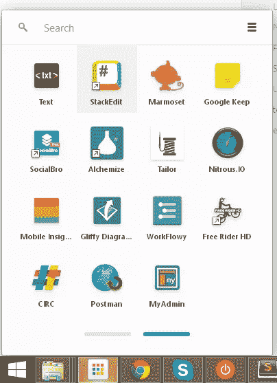

开始界面简单流畅，一个熟悉的引导外观:

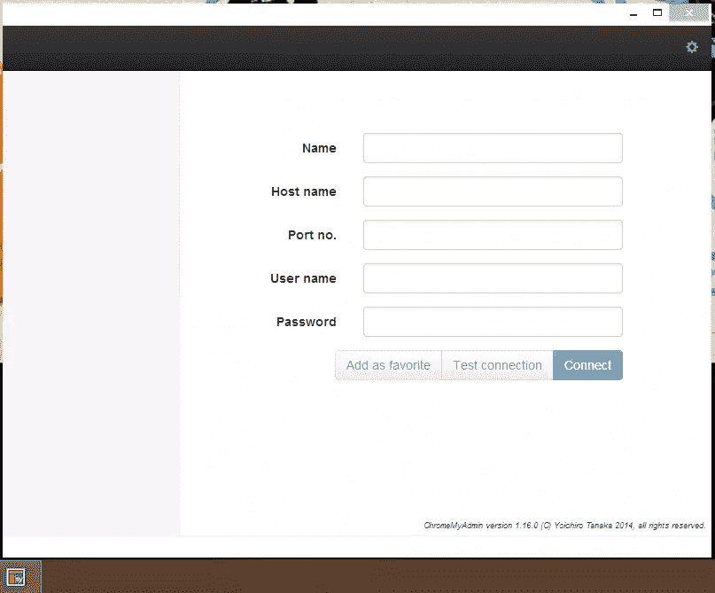

### 流浪起来

如果你读过我以前的任何帖子，你就会知道我不喜欢用 SDK、编程语言及其运行时或数据库驱动程序污染我的日常机器。我做了一个简单的流浪文件，它启动了一个 14.04 版本的 Ubuntu 服务器实例，并预装了 MySQL，启用了远程连接。这意味着您可以从主机上接入虚拟机的数据库，并且仍然保持主机上没有不需要的软件。

如果你不熟悉 Vagrant 和前面提到的虚拟化方法，请参阅我们之前关于主题的[文章。](https://www.sitepoint.com/blog/)

可以从 Github 下载流浪文件[。这样做之后，只要进入文件夹(如果在 Windows 上使用 Git Bash)并运行“After up ”,前提是你已经安装了 vagger 和 VirtualBox。](https://github.com/Swader/trusty64-mysql_remote)

### 连接

我们的 VM 的 IP 地址被设置为 192.168.56.101，所以这是我们在 ChromeMyAdmin 的主屏幕中用于连接的主机名。这也是 ChromeMyAdmin 第一次犯错的地方——你必须输入端口号——它不假设默认。这不是一个大问题，但它的可用性会得到加分。

在我们输入凭证(root，root，如果您使用的是我的 Vagrantfile)之后，我们应该能够成功地测试连接。

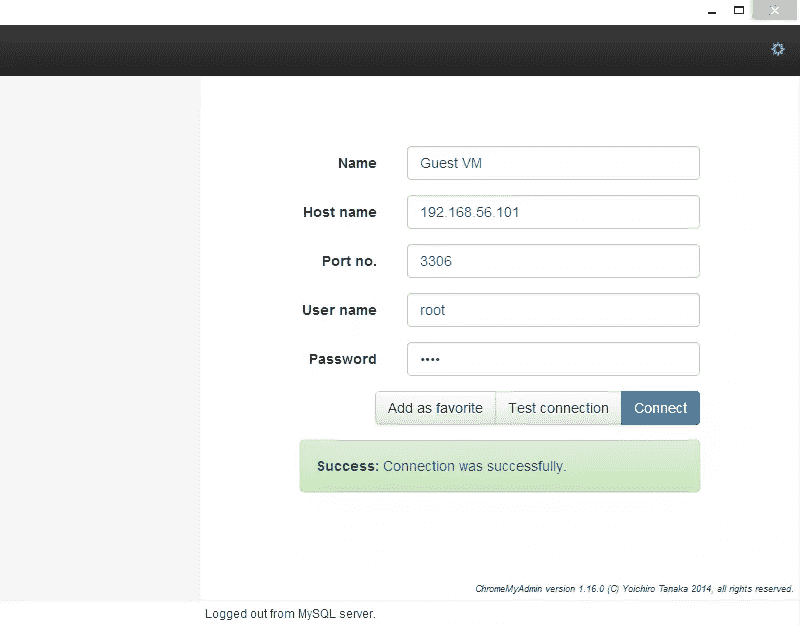

在点击“连接”(可能还有“添加到收藏夹”)之后，您应该会看到下一个屏幕，允许您选择一个数据库。

### 创建和填充数据库

让我们快速旋转一下，创建一个新的数据库。单击窗口右下角的小加号图标来初始化该过程。确保你在“服务器视图”上，点击左上角的“硬盘”图标，在数据库选择下拉菜单旁边。将编码选项保留为 UTF-8 Unicode 默认值，并键入一个示例名称，如“test”。然后，您应该在数据库选择下拉列表中看到您的数据库，您可以从中选择它。

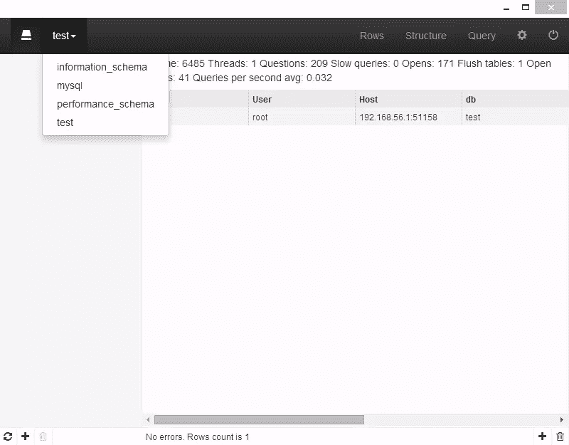

我们通过点击左下角的小加号图标来创建一个新表格。创建一个名为“users”的表，保留所有其他选项的默认值。您会注意到 ChromeMyAdmin 会自动创建一个无符号整数字段，该字段会自动递增，并使其成为表的主键。虽然这与我自己的习惯配合得很好，但我确信有些人会对此感到困扰，并且无法改变默认行为。这样的动作应该是可配置的。

使用表格列视图框架中的第三个加号按钮“添加新列”，添加字段“`first_name`”、“`last_name`”、“`username`”和“`password`”。使它们都成为最大 varchars。我允许 first_name 为 NULL，但其他字段不允许。

我们现在需要使我们的`username`字段唯一，以确保没有两个用户有重叠的用户名。让我们通过添加一个带有加号图标的索引来实现这一点，该图标以前是作为“创建数据库”按钮的，即应用程序窗口右下角的加号。使用我在下图中使用的设置。

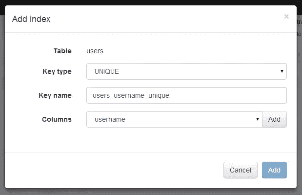

不要忘记先点击选中列旁边的“添加”按钮，否则模式窗口底行的“添加”按钮永远不会激活。

如果在任何时候，您对在界面上单击时执行的 SQL 语句感到好奇，请进入配置菜单(右上方，在“查询”和关机图标之间)，并选择查询历史。

我们现在有了一个定义了一些列和索引的表——让我们使用查询窗口再创建两个表:`users_groups`和`user_groups`。在“查询”窗口中(右上角选项，在“结构”和“配置”之间)，粘贴以下内容:

```
CREATE TABLE `user_groups` (
  `id` int(10) unsigned NOT NULL AUTO_INCREMENT,
  `name` varchar(120) NOT NULL,
  `slug` varchar(120) NOT NULL,
  `description` text,
  PRIMARY KEY (`id`),
  UNIQUE KEY `email_address_UNIQUE` (`name`),
  UNIQUE KEY `slug_UNIQUE` (`slug`)
) ENGINE=InnoDB DEFAULT CHARSET=utf8;

CREATE TABLE `test`.`users_groups` (
  `id` INT UNSIGNED NOT NULL AUTO_INCREMENT,
  `users_id` INT UNSIGNED NOT NULL,
  `groups_id` INT UNSIGNED NOT NULL,
  `main` TINYINT(1) UNSIGNED NOT NULL DEFAULT 0,
  PRIMARY KEY (`id`),
  UNIQUE INDEX `user_group_unique` (`users_id` ASC, `groups_id` ASC),
  INDEX `users_groups_user_groups_id_idx` (`groups_id` ASC),
  CONSTRAINT `users_groups_users_id`
    FOREIGN KEY (`users_id`)
    REFERENCES `test`.`users` (`id`)
    ON DELETE CASCADE
    ON UPDATE CASCADE,
  CONSTRAINT `users_groups_user_groups_id`
    FOREIGN KEY (`groups_id`)
    REFERENCES `test`.`user_groups` (`id`)
    ON DELETE CASCADE
    ON UPDATE CASCADE);
```

起初，我很失望地发现 ChromeMyAdmin 缺少 SQL 导入工具，但当我意识到它无法一个接一个地执行两条语句时，我更加失望。没关系——在一个 CREATE 中粘贴，执行，然后对另一个进行同样的操作，现在我们有了所有三个表。

CREATE 语句还创建了必要的索引**和**一些外键，它们以 M:M 的方式将三个表绑定在一起。但是…我们的外键在哪里？

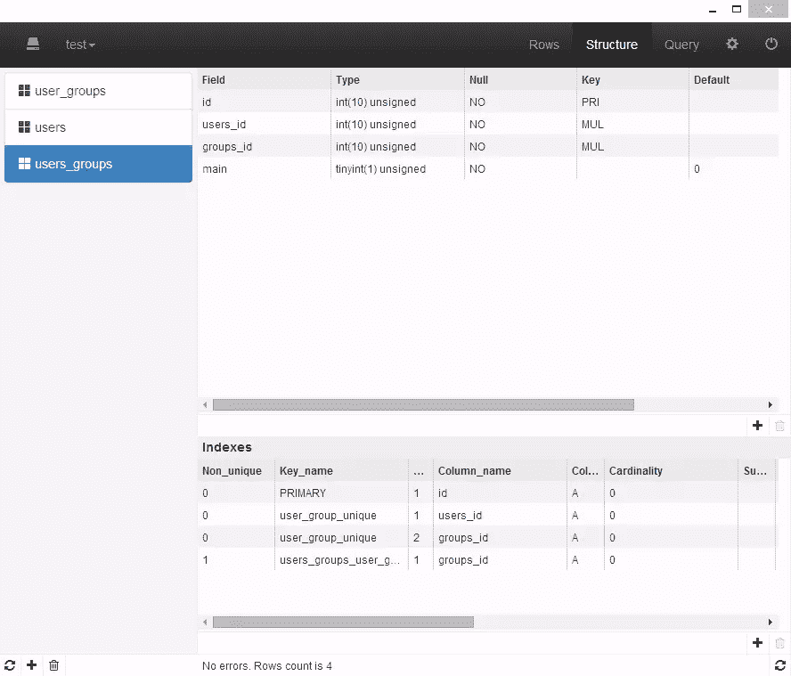

ChromeMyAdmin 在其当前迭代中不支持外键的 GUI 编辑。不幸的是，由于只有一个人在进行大量的开发，像这样的高级功能已经被搁置了。

好吧，让我们看看我们还能做些什么。

打开`user_groups`表，添加两个组:admin 和 user。您可以通过选择表格，然后选择顶部导航栏中的“rows ”,最后点击右下角的加号图标来完成此操作。在当前的形式下，ChromeMyAdmin 为每个列数据类型提供了一个常规的 textarea，并且不以任何方式预填充值，甚至没有默认值。然而，我们可以将我们知道的设置为自动递增的字段留空，ChromeMyAdmin 和 MySQL 会为我们处理剩下的事情。

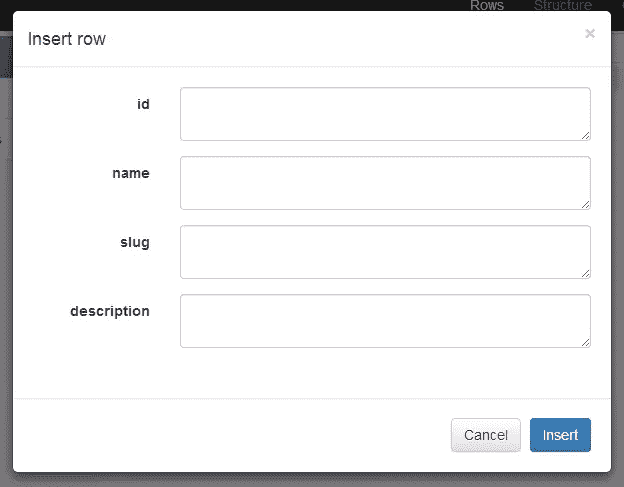

自动增量运行良好，我们添加了两行:

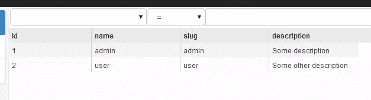

现在让我们添加两个用户。随便你给它们起什么名字，但是试着给第二个起和第一个一样的名字。我们可以看到错误报告运行良好，除非我们更改用户名，否则无法添加第二个用户。

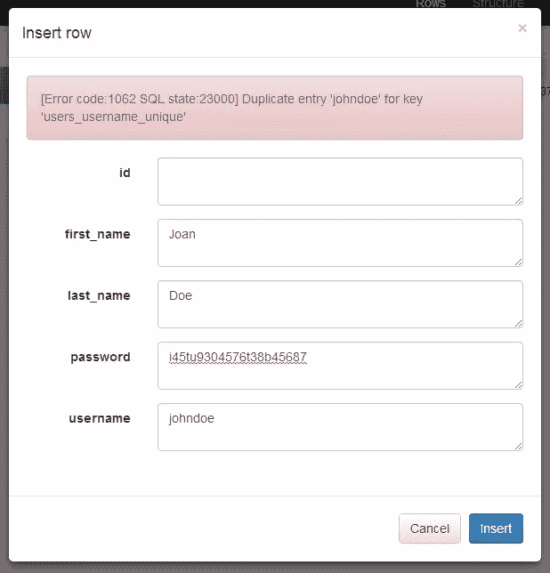

然而，自动增量仍然被触发，我们的第二个用户现在的 ID 是 3，而不是 2。

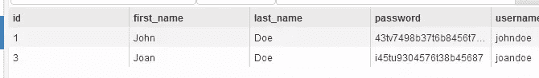

诚然，这是一个 MySQL 的问题，但如果采取适当的措施，它可以很容易地避免。

最后再补充一些`users_groups`词条。在现代 MySQL 管理工具中，向列绑定了外键的表中添加新行会将输入字段变成下拉菜单，您可以从中选择正确的值。在 ChromeMyAdmin 中，GUI 看起来与在没有外键的情况下向表中添加行的 GUI 相同——纯文本区域。

如果您尝试添加条目`NULL, 5, 5, 0`，您会被成功阻止。毕竟，没有 ID = 5 的用户或组。让我们添加三个有效条目:

`NULL, 1, 1, 1`
`NULL, 1, 2, 0`


第一个将第一个用户设置为管理员，并将管理员定义为他的主要角色。第二个也给他一个“用户”的角色，只是因为网站的每个用户都应该有。第三个条目赋予第二个用户“用户”的主要角色。

定义了这些角色后，让我们看看 ChromeMyAdmin 如何处理由外键绑定并设置为 Cascade(如上面的 Create 语句所定义)的值的删除。

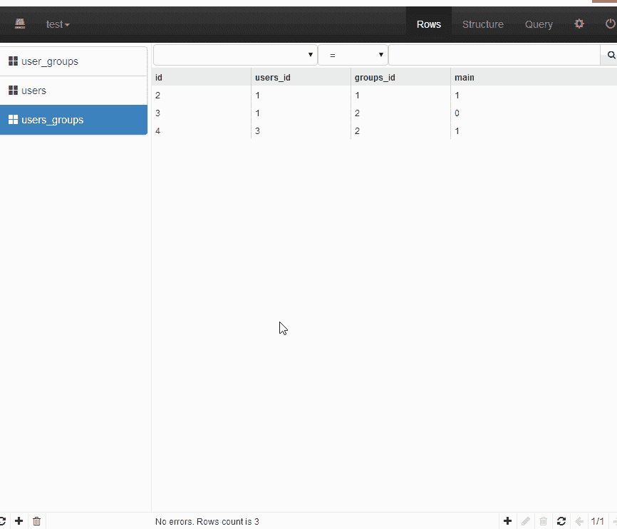

如你所见，这种情况完美地解决了。这背后的逻辑取决于 MySQL，但非常重要的是要看到 ChromeMyAdmin 不仅发送正确的命令，还刷新所有需要刷新的内容。

在当前版本中，这是 ChromeMyAdmin 的范围——对数据库的非常基本的操作、有限的查询历史和一些基本的约束，这些只能通过查询框架的手动输入来实现。

### 贡献的

你可以在 Github 上找到 ChromeMyAdmin [的完整源代码，以及支持它的 JS MySQL 驱动程序](https://github.com/yoichiro/chrome_mysql_admin)[和它的](https://github.com/yoichiro/mysql_js_driver)。这两个项目都接受捐款，可以使用你的帮助。洋一郎会看着你的 PRs，然后逐个批准，或者你也可以自己做一个版本。

如果你决定升级它，请记录程序并让我们知道，我们会喜欢更多的[贡献示例](https://www.sitepoint.com/contributing-open-source-dillinger-case-study/)。

## 结论

最后的统计是多少？ChromeMyAdmin 值得吗？我们来看看利弊。

### 赞成的意见

*   自动安装在你登录的每一个 Chrome 实例上，并且已经准备就绪
*   快速，尽管对 GUI 使用了引导
*   开源，可以轻松扩展和升级

### 骗局

*   自动安装，但不传输保存的连接。有些可能是远程和繁琐的重新添加。
*   没有 SSL 或其他高级连接选项–仅支持非常基本的连接类型。这在进行本地开发时很好，但在进行生产数据库检查或维护时可能会变得毫无用处。话又说回来，除了像 Workbench 这样的大型应用程序，你还会使用其他东西吗？
*   没有外键
*   不能选择多个条目进行多次删除(一次删除几个表，一次删除几行)
*   删除时不能停用外键检查(删除带有外键的数据时非常重要，尤其是在开发过程中需要快速重复时)
*   无法同时执行几个语句

总而言之，ChromeMyAdmin 是一个不错的基础数据库管理工具。它会自动为您安装，允许您执行基本操作，这是您在做小任务或演示时真正需要的，并且不想安装 Workbench、PhpMyAdmin、SequelPro 或其他更成熟的应用程序。随着时间的推移，我希望看到它彻底演变成可以与目前最优秀的产品相媲美的东西，但在此之前，我打算将它用于简单的任务，并密切关注它。

你试过了吗？你会用它替换你现在的 MySQL 工具吗？请在下面的评论中告诉我们。

## 分享这篇文章