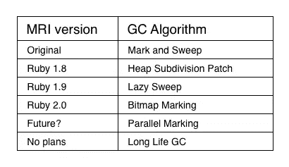

# 中村成弘:Ruby 的 GC 创新者

> 原文：<https://www.sitepoint.com/narihiro-nakamura-rubys-gc-innovator/>

中村成弘对 Ruby 的 GC 算法做了很多关键的改进

我第一次看到中村成弘的名字是在研究我三月份写的一篇关于垃圾收集的文章时。他刚刚对即将发布的 MRI Ruby 2.0 版本进行了大规模的代码更改，启用了一种称为“位图标记”的新垃圾收集技术，这种技术有望通过改善 Ruby 进程与共享内存的工作方式来加快应用程序的速度。后来我看了 Narihiro 在 RubyConf Argentina 2011 上做的一个很棒的演讲的视频，叫做[CRuby GC 的平行世界](https://vimeo.com/38994805)，讲的是一种叫做“平行标记”的垃圾收集技术然后，我在[的网站](http://www.narihiro.info/index.en.html)上注意到，在过去的几年里，成宏对 Ruby 进行了各种其他与 GC 相关的代码修改。很明显，垃圾收集一直是 Narihiro 的热情所在——这种热情让我们所有人受益！

这个月，我决定为 RubySource 采访 Narihiro 我很想了解更多关于他和他的工作的情况。由于语言障碍，我们通过电子邮件交谈，不像我的其他 RubySource 采访，但我在这里为那些懂日语的人提供了他的原始日语回答。请继续阅读，以了解更多关于 Narihiro 的信息，并了解 Narihiro 和核心团队在过去几年中对 GC 所做的所有改进。

## 中村成弘是谁？

问:你好，成宏，非常感谢你的时间。你好吗

嗨——没问题……我很好！

问:你好，Narihiro，感谢您抽出时间。 你好吗？

你好，不，没问题。 我很好！

在日本岛根县举行的 RubyWorld 大会定于 11 月 8 日至 9 日举行。

问:你能告诉我们一些关于你自己的情况吗？你是哪里人？你在哪里工作？除了 Ruby，你还对什么感兴趣？

我目前住在日本岛根县。哦，对了， [RubyWorld 大会](http://www.rubyworld-conf.org/en/)将于 11 月 8-9 日在这里举行。我们希望你们都能来加入我们！

我在 NaCl(网络应用通信实验室有限公司)工作。六名 Ruby 核心提交者在这里工作，包括[松本幸宏](https://twitter.com/yukihiro_matz)。

嗯……超越鲁比？啊，我确实对垃圾收集感兴趣。当然，我也喜欢 Ruby，因为它有自己的垃圾收集器。

问:你能告诉我一些关于你自己的事情吗？ 你是哪里人？ 你在哪里工作？ 你有什么跨越 Ruby 的兴趣吗？

我现在住在日本岛根县。 这次 11 月在岛根有 RubyWorldConference 这个活动，请大家一定要来！

我在网络应用程序通信库 ltd.( NaCl )工作。 这家公司有 6 个 MRI 的提交人。 是世界上有最多 Ruby 提交器工作的公司呢。 然后，其中一个人是@yukihiro_matz。

我对 beyond Ruby. GC 感兴趣！ 但我也喜欢 Ruby 哦。 因为你不是有自己的 GC 吗？

问:NaCl 的另外 5 个 Ruby 提交者是谁？

[【shugo 前田】](http://twitter.com/shugomaeda)、[【shyouhei urabe】](http://twitter.com/shyouhei)、[【yuuzou gotou】](http://twitter.com/gotoyuzo)、和我:】

问: Q: NaCl 的其他五个提交者是谁？

[【shugo 前田】](http://twitter.com/shugomaeda)、[【shyouhei urabe】](http://twitter.com/shyouhei)、[【yuuzou gotou】](http://twitter.com/gotoyuzo)、和我:】

问:你最初是如何与 Ruby 结缘的？

大约五年前，当我在网上看到一些关于 Ruby 的文章时，我第一次接触到了 Ruby。我还受到了 Kakutani Shintaro 的“从 Java 到 Ruby”演讲的启发——它让我相信 Ruby 会一直存在下去。然后我开始把用 Ruby 编程作为一种爱好。

问:与 Q: Ruby 的第一次邂逅是？

我认为 5 年多前在网页上阅读 Rails 的报道是第一个契机。 之后，看了介绍@kakutani 的《从 Java 到 Ruby》的视频说:“接下来就是 Ruby 了！ ”我想。 然后根据兴趣开始了 Ruby 编程。

问:你是如何决定从事垃圾收集工作的？

我最喜欢的书《Ruby 黑客指南》指出，Ruby 的一个弱点是 GC 性能。当我读到这封信时，我想:“也许我可以搞定它。”由于我从未接受过垃圾收集算法方面的正规教育，我不得不自学。现在我想应用我所学到的知识来改进 MRI 的垃圾收集器。

问:你是怎么决定做 GC 的研究的？

有一本我喜欢的书叫 Ruby Hacking Guide，作为最后一个《Ruby 要解决的课题》，提到了《GC 的性能》，我想“那我来做吧”，以此为契机。 我没有在大学等接受过专业教育，所以通过自学加深了 GC 的知识。 我想把我学到的东西运用到 MRI 的 GC 中。

问:和 Ruby 核心团队一起工作是什么感觉？

Ruby 核心团队的成员都是非常独特和酷的人。我尊重他们，我真的很荣幸能和他们一起工作。

问:和 Q: Ruby 核心团队一起工作是什么感觉？

Ruby 的核心团队是个性鲜明、很厉害的人。 我非常尊敬，也很荣幸能和那样的人一起开发 MRI。

问:你能想出一个读者会喜欢的关于与核心团队一起工作的有趣故事吗？

哦，请看[Ruby 的 Redmine](https://bugs.ruby-lang.org/projects/ruby-trunk/issues?set_filter=1&f%5B%5D=status_id&op%5Bstatus_id%5D=*&f%5B%5D=category_id&op%5Bcategory_id%5D=%3D&v%5Bcategory_id%5D%5B%5D=62&f%5B%5D=&c%5B%5D=tracker&c%5B%5D=status&c%5B%5D=priority&c%5B%5D=subject&c%5B%5D=assigned_to&c%5B%5D=updated_on&group_by=) 的笑话类。我强烈推荐[《压缩尾序》](https://bugs.ruby-lang.org/issues/5054)。

问:在与核心团队的工作中，有愉快有趣的故事吗？

请看 Ruby 的 Redmine 的[Joke 类别](https://bugs.ruby-lang.org/projects/ruby-trunk/issues?set_filter=1&f%5B%5D=status_id&op%5Bstatus_id%5D=*&f%5B%5D=category_id&op%5Bcategory_id%5D=%3D&v%5Bcategory_id%5D%5B%5D=62&f%5B%5D=&c%5B%5D=tracker&c%5B%5D=status&c%5B%5D=priority&c%5B%5D=subject&c%5B%5D=assigned_to&c%5B%5D=updated_on)。 我推荐的是[“compress a sequence of ends”](https://bugs.ruby-lang.org/issues/5054):)

## 为什么要学习垃圾收集？

问:乍一看，GC 似乎是一个无聊的话题。为什么我们其他人会对它感兴趣？

垃圾收集的目的是释放未使用的内存段。这似乎是一个非常简单明了的任务，但实际上非常困难。没有完美的解决方案。但这正是我感兴趣的地方。既然大多数程序员喜欢难题的挑战，他们当然会喜欢 GC。

此外，许多 GC 算法是由传奇黑客发明的:约翰·麦卡锡、艾兹格·迪科斯彻、高德纳，当然还有我们自己的“马茨”GC 甚至吸引了传奇黑客的注意。

问:乍一看，GC 似乎是个无聊的话题。 为什么我们以外的人–读者–应该对 GC 感兴趣呢？

尽管 GC 看起来像是一个“释放未自动利用的内存空间”的简单任务，但要解决它的话会成为非常困难的问题，这一点很有趣。 我认为程序员本质上喜欢难题。 GC 一定也会喜欢的吧。

此外，一些 GC 算法是由传说中的黑客们制作的。 例如 John McCarthy、Edsger Wybe Dijkstra、Donald Ervin Knuth 以及松本先生。 我觉得 GC 有连他们这样伟大的黑客也能卷入其中的魅力。

问:Ruby 开发人员在编写代码时应该考虑 GC 吗？或者只是假设它会“神奇地”发生？

垃圾收集的一个目标是即使人们不注意它，它也能正常工作。如果开发人员认为垃圾收集是“神奇的”,并且没有任何不好的事情发生，那么它就像预期的那样工作——GC 系统的作者会很高兴。然而，在实际应用中，有时您需要担心 GC，例如当应用程序需要无停顿地平稳执行时。

问: Q: Ruby 开发人员在编写代码时应该考虑 GC 吗？ 即便如此，只是觉得会发生“魔法般的事情”就可以了吗？

“无需让开发者注意到 GC 的状态”是 GC 的目标之一。 所以如果 GC 只是被认为是“魔法”，没有发生问题的话，那就是 GC 制作得很好的证据，所以没有比这更高兴的事了。 但是，我们必须考虑 GC，尤其是在实践 APP 应用中。 例如，在停止时间进行严格的 APP 等。

## 快速浏览气相色谱创新

问:“标记和扫描”是什么意思？

在我解释 Mark and Sweep (M&S)之前，让我先解释几个基本的 GC 概念。垃圾收集器的基本任务是收集所有的死对象。死对象是程序永远不会引用的对象。

M&S 是众多 GC 算法中的一种。所有标记和清除 GC 系统都有两个独立的阶段:标记阶段和清除阶段。

*   在标记阶段，收集器标记仍被程序代码引用的活动对象。
*   在清扫阶段，它扫描整个堆并“清扫”掉“死的”(未标记的)对象。

问:马克和汤是什么意思？

首先请允许我说明一下 GC 的简单概念。 所谓 GC 就是回收所有死对象的东西。 死对象是指从程序中再也不能引用的对象。

而且，标记和扫描( M&S )是 GC 的算法的一种，处理分为标记阶段和扫描阶段。 在标记阶段，我们会在活着的对象上做标记。 扫掠阶段将扫描整个堆，并释放死的(未标记的)对象。

问:GC 系统如何知道在标记阶段程序当前引用了哪些对象？

GC 系统可以通过遍历一组直接引用程序中对象的指针(例如指向 Ruby 的局部变量、全局变量等)来找到活动对象。

问: GC 在标记时如何知道从程序中引用了对象？

GC 通过遍历程序中直接引用对象的指针集合(例如 Ruby 的局部变量和全局变量…)，得知活着的对象。

问:“懒扫”是什么意思？与 Mark 和 Sweep 有何不同？

由于传统的 M&S GC 系统在一个单一的原子操作中执行标记和清除，所以当垃圾收集正在进行时，应用程序将暂停。

懒扫中，扫就是懒。对象分配器的每次调用都会清理 Ruby 的堆，直到找到一个合适的空闲对象，然后返回。这改善了 GC 的响应时间；即垃圾收集器的最坏情况运行时间减少。

问:“延迟扫频”是什么意思？ 和标记和扫描有什么不同？

传统的 M&S (标记和汤)会自动执行标记和扫掠。 然后，在 GC 期间，ruby APP 应用程序将停止。

在 LazySweeping 中，将延迟扫描。 在对象分配的时机，进行 sweep，直到找到合适的死对象为止。 LazySweeping 提高了 GC 的响应时间，也就是说减少了 GC 的最大停机时间。

问:但是懒扫 GC 算法还是需要标记所有的对象？马克相位还是一样的？唯一不同的是扫相更快？

这是对的。然而，清扫阶段的吞吐量并没有减少，因为惰性清扫只是通过让分配器执行清扫来分摊清扫的成本。

问:即使是 Q: LasySweep 算法也必须标记所有的对象，对吧？ 标记阶段依然一样吗？ 扫掠阶段加快了是唯一的不同吗？

是啊。 但是，由于只是通过使用分配器进行扫掠来分割扫掠的成本，因此扫掠阶段的吞吐量不会减少。

问:什么是“长寿命 GC”补丁？

“长寿命 GC”补丁将长寿命对象视为特例。这类似于分代 GC。然而，这个补丁并没有在任何当前的 Ruby 版本中使用。

问:什么是“长寿命 GC”补丁？

这是对长寿命对象的特殊处理，与不同世代的 GC 类似。 但是，请注意，长生命 GC 是在 Ruby 1.9.2 中 reject 的:)

问:什么是“平行标记？”

并行标记收集器使用本机线程并行运行多个标记进程。如果您使用多核计算机，这可能会提高您的性能。

这听起来很容易，但事实上是一个非常困难和复杂的过程。如果你有兴趣的话，请看我的演讲[平行世界的克鲁比 GC](http://www.slideshare.net/authorNari/parallel-worlds-of-crubys-gc-10108810)
。

问:“并列标记”是什么？

并行标记收集器在多个本机线程上执行标记操作。 在拥有多个 CPU 核心的机器上会变得幸福吧。

虽然可能会被认为很容易安装，但意外地麻烦而深奥。 想知道详细情况的人请参考[我的幻灯片。

问:什么是“堆细分补丁？”

多么美好的回忆啊！“堆细分补丁”是我对 MRI GC 的第一个贡献。

在 Ruby 1.8.x 中，当扩展堆时，我们分配一个新的连续内存块，其大小是旧堆的 1.8 倍。在这种方法中，如果一个大块只有一个活动对象，我们就无法释放它。我的“堆细分补丁”将连续块划分为子块。这个补丁增加了释放死子块的机会，从而再次提高了 GC 性能。

问:什么是“堆细分补丁”？

好怀念！ 这是我第一个贡献给 MRI 的补丁啊。

在 Ruby1.8 中，扩展堆时保留的连续内存块是扩展前堆大小的 1.8 倍。 通过这种方法，巨大的块永远不会被释放，因为如果块中有任何一个活着的对象，则不能释放该块。

在“Heap Subdivision Patch”中，我们将块分割为小块来确保。 与大块相比，分割的块更容易释放。

问:什么是“位图标记？”

在位图标记中，“活动对象”标志存储在单独的位图表中，而不是存储在每个对象头中。哦，我认为[你的文章](http://patshaughnessy.net/2012/3/23/why-you-should-be-excited-about-garbage-collection-in-ruby-2-0)是这个话题的最佳信息来源！

问:什么是“位图标记”？

在 Bitmap Marking 中，将标记位保存在堆和其他空间的位图表中，而不是对象标头中，是对位图进行标记的算法。 啊，关于这个话题[我觉得你的报道](http://patshaughnessy.net/2012/3/23/why-you-should-be-excited-about-garbage-collection-in-ruby-2-0)是最好的信息！

问:谢谢成宏！你还想提到其他 GC 创新吗？

最近我一直在研究 OpenJDK7 中使用的 G1GC 垃圾收集算法。这可以控制 GC 操作的最大暂停时间。另外，我对阿祖莱的《C4》很感兴趣。该算法利用特殊的 CPU 指令实现了无中断的垃圾收集。很好玩！

问:有你想提到的其他 GC 技术创新吗？

我一直在查的是进入 OpenJDK7 的 G1GC 吧。 这是一种可以指定 GC 停止时间的算法。

另外，Azule 的 C4 也很关注。 我们通过硬件支持实现了无中断 GC。 很有趣哦！

## GC 的未来

问:Ruby GC 的下一步是什么？

首先，我计划引入几个对 M&S 的小修正——例如，非递归标记和预取标记循环。我想重构 gc.c，让它更容易实现这样的小修正。然后，我计划实现我之前提到的并行标记补丁。

问:接下来 Ruby 的 GC 能放什么呢？

我想对并购进行一些细微的修改。 例如，非递归标记和使用 prefetch 的标记。 接下来，我想重构 gc.c，让上面提到的小修改更容易引入。

然后，捕获并行标记。

问:MRI Ruby 能从 JRuby、Rubinius 或其他版本的 Ruby 中学到什么吗？

JRuby 使用 JVM 的 GC。我很羡慕:)而且每当我读到 Rubinius 的 GC 源代码时，我总是惊讶于代码是多么的漂亮。

我认为与其他 GC 实现相比，MRI 的垃圾收集器有点落后。由于历史原因，其中大部分与 Ruby 的 C 扩展有关，很难从本质上改变这种情况。但是，我希望能为此做点什么。

问: MRI 的 Ruby 可以从 JRuby、Rubinius 和 Ruby 的其他版本中学到什么吗？

因为 JRuby 使用的是 JVM 的 GC。 我很羡慕:) Rubinius 的 GC 以前读的时候写得相当漂亮，我很惊讶。

我觉得 MRI 的 GC 不如其他版本的 GC。 只是由于历史的原因(主要取决于 c 扩展库的规格)，MRI 的 GC 很难进行大的变更吧。 我想做点什么。

问:你还在研究什么，想告诉大家吗？

我最近写了一本书！[解剖 G1GC 的实现](http://www.narihiro.info/g1gc-impl-book/)…抱歉，只有日文。

问:还有什么其他应该传达给大家的措施吗？

写了电子书！ [彻底解剖 G1GC :实现篇](http://www.narihiro.info/g1gc-impl-book/)

Narihiro 的[新书](http://www.narihiro.info/g1gc-impl-book/)描述了 OpenJDK7 中 G1GC 算法的实现。

问:你未来的计划是什么？

我没有具体的计划…但是我想一点一点地继续改进 Ruby 的 GC 算法。

我要感谢我的同事 Tor 先生，他帮我把这些答案翻译成英文。谢谢！

问:你将来的计划是什么？

虽然没有考虑将来的事情，但是我想一点一点地继续 GC 的工作。

## 分享这篇文章