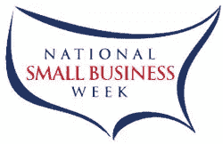

# 如何在全国小企业周期间为你的企业充电

> 原文：<https://www.sitepoint.com/national-small-business-week/>

你知道美国大约有 2720 万家小企业吗？你是一个小企业主，像我一样，谁会欢迎一个充电，更新和振兴您的业务的机会？下周是你的时间。

美国小企业管理局(SBA)将于 5 月 23 日在华盛顿特区举办第 47 届年度全国小企业周(T1)。一系列活动和教育论坛将表彰来自全国各地的 100 多名优秀小企业主。

## 参加活动

由于反应热烈，小企业管理局不得不关闭他们的在线注册，但如果您已经预订了座位，您可以享受在华盛顿特区文华东方酒店和会议中心举行的现场活动的交流和学习

## 本地参与

如果你不能参加，你仍然可以在当地参加。联系您当地的[地区办公室](http://www.sba.gov/localresources/index.html)了解是否会有地区活动。

## 在线跟进

不在美国？没问题。小企业管理局将在他们的网站上直播所有的颁奖活动和论坛。[下周访问网站](http://www.nationalsmallbusinessweek.com/)加入。

## 查看去年的活动

查看去年庆祝活动的视频，了解下周的活动。论坛特别有趣。

## 探索小型企业资源

在您等待下周活动开始时，请查看活动网站上提供的一些[小型企业资源](http://www.nationalsmallbusinessweek.com/index.php?pID=20)。从在线培训到小型企业工具，再到丰富的资源，都有很多值得探索的地方。

我知道下周我会留出一些时间来吸收积极的小企业魔力。你会吗？

## 分享这篇文章