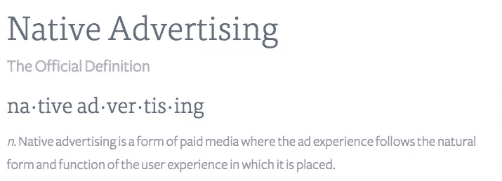
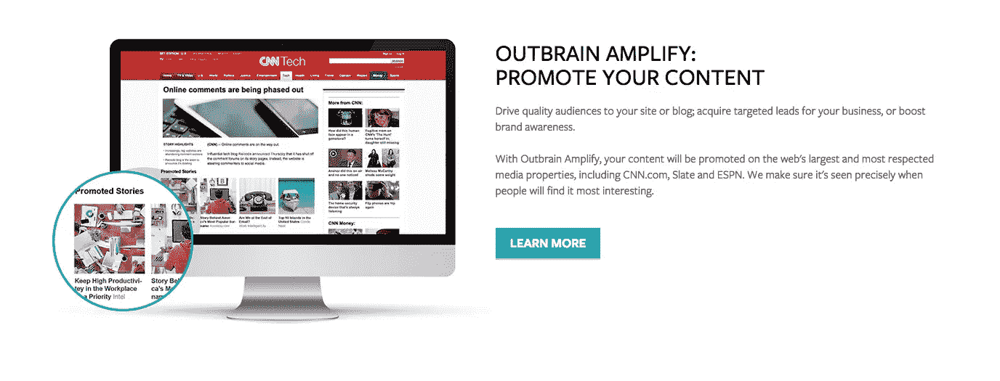
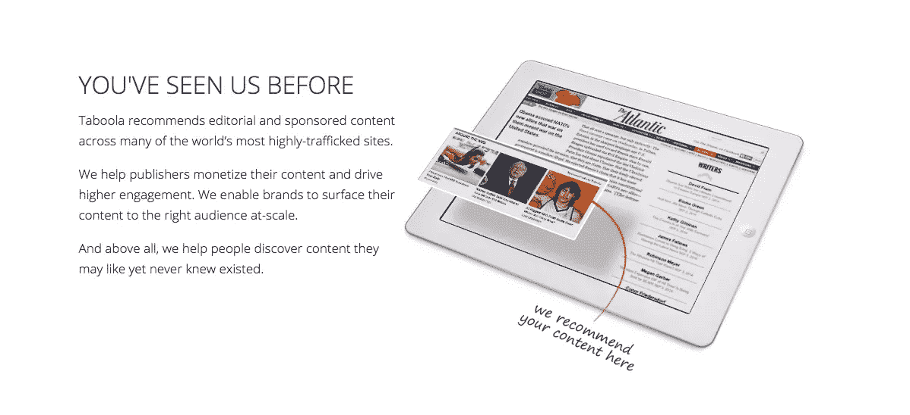
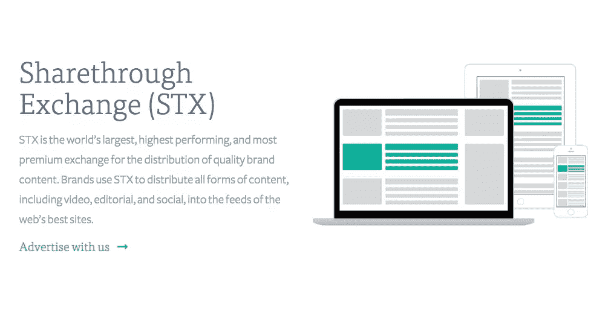
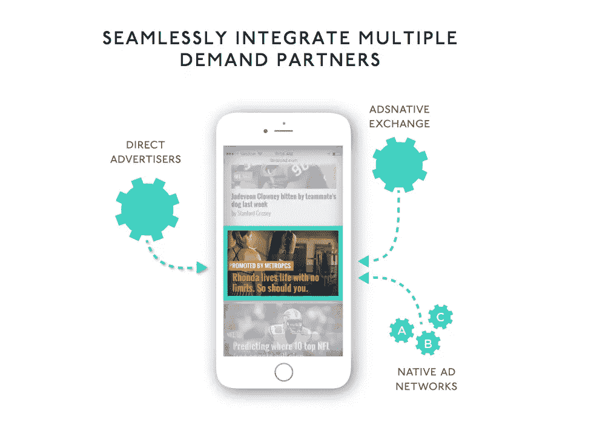
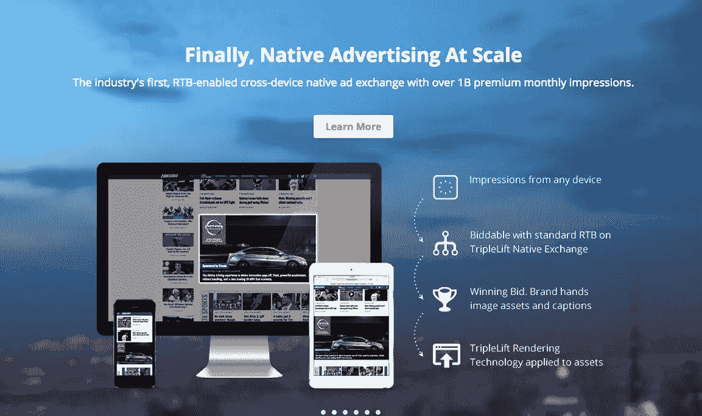
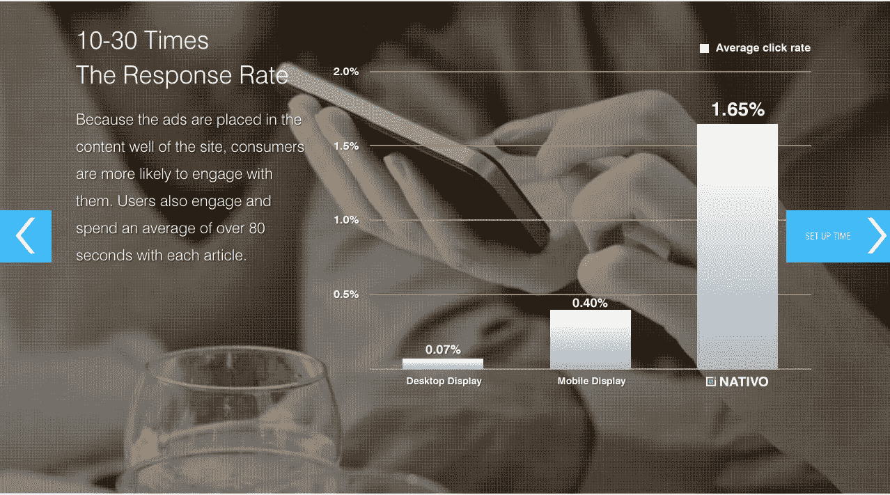
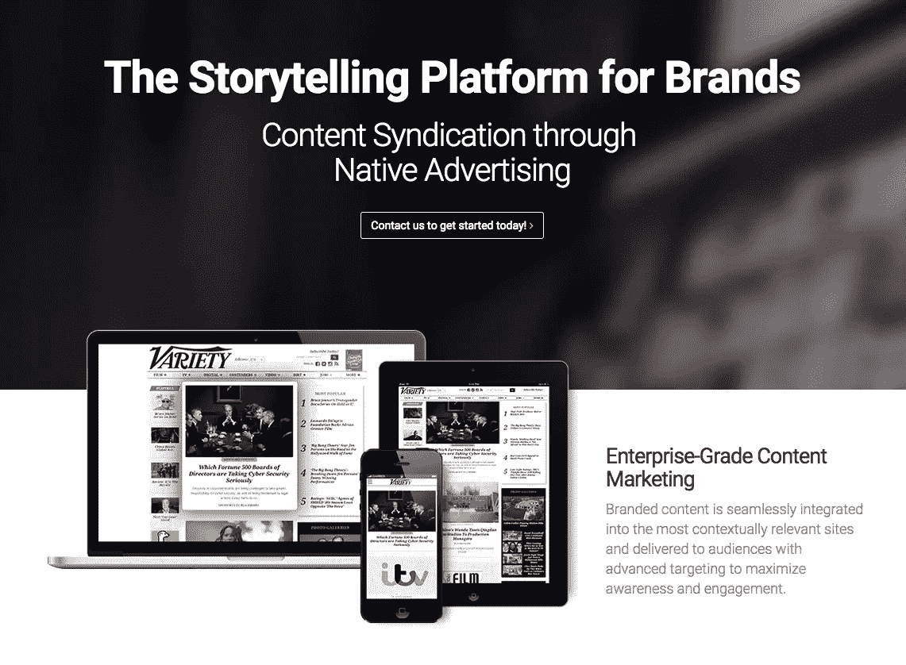

# 你需要了解的 7 家本土广告公司

> 原文：<https://www.sitepoint.com/native-advertising-companies/>

如果你很难通过现在网上存在的噪音让你的内容被注意到，我怎么推荐原生广告都不为过。

我已经在[lounge 在线博客](http://www.louderonline.com.au/blog/)和为我的客户举办的活动中使用过它，没有比这种新的付费推广模式更快产生快速流量的选择了。

但是什么是原生广告呢？你是如何开始的？

[Sharethrough 将原生广告](https://www.sharethrough.com/nativeadvertising/)定义为:

作为广告商，这为我们提供了一个独特的机会，让我们能够接触到消费内容的用户。如果操作正确，就不会影响他们的体验。相反，它增强了它。

也就是说，如果你想参与原生广告，你需要先了解原生广告的不同发布方式，然后我们才能讨论不同的可用平台。

[IAB 行动手册](http://www.iab.net/media/file/IAB-Native-Advertising-Playbook2.pdf)很好地分解了你将看到的不同广告单元，包括:

*   馈入
*   付费搜索
*   推荐部件
*   促销物品
*   In-ad(带原生元素)
*   自定义/“无法包含”

外部工具和平台通常专注于三个主要类别:馈入、广告和推荐窗口小部件。

以下平台都有助于广告商在顶级媒体上投放广告，提高他们的品牌认知度，并向用户推广高质量的相关内容。

## 出脑

[Outbrain](http://outbrain.com/) 通过推荐小工具为品牌提供顶级出版物，从而建立了自己的品牌。它允许用户推广文章、视频、信息图表、幻灯片和其他提供娱乐或信息价值的媒体。

令人震惊的是，80%的世界领先品牌使用 Outbrain。他们在世界各地运营，向 CNN、Slate 和 ESPN 等顶级出版网站的受众提供实时推荐。

Outbrain 使用每次点击成本(CPC)定价模式，这意味着只有当有人点击你的推广故事时，你才需要付费。平台中的高级测试和转换工具可帮助您确定如何优化您的活动，以实现您的目标。

## 塔布拉

这家公司最初是一家视频推荐服务公司，但后来他们转向成为领先的内容发现平台。在某些情况下，他们对分析视觉内容的承诺可能会让他们在与其他努力分发视觉内容的平台竞争时占据上风。

今天， [Taboola 的](http://taboola.com)预测引擎在主要发布网站上提供内容，如:

*   商业内幕
*   雅虎！
*   在线邮件
*   全国广播公司

您可以使用该公司的分析仪表板实时了解您的活动，这可以帮助您的团队分析其绩效并根据结果调整其战略。

Taboola 使用了与 Outbrain (CPC)类似的定价模式，并增加了一个选项，即每次点击多付一点钱，就可以访问该平台的顶级出版商。

## 共享通过

Sharethrough 自称是世界上最大的在线广告交易平台。通过福布斯、Real Simple 和 People 等出版商，您的内容可以通过复杂的受众定位达到 2.47 亿观众。

该平台还拥有几项专有技术，包括内容质量跟踪工具、内容卡和一个创造性的优化系统。

这些功能共同为您的原生广告目标提供增强的体验。该公司似乎难以置信地致力于为用户提供推动成功所需的工具，所以如果你想进入原生广告领域，一定要看看这个平台。

## AdsNative

[AdsNative](http://adsnative.com/) 致力于通过程序化的原生广告和包括各行各业 1000 多家出版商的广泛网络，让互联网变得更加美好。通过显示和视频广告形式，您将有机会将您最好的内容展示给成千上万的人。

AdsNative 采用馈入和广告植入策略，为您提供各种不同的广告选项，例如:

*   馈入
*   文章内
*   帖子结尾
*   应用内
*   自定义位置

公司还可以利用该平台的白标功能，让您在自己的网络和应用程序中访问系统的技术和基础设施。利用 AdsNative 开发定制仪表板、交付报告和监控活动。

## 三重提升

TripleLift 通过专注于他们的图像传输技术而脱颖而出；特别是他们的计算机视觉工具，每次都能读取图像并在所有设备上完美格式化。

该公司特别关注他们的 [USP](https://www.sitepoint.com/unique-selling-proposition/) ，使用 OpenRTB 平台访问业界最大的广告交易。它的工作原理非常简单:

*   为广告空间出价
*   如果你赢了，平台会识别你的图片和字幕资产
*   渲染技术格式化您的内容，以提供原生的高质量图像。

如果你的品牌花时间在视觉内容上，你一定会想看看 TripleLift 提供了什么。它可能就是你需要的原生广告平台，让你的内容呈现在正确的观众面前。

## 当地的

[Nativo](http://www.nativo.net/) 声称他们的编程平台将原生广告性能提高了 300%。因为该平台在出版商的编辑流中提供内容，所以每个广告都保证与特定出版物的外观和感觉相匹配。

这种原生广告方式为每个参与者提供了以下好处:

*   消费者的无中断体验
*   出版商获得额外收入
*   广告商的参与度更高

该平台通过这一过程自动交付您的内容。此外，您可以使用他们的本地特定分析系统来了解性能、分析收入并查看您的 A/B 测试结果。

## 本能的

[Instinctive](https://instinctive.io/) 希望帮助您的品牌调整形式、功能和适合度，以推广通过其创新平台获得结果的盈利媒体，该平台将您的博客文章和视频实时整合到其出版商网络中。

该公司的专利全原生技术为您带来几个好处:

*   深度注意力指标
*   保证 100%可视
*   程序集成
*   企业级控制台

这些平台中的每一个都可以帮助您将内容营销活动从入门级的努力提升到原生广告的强大。也就是说，在每个平台上维持一个存在会变得很昂贵，所以选择一个最符合你的品牌目标、目的和预算的平台是明智的。

### 所以现在，我想听听你的意见！你会选择哪个原生广告平台？你见过成功使用其中之一吗？请在评论中分享你的经历。

## 分享这篇文章