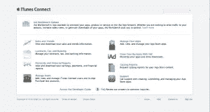
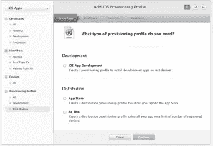

# iTunes Connect 导航:开发人员指南

> 原文：<https://www.sitepoint.com/navigating-itunes-connect-developers-guide/>

如果你是一名移动应用程序开发人员，并计划为 iPad 和 iPhone 等 iOS 设备发布应用程序，你将不可避免地面临导航 iTunes Connect (ITC)，这是苹果公司管理应用程序发布过程的门户网站。

如果你是一个新的 iOS 开发者，还没有建立一个账户，那么去 iTunes 销售页面，决定你想卖什么样的内容。您可以选择销售媒体(音乐、电影或电视内容)、应用程序(从 iTunes 下载到移动设备)或书籍。电子书(被认为是书)和允许进入应用商店的电子故事书是有区别的。

如果您的图书没有交互式内容，如画外音、可点按元素或动画，您将有义务使用 iBooks store 中的另一个帐户交付它，并且可能采用不同的格式，如 ePub 或 pdf 文件。决定是否要在 iBooks 或 Mac App Store 中发布会影响到您的项目，甚至会影响到用于构建项目的软件。你需要在项目的早期决定你的目标商店。

## 一个商店两个门户

如果您的内容符合通过 Mac App Store 交付 iOS 应用程序的条件，您将需要创建一个 Apple 开发者帐户和一个 iTunes Connect 帐户。激活你的[开发者账户](https://developer.apple.com)发布应用每年需要花费 99 美元。该门户允许您设置应用 ID、证书、配置与帐户相关联的设备以进行测试，以及测试和交付应用到生产所需的配置文件。

## 苹果的开发者中心

设置 iOS 应用程序最棘手的部分之一是浏览苹果的开发者中心。因为我的大多数应用程序都使用推送通知，所以我使用的流程是为每个新应用程序创建一个单独的应用程序 ID。

接下来，创建一个与该应用程序 ID 相关联的生产 APN (Apple 推送通知服务)证书。将该证书安装到您的开发计算机上，以便您可以在开发过程中在设备上进行构建和测试。

最后，使用该设备 ID 为开发构建创建一个配置文件。我使用的过程是为设备构建创建一个名为“myApp_Dev”的变体的特别分发配置文件。然后，当我准备好发布时，我创建一个新的名为“myApp_Dist”的 App Store 分发配置文件，我将用它来创建我的最终版本。

## 国际茶叶委员会(International Tea Committee)

一旦你建立了你的应用程序的基本识别，并通过了大部分的开发过程，你就可以开始发布过程了。前往 ITC(在开发者中心的主页上有一个方便的链接)。

使用您在开发者中心配置的 Apple ID 和密码登录。将开发者中心视为准备应用程序在给定设备上运行的地方，将 ITC 视为处理应用程序的完善、营销和交付的地方。

## 货币化和你的应用

你将在 ITC 管理应用的盈利策略，即使你可能在其他地方得到你的销售报告。许多开发者更喜欢从 App Annie 等服务获取销售报告，因为销售可以从谷歌、苹果和亚马逊汇总。

然而，你不能避免使用 ITC 来建立你的应用货币化战略的两个关键要素:应用内购买和你的税务和银行信息。在做任何事情之前，请确保在“合同、税务和银行”区域中您的所有税务和银行信息都是正确的。你会想定期重游这个地区，以确保你的钱能找到你。

此外，在此门户中设置任何应用内购买信息。为此，请在“管理用户”区域创建一个测试用户。通过注销 iTunes 并使用此测试用户的凭据重新登录，在设备上测试应用内购买。

现在，您可以通过点击 ITC 主页上的“管理您的应用>添加新应用”来开始设置您的应用。ITC 将为您的新应用程序提供一个捆绑包 id 下拉列表，反映之前在开发人员中心设置的内容。给你的应用起一个描述性的名字，你就可以开始管理你的应用的正面的、重要的营销元素了。

## 成功应用的四大杀手锏

ITC 是你组装应用程序的地方，包括四个基本的营销元素:图标、截图、标题和关键词。这些因素，加上你的应用的评论和评级，决定了它的 ASO(应用商店优化)排名(类似于 SEO)，并影响下载和销售。当你准备好发布你的应用程序，决定好关键词，准备好截图，你就可以开始 ITC 应用程序提交流程了。

上传您的应用程序的图形资产，包括图标和屏幕截图(适用于 iPhone4、iPhone5 和 iPad)，输入描述性标题、关键词，并包括详细描述您的应用程序的详细信息。

注意不要在应用标题中包含太多关键词，因为这可能会导致应用被拒绝。避免“关键词填充”，例如在关键词中使用与你的应用无关的热门应用名称。最好使用像搜索引擎优化(SearchMan SEO)或 T2 感应塔(SensorTower)这样的服务来帮助你确定哪些关键词会给出最好的结果。这是一门不精确的科学，在 App Store 上相当模糊，但正确的关键词可以给你的排名带来真正的提升。

## 额外服务:

ITC 有一个移动应用程序，可以在 iTunes 上下载，以检查您的下载状态。对一些人来说，这是他们每天早上做的第一件事。ITC 中其他有用的工具包括应用程序加载器，它将应用程序交付到应用程序商店。最后还有游戏中心和 iCloud 工具，分别帮助管理游戏用户和应用程序数据。您还需要查看 iAd 工作台，在那里您可以为您的应用程序设置广告活动，以便在其他应用程序中显示。

## 结论:

ITC 可能不是在苹果应用程序商店上发布应用程序的一站式商店，但它是这一过程的一个重要工具。了解它的来龙去脉，以及它的哪些部分对您有用，有助于加快开发周期。

你对苹果的 app 交付流程有哪些体验？你有什么建议？

## 分享这篇文章