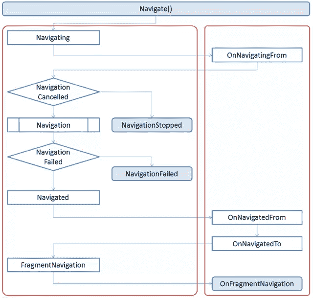

# 在 Windows Phone 中导航数据

> 原文：<https://www.sitepoint.com/navigating-with-data-in-windows-phone/>

在我的上一篇文章中，你看到了如何向前导航到一个新的页面，然后通过硬件的后退按钮或调用`GoBack`方法返回。通常，您会希望在页面之间传递一些数据，例如，如果用户从列表中选择了一个客户，您可以将客户 id 或姓名传递到客户详细信息页面。这篇文章不仅将介绍如何做到这一点，还将强调在导航过程中出现的事件序列。

出于本文的目的，我们将使用一个简单的示例应用程序，它有两个页面，CustomerListPage 和 CustomerDetailsPage。从 customer list 页面，用户可以选择列表中的客户，这将调用到详细信息页面的导航。例如:

```
private void CustomerSelectionChanged(object sender, SelectionChangedEventArgs e)
{
    NavigationService.Navigate(new URI(&quot;/CustomerDetailsPage.xaml&quot;, URIKind.Relative));
}
```

这还不够，因为详细信息页面需要知道要显示哪个客户。在传统的富客户端技术中，如“WinForms”或“WPF ”,您可能会尝试将对客户对象的引用传递到客户详细信息页面。不幸的是，这种策略在 Windows Phone 应用程序中不起作用，因为页面之间的导航必须对被*删除*的应用程序具有弹性。不去讨论*墓碑*，本质上，当你的应用程序进入后台时，它很可能是*墓碑*，这意味着它不再在内存中。当应用程序随后被恢复时，例如通过用户点击后退按钮返回到你的应用程序，先前打开的页面将被创建并导航到，但是任何在存储器中的对象将必须被重新加载。关于 Windows Phone 应用生命周期和*逻辑删除*的更多信息可以在 [MSDN 文档](http://create.msdn.com)中找到。

为了避免陷入与 *tombstoning* 相关的问题，你应该把每一页都看作是独立存在的。这意味着将数据传递到页面的唯一方式是通过导航 URI。由于导航 URI 是一个标准的相对 URI，它支持查询字符串参数和片段。例如，如果您想将客户 id 传递到客户详细信息页面，您可以使用以下方法之一:

```
NavigationService.Navigate(new URI(&quot;/CustomerDetailsPage.xaml?customerId=12345&quot;, 
                                                                   URIKind.Relative));
NavigationService.Navigate(new URI(&quot;/CustomerDetailsPage.xaml#12345&quot;, 
                                                                  URIKind.Relative));
```

第一种方法将客户 id 指定为查询字符串参数。这可以通过检查 NavigationContext 的 QueryString 属性在目标页面中轻松提取出来。

```
protected override void OnNavigatedTo(NavigationEventArgs e)
{
    base.OnNavigatedTo(e);

    var customerId = NavigationContext.QueryString[&quot;customerId&quot;];
}
```

第二种方法将客户 id 指定为 URI 片段。这种方法有些局限性，因为您只能指定一个值，而使用查询字符串，您可以提供多个键值对。然而，使用片段的好处是会引发一个额外的事件，允许页面导航到特定的片段。

```
protected override void OnFragmentNavigation(FragmentNavigationEventArgs e)
{
    base.OnFragmentNavigation(e);

    var customerId = e.Fragment;
}
```

在这一点上，我想跳回一点，只是回顾一下当导航被触发时发生的一系列事件。这应该有助于澄清上面提取客户 id 的代码会出现在哪里。导航过程从调用`Navigate`方法开始，要么直接调用当前页面的`PhoneApplicationFrame`属性，要么调用当前页面的`NavigationService`属性(如图 1 顶部所示)。


[](https://www.sitepoint.com/wp-content/uploads/2011/07/navigation-with-data-figure-1.png)

图 1

图 1 的剩余部分被分成两个圆形的方框:左边的方框表示在`PhoneApplicationFrame`发生的事件。您可以选择在`App.xaml.cs`文件中订阅这些事件，如果您想要记录导航事件，这是很有用的。在大多数情况下，你会对你可以在应用程序页面中覆盖的方法更感兴趣，这些方法继承自`PhoneApplicationPage`类。

导航被触发后，框架上引发的第一个事件是`Navigated`事件。这个事件和相应的方法`OnNavigatingFrom`(在用户离开的页面上调用)都公开了一个`NavigationEventArgs`参数。这个参数继承自`CancelEventArgs`，它公开了一个属性`Cancel`，如果您希望取消导航，可以将其设置为 true。如果您想要运行动画、保存瞬态或执行页面清理操作，这可能会很有用。

此时，导航服务确定导航是否已经被取消。如果它在框架上引发了`NavigationStopped`事件。假设导航没有被取消，导航继续进行。如果由于某种原因导航失败，例如，如果指定的 URI 不是一个有效的页面，或者不能被解析为一个有效的页面，就会引发`NavigationFailed`事件。在`NavigationStopped`或`NavigationFailed`事件的情况下，页面本身并没有被调用的等价方法。

在导航按预期进行的情况下，将在框架上引发`Navigated`事件。随后调用`OnNavigatedFrom`方法(在被导航离开的页面上)和`OnNavigatedTo`方法(在被导航到的页面上)。最后，如果 URI 包含一个片段，则在框架上引发`FragmentNavigation`事件，然后在被导航到的页面上调用`OnFragmentNavigation`方法。如你所见，本文开头提到的`OnNavigatedTo`和`OnFragmentNavigation`方法构成了导航序列的最后阶段，是从导航 URI 中提取查询字符串或片段的最佳位置。

另一个从网上移植过来的概念是 URI 映射或重写的概念。对于 Silverlight for the desktop，这主要是作为应用程序公开可读深层链接 URL 的一种方式而引入的。在 Windows Phone 应用程序的上下文中，用户将永远看不到他们正在导航到的页面的 URI。然而，在某些情况下，进行 URI 映射还是有意义的。以前面的例子为例，应用程序导航到`CustomerDetailsPage`并提供客户 id 作为参数。如果这个页面的名称改变了，或者这个页面被移动到一个子文件夹中，或者即使参数名称从 customerId 变成了 Id，在每一种情况下，您都必须确保更新每一种导航方法。另一种方法是为显示客户详细信息页面定义一个 URI 映射。例如:

```
/customer/{id}      =>      /CustomerDetailsPage.xaml?customerId={id}
```

现在，如果要进行所讨论的任何更改，您所要做的就是更改映射:

```
/customer/{id}      =>      /CustomerInfoPage.xaml?customerId={id}
/customer/{id}      =>      /Pages/CustomerDetailsPage.xaml?customerId={id}
/customer/{id}      =>      /CustomerDetailsPage.xaml?Id={id}
```

定义 URI 映射有两个选项:您可以简单地创建一个 URIMapper 类的实例，并将其分配给框架上的`URIMapper`属性，或者您可以在`App.xaml`文件中将`URIMapper`创建为一个资源。后者使得`URIMapper`更容易定位和更新。

```
<Application
    x:Class=&quot;CustomerNavigationSample.App&quot;      
    xmlns=&quot;http://schemas.microsoft.com/winfx/2006/xaml/presentation&quot;       
    xmlns:x=&quot;http://schemas.microsoft.com/winfx/2006/xaml&quot;
    xmlns:shell=&quot;clr-namespace:Microsoft.Phone.Shell;assembly=Microsoft.Phone&quot; 
    xmlns:Navigation=&quot;clr-namespace:System.Windows.Navigation;assembly=Microsoft.Phone&quot; >

    <Application.Resources>
        <Navigation:URIMapper x:Key=&quot;Mapper&quot;>
            <Navigation:URIMapper.URIMappings>
                <Navigation:URIMapping URI=&quot;/customer/{id}&quot;
                                       MappedURI=&quot;/CustomerDetailsPage.xaml?customerId={id}&quot; />
            </Navigation:URIMapper.URIMappings>
        </Navigation:URIMapper>
    </Application.Resources>
   …
</Application>
```

在`App.xaml`中定义了`URIMapper`之后，你需要将它分配给`App.xaml.cs`文件中的`PhoneApplicationFrame`。

```
public App()
{
    // Global handler for uncaught exceptions. 
    UnhandledException += Application_UnhandledException;

    // Standard Silverlight initialization
    InitializeComponent();

    // Phone-specific initialization
    InitializePhoneApplication();
    RootFrame.URIMapper = Application.Current.Resources[&quot;Mapper&quot;] as URIMapper;

   …
}
```

现在已经定义了 URI 映射，您可以使用下面的内容导航到 customer details 页面，而不管该页面是否更改了名称、位置或参数名称(当然假设映射已更新)。

```
this.NavigationService.Navigate(new URI(&quot;/customer/12345&quot;, URIKind.Relative));
```

最后，我要说的是，导航意图与页面实现的分离在今天的 Windows Phone 中是一个有用的概念，但当你看到 Mango 的深层链接功能时，这一点就变得更加重要了。用于 Windows Phone 的 Mango 更新将引入开始磁贴和 Toast 通知的深度链接。由于 Toast 通知通常是从服务器发送的，服务器不应该知道或关心电话应用程序是如何实现的，因此能够将导航意图与应用程序细节分开对于允许服务器和应用程序独立版本化非常重要。例如，服务器可以发出以下 toast 通知。

```
<?xml version=&quot;1.0&quot; encoding=&quot;utf-8&quot;?>
<wp:Notification xmlns:wp=&quot;WPNotification&quot;>
    <wp:Toast>
        <wp:Text1>Customer</wp:Text1>
        <wp:Text2>Bob Jones</wp:Text2>
        <wp:Param>/customer/12345</wp:Param>
    </wp:Toast>
</wp:Notification>
```

这将作为一个 toast 通知显示给电话用户，文本为“客户 Bob Jones”(类似于传入的 SMS 消息)。当他们点击通知时，应用程序将被启动，应用程序将解释参数元素值`“/customer/12345”`,以确定显示哪个页面。使用我们之前定义的 URI 映射，这将路由到`“/CustomerDetailsPage.xaml?customerId=12345”`。但是，可以在不修改服务器代码的情况下重新构建应用程序和更改 URI 映射。

希望读完这篇文章后，你会对 Windows Phone 的导航服务以及相应的事件和方法有一个很好的理解。有了这些知识，你应该能够有效地在页面之间传递数据，同时仍然处理从*逻辑删除*产生的不同场景。

## 分享这篇文章