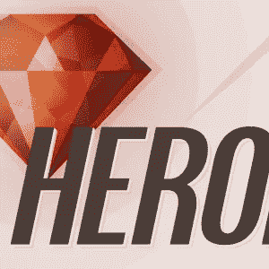

# 我需要一个(红宝石)英雄

> 原文：<https://www.sitepoint.com/need-ruby-hero/>

又到了一年一度 Ruby 社区为他们的英雄投票的时候了。红宝石英雄奖现在已经进入了第七个年头，并且已经成为一个承认和庆祝那些回馈社会的红宝石爱好者的贡献的令人敬畏的传统。Envy Labs 的 Gregg Pollack 在采访 Rails Envy Podcast 上的人时发现 Ruby 社区需要更多的认可。投票现在在精彩的[漫画主题网站](http://rubyheroes.com/)上开放(由 Envy Labs 的 Nick Walsh 设计)。

它的工作方式很简单——你去[http://rubyheroes.com/](http://rubyheroes.com)为你的 Ruby 英雄投票，提供一个链接到他们的 [Github](https://github.com) 个人资料，以及你为什么认为他们是 Ruby 英雄的原因。这可能是因为他们以某种方式帮助了你，制作了一些很棒的博客帖子、播客或截屏，创建或维护了一个很棒的软件，或者只是帮助传播了对 Ruby 的热爱。

这不是一场人气竞赛——获胜者不是那些获得最多选票的人，而是从往年获胜者提名的人中选出的。你投票支持的人不一定要很出名，事实上，前几年的许多获奖者在获奖时并不出名，但他们经常成为红宝石摇滚明星！获胜者每年都会在 Rails Conf 上亮相，并获得一个[造型可爱的奖杯](http://www.flickr.com/photos/x180/2537415785/in/photostream/)。

去年有 8 名获奖者(通常有 6 名，但有 3 人代表 Rails Girls 获奖):

*   特伦斯·李(Terence Lee)——感谢他在会议上的工作和对 Bundler 的维护
*   Sandi Metz——因为她出色的教学和关于 Ruby 的写作
*   Mike Perham——他在 Sidekiq 上的工作和关于 Ruby 的博客
*   [詹姆斯·塔克](https://github.com/raggi)——几乎单手支撑机架
*   Brian Shirai——感谢他对 Rubinus 的贡献和建立 RubySpec 项目
*   [Karri Saarinen](https://github.com/ksaa) 、 [Linda Liukas](https://github.com/lindaliukas) 和[Henrietta keklinen](https://github.com/phenriettak)代表[Rails Girls](http://railsgirls.com/)——感谢他们在赫尔辛基开创 Rails Girls 的工作

你可以在这里看到他们领奖的[视频。](http://www.youtube.com/watch?v=wfy_ctBaU2o)

我联系了前两年的一些获奖者，询问他们成为 Ruby 英雄对他们来说意味着什么:

# 特伦斯·李(2013 年获奖者)

> 我买它是为了一些事情。技术上来说，我确实为邦德勒和雷斯克工作过。在社交上，我被称为“周五拥抱超级英雄<3 <3 <3”. I’ve been doing Friday Hugs during my talks around the world which has been super fun. I have some posted [here] (https://twitter.com/hone02/media). Also, my work on Rails Girls. At this point I’ve been to 10+ workshops around the world helping and organizing as well as help get the [Rails 女孩在线指南](http://guides.railsgirls.com)和[开源](https://github.com/railsgirls/railsgirls.github.com)。
> 
> 人们认为我的工作应该得到认可，这让我感到非常谦卑。我很幸运，在 Heroku，我有机会关心整个 Ruby 社区。此外，我一路走来有很好的朋友和导师，比如耶胡达(wycats)，亚伦(tenderlove)，安德烈(indirect)。我希望作为回报，我可以激励其他即将到来的 ruby 爱好者，帮助我们的社区成为一个更好的地方。

# 迈克·佩勒姆(2013 年获奖者)

> 我在 sidekiq.org side kiq 的作品获奖了。我之前已经发表了十几个不同的 gem，例如 connection_pool 和 dalli，并且在过去的 5-7 年里写了很多关于 Ruby 的博客。
> 
> 很高兴看到我的努力得到了社区的认可。我一直觉得 OSS 只有在人们积极贡献出一些时间来改善生态系统的情况下才会起作用，而且总会有人因为热爱构建软件而做出不必要的让步。用这样一个奖项来奖励那些离群的人是很容易的，但却非常有意义。

# 康斯坦丁·哈斯(2012 年获奖者)

> 我因为我对开源的贡献而获奖，尤其是对 Rack、Rubinius 和大部分 Sinatra 的贡献。为 IRC、邮件列表等上的人提供支持。
> 
> 感觉很奇怪。这是惊人的，同时也很尴尬。我的意思是，我做这些事情不是为了得到认可，而是为了做这件事的乐趣。即使是在 RailsConf 之前的几个月，我也不会想到会因此获奖。另一方面，出于某种原因斯文和乔希说服我出现“特拉维斯风格”，即穿着 ShiteShirt 和我试图留胡子。当我看到视频时，我向自己发誓再也不这样做了…

# 斯文·富克斯(2012 年获奖者)

> 我因围绕 Ruby/Rails I18n、Travis CI 和其他开源项目所做的工作获得了 2012 年的 Ruby Hero 奖。
> 
> 我一直觉得，我在开源上投入的每一点精力，尤其是在 Ruby 和 Rails 社区，都得到了十倍的回报，这种积极的回报总是让我感到谦卑和感激。
> 
> 所以，当我第一次被告知我被提名了 Ruby Hero 奖时，我几乎觉得有拒绝它的冲动:我已经因为我的工作获得了太多，我觉得其他人可能比我更应该获得这个奖。
> 
> 最终被宣布上台领奖让我感动得热泪盈眶，我无法用语言表达我对这个社区给我的一切的感激之情。

# 琳达·柳卡斯(2013 年获奖者)

> 我的 Ruby Hero 作为一个组织获得了 Rails Girls 的奖项，我作为联合创始人接受了这个奖项。Rails Girls 是一个鼓励更多女性参与编程的草根运动，由 Ruby 社区在全世界 160 多个城市运营。
> 
> 这显然是一个巨大的荣誉，被社区认可的感觉棒极了。然而，如果没有 Ruby 社区和所有投入无数时间组织这些活动的志愿者，Rails Girls 就不会出现在这里。真希望去年我能带大家一起去 RailsConf！

# Karri Saarinen (2013 年获奖者)

> 琳达、亨丽埃塔和我获得了红宝石英雄奖，以表彰我们与整个 Rails 的女孩们一起工作并代表她们。Rails Girls 起步很小，只有芬兰的一个工作室，但通过我们出色的当地组织者，它已经发展成为一个全球现象，他们使活动在工作场所周围进行。
> 
> 我真的很荣幸能得到这个奖，特别是和许多其他英雄一起，他们为改善 Ruby 和场景做了很多。我认为我们的奖项显示了 Ruby 社区作为一个整体确实是支持的，并且对让新的和多样化的人参与编程感兴趣。

我认为，在所有这些引用中，接受者被社区重视是多么重要。他们都放弃了他们的时间并做出了贡献，因为他们喜欢它，但这意味着更多的是知道它对某人有意义。

所以，如果有人在 Ruby 上帮了你，不管是大是小，或者你发现了某个特别有用的宝石，不要只是投票给他们——一定要说谢谢，让那个人知道他们是如何帮助你的。这是你向在你的 Ruby 之旅中帮助过你的人回馈的机会。

你还在等什么？为你的[红宝石英雄](http://rubyheroes.com/)投票

## 分享这篇文章