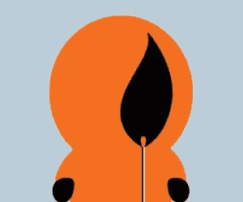
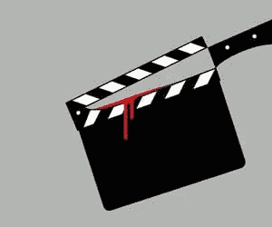
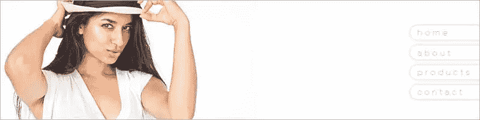
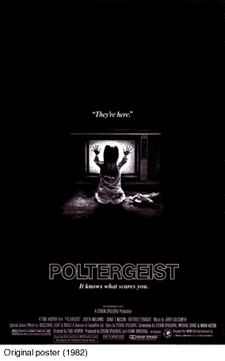

# 负空间:设计中“无”的力量

> 原文：<https://www.sitepoint.com/negative-space/>

在平面设计中有普遍接受的最佳实践，适用于所有媒体。

你可能以前听说过“负空间”这个术语——这是设计师一直使用的一种做法。如果他们做得对，你可能都没注意到。它往往是一种技术，用来吸引你对信息或主题视觉的注意，增加它的影响。

当你有很多东西要交流时，这有点违背直觉——很难不被诱惑去使用每一个像素。好消息是，如果你能掌握负空间的概念，你会更好地理解如何以及何时使用它。

“负空间”这个术语，在平面设计中，有点误导。听起来好像你在你的页面上描述一个空无一物的空间(真实的或虚拟的)。

那实际上不是真的。

在那个空间里有很多“东西”，当有目的地使用时，它产生的效果绝不是“负面的”。

负空间是你的设计和沟通的路线图，向观众展示他们需要知道或想要看到的重要内容。

它的工作原理有点像一张有一些模糊区域和一个非常清晰聚焦区域的照片。你的大脑直觉地知道忽略模糊的事物，去关注清晰的事物。

我们的大脑会寻找熟悉的形状和模式，比如从邻居的猫中认出某人的脸、特定的树或你的宠物猫。

设计中的负空间向你的大脑发出同样的信号。当一个空白空间被一个元素打断时，你的眼睛就会被吸引到那里。

理解负空间最基本、最实用的方法是想象一个徽标，位于页面顶部，居中，大约是浏览器宽度的 15%到 20%。

重要的是，两边什么都没有。那么，你看哪里？

答:*就在 logo* 处。

你不必从左边开始，沿着一无所有的路走，直到你到达某处。你的眼睛直直地看着那里，因为有东西打断了虚无。

负空间就是这么运作的。是“无”把你带到了“有”的地方。

### 所以，所有的页面元素都应该有空格？

也就是说，值得使用负空间的元素和不值得使用负空间的元素之间有一个重要的区别。

一个标志？负空间疗法的绝佳人选。这是一个重要的元素。

概念形象？没错。增加了戏剧性。

发表文章的日期？嗯，没那么多。当你的页面上的一个元素被赋予一个独立的空间区域时，它会立刻被认为比页面上其他元素“更重要”,这些元素更符合布局的常规流程。

所以，标志、标题、章节标题、重要的视觉效果——所有的元素对于负空间处理都有适当的重要性。

### 用负空间讲故事

除了我上面提到的简单的 logo 例子之外，负空间的更高级的应用有点难以理解，但是如果使用得当的话是非常强大的。

负空间可以为眼睛创造一个小把戏——你的观众可能需要一段时间才能抓住，但当他们抓住它时，他们会欣赏你的聪明。

我列举了一些例子来说明我的意思。

### 用负空间创造视觉戏剧

负空间的另一个应用是戏剧化主题视觉，如重要的肖像或关键视觉。这通常与主题标题或品牌标语一起使用。

当在一个普通的日常项目中工作时，这有点难以实现，但是在你的客户想要一些更“高档”的东西的情况下，这可以很好地工作。

这是它的一个实例(图片经摄影师安东尼·泰勒许可使用)。

同样，恐怖电影海报艺术家也是这种把戏最熟练的倡导者之一。

史蒂文·斯皮尔伯格的《闹鬼》(1982)的海报就是一个经典的例子。

它的单个组件都不是很吓人。

有一个小女孩，一个玩具熊，一个大电视屏幕。没有血或戈尔，没有鬼，甚至没有一个怪异的字体。

但是，不知何故，它的布局充满了恐惧和厌恶。显然，电视里的某些东西迷住了那个可怜的、无辜的女孩，她很无助，迷失在黑暗中，我们或任何人都无法触及。

有趣的是，在 25 周年纪念版(2007)中，他们重新制作了原来的海报，删除了大部分的负面空间并放大了图像，结果令人质疑。

现在，作为观众，我们和这个女孩分享这个房间。当然，这不是一个度假目的地，但许多绝望情绪已经消退。

### 那么，使用负空间有什么诀窍呢？

深入到纯粹的设计中，负空间与其他设计概念一起使用，如三分和五分，基于网格的设计和排版(不仅仅是选择字体，而是创造有趣和迷人的字体的工艺)，成为一个有效的工具箱中非常多样化的工具。

专业设计师在每个项目中都使用这个工具箱，但当然不是每次都使用每个工具。

好的设计通常很简单。一个视觉技巧。一个可爱的花招。一种治疗方法。

当你试图过度使用技术时，就会变得混乱——就像编写 web 代码一样。最好的方法通常是最简单的方法，使用最少的代码。设计也不例外。

底线是，第一次就创造出好的设计并不容易，坦率地说，在所有的媒体上，都有很多非常糟糕的设计。

我发现，在任何情况下，最好的设计方法是我曾经为之工作的创意总监所使用的方法。

他的哲学:

> “把消息搞对了。让它清晰易懂，并保持在策略上。做到这一点，设计就会自己解决。”

把负空间技术放在你的设计工具箱里，不时地拿出来。你的客户会要求你填满每一个像素，是的。它发生在我们最好的人身上。

但是，好的设计总是最好的防御。

## 分享这篇文章