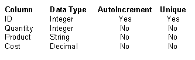

# 使用数据表构建 ASP.NET 购物车

> 原文：<https://www.sitepoint.com/net-shopping-cart-datatables/>

大多数动态网络应用程序都是为了在网上赚钱而创建的。

让我们面对现实吧:如果你不打算通过创建动态 Web 应用程序来赚钱，为什么还要去做这些工作呢？当然，公司使用动态的内部网站点，仍然有一些——尽管很少——免费的网络应用程序可以使用。

然而，在现实世界中，创建动态 Web 应用程序是为了通过允许网站所有者在 Web 上销售商品来赚钱。当用户浏览你的网站时，为他们提供向虚拟购物车中添加商品的功能仍然是一项非常赚钱的业务。VeriSign、Paypal、WebAssist 和 LinkPoint 等公司向开发人员提供向他们自己的网站添加购物车功能的能力。但是为什么要花 300-400 美元购买别人已经构建好的解决方案，而你自己也可以利用 ASP.NET 的新技术免费构建一个呢？

本文将允许您利用会话、数据网格和`DataSet`对象的`DataTable`类来开发和实现自己的购物车。通过这篇文章，您将学会:

*   使用 ASP.NET Web 服务器控件构建用户界面
*   根据用户交互动态构建数据表
*   将动态构造的数据表绑定到数据网格
*   允许用户自由地从购物车中移除商品
*   保存购物车中物品的运行总成本

在本文结束时，您将拥有一个功能完整的购物车，并且您将对数据表、数据网格和会话变量有一个透彻的理解。[点击此处](https://www.sitepoint.com/examples/aspnetcart/ASP.NETCart.zip)下载最终产品的完整演示。

该项目分为五个部分:

1.  构建用户界面

3.  构建数据表结构

5.  将商品添加到购物车

7.  保持累计总数

9.  从购物车中移除商品

##### 步骤 1:构建购物车用户界面

应用程序的用户界面非常简单。事实上，大多数交互都将发生在数据网格中，但是用户界面确实包括一些用户将与之交互的关键组件:

*   **一个`DropDownList`网络控件**，将显示我们将提供的产品。为了简单起见，每个项目的成本将与`DropDownList` Web 控件的值相关联。
*   **一个`TextBox`网络控件**，为用户提供调整数量的能力
*   **一个`Button` Web 控件**添加到购物车中
*   一个包含购物车内容的`DataGrid`
*   **一个`Label`控件**,将向用户显示价格的运行总数

现在您已经知道 UI 将显示什么了，让我们将这些组件添加到 HTML 页面的主体中。使用 Dreamweaver MX，我们将创建一个新页面，并将此代码添加到页面的`<body>`标记中:

```
<form runat="server"> 

Product:<br> 

<asp:DropDownList id="ddlProducts" runat="server"> 

<asp:ListItem Value="4.99">Socks</asp:ListItem> 

<asp:ListItem Value="34.99">Pants</asp:ListItem> 

<asp:ListItem Value="14.99">Shirt</asp:ListItem> 

<asp:ListItem Value="12.99">Hat</asp:ListItem> 

</asp:DropDownList><br> 

Quantity:<br> 

<asp:textbox id="txtQuantity" runat="server" /><br><br> 

<asp:Button id="btnAdd" runat="server" Text="Add To Cart"  

onClick="AddToCart" /><br><br> 

<asp:DataGrid id="dg" runat="server" /><br><br> 

Total:  

<asp:Label id="lblTotal" runat="server" /> 

</form>
```

代码实际上非常简单，几乎不需要解释。基本上就是增加了一个硬编码的 `DropDownList`控件(`ddlProducts` ) ，有四个产品。这些产品的成本通过为每个特定产品关联一个小数值来维护。

其次，添加了一个`TextBox`控件(`txtQuantity`)，以便用户可以修改数量。接下来，添加一个带有文本“添加到购物车”的 `Button` 控件(`btnAdd`)。与按钮控件相关联的`onClick`事件将调用`AddToCart()`子例程，该子例程将在下一节中创建。

接下来，添加一个`DataGrid` ( `dg`)，用于绑定到动态构造的`DataTable`。记住，`DataTable`将用代码构建，并绑定到`DataGrid`以呈现给用户。我们将添加一个按钮列，允许用户稍后删除特定的项目。最后，我们将添加一个`Label` 控件(`lblTotal`)，它将用于向用户显示购物车中商品的总数。

##### 步骤 2:构建`DataTable`结构

如果您熟悉数据集`,`，那么您会知道数据表为您提供了一种动态创建数据库表的纯内存驻留表示的方法。通常，您可以从现有的数据库中填充一个数据表,但是您也可以以编程方式创建一个，就像这里的情况一样。

在数据表中，列由 columns 属性表示，行由 rows 属性表示。因此，数据表将是创建购物车的最佳选择。我们可以像在数据库中一样，使用数据表的 columns 属性构建列，并使用`Rows`属性向数据表添加行。构建好数据表后，我们可以将数据表绑定到数据网格，以直观的方式显示结果。

因为数据表包含行和列，所以您将能够有效地模拟传统数据库表的结构。当用户向购物车添加商品时，这些行将被添加到数据表中。现在，我们需要构建列作为行项目的类别。为了让购物车正常工作，我们需要添加具有相应数据类型的以下各列:



您可能想知道如何以编程方式设置数据类型、自动增量和惟一性。请记住，数据表包含列和行属性。其中一些属性包括设置上述项目的能力，就像设置传统的数据库表一样。您还会注意到, `DataTable`包含一个 ID 列。从技术上讲，这个列与购物车没有任何关系，但是它与保持购物车中商品的唯一性有很大关系，并且如果我们想要创建与另一个数据表的关系，它将允许我们建立一个主键。

现在，我们只想在页面第一次加载时构建数据表的结构。在用户选择要添加到购物车的商品之前，我们不想真正开始定义行。

要开始构建购物车的结构，请将以下代码添加到页面的顶部:

```
<script runat="server"> 

Dim objDT As System.Data.DataTable  

Dim objDR As System.Data.DataRow 

Private Sub Page_Load(s As Object, e As EventArgs) 

     If Not IsPostBack Then 

          makeCart() 

     End If 

End Sub 

Function makeCart() 

     objDT = New System.Data.DataTable("Cart") 

     objDT.Columns.Add("ID", GetType(Integer)) 

     objDT.Columns("ID").AutoIncrement = True 

     objDT.Columns("ID").AutoIncrementSeed = 1 

     objDT.Columns.Add("Quantity", GetType(Integer)) 

     objDT.Columns.Add("Product", GetType(String)) 

     objDT.Columns.Add("Cost", GetType(Decimal)) 

     Session("Cart") = objDT 

End Function 

</script>
```

查看代码，您可以看到，`makeCart()` 函数仅在页面第一次加载时被调用。这就是进行 IsPostBack 检查的原因。

在`makeCart()`函数中，我们将添加定义数据表及其列的实际结构的代码。首先，我们将一个名为`ID`的列添加到 DataTable 中，并为它分配 integer 数据类型。我们将`AutoIncrement`的属性分配给`True`，并从 1 开始播种。

接下来，向数据表中添加另外三列，分别用于`Quantity`、`Product`和`Cost`，分别为它们指定数据类型为整数、字符串和小数。最后，将数据表添加到一个`Session`中，方便地命名为`Cart`，用于存储。

就是这样！如果您考虑数据库表的结构，然后考虑数据表的结构和代码，它们在概念上开始彼此相似。下一步是向购物车中添加商品，这并不比为数据表定义新行更难。

**Go to page:** [1](/net-shopping-cart-datatables) | [2](/net-shopping-cart-datatables-2/)

## 分享这篇文章